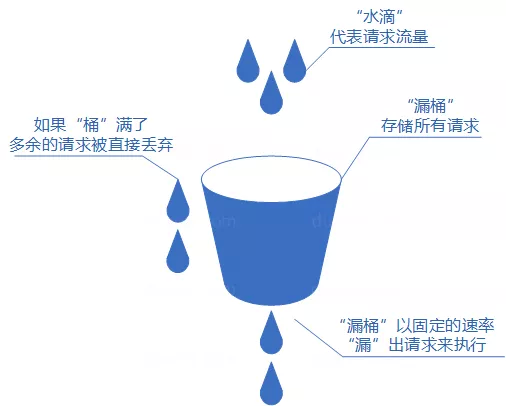

# 限流

对请求的速率进行限制，避免瞬时的大量请求击垮系统

- 单机限流：仅能保护自身节点，无法保护应用依赖的各种服务
- 分布式限流：以集群为维度，可以方便的控制整个集群的请求限制，从而保护下游依赖的各种服务资源
  - 借助中间件架限流：可以借助 Sentinel 或者使用 Redis + Lua 来自己实现对应的限流逻辑
  - 网关层限流：Spring Cloud Gateway 中的 RedisRateLimiter，从名字也可看出这是基于 Redis 的

## 限流算法

### 固定窗口

也叫做计数器算法，把时间划分为固定的时间窗口，每个窗口内允许固定数量的请求次数

1. 用一个计数器来记录当前接口处理的请求数量，初始值为 0
2. 在单位时间内，每处理一个请求就加 1
3. 在单位时间内，计数器的值达到了限制的数量，后续的请求就全被拒绝
4. 本次时间结束后，就将计数器重置，重新开始计数


<small>[来，四种分布式限流算法实现！ - 固定窗口限流算法](https://mp.weixin.qq.com/s/fsTBXAKacoeLx2NUBYaFsQ)</small>

```java
public class Test4 {

    // 请求数量
    private static final int RATE = 1;
    // 时间窗口
    private static final long RATE_INTERVAL = 5 * 1000;
    // 当前时间窗口内的请求次数
    private int requestTimes = 0;
    // 时间窗口开始时间
    private long time = System.currentTimeMillis();

    private synchronized boolean request() {
        // 超过之前的时间段
        if (System.currentTimeMillis() - current > RATE_INTERVAL) {
            time = System.currentTimeMillis();
            requestTimes = 0;
        }

        if (requestTimes < RATE) {
            ++requestTimes;
            return true;
        }

        return false;
    }
}
```

#### 临界问题

固定窗口算法实现简单，占用空间小，但是存在临界问题

由于窗口的切换是瞬间完成的，因此请求的处理并不平滑，可能会在窗口切换的瞬间出现流量的剧烈波动

- 假如计数器的限制是每 10 秒处理 50 个请求，前 10 秒和后 10 秒都没超过限制，但在切换的前后的 1 秒钟内，接收到了 80 个请求，虽然每个周期都符合限制，但确实是某个时间点超出了限制


<small>[来，四种分布式限流算法实现！ - 固定窗口限流算法](https://mp.weixin.qq.com/s/fsTBXAKacoeLx2NUBYaFsQ)</small>

### 滑动窗口

将一个大的时间窗口划分为多个小的时间窗口，每个小的窗口都有独立的计数。请求过来的时候，判断请求的次数是否超过整个窗口的限制，而窗口的移动是每次向前 **滑动一个小的单元窗口**

- 解决临界问题，格子越多，那么整体的滑动就会越平滑，限流的效果就会越精准
- 在高并发的情况下，可能会比较占内存


<small>[来，四种分布式限流算法实现！ - 滑动窗口算法](https://mp.weixin.qq.com/s/fsTBXAKacoeLx2NUBYaFsQ)</small>

```java
public class Test {

    // 滑动窗口，时间列表
    private static final LinkedList<Long> WINDOW = new LinkedList<>();
    // 请求数量
    private static final int RATE = 1;
    // 时间窗口
    private static final long RATE_INTERVAL = 5 * 1000;

    private synchronized boolean request() {
        Long first = WINDOW.peek();

        // 列表未满，说明请求数量未满
        // 请求数量满了，则检查头结点是否超时
        boolean notFull;
        if ((notFull = WINDOW.size() < RATE) || (System.currentTimeMillis() - first > RATE_INTERVAL)) {
            // 如果满了移除头结点
            if (!notFull) {
                WINDOW.poll();
            }
            WINDOW.add(System.currentTimeMillis());
            return true;
        }

        return false;
    }
}
```

### 漏桶

请求就像水一样以任意速度注入漏桶，而桶会按照 **固定的速率** 将水漏掉，桶的容量是有限的，如果请求量超过桶的容量，则会拒绝后续的请求。漏桶算法的两大作用是流量整形、速度限制

- 流量整形：限制网络设备的流量突变，使得网络报文以比较均匀的速度向外发送

综上可得出漏桶的三个特点

- 流入速率不固定
- 流出速率固定
- 桶满了会丢弃请求

由于漏桶的处理速率是固定的，所以漏桶的缺点就是无法充分的利用系统资源，无法应对激增的请求



<small>[来，四种分布式限流算法实现！ - 漏桶算法](https://mp.weixin.qq.com/s/fsTBXAKacoeLx2NUBYaFsQ)</small>

```java
public class Test {

    // 水位
    private int water = 0;
    // 开始时间
    private long time = System.currentTimeMillis();
    // 请求数量
    private static final int RATE = 2;
    // 桶容量
    private static final int CAPACITY = 10;

    private synchronized boolean request() {
        long current = System.currentTimeMillis();
        long timeout = current - time;

        // 该段时间内流通的请求数
        int leakedWater = (int) (timeout * RATE / 1000);
        // 减少水位
        water = Math.max(water - leakedWater, 0);
        time = current;

        if (water < CAPACITY) {
            water++;
            return true;
        }
        return false;
    }
}
```

### 令牌桶

以固定的速率向桶中添加令牌，每个请求在发送前都需要从桶中取出一个令牌，只有取到令牌的请求才能通过。因此，令牌桶算法允许请求以任意速率发送，只要桶中有足够的令牌

- 以一定的速率向桶中放令牌
- 桶中可积累一定数量的令牌
- 如果令牌不足也会丢弃请求


<small>[来，四种分布式限流算法实现！ - 令牌桶算法](https://mp.weixin.qq.com/s/fsTBXAKacoeLx2NUBYaFsQ)</small>

```java
public class Test {

    private static final int CAPACITY = 10;
    private static final AtomicInteger TOKEN_BARREL = new AtomicInteger(CAPACITY);

    static {
        ScheduledExecutorService executor = new ScheduledThreadPoolExecutor(10, r -> new Thread(r, "线程"));
        executor.scheduleAtFixedRate(() -> {
            if (TOKEN_BARREL.get() < CAPACITY) {
                TOKEN_BARREL.incrementAndGet();
            }
        }, 0, 1, TimeUnit.SECONDS);
    }

    private synchronized boolean request() {
        if (TOKEN_BARREL.get() > 0) {
            TOKEN_BARREL.decrementAndGet();
            return true;
        }
        return false;
    }
}
```

#### 与漏桶的区别

漏桶的处理速度是固定的，而令牌桶只要桶中有令牌就允许请求，允许流量的突增，并且可以动态的控制令牌的生产速率以适应请求的速率

假如系统的 QPS 是 1000，那么令牌桶的容量最多只能设置为 1000，而漏桶可以设置几万，甚至几十万，只要保证处理速率不超过 1000 就行了

#### Redisson 实现的限流

```java
@Retention(RetentionPolicy.RUNTIME)
@Target({ElementType.METHOD})
public @interface RateLimiter {

    String key();

    long rate();

    long rateInterval();
}
```

```java
@Aspect
@Component
public class RateLimiterAop {

    private final RedissonClient redissonClient;

    @Autowired
    public RateLimiterAop(RedissonClient redissonClient) {
        this.redissonClient = redissonClient;
    }

    @Before("@annotation(rateLimiter)")
    public void before(RateLimiter rateLimiter) {
        // 限流次数
        long rate = rateLimiter.rate();
        // 限流时间
        // 转换为毫秒
        long rateInterval = TimeUnit.SECONDS.toMillis(rateLimiter.rateInterval());

        RRateLimiter rRateLimiter = redissonClient.getRateLimiter(rateLimiter.key());

        if (!rRateLimiter.isExists()) {
            rRateLimiter.setRate(RateType.OVERALL, rate, rateInterval, RateIntervalUnit.MILLISECONDS);
        } else {
            RateLimiterConfig rateLimiterConfig = rRateLimiter.getConfig();
            // 配置中的限流次数
            Long configRate = rateLimiterConfig.getRate();
            // 配置中的限流时间
            Long configRateInterval = rateLimiterConfig.getRateInterval();

            // 如果配置不一样要删除之前的配置
            if (rate != configRate || configRateInterval != rateInterval) {
                rRateLimiter.setRate(RateType.OVERALL, rate, rateInterval, RateIntervalUnit.MILLISECONDS);
            }
        }

        if (!rRateLimiter.tryAcquire()) {
            throw new ValidException("你太快了");
        }
    }
}
```

## 排队

排队是限流的一个变种，限流可能会丢弃请求，而排队则是将请求按照先后顺序放入到一个排队模块中（一般为消息队列）

- 虽然不会丢弃请求，但等待时间可能较长，用户体验不一定好

## 参考

- [来，四种分布式限流算法实现！](https://mp.weixin.qq.com/s/fsTBXAKacoeLx2NUBYaFsQ)
- [限流算法 | 漏桶算法、令牌桶算法](https://juejin.cn/post/7219209641797025847)
- [漏桶算法和令牌桶算法](https://dbwu.tech/posts/golang_ratelimit/)
- [限流：计数器、漏桶、令牌桶 三大算法的原理与实战（史上最全）](https://www.cnblogs.com/crazymakercircle/p/15187184.html)
