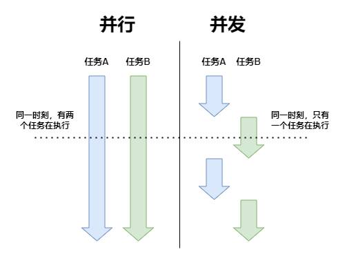
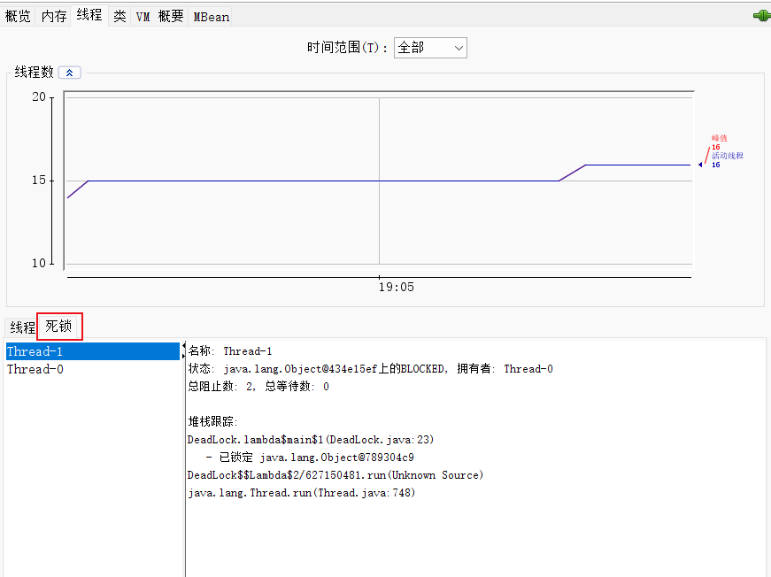
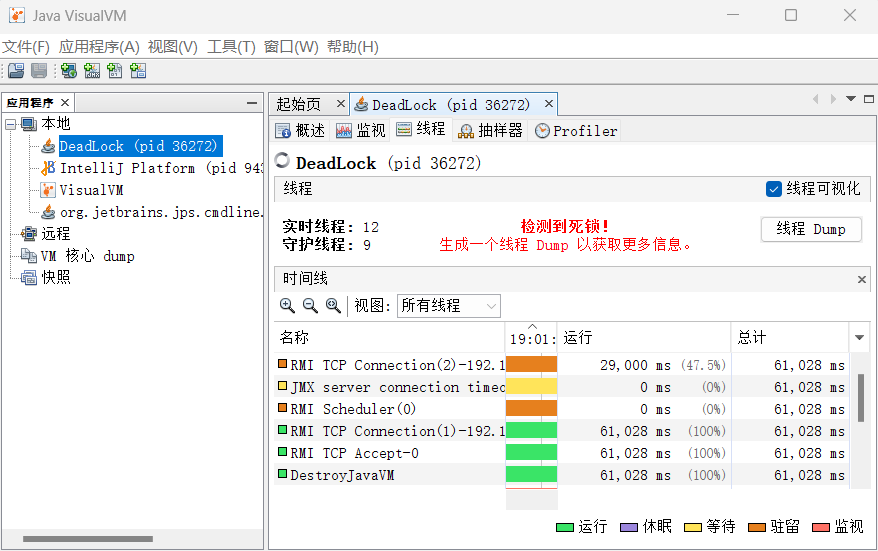

# 并发

## 推荐

仅做推荐，对以下二者的了解会对并发的学习事半功倍，不想看的话其实也没多大影响

- JMM（Java 内存模型）
  - 《深入理解Java虚拟机（第3版）》 - 第12章
- 操作系统 - 进程管理
  - [小林coding图解系统 - 五、进程管理](https://xiaolincoding.com/os/4_process/process_base.html)
  - [王道计算机考研 操作系统 - 进程管理](https://www.bilibili.com/video/BV1YE411D7nH?p=12&vd_source=fe3b57380ec8b2295c6f21c0d4ffb4d8)

推荐以下文章及书籍，基本上能满足你想要对并发的了解

- 《Java并发编程的艺术》
- 《实战Java高并发程序设计（第3版）》
- [深入浅出Java多线程](http://concurrent.redspider.group/)
- [JavaGuide(Java面试 + 学习指南) - 并发编程](https://javaguide.cn/java/concurrent/java-concurrent-questions-01.html)

## 同步与异步

- 同步（Synchronous）：发出调用后，必须一直等待返回结果，才能继续后续操作
- 异步（Asynchronous）：发出调用后，无需等待返回结果，可直接进行后续操作

## 并发与并行

- 并行（Parallelism）：同一时刻，多个任务同时执行
- 并发（concurrency）：在一个时间段内，多个任务交替执行



## 进程与线程

- 进程（Process）：进程是静态的程序的动态的执行过程，是系统进行 **资源分配的基本单位**
- 线程（Thread）：线程是进程当中的一条执行流程，是系统进行 **调度的基本单位**，一个进程内至少有一个线程

### 进程与线程的区别

- 拥有资源：进程是拥有系统资源的基本单位，进程间的资源是相互独立的。而线程只占用少量的必不可少的系统资源，但线程可以使用其隶属的进程的资源
- 系统开销：进程的创建与销毁，系统都要为之分配或回收资源，而线程只需要少量的必不可少的系统资源，开销很小。所以线程的创建与销毁的速度也更快
- 通信：进程间通信需要进程同步和互斥的手段辅助。来保证数据的一致性。而同一个进程内的不同线程共享进程的资源，可以直接读写共享的共享的资源来进行通信
- 上下文切换：上下文是指某一时间点上进程或线程的执行状态及相关信息，以便切换回来后进行恢复，线程占用的资源更少，所以切换的更快，开销也更小

### 进程的状态


一个进程通常有 5 种状态，其中至少有 3 种基本状态

- 运行态（Runing）：进程正在运行
- 就绪态（Ready）：进程在可运行状态，等待获取 CPU
- 阻塞态（Blocked）：又称等待态（Waiting），进程正在等待某一事件而暂停运行
- 创建态（New）：进程正在被创建，暂未转到就绪态
- 结束态（Terminated）：进程正在从系统中消失，可能是正常执行结束或其他原因中断运行退出

### 线程的状态

线程被视为轻量级进程，所以操作系统线程的状态其实和操作系统进程的状态是一致的，通常只关注最主要的 3 种状态


## 多线程

百科上说多线程指从软件或者硬件上实现多个线程并发执行的技术，简单点就是多个线程并发执行

### 优点

- 提高程序执行效率：在一个程序中有很多操作是非常耗时的（IO 操作等），只用单线程的话就会发生阻塞，其他的操作就无法进行。使用了多线程就可以单独开辟一个线程去处理这类操作，其他线程可以继续进行其他操作
- 提高多核 CPU 的使用率：如果只使用单线程，就会造成一核有难，多核围观的现象。使用多线程就可以更充分利用多核 CPU 的性能，也是提高程序的执行效率

### 缺点

- 多线程并不是线程越多越好，过多的线程也是很耗费系统资源的，不仅不会提高效率，反而影响性能
- 线程安全：在多线程环境中，能正确的处理线程间的公共资源，使程序能正确完成。为了保证线程安全，需提供额外的操作，增加了系统的复杂性。这也是很多程序员对多线程望而却步的原因
- 死锁：两个或两个以上的线程在争夺互相手中的资源，而造成阻塞，若无外力作用，将无限期的等待下去

#### 如何避免线程死锁

```java
public class Test {

    private static Object obj1 = new Object();
    private static Object obj2 = new Object();

    public static void main(String[] args) {
        Thread t1 = new Thread(() -> {
            synchronized (obj1) {
                System.out.println("1、t1获得obj1");
                System.out.println("2、t1开始争抢obj2...");
                synchronized (obj2) {
                    System.out.println("3、t1获得obj2");
                }
            }
        });

        Thread t2 = new Thread(() -> {
            synchronized (obj2) {
                System.out.println("1、t2获得obj2");
                System.out.println("2、t2开始争抢obj1...");
                synchronized (obj1) {
                    System.out.println("3、t2获得obj1");
                }
            }
        });

        t1.start();
        t2.start();
    }
}
```

> 1、t1获得obj1
> 1、t2获得obj2
> 2、t2开始争抢obj1...
> 2、t1开始争抢obj2...

死锁的产生有 4 个必要条件

- 互斥：一个资源只能被一个线程所拥有的
- 不可剥夺：一个线程保持的资源只能等待他主动释放，不可以强行剥夺
- 请求和保持：一个线程保持着某些资源的同时，还去请求别的资源
- 循环等待：产生死锁一定发生了循环等待
  - 循环等待未必一定是死锁

只要破坏了至少 1 个必要条件，死锁也就可以避免了

- 破坏互斥：一个资源可以被多个线程所拥有的。一般只会针对只有读没有写的情况使用共享锁（读锁），如果有写的情况，破坏互斥的话，那么数据一致性也无法保证了
- 破坏不可剥夺：已占用部分资源的线程，再去请求别的资源，如果请求不到，可以主动释放他已占有的资源
- 破坏请求和保持：一次性申请所有所需的资源
- 破坏循环等待：按序申请资源，资源按照顺序申请，并按倒序回收

#### 如何排查死锁

##### jps + jstack

先使用 jps 检查是否有死锁


再使用 `jstack <进程ID>` 查看堆栈信息


##### jconsole

运行 bin 文件夹中的 jconsole，或者通过命令行运行




##### jvisualvm

运行 bin 文件夹中的 jvisualvm，或者通过命令行运行



## 参考

- [进程](https://zh.wikipedia.org/wiki/%E8%A1%8C%E7%A8%8B)
- [Java死锁排查和Java CPU 100% 排查的步骤整理和OOM FullGc案例](https://blog.csdn.net/u010648555/article/details/80721815)
