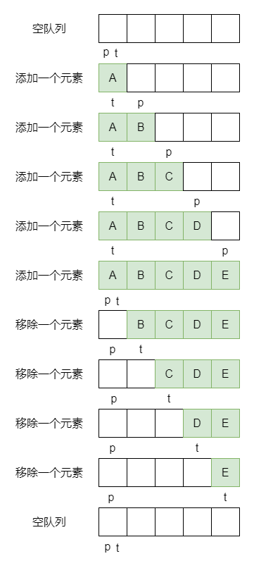

# 阻塞队列

阻塞队列常用于生产者和消费者的场景，生产者是往队列里添加元素的线程，消费者是从队列里拿元素的线程

- 生产者-消费者模式：生产者一直生产资源，消费者一直消费资源，两者不直接交流，而是利用一个缓冲池，生产者将生产出的资源放入缓冲池中，消费者从缓冲池中拿到资源进行消费

阻塞队列的阻塞主要体现在，缓冲池空了，要阻塞消费者，唤醒生产者；缓冲池满了，要阻塞生产者，唤醒消费者

## Queue

阻塞队列首先得是个队列，在 Java 中具有队列性质的集合都实现自 Queue 接口，主要有添加、删除、检查三种操作，每种操作又各有抛出异常、返回特殊值这两个版本

```java
public interface Queue<E> extends Collection<E> {
    
    // 向队列中添加一个元素，如果是一个有界队列且空间不足，则抛出异常
    boolean add(E e);

    // 向队列中添加一个元素，如果是一个有界队列且空间不足，则返回false
    boolean offer(E e);

    // 移除并返回队首元素，如果队列为空，则抛出异常
    E remove();

    // 移除并返回队首元素，如果队列为空，则返回null
    E poll();

    // 获得队首元素，如果队列为空，则抛出异常
    E element();

    // 获得队首元素，如果队列为空，则返回null
    E peek();
}
```

## BlockingQueue

阻塞队列都实现自 BlockingQueue 接口

```java
public interface BlockingQueue<E> extends Queue<E> {
    
    // 向队列中添加一个元素，如果是一个有界队列且空间不足，则抛出异常
    boolean add(E e);

    // 向队列中添加一个元素，如果是一个有界队列且空间不足，则返回false
    boolean offer(E e);

    // 向队列中添加一个元素，如果是一个有界队列且空间不足，则会一直阻塞
    void put(E e) throws InterruptedException;

    // 向队列中添加一个元素，如果是一个有界队列且空间不足，则会等待一段时间，超时返回false
    boolean offer(E e, long timeout, TimeUnit unit)
        throws InterruptedException;

    // 移除并返回队首元素，如果队列为空，则会一直阻塞
    E take() throws InterruptedException;

    // 移除并返回队首元素，如果队列为空，会等待一段时间，超时返回null
    E poll(long timeout, TimeUnit unit)
        throws InterruptedException;

    // 返回该队列剩余可插入的元素数量，最大值为Integer.MAX_VALUE
    int remainingCapacity();

    // 从队列中移除与给定元素相等的元素，如果有多个，只移除第一个
    boolean remove(Object o);

    // 判断队列中是否存在给定的元素
    public boolean contains(Object o);

    // 移除队列中给定数量的元素，并将他们添加到给定的集合中
    int drainTo(Collection<? super E> c, int maxElements);
}
```

|  | 抛出异常 | 返回特殊值 | 阻塞 | 超时退出 |
| :-: | :-: | :-: | :-: | :-: |
| 插入 | add(e) | offer(e) | put(e) | offer(e, time, unit) |
| 移除 | remove() | poll() | take() | poll(time, unit) |
| 检查 | element() | peek() |  |  |

### 实现类

BlockingQueue 主要有 7 个实现类

- ArrayBlockingQueue：由 **数组** 结构组成的 **有界** 阻塞队列
- LinkedBlockingQueue：由 **链表** 结构组成的 **有界** 阻塞队列，默认队列的大小为 Integer.MAX_VALUE
- LinkedBlockingDeque：由 **链表** 结构组成的 **有界** **双向** 阻塞队列
- LinkedTransferQueue：由 **链表** 结构组成的无界阻塞队列
- SynchronousQueue：**不存储元素** 的阻塞队列
- PriorityBlockingQueue：支持 **优先级** 排序的 **无界** 阻塞队列
- DelayQueue：使用 **延迟优先级** 的 **无界** 阻塞队列

有固定大小被称作有界队列，没有固定大小的，可以一直添加称作无界队列，当然元素是不可能无限制的添加的，在 Java 中的上限一般是 Integer.MAX_VALUE，相当于无界。所以 LinkedBlockingQueue 有时被叫做有界队列，有时又被叫做无界队列

## ArrayBlockingQueue

### 成员变量

```java
// 存放数据的数组
final Object[] items;

// 用于下次执行take、poll、peek、remove方法的数组下标，即获取方法
int takeIndex;

// 用于下次执行put、offer、add方法的数组下标，即添加方法
int putIndex;

// 队列中元素的数量
int count;

// 控制所有并发访问的锁
final ReentrantLock lock;

// 队列空时，消费者线程等待队列
private final Condition notEmpty;

// 队列满时，生产者线程等待队列
private final Condition notFull;

// 迭代器
transient Itrs itrs = null;
```

#### notEmpty 与 notFull

notEmpty 与 notFull 的字面意思指的是他们的唤醒条件

- 如果队列不为空就唤醒一个 notEmpty 等待队列中的线程，队列为空就阻塞
  - notEmpty.await 用在移除操作中，队列为空，也就无法移除元素了，所以得阻塞
  - notEmpty.signal 用在添加操作中，只要元素能添加成功，队列肯定就不为空了，所以可以唤醒了
- 如果队列未满，就唤醒一个 notFull 等待队列中的线程，队列已满就阻塞
  - notFull.await：用在添加操作中，队列满了，也就无法再添加元素了，所以得阻塞
  - notFull.signal：用在移除操作中，只要元素能成功移除，队列肯定就不是满的了，所以可以唤醒了

#### takeIndex 与 putIndex

ArrayBlockingQueue 是通过数组存储元素的，如果是按照下标为 0 的元素为头结点，那么每次从队列中获取一个元素，之后的元素都要前移一位，性能开销太大了

通过 takeIndex 与 putIndex 两个指针，一个指向可获取元素的位置，一个指向可插入元素的位置。通过两个指针的移动就可以快速的找到获取和插入的位置，也不需要频繁的移动元素，可以循环的利用数组



### 构造方法

```java
// 根据给定的容量创建一个队列，默认非公平锁
public ArrayBlockingQueue(int capacity) {
    this(capacity, false);
}

// 根据给定的容量及公平方式创建一个队列
public ArrayBlockingQueue(int capacity, boolean fair) {
    if (capacity <= 0)
        throw new IllegalArgumentException();
    this.items = new Object[capacity];
    lock = new ReentrantLock(fair);
    notEmpty = lock.newCondition();
    notFull =  lock.newCondition();
}

// 根据给定的容量及公平方式创建一个队列，并将给定的集合中的元素复制到队列中
public ArrayBlockingQueue(int capacity, boolean fair,
                            Collection<? extends E> c) {
    this(capacity, fair);

    final ReentrantLock lock = this.lock;
    lock.lock(); // Lock only for visibility, not mutual exclusion
    try {
        int i = 0;
        try {
            for (E e : c) {
                checkNotNull(e);
                items[i++] = e;
            }
        } catch (ArrayIndexOutOfBoundsException ex) {
            throw new IllegalArgumentException();
        }
        count = i;
        // 如果队列已满，则putIndex为0，无法执行下次的添加操作
        putIndex = (i == capacity) ? 0 : i;
    } finally {
        lock.unlock();
    }
}
```

### 添加方法

#### add

```java
public boolean add(E e) {
    return super.add(e);
}

public boolean add(E e) {
    // 内部调用了offer方法
    if (offer(e))
        return true;
    else
        throw new IllegalStateException("Queue full");
}
```

#### offer

```java
public boolean offer(E e) {
    checkNotNull(e);
    final ReentrantLock lock = this.lock;
    lock.lock();
    try {
        // 如果队列已满返回false，否则进行入队操作
        if (count == items.length)
            return false;
        else {
            enqueue(e);
            return true;
        }
    } finally {
        lock.unlock();
    }
}

// 有超时时间的
public boolean offer(E e, long timeout, TimeUnit unit)
    throws InterruptedException {

    checkNotNull(e);
    long nanos = unit.toNanos(timeout);
    final ReentrantLock lock = this.lock;
    lock.lockInterruptibly();
    try {
        // 如果队列已满，将当前线程挂起放入notFull等待队列中，等待被唤醒或者超时
        while (count == items.length) {
            if (nanos <= 0)
                return false;
            nanos = notFull.awaitNanos(nanos);
        }
        enqueue(e);
        return true;
    } finally {
        lock.unlock();
    }
}
```

#### put

```java
public void put(E e) throws InterruptedException {
    checkNotNull(e);
    final ReentrantLock lock = this.lock;
    lock.lockInterruptibly();
    try {
        // 如果队列已满，将当前线程挂起放入notFull等待队列中，等待被唤醒
        // 等待期间会释放锁
        while (count == items.length)
            notFull.await();
        enqueue(e);
    } finally {
        lock.unlock();
    }
}
```

#### 入队操作

```java
private void enqueue(E x) {
    final Object[] items = this.items;
    // 将给定的元素添加到当前可以执行添加操作的下标位置
    items[putIndex] = x;
    // 如果putIndex自增后等于队列容量上限，将putIndex设置为0
    if (++putIndex == items.length)
        putIndex = 0;
    count++;
    // 唤醒notEmpty等待队列中的第一个可用线程，可以去获取元素了
    notEmpty.signal();
}
```

### 移除方法

#### remove

```java
public E remove() {
    // 内部调用了poll方法
    E x = poll();
    if (x != null)
        return x;
    else
        throw new NoSuchElementException();
}
```

#### poll

```java
public E poll() {
    final ReentrantLock lock = this.lock;
    lock.lock();
    try {
        // 如果队列为空，返回null
        return (count == 0) ? null : dequeue();
    } finally {
        lock.unlock();
    }
}

// 有超时时间的
public E poll(long timeout, TimeUnit unit) throws InterruptedException {
    long nanos = unit.toNanos(timeout);
    final ReentrantLock lock = this.lock;
    lock.lockInterruptibly();
    try {
        // 如果队列为空，将当前线程挂起放入notEmpty等待队列中，等待被唤醒或超时
        while (count == 0) {
            if (nanos <= 0)
                return null;
            nanos = notEmpty.awaitNanos(nanos);
        }
        return dequeue();
    } finally {
        lock.unlock();
    }
}
```

#### take

```java
public E take() throws InterruptedException {
    final ReentrantLock lock = this.lock;
    lock.lockInterruptibly();
    try {
        // 如果队列为空，将当前线程挂起放入notEmpty等待队列中，等待被唤醒
        while (count == 0)
            notEmpty.await();
        return dequeue();
    } finally {
        lock.unlock();
    }
}
```

#### 出队操作

```java
private E dequeue() {
    final Object[] items = this.items;
    // 通过takeIndex获取元素
    @SuppressWarnings("unchecked")
    E x = (E) items[takeIndex];
    // 将该下标位置置空
    items[takeIndex] = null;
    // 如果takeIndex自增后等于队列容量上限，将takeIndex设置为0
    if (++takeIndex == items.length)
        takeIndex = 0;
    count--;
    if (itrs != null)
        itrs.elementDequeued();
    // 唤醒notFull等待队列中的第一个可用线程，可以去添加元素了
    notFull.signal();
    return x;
}
```

### 检查方法

#### element

```java
public E element() {
    // 内部调用了peek方法
    E x = peek();
    if (x != null)
        return x;
    else
        throw new NoSuchElementException();
}
```

#### peek

```java
public E peek() {
    final ReentrantLock lock = this.lock;
    lock.lock();
    try {
        return itemAt(takeIndex); // null when queue is empty
    } finally {
        lock.unlock();
    }
}

// 通过takeIndex获取元素
final E itemAt(int i) {
    return (E) items[i];
}
```

## LinkedBlockingQueue

### 节点

```java
static class Node<E> {
    E item;

    Node<E> next;

    Node(E x) { item = x; }
}
```

可以看出 LinkedBlockingQueue 使用的是一个单向链表

### 成员变量

```java
// 队列容量，最大为Integer.MAX_VALUE
private final int capacity;

// 队列中元素的数量
private final AtomicInteger count = new AtomicInteger();

// 头节点
transient Node<E> head;

// 尾节点
private transient Node<E> last;

// take锁，控制take、poll等移除操作的并发访问
private final ReentrantLock takeLock = new ReentrantLock();

// 队列空时，消费者线程等待队列
private final Condition notEmpty = takeLock.newCondition();

// put锁，控制put、offer等添加操作的并发访问
private final ReentrantLock putLock = new ReentrantLock();

// 队列满时，生产者线程等待队列
private final Condition notFull = putLock.newCondition();
```

LinkedBlockingQueue 的头节点与 AQS 内的头节点一样都是一个哨兵节点，是不存储元素的，即 head 的 item 永远都是 null，我们获取到的队列头部的元素，实际上是头节点的后继节点

生产者使用 putLock 锁，消费者使用 takeLock，可以防止生产者和消费者线程之间的锁争夺

### 构造方法

```java
// 默认创建一个Integer.MAX_VALUE长度的队列
public LinkedBlockingQueue() {
    this(Integer.MAX_VALUE);
}

// 创建一个给定大小的队列
public LinkedBlockingQueue(int capacity) {
    if (capacity <= 0) throw new IllegalArgumentException();
    this.capacity = capacity;
    last = head = new Node<E>(null);
}

// 创建一个Integer.MAX_VALUE长度的队列，并将给定的集合中的元素复制到队列中
public LinkedBlockingQueue(Collection<? extends E> c) {
    this(Integer.MAX_VALUE);
    final ReentrantLock putLock = this.putLock;
    putLock.lock(); // Never contended, but necessary for visibility
    try {
        int n = 0;
        for (E e : c) {
            if (e == null)
                throw new NullPointerException();
            if (n == capacity)
                throw new IllegalStateException("Queue full");
            enqueue(new Node<E>(e));
            ++n;
        }
        count.set(n);
    } finally {
        putLock.unlock();
    }
}
```

### 添加方法

add、offer、put 方法与 ArrayBlockingQueue 中的思路类似，只有些许区别，所以下面只看一下 put 方法

```java
public void put(E e) throws InterruptedException {
    if (e == null) throw new NullPointerException();
    // 添加成功后的队列中的元素总数
    // 默认是-1，表示失败
    int c = -1;
    // 创建新节点
    Node<E> node = new Node<E>(e);
    final ReentrantLock putLock = this.putLock;
    final AtomicInteger count = this.count;
    putLock.lockInterruptibly();
    try {
        // 如果队列已满，将当前线程挂起放入notFull等待队列中，等待被唤醒
        while (count.get() == capacity) {
            notFull.await();
        }
        enqueue(node);
        c = count.getAndIncrement();
        // 如果当前队列中的元素数量加1，仍小于最大容量，唤醒notFull等待队列中的第一个可用线程，可以去添加元素了
        if (c + 1 < capacity)
            notFull.signal();
    } finally {
        putLock.unlock();
    }
    // 如果当前队列中没有元素，唤醒notEmpty等待队列中的第一个可用线程，可以去获取元素了
    if (c == 0)
        signalNotEmpty();
}

private void enqueue(Node<E> node) {
    // 将新节点加到last后面，再将last指向该节点
    last = last.next = node;
}

// 唤醒notEmpty等待队列中的第一个可用线程，可以去获取元素了
private void signalNotEmpty() {
    final ReentrantLock takeLock = this.takeLock;
    takeLock.lock();
    try {
        notEmpty.signal();
    } finally {
        takeLock.unlock();
    }
}
```

### 移除方法

remove、poll、take 方法与 ArrayBlockingQueue 中的思路类似，只有些许区别，所以下面只看一下 take 方法

```java
public E take() throws InterruptedException {
    E x;
    // 移除成功后的队列中的元素总数
    // 默认是-1，表示失败
    int c = -1;
    final AtomicInteger count = this.count;
    final ReentrantLock takeLock = this.takeLock;
    takeLock.lockInterruptibly();
    try {
        // 如果队列为空，将当前线程挂起放入notEmpty等待队列中，等待被唤醒
        while (count.get() == 0) {
            notEmpty.await();
        }
        x = dequeue();
        c = count.getAndDecrement();
        // 如果当前队列中的元素数量仍大于1，唤醒notEmpty等待队列中的第一个可用线程，可以去获取元素了
        if (c > 1)
            notEmpty.signal();
    } finally {
        takeLock.unlock();
    }
    if (c == capacity)
        signalNotFull();
    return x;
}

private E dequeue() {
    // 获取头节点
    Node<E> h = head;
    // 获取头节点的后继节点
    Node<E> first = h.next;
    // 将头节点的后继节点指向自己
    h.next = h; // help GC
    // 交换头节点位置
    head = first;
    // first其实才是能获取到元素的"头节点"
    E x = first.item;
    // 获取完元素将其置空，真正成为一个头节点
    first.item = null;
    return x;
}

// 唤醒notFull等待队列中的第一个可用线程，可以去添加元素了
private void signalNotFull() {
    final ReentrantLock putLock = this.putLock;
    putLock.lock();
    try {
        notFull.signal();
    } finally {
        putLock.unlock();
    }
}
```

### 检查方法

element 方法与 ArrayBlockingQueue 的相同，不多赘述，内部都是调用的 peek 方法

```java
public E peek() {
    if (count.get() == 0)
        return null;
    final ReentrantLock takeLock = this.takeLock;
    takeLock.lock();
    try {
        // 获取头节点的后继节点，真正存储队首元素的节点
        Node<E> first = head.next;
        if (first == null)
            return null;
        else
            return first.item;
    } finally {
        takeLock.unlock();
    }
}
```

### 与 ArrayBlockingQueue 的区别

- ArrayBlockingQueue 基于数组结构，LinkedBlockingQueue 基于链表结构
- ArrayBlockingQueue 初始化需指定容量上限，LinkedBlockingQueue 初始化可以不指定容量上限
- ArrayBlockingQueue 中生产和消费共用一把锁，LinkedBlockingQueue 中锁是分离的，生产使用 putLock，消费使用 takeLock

在 ArrayBlockingQueue 中生产和消费共用一把锁，而在 LinkedBlockingQueue 生产和消费使用了两把锁。这就意味着 ArrayBlockingQueue 每次只能执行生产和消费其中一个操作，而 LinkedBlockingQueue 可以生产和消费同时进行，并且将锁细分后，减少了锁之间的竞争

## LinkedBlockingDeque

与 LinkedBlockingQueue 类似，只是改用了双向链表

```java
static final class Node<E> {

    E item;

    Node<E> prev;

    Node<E> next;

    Node(E x) {
        item = x;
    }
}
```

## LinkedTransferQueue

与 LinkedBlockingQueue 类似，不可指定容量上限，并且内部没有使用 ReentrantLock 来保证线程安全，而采用了 CAS 机制

## SynchronousQueue

不存储元素的阻塞队列，每个插入操作必须等待一个移除操作，反之亦然

当然作为一个集合不存储元素是不可能的，SynchronousQueue 更像是一个临时存放点，往里面加入一个元素后，就必须得拿走，不然就啥也不干了

可以看一下 SynchronousQueue 与容量为 1 的 LinkedBlockingQueue 的区别

```java
public class Test {

    public static void main(String[] args) throws InterruptedException {
        LinkedBlockingQueue<String> linkedBlockingQueue = new LinkedBlockingQueue<>(1);
        SynchronousQueue<String> synchronousQueue = new SynchronousQueue<>();

        System.out.println("before");
        linkedBlockingQueue.put("ONE");
        System.out.println("linkedBlockingQueue put");
        synchronousQueue.put("ONE");
        System.out.println("synchronousQueue put");
    }
}
```

> before
> linkedBlockingQueue put

可以看出容量为 1 的 LinkedBlockingQueue 执行 put 方法后，还可执行后面的代码，而 SynchronousQueue 执行 put 方法后，线程就被阻塞了，只有当里面的元素被消费了之后，才会恢复执行

所以可以把 SynchronousQueue 看做一个没有容量的阻塞队列

```java
// 总是返回null
System.out.println(queue.peek());

// 总是返回0
System.out.println(queue.size());

// 总是返回true
System.out.println(queue.isEmpty());

// 总是返回null
System.out.println(queue.poll());

// 总是抛出异常
System.out.println(queue.remove());
```

## PriorityBlockingQueue

PriorityBlockingQueue 基于数组的堆结构，并且默认是个小根堆，即数组内的第一个元素是整个数组内最小的，但并不意味着数组内的元素是按照从小到大排的，而是只能确保第一个元素小于其他所有元素

### 成员变量

```java
// 默认容量
private static final int DEFAULT_INITIAL_CAPACITY = 11;

// 最大容量
private static final int MAX_ARRAY_SIZE = Integer.MAX_VALUE - 8;

// 存放数据的数组
private transient Object[] queue;

// 队列中的元素个数
private transient int size;

// 比较器，如果为null则按照从小到大排序
private transient Comparator<? super E> comparator;

// 控制所有并发访问的锁
private final ReentrantLock lock;

// 队列空时，消费者线程等待队列
private final Condition notEmpty;

// 用于扩容时的CAS操作
private transient volatile int allocationSpinLock;

// 只用于序列化和反序列化
private PriorityQueue<E> q;
```

### 构造方法

注意无论是默认的容量还是给定的容量，都不是 PriorityBlockingQueue 的最大容量，而是跟 List 一样，是一个初始化的容量，当元素添加到一定程度后会自动扩容

```java
// 根据默认的容量创建一个队列
public PriorityBlockingQueue() {
    this(DEFAULT_INITIAL_CAPACITY, null);
}

// 根据给定的容量创建一个队列
public PriorityBlockingQueue(int initialCapacity) {
    this(initialCapacity, null);
}

// 根据给定的容量创建一个队列，并使用给定的比较器
public PriorityBlockingQueue(int initialCapacity,
                                Comparator<? super E> comparator) {
    if (initialCapacity < 1)
        throw new IllegalArgumentException();
    this.lock = new ReentrantLock();
    this.notEmpty = lock.newCondition();
    this.comparator = comparator;
    this.queue = new Object[initialCapacity];
}

// 创建一个队列，并将给定的集合中的元素复制到队列中
public PriorityBlockingQueue(Collection<? extends E> c) {
    this.lock = new ReentrantLock();
    this.notEmpty = lock.newCondition();
    boolean heapify = true; // true if not known to be in heap order
    boolean screen = true;  // true if must screen for nulls
    if (c instanceof SortedSet<?>) {
        SortedSet<? extends E> ss = (SortedSet<? extends E>) c;
        this.comparator = (Comparator<? super E>) ss.comparator();
        heapify = false;
    }
    else if (c instanceof PriorityBlockingQueue<?>) {
        PriorityBlockingQueue<? extends E> pq =
            (PriorityBlockingQueue<? extends E>) c;
        this.comparator = (Comparator<? super E>) pq.comparator();
        screen = false;
        if (pq.getClass() == PriorityBlockingQueue.class) // exact match
            heapify = false;
    }
    Object[] a = c.toArray();
    int n = a.length;
    // If c.toArray incorrectly doesn't return Object[], copy it.
    if (a.getClass() != Object[].class)
        a = Arrays.copyOf(a, n, Object[].class);
    if (screen && (n == 1 || this.comparator != null)) {
        for (int i = 0; i < n; ++i)
            if (a[i] == null)
                throw new NullPointerException();
    }
    this.queue = a;
    this.size = n;
    if (heapify)
        heapify();
}
```

### 添加方法

PriorityBlockingQueue 的添加方法都是非阻塞的，因为 PriorityBlockingQueue 是个无界队列，但是操作时需要先获取独占锁。此外 add、put 内部都是调用的 offer 方法

```java
public boolean add(E e) {
    return offer(e);
}
```

```java
public void put(E e) {
    offer(e); // never need to block
}
```

```java
public boolean offer(E e) {
    if (e == null)
        throw new NullPointerException();
    final ReentrantLock lock = this.lock;
    lock.lock();
    int n, cap;
    Object[] array;
    // 当队列中元素的数量大于等于数组的容量，开始扩容
    while ((n = size) >= (cap = (array = queue).length))
        tryGrow(array, cap);
    try {
        Comparator<? super E> cmp = comparator;
        // 比较并插入
        if (cmp == null)
            siftUpComparable(n, e, array);
        else
            siftUpUsingComparator(n, e, array, cmp);
        size = n + 1;
        notEmpty.signal();
    } finally {
        lock.unlock();
    }
    return true;
}

public boolean offer(E e, long timeout, TimeUnit unit) {
    return offer(e); // never need to block
}
```

```java
// k：当前队列中元素的个数，也就是即将要开始插入元素的下标位置
// x：要插入的元素
// array：存放元素的数组
private static <T> void siftUpComparable(int k, T x, Object[] array) {
    Comparable<? super T> key = (Comparable<? super T>) x;
    while (k > 0) {
        // 找到父节点的下标，(k-1)/2，向下取整
        int parent = (k - 1) >>> 1;
        Object e = array[parent];
        // 跟父节点进行比较，如果大于等于父节点则结束循环，否则再往前找父节点
        if (key.compareTo((T) e) >= 0)
            break;
        // 如果当前元素小于父节点，则进行交换
        array[k] = e;
        k = parent;
    }
    array[k] = key;
}

// 使用给定的比较器进行比较
private static <T> void siftUpUsingComparator(int k, T x, Object[] array,
                                    Comparator<? super T> cmp) {
    while (k > 0) {
        int parent = (k - 1) >>> 1;
        Object e = array[parent];
        if (cmp.compare(x, (T) e) >= 0)
            break;
        array[k] = e;
        k = parent;
    }
    array[k] = x;
}
```

#### 扩容方法

```java
private void tryGrow(Object[] array, int oldCap) {
    // 首先释放锁
    lock.unlock(); // must release and then re-acquire main lock
    Object[] newArray = null;
    // 如果allocationSpinLock说明有其他线程正在执行扩容操作
    if (allocationSpinLock == 0 &&
        UNSAFE.compareAndSwapInt(this, allocationSpinLockOffset,
                                    0, 1)) {
        try {
            // 如果节点个数小于64，则扩容oldCap + oldCap + 2，即 2 * oldCap + 2
            // 如果节点个数大于等于64，则扩容oldCap + oldCap / 2
            // 希望在节点数较小的时候扩容大些
            int newCap = oldCap + ((oldCap < 64) ?
                                    (oldCap + 2) : // grow faster if small
                                    (oldCap >> 1));
            // 判断新的容量大小是否越界了
            if (newCap - MAX_ARRAY_SIZE > 0) {    // possible overflow
                int minCap = oldCap + 1;
                if (minCap < 0 || minCap > MAX_ARRAY_SIZE)
                    throw new OutOfMemoryError();
                newCap = MAX_ARRAY_SIZE;
            }
            // 创建新数组
            if (newCap > oldCap && queue == array)
                newArray = new Object[newCap];
        } finally {
            allocationSpinLock = 0;
        }
    }
    // 可能有其他线程正在执行扩容操作，进行礼让
    if (newArray == null) // back off if another thread is allocating
        Thread.yield();
    // 重新获取锁，将旧数组内的元素复制到新数组中
    lock.lock();
    if (newArray != null && queue == array) {
        queue = newArray;
        System.arraycopy(array, 0, newArray, 0, oldCap);
    }
}
```

### 移除方法

PriorityBlockingQueue 的移除方法很简单，就是移除数组中的第一个元素就可以了，但是后续需要进行一些操作来维护二叉堆的性质

```java
public E remove() {
    E x = poll();
    if (x != null)
        return x;
    else
        throw new NoSuchElementException();
}
```

```java
public E poll() {
    final ReentrantLock lock = this.lock;
    lock.lock();
    try {
        return dequeue();
    } finally {
        lock.unlock();
    }
}

public E poll(long timeout, TimeUnit unit) throws InterruptedException {
    long nanos = unit.toNanos(timeout);
    final ReentrantLock lock = this.lock;
    lock.lockInterruptibly();
    E result;
    try {
        // 只要出队的结果为null就一直阻塞
        while ( (result = dequeue()) == null && nanos > 0)
            nanos = notEmpty.awaitNanos(nanos);
    } finally {
        lock.unlock();
    }
    return result;
}
```

```java
public E take() throws InterruptedException {
    final ReentrantLock lock = this.lock;
    lock.lockInterruptibly();
    E result;
    try {
        // 只要出队的结果为null就一直阻塞
        while ( (result = dequeue()) == null)
            notEmpty.await();
    } finally {
        lock.unlock();
    }
    return result;
}
```

#### 出队操作

```java
private E dequeue() {
    int n = size - 1;
    if (n < 0)
        return null;
    else {
        Object[] array = queue;
        // 可以看出在这里已经获取到了结果，后续进行的操作都是为了维护二叉堆的性质
        E result = (E) array[0];
        E x = (E) array[n];
        array[n] = null;
        Comparator<? super E> cmp = comparator;
        if (cmp == null)
            siftDownComparable(0, x, array, n);
        else
            siftDownUsingComparator(0, x, array, n, cmp);
        size = n;
        return result;
    }
}
```

```java
// k：当前空缺的位置，执行了出队操作，空缺的位置自然就是0
// x：要插入的元素
// array：存放元素的数组
// n：最后一个元素的下标
private static <T> void siftDownComparable(int k, T x, Object[] array,
                                            int n) {
    if (n > 0) {
        Comparable<? super T> key = (Comparable<? super T>)x;
        // 堆中的叶子节点最多，占一半
        int half = n >>> 1;           // loop while a non-leaf
        // 循环非叶子节点
        while (k < half) {
            // 左孩子，即 k * 2 + 1
            int child = (k << 1) + 1; // assume left child is least
            Object c = array[child];
            // 右孩子，即 k * 2 + 2
            int right = child + 1;
            // 找到左孩子与右孩子中最小的元素，如果右孩子更小，则将下一个要往后查找的节点更新为右孩子节点
            if (right < n &&
                ((Comparable<? super T>) c).compareTo((T) array[right]) > 0)
                c = array[child = right];
            // 如果当前要插入的元素小于等于左孩子，则结束循环，当前位置就是适合插入的位置
            if (key.compareTo((T) c) <= 0)
                break;
            // 交换位置
            array[k] = c;
            // 继续往后查找
            k = child;
        }
        array[k] = key;
    }
}

private static <T> void siftDownUsingComparator(int k, T x, Object[] array,
                                                int n,
                                                Comparator<? super T> cmp) {
    if (n > 0) {
        int half = n >>> 1;
        while (k < half) {
            int child = (k << 1) + 1;
            Object c = array[child];
            int right = child + 1;
            if (right < n && cmp.compare((T) c, (T) array[right]) > 0)
                c = array[child = right];
            if (cmp.compare(x, (T) c) <= 0)
                break;
            array[k] = c;
            k = child;
        }
        array[k] = x;
    }
}
```

### 检查方法

检查方法返回数组中的第一个元素就行了

```java
public E element() {
    E x = peek();
    if (x != null)
        return x;
    else
        throw new NoSuchElementException();
}
```

```java
public E peek() {
    final ReentrantLock lock = this.lock;
    lock.lock();
    try {
        return (size == 0) ? null : (E) queue[0];
    } finally {
        lock.unlock();
    }
}
```

## DelayQueue

DelayQueue 是一个延迟队列，里面的元素默认按照到期时间从小到大排序，只有当元素过期是才能从队列中取出。里面存放的元素必须实现自 Delayed 接口

```java
public class Test {

    static DelayQueue<DelayTask> queue = new DelayQueue<>();

    public static void main(String[] args) throws InterruptedException {
        queue.add(new DelayTask(3000, "you"));
        queue.add(new DelayTask(1000, "fuck"));
        queue.add(new DelayTask(5000, "!!!"));

        System.out.println(queue.take().getData());
        System.out.println(queue.take().getData());
        System.out.println(queue.take().getData());
    }
}

class DelayTask implements Delayed {

    // 到期时间
    private volatile long time;

    // 存放的数据
    private String data;

    public String getData() {
        return data;
    }

    public DelayTask(long time, String data) {
        this.time = System.currentTimeMillis() + time;
        this.data = data;
    }

    @Override
    public long getDelay(TimeUnit unit) {
        return unit.convert(time - System.currentTimeMillis(), TimeUnit.MILLISECONDS);
    }

    @Override
    public int compareTo(Delayed o) {
        return Long.compare(this.time, ((DelayTask) o).time);
    }
}
```

## 参考

- [第十三章 阻塞队列](http://concurrent.redspider.group/article/03/13.html)
- [深入浅出Java多线程-阻塞队列BlockingQueue](https://crazyfzw.github.io/2020/11/20/concurrent-blocking-queue/)
- [ArrayBlockingQueue 详细源码解析](https://juejin.cn/post/6844903989788540941)
- [ArrayBlockingQueue uses a single lock for insertion and removal but LinkedBlockingQueue uses 2 separate locks](https://stackoverflow.com/questions/11015571/arrayblockingqueue-uses-a-single-lock-for-insertion-and-removal-but-linkedblocki)
- [Java并发包源码学习系列：阻塞队列实现之SynchronousQueue源码解析](https://www.cnblogs.com/summerday152/p/14358663.html)
- [Java并发包源码学习系列：阻塞队列实现之PriorityBlockingQueue源码解析](https://www.cnblogs.com/summerday152/p/14342019.html)
- [When should I use SynchronousQueue over LinkedBlockingQueue](https://stackoverflow.com/questions/8591610/when-should-i-use-synchronousqueue-over-linkedblockingqueue)
- [Java并发包源码学习系列：阻塞队列实现之DelayQueue源码解析](https://www.cnblogs.com/summerday152/p/14349570.html)
- [DelayQueue 源码分析](https://javaguide.cn/java/collection/delayqueue-source-code.html)
