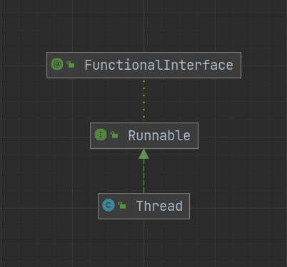
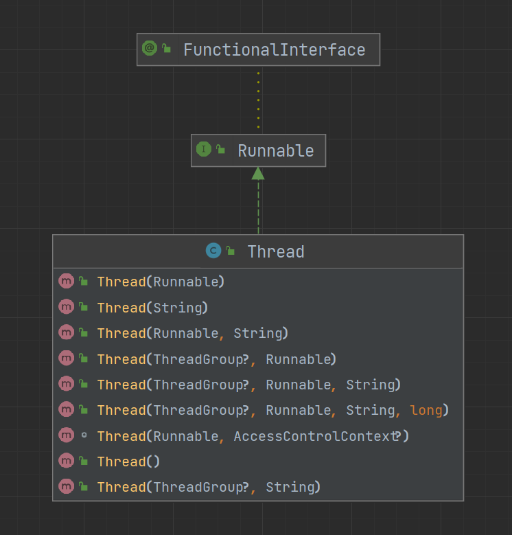
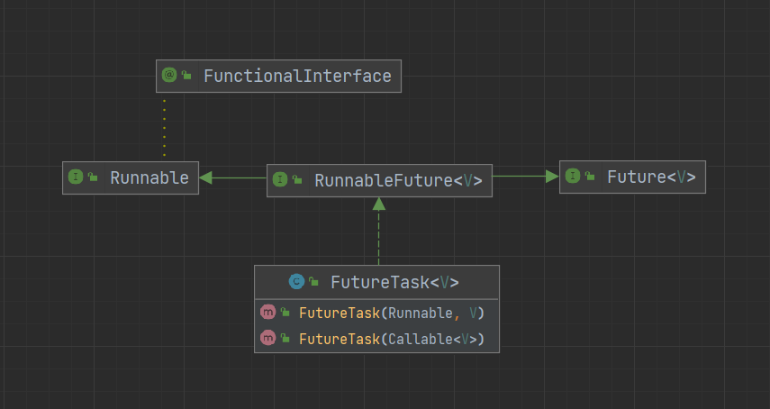

# Java 多线程

## Java 线程的状态

Java 中线程被分成了 6 种状态

```java
public enum State {

    NEW,

    RUNNABLE,

    BLOCKED,

    WAITING,

    TIMED_WAITING,

    TERMINATED;
}
```

- NEW（新生状态）：线程刚刚创建，还未开始执行。等到线程的 start 方法执行，才表示线程开始执行
- RUNNABLE（运行状态，也可能是等待状态）：线程正在执行，也可能正在等待 CPU 分配资源
- BLOCKED（阻塞状态）：等待锁的释放
- WAITING（等待状态）：等待事件的发生
- TIMED_WAITING（超时等待状态）：等待事件的发生，超过时间限制后可自行返回
- TERMINATED（终止状态）：线程执行完毕


<small>[挑错 |《Java 并发编程的艺术》中关于线程状态的三处错误](https://mp.weixin.qq.com/s/UOrXql_LhOD8dhTq_EPI0w)</small>

### 示例代码

```java
public class Test {

    private static Object lock = new Object();

    public static void main(String[] args) throws InterruptedException {

        Thread thread_runnable = new Thread(() -> {
            synchronized (lock) {
                while (true) {}
            }
        });

        Thread thread_blocked = new Thread(() -> {
            synchronized (lock) {
                System.out.println(lock);
            }
        });

        Thread thread_waiting = new Thread(() -> {
            try {
                thread_runnable.join();
            } catch (InterruptedException e) {
                throw new RuntimeException(e);
            }
        });

        Thread thread_timed_waiting = new Thread(() -> {
            try {
                thread_runnable.join(1000 * 60);
            } catch (InterruptedException e) {
                throw new RuntimeException(e);
            }
        });

        Thread thread_terminated = new Thread();

        System.out.println(thread_runnable.getState());

        thread_runnable.start();
        // 确保thread_runnable线程已开始运行
        Thread.sleep(50);
        thread_blocked.start();
        thread_waiting.start();
        thread_timed_waiting.start();
        thread_terminated.start();
        // 确保所有线程已开始运行
        Thread.sleep(50);

        System.out.println(thread_runnable.getState());
        System.out.println(thread_blocked.getState());
        System.out.println(thread_waiting.getState());
        System.out.println(thread_timed_waiting.getState());
        System.out.println(thread_terminated.getState());
    }
}
```

> NEW
> RUNNABLE
> BLOCKED
> WAITING
> TIMED_WAITING
> TERMINATED

### 为什么 Java 用 RUNNABLE 代替了 READY 和 RUNNING 状态

对于现代的分时操作系统，都是通过争抢时间片来进行调度的，获得了时间片就开始执行，时间片用完就释放出 CPU，再继续争抢时间片。也就是说处于就绪态的线程获得了时间片，就会转为运行态，运行态的线程时间片用完，就会转回就绪态

一个时间片通常只有 10 ~ 20 毫秒，也即 0.01 ~ 0.02 秒，所以线程会在就绪态和运行态之间飞速的切换，再去做具体的区分意义不大

## Java 中线程的实现

### Thread 类

最常用的实现方式，有三种具体的实现方法

- 继承 Thread 类，并重写 run 方法
- 创建匿名内部类，并重写 run 方法
- 使用 lambda 表达式重写 run 方法

```java
public class Test {

    public static void main(String[] args) {

        // 匿名内部类
        Thread t1 = new Thread() {
            @Override
            public void run() {
                System.out.println("t1...");
            }
        };

        // lambda表达式
        Thread t2 = new Thread(()->{
            System.out.println("t2...");
        });

        // 继承
        Thread t3 = new MyThread();
    }
}

class MyThread extends Thread {
    @Override
    public void run() {
        System.out.println("t3...");
    }
}
```

### Runnable 接口

```java
@FunctionalInterface
public interface Runnable {
    public abstract void run();
}
```



可以看出 Thread 类 实现了 Runnable 接口，函数式编程的特性也由此而来

```java
public class Test {

    public static void main(String[] args) {
        Thread thread = new Thread(new MyRunnable());
    }
}

class MyRunnable implements Runnable {

    @Override
    public void run() {
        System.out.println("my runnable");
    }
}
```

### Callable 接口

```java
@FunctionalInterface
public interface Callable<V> {
    V call() throws Exception;
}
```

使用 Runnable 和 Thread 都是没有返回值的，而当我们需要一个线程执行完任务后能给出返回值，就可以使用 Callable + FutureTask（中转）

```java
public class Test {

    public static void main(String[] args) throws Exception {
        FutureTask<String> task = new FutureTask<>(new MyCallable());
        // 无法直接传入Callable类型，通过FutureTask中转
        new Thread(task).start();
        System.out.println("我在你前面");
        // 注意调用get方法会阻塞当前线程，直到得到结果
        System.out.println(task.get());
        System.out.println("我在你后面");
    }
}

class MyCallable implements Callable<String> {

    @Override
    public String call() throws Exception {
        System.out.println("进入线程...");
        Thread.sleep(1000 * 6);
        return "你做的好啊";
    }
}
```

#### FutureTask



通过上图可以看出 Thread 的构造方法是接受不了 Callable 类型，这就需要一个中转的类，而 FutureTask 正好有能接受 Callable 类型的构造方法



#### Future 接口

```java
public interface Future<V> {

    // 尝试取消，并不一定能取消成功，任务可能已完成、已取消、或者一些其它因素不能取消
    boolean cancel(boolean mayInterruptIfRunning);

    // 是否已被取消
    boolean isCancelled();

    // 是否执行完成
    boolean isDone();

    // 获得执行结果
    V get() throws InterruptedException, ExecutionException;

    // 在时间限制内获得执行结果，如果超时抛出异常
    V get(long timeout, TimeUnit unit)
        throws InterruptedException, ExecutionException, TimeoutException;
}
```

### 线程组

Java 中每个线程都属于一个线程组，如果没有显式的指定线程组，默认将父线程（当前的线程）的线程组设置为自己的线程组

```java
public class Test {

    public static void main(String[] args) throws Exception {
        Thread main = Thread.currentThread();

        Thread thread = new Thread();

        // 创建线程组
        ThreadGroup group = new ThreadGroup("鸡你太美");
        Thread son1 = new Thread(group, thread);
        Thread son2 = new Thread(group, thread);

        System.out.println(main.getThreadGroup().getName());
        System.out.println(thread.getThreadGroup().getName());
        System.out.println(son1.getThreadGroup().getName());
        System.out.println(son2.getThreadGroup().getName());
    }
}
```

> main
> main
> 鸡你太美
> 鸡你太美

通过线程组可以对组内的线程进行简单的管理

```java
// 中断线程组中所有线程
public final void interrupt();

// 停止线程组中所有线程
public final void stop();

// 销毁线程组中所有线程
public final void destroy();

// 返回线程组中当前活动线程的数量
public int activeCount();

// 打印出线程组中所有的线程
public void list();
```

## 线程优先级

Java 中可以指定线程的优先级，范围在 1 ~ 10，优先级高的越容易抢占到资源。由于线程的优先级调度和底层操作系统有密切的关系，在各个平台上表现不一，线程最终的调用顺序还是得有操作系统决定

```java
public class Test {

    public static void main(String[] args) {
        Thread t1 = new Thread(() -> {
            for (int i = 0; i < 100000; i++) {
            }
            System.out.println("低优先级");
        });
        Thread t2 = new Thread(() -> {
            for (int i = 0; i < 100000; i++) {
            }
            System.out.println("中优先级");
        });
        Thread t3 = new Thread(() -> {
            for (int i = 0; i < 100000; i++) {
            }
            System.out.println("高优先级");
        });

        // 设置优先级
        t1.setPriority(Thread.MIN_PRIORITY);
        t2.setPriority(Thread.NORM_PRIORITY);
        t3.setPriority(Thread.MAX_PRIORITY);

        t1.start();
        t2.start();
        t3.start();
    }
}
```

> 高优先级
> 中优先级
> 低优先级

优先级更高的总是更快完成吗，但也是会出现低优先级的比高优先级的更快被完成

## 守护线程

守护线程是一个特殊的线程，且默认的优先级比较低，如果一个线程组中所有的非守护线程都结束了，那么守护线程也会自动结束

```java
public class Test {

    public static void main(String[] args) {
        Thread thread = new Thread(() -> {
            while (true) {
                System.out.println("hello");
            }
        });

        // 设置为守护线程
        thread.setDaemon(true);

        thread.start();
    }
}
```

如果 thread 没有被设置为守护线程，那么控制台就会一直在打印 hello

setDaemon 方法要在 start 方法之前执行，否则会抛出 IllegalThreadStateException 异常，设置守护线程失败，但程序还是会继续运行的

## 线程常用方法

### Thread 类静态方法

#### currentThread

获取当前执行的线程

```java
public static native Thread currentThread();
```

#### sleep

使当前的线程睡眠一会，即暂时停止执行，但不会失去已拥有的锁

如果处于睡眠状态的线程被执行中断操作，则会抛出 InterruptedException

```java
public static native void sleep(long millis) throws InterruptedException;

// 1毫秒=1000微秒，1微秒=1000纳秒
public static void sleep(long millis, int nanos)
throws InterruptedException {
    if (millis < 0) {
        throw new IllegalArgumentException("timeout value is negative");
    }

    if (nanos < 0 || nanos > 999999) {
        throw new IllegalArgumentException(
                            "nanosecond timeout value out of range");
    }

    if (nanos >= 500000 || (nanos != 0 && millis == 0)) {
        millis++;
    }

    sleep(millis);
}
```

#### yield

当前线程愿意让出 CPU，调度程序可以忽略此项建议。而且当前线程在让出 CPU 后，还会进行对 CPU 资源的争夺

```java
public static native void yield();
```

### Thread 类普通方法

#### run

线程将要执行的操作，需要根据需求重写。执行 start 方法后，线程会自动的执行 run 方法的内容

- run 方法也可以直接被调用，直接执行的 run 方法不会以多线程的方式执行

#### start

启动一个线程

```java
public synchronized void start() {
    // 如果当前线程不是新生状态，则抛出异常
    if (threadStatus != 0)
        throw new IllegalThreadStateException();

    // 将当前线程加入到线程组中
    group.add(this);

    boolean started = false;
    try {
        start0();
        started = true;
    } finally {
        try {
            // 如果启动失败，将当前线程从线程组中删除
            if (!started) {
                group.threadStartFailed(this);
            }
        } catch (Throwable ignore) {
            /* do nothing. If start0 threw a Throwable then
                it will be passed up the call stack */
        }
    }
}

private native void start0();
```

从源码中可以看出，一个线程的 start 方法只能被调用一次，且只能是新生状态的线程可以调用。处于新生状态的线程一旦调用成功后，状态就会被改变，且无法再回到新生状态

#### interrupt

中断当前线程的执行，但不会立即关闭线程，而是给线程发送一个通知，由目标线程决定何时关闭

```java
public void interrupt() {
    if (this != Thread.currentThread())
        checkAccess();

    synchronized (blockerLock) {
        Interruptible b = blocker;
        if (b != null) {
            interrupt0();           // Just to set the interrupt flag
            b.interrupt(this);
            return;
        }
    }
    interrupt0();
}

private native void interrupt0();

// 判断当前线程是否被中断
public boolean isInterrupted() {
    return isInterrupted(false);
}

// 判断当前线程是否被中断，并清除中断标志位
public static boolean interrupted() {
    return currentThread().isInterrupted(true);
}
```

```java
public class Test {

    public static void main(String[] args) throws InterruptedException {
        Thread t1 = new Thread(() -> {
            while (true) {
//                if (Thread.interrupted()) {
//                    return;
//                }
            }
        });

        t1.start();

        Thread.sleep(50);

        t1.interrupt();

        Thread.sleep(50);

        System.out.println(t1.getState());
    }
}
```

虽然执行了 interrupt 方法，但 t1 线程仍然处于运行状态。如果需要 t1 线程在接收到中断指令后停止执行，就必须在线程中增加响应的中断处理代码

#### stop（已被废弃）

立即终止当前线程，已被废弃，原因是过于暴力，强行把执行中的线程终止，可能会引发一些数据不一致的问题

```java
@Deprecated
public final void stop();

@Deprecated
public final synchronized void stop(Throwable obj);
```

#### join

让当前线程等待另一个线程执行完毕后再继续执行，会阻塞当前线程，通过源码可以看出 join 方法是通过 Object 类的 wait 方法实现的

```java
public final synchronized void join(long millis)
throws InterruptedException {
    long base = System.currentTimeMillis();
    long now = 0;

    if (millis < 0) {
        throw new IllegalArgumentException("timeout value is negative");
    }

    if (millis == 0) {
        while (isAlive()) {
            wait(0);
        }
    } else {
        while (isAlive()) {
            long delay = millis - now;
            if (delay <= 0) {
                break;
            }
            wait(delay);
            now = System.currentTimeMillis() - base;
        }
    }
}

public final synchronized void join(long millis, int nanos)
throws InterruptedException {

    if (millis < 0) {
        throw new IllegalArgumentException("timeout value is negative");
    }

    if (nanos < 0 || nanos > 999999) {
        throw new IllegalArgumentException(
                            "nanosecond timeout value out of range");
    }

    if (nanos >= 500000 || (nanos != 0 && millis == 0)) {
        millis++;
    }

    join(millis);
}

// 无限制的等待下去
public final void join() throws InterruptedException {
    join(0);
}
```

```java
public class Test {

    public static void main(String[] args) throws InterruptedException {
        Thread t1 = new Thread(() -> {
            while (true) {
            }
        });

        t1.start();

        Thread.sleep(50);

        // t1.join();
        // t1.join(1000);

        System.out.println("hey");
    }
}
```

如果不使用 join 方法，最后会打印出 hey，一旦使用了 join 方法，当前线程就会等待 t1 线程执行完毕，所以也就打印不出 hey

### Object 类

#### wait

让当前的线程等待，并释放当前对象的锁，一直等待到其他线程调用了该线程的 notify 或 notifyAll 方法，或者等待超过了设置的时间限制

```java
public final native void wait(long timeout) throws InterruptedException;

public final void wait(long timeout, int nanos) throws InterruptedException {
    if (timeout < 0) {
        throw new IllegalArgumentException("timeout value is negative");
    }

    if (nanos < 0 || nanos > 999999) {
        throw new IllegalArgumentException(
                            "nanosecond timeout value out of range");
    }

    if (nanos > 0) {
        timeout++;
    }

    wait(timeout);
}

public final void wait() throws InterruptedException {
    wait(0);
}
```

```java
public class Test {

    final static Object object = new Object();

    public static void main(String[] args) throws InterruptedException {

        Thread t1 = new Thread(() -> {
            while (true) {}
        });

        t1.start();

        Thread.sleep(50);

        synchronized (object) {
            object.wait();
        }

        System.out.println("hey");
    }
}
```

调用 wait 的前提是当前线程得拥有该对象的锁，否则会抛出 IllegalMonitorStateException 异常，你得先有锁才能去释放

##### 为什么 wait 方法必须包含在 synchronized 语句中

如果 wait 方法没有包含在 synchronized 语句中，就会抛出 IllegalMonitorStateException 异常

wait 方法作用是让当前线程等待，有等待肯定想要一个结果，如果一个等待注定没有结果，那不是等待，那是卡死了，也不符合实际的需求。所以调用完 wait 方法的线程，就期待着他能被 notify 或 notifyAll 唤醒，能够继续完成他未竟的事业。当然 wait 方法有个超时时间，但这是个保底机制，他主要期望的还是能被唤醒

其次 synchronized 的作用就是同步，在并发环境中，有可能出现 wait 方法期待的唤醒方法先于 wait 方法执行完毕，造成空唤醒的情况

##### 与 sleep 方法的区别

两者都可以暂停当前线程的执行，都可以响应中断

- wait 是 Object 类中的方法，sleep 是 Thread 类的静态方法
- wait 需写在 synchronized 语句中，sleep 则不需要
- wait 可以不指定时间参数，sleep 需指定时间参数
- wait 被调用后会释放当前对象的锁，而 sleep 则不会释放
- wait 常用作线程间通信，sleep 常用作暂停线程的执行
- wait 可以被 notify、notifyAll 唤醒，而 sleep 只能等待其自动苏醒

#### notify 与 notifyAll

notify 会 **随机** 唤醒一个正在等待的持有相同锁的线程，notifyAll 则会唤醒所有正在等待持有相同锁的线程

当一个线程调用了 wait 方法，就会进入到该对象（相同锁）的等待队列中。当 notify 方法被调用时，就会从这个队列中随机选择一个线程将其唤醒，而 notifyAll 方法被调用时，会唤醒队列中所有的线程

```java
public final native void notify();

public final native void notifyAll();
```

```java
public class Test {

    private static final Object lock_1 = new Object();

    private static final Object lock_2 = new Object();

    public static void main(String[] args) throws InterruptedException {
        Thread t1 = new Thread(() -> {
            synchronized (lock_1) {
                try {
                    lock_1.wait();
                } catch (InterruptedException e) {
                    throw new RuntimeException(e);
                }
            }
            System.out.println("t1 done");
        });

        Thread t2 = new Thread(() -> {
            synchronized (lock_1) {
                try {
                    lock_1.wait();
                } catch (InterruptedException e) {
                    throw new RuntimeException(e);
                }
            }
            System.out.println("t2 done");
        });

        Thread t3 = new Thread(() -> {
            synchronized (lock_2) {
                try {
                    lock_2.wait();
                } catch (InterruptedException e) {
                    throw new RuntimeException(e);
                }
            }
            System.out.println("t3 done");
        });

        Thread thread = new Thread(() -> {
            try {
                Thread.sleep(1000);
            } catch (InterruptedException e) {
                throw new RuntimeException(e);
            }
            synchronized (lock_1) {
                lock_1.notifyAll();
            }
        });

        t1.start();
        Thread.sleep(50);
        t2.start();
        Thread.sleep(50);
        t3.start();
        Thread.sleep(50);
        thread.start();
    }
}
```

> t2 done
> t1 done

可以看出 notifyAll 唤醒了，所有持有相同锁的线程，并且唤醒的顺序是随机的

##### 为什么 wait、notify、notifyAll 方法定义在 Object 类中

Java 多线程的锁都是基于对象的，Java 中的每一个对象都可以作为一个锁。也就是说 Java 提供的锁是对象级的而不是线程级的，而线程是可以获取到这个对象的，因此线程需要等待某个对象锁时，只要调用该对象的 wait 方法就可以了。如果定义在 Thread 类中，那么线程需要等待的哪个锁就不明确了

##### 虚假唤醒

多线程环境下，有多个线程执行了 wait 方法，需要其他线程去唤醒它们，假如多个线程都被唤醒了，但是只有其中一部分是有用的唤醒操作，其余的唤醒都是无用功，对于不应该被唤醒的线程而言，便是虚假唤醒

```java
synchronized (obj) {
    while (<condition does not hold>) {
        obj.wait(timeout);
        ...
    }
}
```

Java 推荐使用 while 来替代 if 作为条件判断，以避免虚假唤醒

##### 隐式的 notifyAll 调用

```java
public class Test {

    public static void main(String[] args) throws InterruptedException {
        Thread thread = new MyThread();

        thread.start();

        synchronized (thread) {
            thread.wait();
            System.out.println("all done");
        }
    }
}

class MyThread extends Thread {
    @Override
    public void run() {
        System.out.println("run");
    }
}
```

> run
> all done

对于以上代码，期望的结果应该是打印完 run 之后，主线程就暂停执行了，是打印不出 all done 的，但事与愿违，这两行都打印出来了

其实可以从 join 方法的注释上找到答案。当一个线程终止时，会主动调用 notifyAll 方法唤醒所有等待该线程对象锁的所有线程。并且建议不要在线程对象上使用 wait、notify、notifyAll 方法

```java
public class Test {

    static Object object = new Object();

    public static void main(String[] args) throws InterruptedException {
        Thread thread = new MyThread();

        thread.start();

        synchronized (object) {
            object.wait();
            System.out.println("all done");
        }
    }
}

class MyThread extends Thread {
    @Override
    public void run() {
        System.out.println("run");
    }
}
```

> run

## 参考

- 《实战Java高并发程序设计（第3版）》
- [Why must wait() always be in synchronized block](https://stackoverflow.com/questions/2779484/why-must-wait-always-be-in-synchronized-block)
- [为什么wait()要在synchronized块中执行](https://blog.csdn.net/m0_62573351/article/details/133150670)
- [Java中sleep()方法和wait()方法的异同点](https://blog.csdn.net/x541211190/article/details/109545132#:~:text=%E2%91%A0.%20wait()%20%E3%80%81%20notify(),%E6%96%B9%E6%B3%95%E5%8F%AF%E4%BB%A5%E6%8C%87%E5%AE%9A%E6%97%B6%E9%97%B4%E5%8F%82%E6%95%B0%E3%80%82)
- [notify()、notifyAll()和wait()](https://www.cnblogs.com/andrew-chen/p/4916880.html)
- [Java多线程中的wait/notify通信模式](https://www.cnblogs.com/jian0110/p/14064934.html)
- [[多线程] Wait和Notify方法解析](https://www.cnblogs.com/aiqiqi/p/11668211.html#_label2)
- [Java线程虚假唤醒是什么、如何避免？](https://blog.csdn.net/Saintmm/article/details/121092830)
