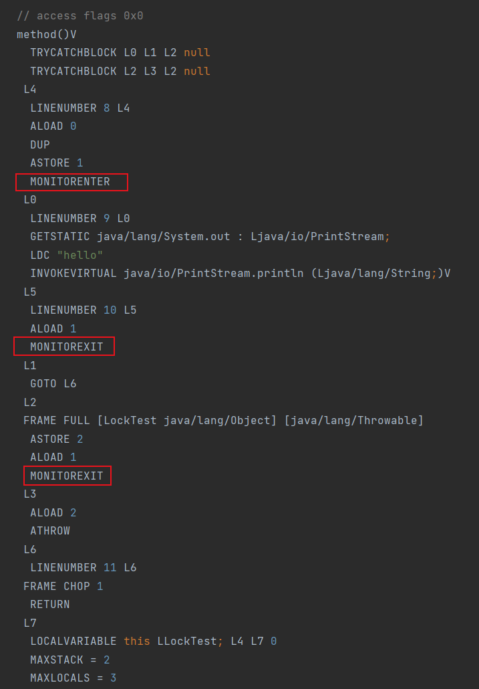
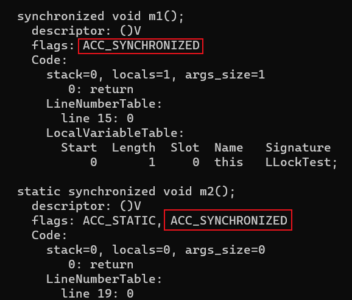

# 锁

锁是一种同步机制，保证同一时间只有一个线程访问访问共享资源，从而避免数据竞争的问题，保证线程安全

- 锁主要保证的是操作的原子性
- 这里说的访问主要是修改操作，锁技术发展到今天，已经发展出了共享锁（读锁），同一时间可以允许有多个线程读取共享资源

## CAS

Compare And Swap（比较与交换），是乐观锁的一种实现，用一个预期值和要更新的变量值进行比较，两值相等才会进行更新

- CAS 是一个原子操作，底层依赖于一条 CPU 的原子指令

在 CAS 中有 3 个值

- V（Var）：要更新的变量值（旧值）
- E（Expected）：预期值（旧值的副本）
- N（New）：准备写入的值（新值）

当 `V = E` 时，才会用 N 去替换 V，不过不相等，则说明有其他线程对 V 做了更新，可以放弃，也可以修改 E 后重试

- 乐观锁：总是假设对共享资源的访问没有冲突，对共享数据的操作时不会事先加锁，而是等到操作完成后再去验证是否有其他线程在这期间修改了该资源。所以乐观锁又称为 **无锁**
  - 乐观锁天生免疫死锁
  - 乐观锁虽然没有加锁解锁的操作，但发生冲突时，重试的成本会比较高
  - 多用于 **读多写少，或加锁成本非常高** 的环境，避免频繁加锁影响性能
- 悲观锁：总是假设对共享资源的访问会发生冲突，每次对共享数据的操作都会加锁
  - 多用于 **写多读少** 的环境，避免频繁失败和重试影响性能

### CAS 的缺点

#### ABA 问题

如果一个值原来是 A，之后变成了 B，最后又变回了 A，这时 CAS 是检查不出变化的

ABA 问题的解决思路是在变量前面追加上 **版本号或者时间戳**。JDK 1.5 以后的 AtomicStampedReference 类就是用来解决 ABA 问题的，他的 compareAndSet 方法首先检查当前引用是否等于预期引用，再检查当前标志是否等于预期标志，如果全部相等，才会去修改

```java
/**
 * @param expectedReference 预期引用
 * @param newReference 当前引用
 * @param expectedStamp 预期的标志
 * @param newStamp 当前的标志
 */
public boolean compareAndSet(V   expectedReference,
                             V   newReference,
                             int expectedStamp,
                             int newStamp) {
    Pair<V> current = pair;
    return
        expectedReference == current.reference &&
        expectedStamp == current.stamp &&
        ((newReference == current.reference &&
            newStamp == current.stamp) ||
            casPair(current, Pair.of(newReference, newStamp)));
}
```

#### 循环时间长开销大

CAS 多与自旋结合进行重试，如果自旋长时间不成功，会占用大量的 CPU 资源

如果 JVM 能支持处理器提供的 pause 指令那么效率会有一定的提升，pause 指令能让自旋失败时 CPU 睡眠一小段时间再继续自旋

#### 只能保证一个共享变量的原子操作

CAS 只对单个共享变量有效，当操作涉及跨多个共享变量时 CAS 无效

- 将多个变量放入到一个对象中，使用 AtomicStampedReference 类的方法对一个对象进行 CAS 操作
- 可以考虑改用锁

## synchronized

用来实现线程的同步，保证线程安全，不仅保证了原子性，还保障了可见性，有序性，可重入性

主要有三种使用方式

```java
// 修饰代码块，对给定的对象加锁
void method() {
    synchronized (this) {

    }
}

// 修饰实例方法，对当前实例加锁
synchronized void method() {

}

// 修饰静态方法，对当前类加锁
synchronized static void method() {

}
```

- 类锁其实也是对象锁，因为静态成员不属于任何⼀个实例对象，归整个类所有，所以类锁其实也就是该类的 Class 对象的锁

```java
public class LockTest extends Thread {

    @Override
    public void run() {
        try {
            method1();
            static1();
        } catch (InterruptedException e) {
            throw new RuntimeException(e);
        }
    }

    synchronized void method1() throws InterruptedException {
        System.out.println(Thread.currentThread().getName() + " - method1");
        Thread.sleep(1000);
    }

    synchronized static void static1() throws InterruptedException {
        System.out.println(Thread.currentThread().getName() + " - static1");
        Thread.sleep(1000);
    }

    public static void main(String[] args) {
        Thread t1 = new Thread(new LockTest(), "t1");
        Thread t2 = new Thread(new LockTest(), "t2");

        t1.start();
        t2.start();
    }
}
```

上述代码创建线程传入的是不同的对象，所以 method1 方法几乎是同时打印出来的，而 static1 是个静态同步方法，以类对象作为锁，所以 static1 差不多相隔 1 秒后才全部打印完成，所以以上代码的执行顺序如下

1. 几乎同时打印 `t1 - method1`，`t2 - method1`
2. 1 秒后，打印 `t1 - static1`
3. 1 秒后，打印 `t2 - static1`

### synchronized 原理

对于对象监视器 monitor 的获取

- monitor：也叫做内部锁或 monitor 锁，可以理解为一种同步工具，或者同步机制，通常被描述成一个对象，在 JVM 中由 ObjectMonitor 实现，每个对象中都内置了一个 ObjectMonitor 对象

#### 修饰代码块

被 synchronized 修饰过的代码块前后会生成两个字节码指令：monitorenter、monitorexit

- monitorenter：线程试图获取 monitor 的所有权
  - 每个对象中维护一个锁计数器，对象未被锁定时，计数器为 0
  - 线程成功获取到锁，计数器加 1
  - 同一线程如果再次获取到该锁，计数器再加 1
  - 如果计数器不为 0，其他线程尝试获取该对象的 monitor 权限时，会被阻塞
- monitorexit：线程放弃 monitor 的所有权，释放锁。所以执行 monitorexit 的线程必须是 Object 所对应的 monitor 所有者
  - 每执行一次，对象中锁计数器就减 1，直到减为 0，表明锁被释放，其他线程可以尝试获取锁

这也是为什么 wait、notify、notifyAll 方法必须在 synchronized 语句中使用

```java
void method() {
    synchronized (this) {
        System.out.println("hello");
    }
}
```



可以看出在同步代码块前后都加入了 monitorenter、monitorexit 指令，并且为了保障锁在同步代码块代码正常执行或出现异常都能被正确释放，多加了一个 monitorexit 指令

#### 修饰同步方法

被 synchronized 修饰过的方法不会加入 monitorenter、monitorexit 两个字节码指令，而是在类文件中被标识为 ACC_SYNCHRONIZED，表示该方法为一个同步方法，当方法调用时，会先检查是否设置了该标识，如果设置了，执行线程就会先获取 monitor，获取成功后再去执行方法体的内容

```java
synchronized void m1() {

}

synchronized static void m2() {

}
```



### 可见性

对于共享变量的修改其他线程能及时可见

> 详见 [7. Java 内存模型 - 内存间交互操作](../JVM/7.%20Java%20内存模型.md)

- lock（锁定）：把一个变量标识为一条线程独占的状态
- unlock（解锁）：把一个处于锁定状态的变量释放出来，释放后的变量才可以被其他线程锁定

lock 与 unlock 都是针对主内存的操作

- 如果对一个变量执行 lock 操作，那将会清空工作内存中此变量的值，在执行引擎使用这个变量前，需要重新执行 load 或 assign 操作以初始化变量的值
- 如果一个变量事先没有被 lock 操作锁定，那就不允许对它执行 unlock 操作，也不允许去 unlock 一个被其他线程锁定的变量
- 对一个变量执行 unlock 操作之前，必须先把此变量同步回主内存中（执行 store、write 操作）

### 有序性

如果在本线程内观察，所有的操作都是有序的

由于 synchronized 语句块限制同时只能有一个线程进行访问，可以保证当前的操作不受其他线程的干扰。当然保证的是执行结果的有序性，指令还是可能会重排序，即串行语义（as-if-serial）

- as-if-serial 语义：所有的动作都可以为了优化而被重排序，但是必须保证它们重排序后的结果和程序代码本身的应有结果是一致的

### 可重入

synchronized 是可重入锁，允许同一个线程多次请求自己持有的锁，当然释放的时候也需要释放相同次数的锁，直到上述原理部分提到的计数器为 0

- 可重入锁也叫递归锁，在外层使用锁之后，在内层仍然可以使用，并且不会产生死锁

> 详见 [7. Java 内存模型 - 内存间交互操作](../JVM/7.%20Java%20内存模型.md)

一个变量在同一个时刻只允许一条线程对其进行 lock 操作，但 lock 操作可以被同一条线程重复执行多次，多次执行 lock 后，只有执行相同次数的 unlock 操作，变量才会被解锁

### 锁优化

在 JDK1.6 为了减少获得锁和释放锁带来的性能消耗，对锁的实现引入了大量的优化

- 偏向锁
- 轻量级锁
- 自旋锁
  - 适应性自旋锁
- 锁粗化
- 锁消除

#### 锁粗化

JVM 在遇到一连串连续地对同一个锁不断进行请求和释放的操作时，便会把所有的锁操作整合成对锁的一次请求，从而减少对锁的请求同步的次数

为了保证多线程间的高效并发，每个线程持有的锁的时间应该尽可能短，即加锁的粒度要小，以便当前线程使用完后，其他线程能更快的获取到资源。但如果对一个锁不停的进行请求、同步和释放，不仅不能提高性能，反而还浪费资源

```java
public void method() {
    synchronized (this) {
        System.out.println("one");
    }
    synchronized (this) {
        System.out.println("two");
    }
    synchronized (this) {
        System.out.println("three");
    }
}
```

```java
public void method() {
    synchronized (this) {
        System.out.println("one");
        System.out.println("two");
        System.out.println("three");
    }
}
```

锁粗化在开发中也可以应用，合适的锁粗化反而可以提高效率

```java
public class LockTest extends Thread {

    @Override
    public void run() {
        long n1 = System.currentTimeMillis();
        // synchronized (this) {
        for (int i = 0; i < 1000000; i++) {
            synchronized (this) {
                this.m1();
                this.m2();
            }
        }
        System.out.println(System.currentTimeMillis() - n1);
    }

    void m1() {
    }

    void m2() {
    }

    public static void main(String[] args) {
        LockTest lockTest = new LockTest();
        new Thread(lockTest).start();
        new Thread(lockTest).start();
    }
}
```

以上代码每次执行的时间都在几十毫秒，而如果把 synchronized 语句移到循环外，几毫秒就可以执行完毕

#### 锁消除

JVM 在 JIT 编译时，通过对运行上下文的扫描，去除不可能存在共享资源竞争的锁。通过锁消除，可以节省毫无意义的请求锁时间

```java
public synchronized void method() {
    System.out.println("one");
}
```

```java
public void method() {
    System.out.println("one");
}
```

### 锁升级

在 JDK1.6 之前所有的锁都是重量级锁，在 JDK1.6 之后扩展到了 4 种状态，根据锁在多线程中竞争的程度和状态，逐步进行升级，尽量减少性能消耗

- 锁升级的过程基本是不可逆的，虽然 JVM 是支持锁降级的，但条件较为苛刻

每个 Java 对象都有一个对象头，对象头里有一个称为 Mark Word 的部分，用于存储对象自身的运行时数据，如哈希码、GC 分代年龄、锁状态标志、线程持有的锁、偏向线程 ID、偏向时间戳等。根据锁的状态的不同，Mark Word 的结构也会不同

- Mark Word 的长度是根据及其字长来的，在 32 位和 64 位的虚拟机中分别为 32 个比特和 64 个比特

<table>
    <tr>
        <th>锁状态</th>
        <th>29bit / 61bit</th>
        <th>可偏向</th>
        <th>锁标志位</th>
    </tr>
    <tr>
        <td>无锁</td>
        <td>其他内容</td>
        <td>0</td>
        <td>01</td>
    </tr>
    <tr>
        <td>偏向锁</td>
        <td>当前线程ID（23bit / 54bit）</td>
        <td>1</td>
        <td>01</td>
    </tr>
    <tr>
        <td>轻量级锁</td>
        <td colspan="2">指向栈中锁记录的指针（30bit / 62bit）</td>
        <td>00</td>
    </tr>
    <tr>
        <td>重量级锁</td>
        <td colspan="2">指向重量级锁的指针（30bit / 62bit）</td>
        <td>10</td>
    </tr>
</table>

#### 无锁

没有对资源进行锁定，任何线程都可以尝试去修改它

#### 偏向锁

偏向锁会偏向于第一个访问锁的线程，如果在接下来的运行过程中，该锁没有被其他的线程访问，则持有偏向锁的线程将永远不需要触发同步。也就是说，偏向锁在资源无竞争情况下消除了同步语句，连 CAS 操作都不做了，提高了程序的运行性能

##### 实现原理

一个线程在第一次进入同步块时，会在 Mark Word 中存储当前线程的 ID。当该线程再次进入这个同步块时，会去检查 Mark Word 里面是不是放的自己的线程 ID

如果是，则说明当前的线程已经获取到了锁，以后该线程在进入和退出同步块时都不需要花费 CAS 操作来加锁和解锁

如果不是，则表明有其他线程在竞争这个锁，这时就会使用 CAS 操作将存储的线程 ID 替换为当前线程的 ID

- 如果替换成功，表示之前的线程已经不存在了，锁不会升级
- 如果替换失败，表示之前的线程仍然存在，则升级为轻量级锁，再去竞争

当然对于锁竞争比较激烈的场合效果不佳，可能每次都是不同的线程来请求同一把锁，还不如不用

```shell
# 关闭偏向锁
-XX:UseBiasedLocking=false
```

偏向锁使用了一种等到竞争出现才释放锁的机制，所以 **当其他线程尝试竞争偏向锁时，持有偏向锁的线程才会释放锁**

偏向锁升级轻量级锁，会在一个安全点（Safepoint）上暂停拥有偏向锁的线程，重置偏向锁标识，开销比较大

#### 轻量级锁

多个线程在不同时段获取同一把锁，即不存在锁竞争的情况，也就没有线程阻塞。针对这种情况，JVM 采用轻量级锁来避免线程的阻塞与唤醒

##### 实现原理

一个线程在第一次进入同步块时，会先判断当前的锁是否已经是重量级锁，如果不是，则会在当前线程的栈帧中创建用于存储该锁的锁记录的空间（Displaced Mark Word），将锁对象的 Mark Word 复制到里面

复制成功后，线程尝试用 CAS 将锁的 Mark Word 替换为指向锁记录的指针

- 如果替换成功，则当前线程获得锁
- 如果替换失败，说明在与其它线程竞争锁，当前线程就尝试使用自旋来获取锁

自旋：不断尝试去获取锁，一般用循环来实现

- 减少线程上下文切换：线程是不知道什么时候能获取到锁，如果能够很快的获取到锁，那么将线程粗暴挂起反而得不偿失，为此通过自旋保持当前线程的运行，减少不必要的上下文切换
- 需要消耗 CPU，如果一直获取不到锁的话，那该线程就一直处在自旋状态，白白浪费 CPU 资源

Java 采用了 **适应性自旋**，线程如果刚刚通过自旋成功获取到了锁，则其下次自旋的允许等待的时间会更长，如果某个线程很少能通过自旋获取到锁，则自旋的次数会相应减少，甚至直接被忽略掉

如果一个线程自旋超过 10 次（默认）仍未获取到锁，称为自旋失败，那么这个线程会阻塞，同时这个锁就会升级成重量级锁

#### 重量级锁

重量级锁依赖于操作系统的互斥量（mutex） 实现的，而操作系统中线程间状态的转换需要相对比较长的时间，挂起线程和恢复线程都需要转入内核态来完成，所以重量级锁效率很低，但被阻塞的线程不会消耗 CPU

### 与 volatile 的区别

synchronized 关键字和 volatile 关键字不是对立的而是互补的

- volatile 是线程同步的轻量级实现，所以 volatile 的性能要更好，但是 volatile 只能用于修饰变量，而 synchronized 可以修饰方法和代码块
- volatile 只能保证数据的可见性，不能保证原子性，而 synchronized 两者都能保证
- volatile 主要用于解决变量在多个线程之间的可见性，而 synchronized 主要解决的是多线程之间访问资源的同步性

## 参考

- 《实战Java高并发程序设计（第3版）》
- [深入浅出Java多线程](http://concurrent.redspider.group/)
- [synchronized总结](https://blog.csdn.net/weixin_39559282/article/details/114273936)
- [Mark Word结构详解及分析对象在内存占用大小](https://blog.csdn.net/sbl19940819/article/details/126707169)
- [Java锁优化--JVM锁降级](https://www.jianshu.com/p/9932047a89be)
