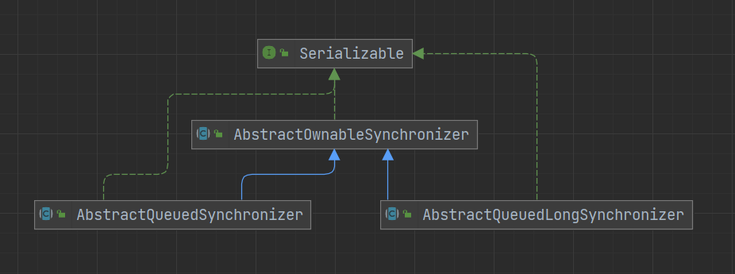
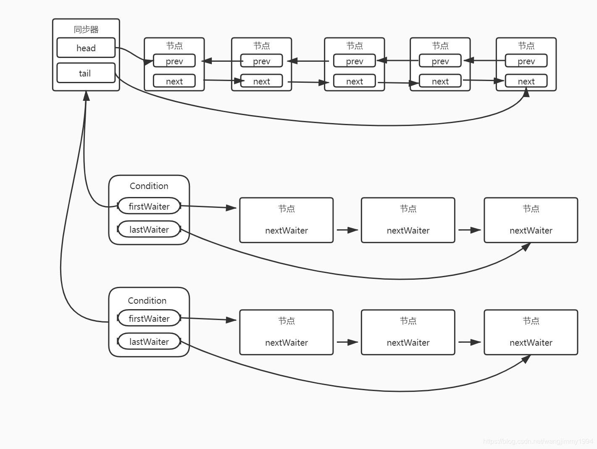
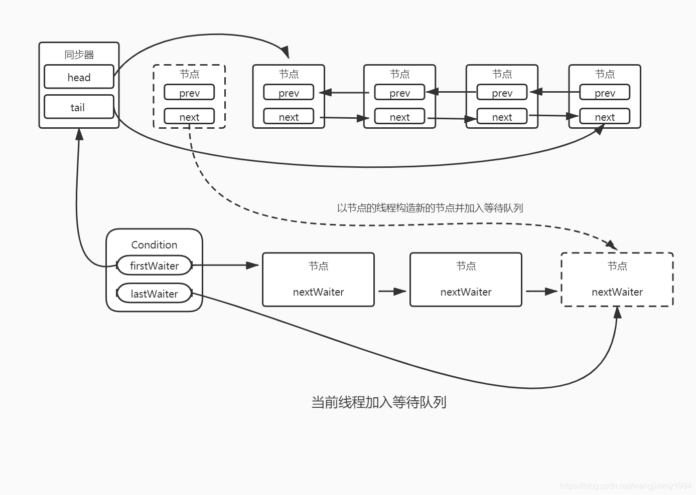
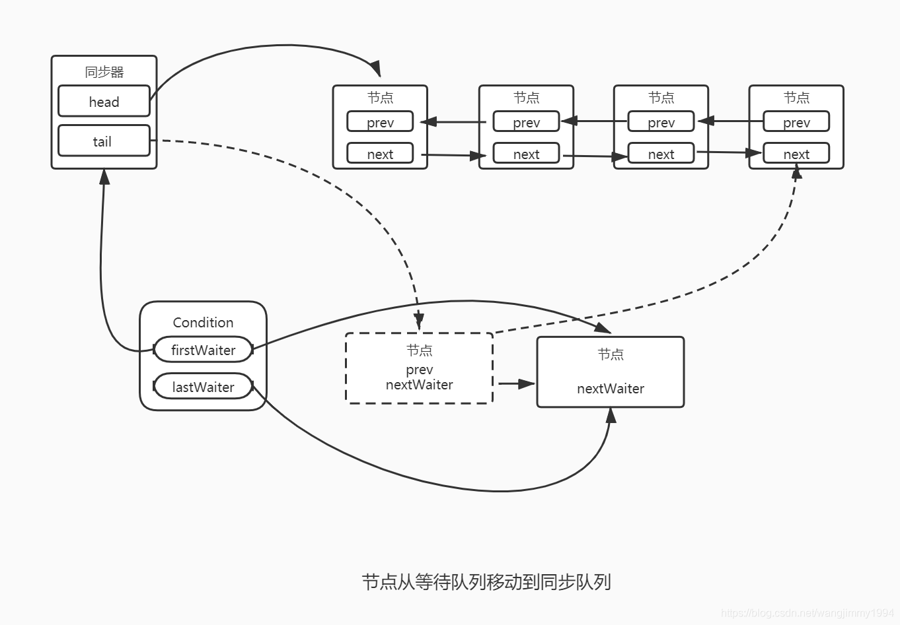

# AQS

AQS 是 AbstractQueuedSynchronizer 的简称，即抽象队列同步器，是一个用来构建锁和同步器的框架，Java 中很多自带的并发工具都是基于 AQS 构建的



AQS 继承自 AOS（AbstractOwnableSynchronizer），该类主要用于表示锁与持有者的关系（独占模式）

- AQS 定义了两种资源共享方式：Exclusive（独占，只有一个线程能执行）和 Share（共享，多个线程可同时执行）

```java
public abstract class AbstractOwnableSynchronizer
    implements java.io.Serializable {

    private static final long serialVersionUID = 3737899427754241961L;

    protected AbstractOwnableSynchronizer() { }

    // 锁的持有者
    private transient Thread exclusiveOwnerThread;

    // 设置锁持有者
    protected final void setExclusiveOwnerThread(Thread thread) {
        exclusiveOwnerThread = thread;
    }

    // 获得锁持有者
    protected final Thread getExclusiveOwnerThread() {
        return exclusiveOwnerThread;
    }
}
```

AOS 有两个子类 AQS 与 AQLS（AbstractQueuedLongSynchronizer），在 AQS 中资源是用一个 int 类型的数据表示的，当业务需要更大范围的资源时，可以使用 AQLS，他们俩的代码几乎一致，只是 AQLS 将资源的表示类型改为了 long 类型

```java
// AQS
private volatile int state;

// AQLS
private volatile long state;
```

## AQS 的结构

AQS 是基于模版方法模式的抽象类，需要子类去实现一些方法，多以内部类的形式实现

```java
// 以ReentrantLock为例，内部类Sync就是继承自AQS
public class ReentrantLock implements Lock, java.io.Serializable {

    abstract static class Sync extends AbstractQueuedSynchronizer {
        ...
    }
    ...
}
```

AQS 虽然是抽象类，但内部并没有抽象方法，而是定义了一些只抛出异常没有具体实现的 protected 方法，提供给子类去实现。这样做的好处是避免子类将所有的抽象方法都实现一遍，只需要实现自己需要的方法即可

```java
// 独占模式，尝试获取资源
protected boolean tryAcquire(int arg) {
    throw new UnsupportedOperationException();
}

// 独占模式，尝试是否资源
protected boolean tryRelease(int arg) {
    throw new UnsupportedOperationException();
}

// 共享模式，尝试获取资源
protected int tryAcquireShared(int arg) {
    throw new UnsupportedOperationException();
}

// 共享模式，尝试释放资源
protected boolean tryReleaseShared(int arg) {
    throw new UnsupportedOperationException();
}

// 当前线程是否正在独占资源
protected boolean isHeldExclusively() {
    throw new UnsupportedOperationException();
}
```

## 原理

AQS 核心思想是，如果被请求的共享资源空闲，则将当前请求资源的线程设置为有效的工作线程，并且将共享资源设置为锁定状态。如果被请求的共享资源被占用，那么就需要一套线程阻塞等待以及被唤醒时锁分配的机制，这个机制 AQS 是基于 CLH 锁 （Craig, Landin and Hagersten locks） 实现的

### CLH 锁


<small>[AQS 详解 - CLH 队列](https://javaguide.cn/java/concurrent/aqs.html#aqs-%E6%A0%B8%E5%BF%83%E6%80%9D%E6%83%B3)</small>

CLH 锁是对自旋锁的一种改进，是一个虚拟的双向队列（不存在队列实例，仅存在结点之间的关联关系），暂时获取不到锁的线程将被加入到该队列中。AQS 将每条请求共享资源的线程封装成一个 CLH 队列锁的一个结点（Node）来实现锁的分配

- 每个节点会不断轮询前驱节点的状态，如果发现前驱节点释放了锁就结束自旋，自旋超过一定次数仍未获取到锁，会将该线程阻塞
- head 指向已获得锁的节点，且自身不持有具体线程

```java
// 设置头节点
private void setHead(Node node) {
    head = node;
    // 持有的线程被置为空
    node.thread = null;
    node.prev = null;
}
```

#### 节点信息

```java
static final class Node {
    // 标记一个节点在共享模式下进行等待，用作nextWaiter的取值之一
    static final Node SHARED = new Node();
    // 标记一个节点在独占模式下进行等待，用作nextWaiter的取值之一
    static final Node EXCLUSIVE = null;
    // 取消状态
    static final int CANCELLED =  1;
    // 唤醒状态
    static final int SIGNAL    = -1;
    // 条件等待状态
    static final int CONDITION = -2;
    // 传播状态
    static final int PROPAGATE = -3;

    // 当前节点的等待状态，初始值为0
    volatile int waitStatus;
    // 前驱节点
    volatile Node prev;
    // 后继节点
    volatile Node next;
    // 当前节点持有的线程
    volatile Thread thread;
    // 下一个等待节点，指的其实也就是自己的等待模式
    Node nextWaiter;

    // 当前节点是否处于共享模式
    final boolean isShared() {
        return nextWaiter == SHARED;
    }

    // 获取前驱节点
    final Node predecessor() throws NullPointerException {
        Node p = prev;
        if (p == null)
            throw new NullPointerException();
        else
            return p;
    }

    Node() {
    }

    Node(Thread thread, Node mode) {
        this.nextWaiter = mode;
        this.thread = thread;
    }

    Node(Thread thread, int waitStatus) {
        this.waitStatus = waitStatus;
        this.thread = thread;
    }
}

// 同步队列的头节点
private transient volatile Node head;

// 同步队列的尾节点
private transient volatile Node tail;
```

```java
// 根据传入的模式创建节点并加入到同步队列中
// 接受两种模式，Node.EXCLUSIVE代表独占模式, Node.SHARED代表共享模式
private Node addWaiter(Node mode) {
    // 从调用的构造方法能看出，Node内部类中nextWaiter指的就是该节点的等待模式
    Node node = new Node(Thread.currentThread(), mode);
    Node pred = tail;
    if (pred != null) {
        node.prev = pred;
        if (compareAndSetTail(pred, node)) {
            pred.next = node;
            return node;
        }
    }
    enq(node);
    return node;
}
```

##### waitStatus

waitStatus 是当前节点的等待状态，有 5 种状态，并且 CAS 操作进行转换

- 默认值（0）：该节点处于等待状态
- Node.CANCELLED（1）：取消状态，该节点因为超时或中断被取消，停止去获取锁
- Node.SIGNAL（-1）：唤醒状态，该节点的后继节点被（或即将）阻塞，该节点释放锁后，必然会唤醒他的后继节点
- Node.CONDITION（-2）：条件等待状态，该节点是条件队列中的一个节点，当他转换为同步队列中的节点时，状态会置为 0
- Node.PROPAGATE（-3）：传播状态，只有头节点会有这个状态，只会在 doReleaseShared（共享模式释放资源）方法中设置，连续唤醒队列中处于共享模式的节点

### 资源

AQS 使用 state 表示同步状态，并且设置和获取 state 都是 final 修饰的

```java
// 同步状态
private volatile int state;

// 获取同步状态
protected final int getState() {
    return state;
}

// 设置同步状态
protected final void setState(int newState) {
    state = newState;
}

// 通过CAS操作设置同步状态
protected final boolean compareAndSetState(int expect, int update) {
    return unsafe.compareAndSwapInt(this, stateOffset, expect, update);
}
```

state 的初始值为 0，表示锁处于未锁定状态，所有线程每次能成功获取到锁就加 1

- 独占模式下同一线程多次获得同一个锁也是会累加的，通过在方法中对当前请求的线程与锁持有者做对比，相同才会累加，不同则抛出异常

### 获取资源

- 共享模式获取资源

```java
public final void acquireShared(int arg) {
    // 判断条件由子类进行具体实现
    if (tryAcquireShared(arg) < 0)
        doAcquireShared(arg);
}

private void doAcquireShared(int arg) {
    final Node node = addWaiter(Node.SHARED);
    boolean failed = true;
    try {
        boolean interrupted = false;
        // 自旋
        for (;;) {
            final Node p = node.predecessor();
            // 如果当前节点的前驱节点是头结点，表示当前节点可以尝试获取资源了
            if (p == head) {
                int r = tryAcquireShared(arg);
                if (r >= 0) {
                    // 设置头结点，并且传播获取资源成功的状态，这个方法的作用是确保唤醒状态传播到所有的后继节点
                    setHeadAndPropagate(node, r);
                    p.next = null; // help GC
                    if (interrupted)
                        selfInterrupt();
                    failed = false;
                    return;
                }
            }
            // 判断获取资源失败是否需要阻塞
            if (shouldParkAfterFailedAcquire(p, node) &&
                parkAndCheckInterrupt())
                interrupted = true;
        }
    } finally {
        if (failed)
            cancelAcquire(node);
    }
}
```

- 独占模式获取资源

```java
public final void acquire(int arg) {
    if (!tryAcquire(arg) &&
        acquireQueued(addWaiter(Node.EXCLUSIVE), arg))
        selfInterrupt();
}

final boolean acquireQueued(final Node node, int arg) {
    boolean failed = true;
    try {
        boolean interrupted = false;
        // 自旋
        for (;;) {
            final Node p = node.predecessor();
            // 如果当前节点的前驱节点是头结点，表示当前节点可以尝试获取资源了
            if (p == head && tryAcquire(arg)) {
                // 设置头结点
                setHead(node);
                p.next = null; // help GC
                failed = false;
                return interrupted;
            }
            // 判断获取资源失败是否需要阻塞
            if (shouldParkAfterFailedAcquire(p, node) &&
                parkAndCheckInterrupt())
                interrupted = true;
        }
    } finally {
        if (failed)
            cancelAcquire(node);
    }
}
```

共享模式与独占模式获取资源的代码很类似，区别在于共享模式在当前节点获取资源成功晋升为头节点之后，它会把自身的等待状态通过 CAS 从 0 更新为 Node.PROPAGATE，并将之后处于 Node.SIGNAL 的节点逐一更新为 0

简单来说共享模式获取资源成功后，就会通知之后的节点顶上，而独占模式获取资源成功后，因为是独占的，所以后面的还需要再等等

### 释放资源

- 共享模式释放资源

```java
public final boolean releaseShared(int arg) {
    // 判断条件由子类进行具体实现
    if (tryReleaseShared(arg)) {
        doReleaseShared();
        return true;
    }
    return false;
}

private void doReleaseShared() {
    for (;;) {
        Node h = head;
        if (h != null && h != tail) {
            int ws = h.waitStatus;
            // 如果头节点处于唤醒状态，则将他置为0
            if (ws == Node.SIGNAL) {
                if (!compareAndSetWaitStatus(h, Node.SIGNAL, 0))
                    continue;
                // 唤醒头节点的后继节点
                unparkSuccessor(h);
            }
            // 如果头节点处于等待状态，则将他置为传播状态
            else if (ws == 0 &&
                        !compareAndSetWaitStatus(h, 0, Node.PROPAGATE))
                continue;                // loop on failed CAS
        }
        if (h == head)                   // loop if head changed
            break;
    }
}
```

- 独占模式释放资源

```java
public final boolean release(int arg) {
    // 判断条件由子类进行具体实现
    if (tryRelease(arg)) {
        Node h = head;
        // 如果头节点不是等待状态，则唤醒头节点的后继节点
        if (h != null && h.waitStatus != 0)
            unparkSuccessor(h);
        return true;
    }
    return false;
}
```

- unparkSuccessor：如果有后继节点，则将其唤醒

```java
private void unparkSuccessor(Node node) {
    // 如果当前节点不处于等待或者取消状态，则被置为等待状态
    int ws = node.waitStatus;
    if (ws < 0)
        compareAndSetWaitStatus(node, ws, 0);

    Node s = node.next;
    // 判断后继节点是否为空，或已被取消
    if (s == null || s.waitStatus > 0) {
        s = null;
        for (Node t = tail; t != null && t != node; t = t.prev)
            if (t.waitStatus <= 0)
                s = t;
    }
    // 如果有后继节点，则将其唤醒
    if (s != null)
        LockSupport.unpark(s.thread);
}
```

## Condition 接口

Condition 与 Object 中的 wait、notify 方法作用大致相同

```java
public interface Condition {

    // 当前线程进入等待状态，可响应中断
    void await() throws InterruptedException;

    // 当前线程进入等待状态，不支持中断
    void awaitUninterruptibly();

    // 当前线程进入等待状态，直到超时、被唤醒或中断
    long awaitNanos(long nanosTimeout) throws InterruptedException;

    // 当前线程进入等待状态，直到超时、被唤醒或中断
    boolean await(long time, TimeUnit unit) throws InterruptedException;

    // 当前线程进入等待状态，直到某个时间点、被唤醒或中断
    boolean awaitUntil(Date deadline) throws InterruptedException;

    // 唤醒一个等待的线程
    void signal();

    // 唤醒所有等待的线程
    void signalAll();
}
```

那么已经有了 Object 类的 wait、notify 方法，为何还需要 Condition 接口呢。首先他们二者都需要先获取到对象锁，并且进入等待状态都会释放持有的锁，都可以设置超时时间，当然 Condition 还可以设置一个时间点，都可响应中断，但 Condition 中有可以不响应中断的方法

二者最大的区别就是，在 Object 监视模型中，一个对象有一个同步队列和一个等待队列，而 Condition 有一个同步队列和 **多个等待队列**

AQS 就在内部实现了 Condition 接口，一个 Condition 包含一个等待队列，Condition 拥有首节点和尾节点

```java
public abstract class AbstractQueuedSynchronizer
    extends AbstractOwnableSynchronizer
    implements java.io.Serializable {

    public class ConditionObject implements Condition, java.io.Serializable {
        // condition队列的头节点
        private transient Node firstWaiter;
        // condition队列的尾节点
        private transient Node lastWaiter;
        ...
    }
    ...
}
```







<small>[并发编程的艺术之读书笔记（九）](https://blog.csdn.net/wangjimmy1994/article/details/105245987)</small>

## LockSupport

LockSupport 是一个线程阻塞工具类，里面的所有方法都是静态方法，可以在线程内任意位置让线程阻塞。与 wait 方法相比，它不需要先获得某个对象的锁，也不会抛出 InterruptedException 异常

- 与 wait、notify 方法相比，LockSupport 不需要事先获取锁，并且可以指定要唤醒的线程，而 notify 只能随机唤醒一个线程

LockSupport 使用了类似信号量的机制。它为每一个线程准备了一个许可，如果许可可用，那么 park 方法会立即返回，并且消费这个许可（即将许可变为不可用），如果许可不可用，就会阻塞。而 unpark 方法则会使一个许可变为可用（和信号量不同的是，许可不能累加，它永远只有一个）。这个特点使得即使 unpark 方法发生在 park 方法之前，它也可以使下一次的 park 方法立即返回

- 伪代码

```java
boolean permit = false;

void park() {
    if (permit) {
        permit = !permit;
    }
}

void unPark() {
    permit = true;
}
```

LockSupport 的阻塞与唤醒都是基于 Unsafe 类中的 native 方法。AQS 就是用其来进行线程的阻塞与唤醒

```java
public class LockSupport {
    private LockSupport() {}

    private static void setBlocker(Thread t, Object arg) {
        UNSAFE.putObject(t, parkBlockerOffset, arg);
    }

    // 唤醒该线程
    public static void unpark(Thread thread) {
        if (thread != null)
            UNSAFE.unpark(thread);
    }

    // 阻塞当前线程
    public static void park(Object blocker) {
        Thread t = Thread.currentThread();
        setBlocker(t, blocker);
        UNSAFE.park(false, 0L);
        setBlocker(t, null);
    }

    // 阻塞当前线程，并设置超时时间
    public static void parkNanos(Object blocker, long nanos) {
        if (nanos > 0) {
            Thread t = Thread.currentThread();
            setBlocker(t, blocker);
            UNSAFE.park(false, nanos);
            setBlocker(t, null);
        }
    }

    // 阻塞当前线程，直到某个时间点
    public static void parkUntil(Object blocker, long deadline) {
        Thread t = Thread.currentThread();
        setBlocker(t, blocker);
        UNSAFE.park(true, deadline);
        setBlocker(t, null);
    }

    public static Object getBlocker(Thread t) {
        if (t == null)
            throw new NullPointerException();
        return UNSAFE.getObjectVolatile(t, parkBlockerOffset);
    }

    // 阻塞当前线程
    public static void park() {
        UNSAFE.park(false, 0L);
    }

    // 阻塞当前线程，并设置超时时间
    public static void parkNanos(long nanos) {
        if (nanos > 0)
            UNSAFE.park(false, nanos);
    }

    // 阻塞当前线程，直到某个时间点
    public static void parkUntil(long deadline) {
        UNSAFE.park(true, deadline);
    }

    static final int nextSecondarySeed() {
        int r;
        Thread t = Thread.currentThread();
        if ((r = UNSAFE.getInt(t, SECONDARY)) != 0) {
            r ^= r << 13;   // xorshift
            r ^= r >>> 17;
            r ^= r << 5;
        }
        else if ((r = java.util.concurrent.ThreadLocalRandom.current().nextInt()) == 0)
            r = 1; // avoid zero
        UNSAFE.putInt(t, SECONDARY, r);
        return r;
    }

    private static final sun.misc.Unsafe UNSAFE;
    private static final long parkBlockerOffset;
    private static final long SEED;
    private static final long PROBE;
    private static final long SECONDARY;
    static {
        try {
            UNSAFE = sun.misc.Unsafe.getUnsafe();
            Class<?> tk = Thread.class;
            parkBlockerOffset = UNSAFE.objectFieldOffset
                (tk.getDeclaredField("parkBlocker"));
            SEED = UNSAFE.objectFieldOffset
                (tk.getDeclaredField("threadLocalRandomSeed"));
            PROBE = UNSAFE.objectFieldOffset
                (tk.getDeclaredField("threadLocalRandomProbe"));
            SECONDARY = UNSAFE.objectFieldOffset
                (tk.getDeclaredField("threadLocalRandomSecondarySeed"));
        } catch (Exception ex) { throw new Error(ex); }
    }
}
```

## 参考

- [AQS 详解](https://javaguide.cn/java/concurrent/aqs.html)
- [源码分析:AQS源码](https://blog.csdn.net/maoyeqiu/article/details/95866862)
- [Java并发：Condition接口](https://www.cnblogs.com/magic-sea/p/11594861.html)
- [并发编程的艺术之读书笔记（九）](https://blog.csdn.net/wangjimmy1994/article/details/105245987)
- [LockSupport详解](https://www.cnblogs.com/liang1101/p/12785496.html)
- [全网最详细的AbstractQueuedSynchronizer(AQS)源码剖析（一）AQS基础](https://www.cnblogs.com/frankiedyz/p/15673957.html)
