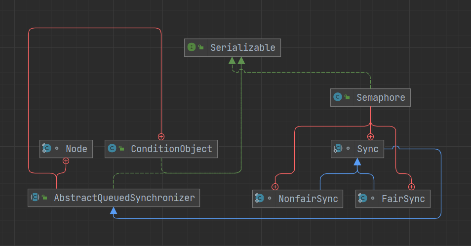

# Semaphore

Semaphore（信号量）常用来控制同时访问特定资源的线程数量，能起到限流的作用

Semaphore 中的资源被称作许可，需在初始化时指定许可数量，线程必须持有许可才能执行后续操作，一个线程可以持有多个许可

## 使用

```java
public class Test {
    public static void main(String[] args) throws InterruptedException {
        Th th = new Th();

        for (int i = 0; i < 10; i++) {
            new Thread(th, "线程" + (i + 1)).start();
        }
    }
}

class Th extends Thread {

    // 初始化2个许可
    static Semaphore semaphore = new Semaphore(2);

    @Override
    public void run() {
        try {
            semaphore.acquire();
            Thread.sleep(1000);
            System.out.println(Thread.currentThread().getName());
        } catch (InterruptedException e) {
            throw new RuntimeException(e);
        } finally {
            semaphore.release();
        }
    }
}
```

每隔一秒会打印出获得许可的两个线程名

## 结构



Semaphore 与 ReentrantLock 类似，都是在内部定义了 Sync 类继承自 AQS 类

与 ReentrantLock 不同的是，Semaphore 使用的多是 AQS 中的共享模式。在 AQS 中有两种模式独占模式与共享模式，根据不同模式实现的锁也被叫做独占锁与共享锁

- 独占锁：也叫做写锁、排它锁，只允许一个线程获取该锁
- 共享锁：也叫做写锁，允许多个线程获取同一个锁

ReentrantLock 等锁的使用的多是 AQS 中的独占模式的方法，而 Semaphore 使用的多是共享模式的方法。两种模式的方法实现类似，独占模式会判断当前线程是否是持有锁的线程，否则无法执行后续操作

### 许可

```java
private volatile int state;

protected final int getState() {
    return state;
}

protected final void setState(int newState) {
    state = newState;
}
```

Semaphore 使用 state 来存储许可，与 ReentrantLock 等独占锁不同的是，Semaphore 需要事先传入一个 state 的值，而独占锁的 state 初始值是 0，每获取一次锁就加 1，每释放一次就减 1。Semaphore 则是每获取一个许可就减 1，每释放一个许可就加 1

例如现在有 5 个线程，有 2 个许可，第一个线程来了，获得许可，state 减 1，然后该线程执行后续操作；第二个线程类似；到了第三个线程，许可没了，这时第三个线程及之后的线程都会自旋阻塞，并且一直尝试去获取许可（具体可见 doAcquireShared 方法）。第一个或第二个线程这时操作完了，不需要许可了，就会释放许可，state 加 1。后续的线程就可以通过公平或非公平的方式去获得这个许可了

### 构造函数

需指定许可数量

```java
// 当前使用的锁
private final Sync sync;

// 默认使用非公平锁
public Semaphore(int permits) {
    sync = new NonfairSync(permits);
}

// 是否使用公平锁
public Semaphore(int permits, boolean fair) {
    sync = fair ? new FairSync(permits) : new NonfairSync(permits);
    }

```

### 除了 Sync 内部类的其余部分

```java
public class Semaphore implements java.io.Serializable {
    private static final long serialVersionUID = -3222578661600680210L;

    private final Sync sync;

    public Semaphore(int permits) {
        sync = new NonfairSync(permits);
    }

    public Semaphore(int permits, boolean fair) {
        sync = fair ? new FairSync(permits) : new NonfairSync(permits);
    }

    // 获取一个许可，获取不到则阻塞，可响应中断
    public void acquire() throws InterruptedException {
        sync.acquireSharedInterruptibly(1);
    }

    // 获取一个许可，获取不到则阻塞，不可响应中断
    public void acquireUninterruptibly() {
        sync.acquireShared(1);
    }

    // 尝试获取一个许可，成功返回true，失败返回false，直接返回结果，不会等待
    public boolean tryAcquire() {
        return sync.nonfairTryAcquireShared(1) >= 0;
    }

    // 尝试获取一个许可，有时间限制
    public boolean tryAcquire(long timeout, TimeUnit unit)
        throws InterruptedException {
        return sync.tryAcquireSharedNanos(1, unit.toNanos(timeout));
    }

    // 释放一个许可
    public void release() {
        sync.releaseShared(1);
    }

    // 获取指定数量的许可，获取不到则阻塞，可响应中断
    public void acquire(int permits) throws InterruptedException {
        if (permits < 0) throw new IllegalArgumentException();
        sync.acquireSharedInterruptibly(permits);
    }

    // 获取指定数量的许可，获取不到则阻塞，不可响应中断
    public void acquireUninterruptibly(int permits) {
        if (permits < 0) throw new IllegalArgumentException();
        sync.acquireShared(permits);
    }

    // 尝试获取指定数量的许可，成功返回true，失败返回false，直接返回结果，不会等待
    public boolean tryAcquire(int permits) {
        if (permits < 0) throw new IllegalArgumentException();
        return sync.nonfairTryAcquireShared(permits) >= 0;
    }

    // 尝试获取指定数量的许可，有时间限制
    public boolean tryAcquire(int permits, long timeout, TimeUnit unit)
        throws InterruptedException {
        if (permits < 0) throw new IllegalArgumentException();
        return sync.tryAcquireSharedNanos(permits, unit.toNanos(timeout));
    }

    // 释放指定数量的许可
    public void release(int permits) {
        if (permits < 0) throw new IllegalArgumentException();
        sync.releaseShared(permits);
    }

    // 获取当前可用的许可的数量
    public int availablePermits() {
        return sync.getPermits();
    }

    // 获取当前所有的许可的数量
    public int drainPermits() {
        return sync.drainPermits();
    }

    // 减少许可数量
    protected void reducePermits(int reduction) {
        if (reduction < 0) throw new IllegalArgumentException();
        sync.reducePermits(reduction);
    }

    // 是否使用公平模式
    public boolean isFair() {
        return sync instanceof FairSync;
    }

    // 是否有线程在等待获取许可
    public final boolean hasQueuedThreads() {
        return sync.hasQueuedThreads();
    }

    // 获取正在等待获取许可的线程数，是个估计值
    public final int getQueueLength() {
        return sync.getQueueLength();
    }

    // 获取正在等待获取许可的线程的列表
    protected Collection<Thread> getQueuedThreads() {
        return sync.getQueuedThreads();
    }

    // 打印方法
    public String toString() {
        return super.toString() + "[Permits = " + sync.getPermits() + "]";
    }
}
```

### Sync 内部类

```java
abstract static class Sync extends AbstractQueuedSynchronizer {
    private static final long serialVersionUID = 1192457210091910933L;

    // 指定许可数量，也就是state的值
    Sync(int permits) {
        setState(permits);
    }

    // 获取许可数量
    final int getPermits() {
        return getState();
    }

    // 以非公平的方式获取许可
    final int nonfairTryAcquireShared(int acquires) {
        for (;;) {
            int available = getState();
            int remaining = available - acquires;
            if (remaining < 0 ||
                compareAndSetState(available, remaining))
                return remaining;
        }
    }

    // 尝试释放许可
    protected final boolean tryReleaseShared(int releases) {
        for (;;) {
            int current = getState();
            int next = current + releases;
            if (next < current) // overflow
                throw new Error("Maximum permit count exceeded");
            if (compareAndSetState(current, next))
                return true;
        }
    }

    // 减少许可数量
    final void reducePermits(int reductions) {
        for (;;) {
            int current = getState();
            int next = current - reductions;
            if (next > current) // underflow
                throw new Error("Permit count underflow");
            if (compareAndSetState(current, next))
                return;
        }
    }

    // 获取当前所有的许可的数量
    final int drainPermits() {
        for (;;) {
            int current = getState();
            if (current == 0 || compareAndSetState(current, 0))
                return current;
        }
    }
}

static final class NonfairSync extends Sync {
    private static final long serialVersionUID = -2694183684443567898L;

    NonfairSync(int permits) {
        super(permits);
    }

    protected int tryAcquireShared(int acquires) {
        return nonfairTryAcquireShared(acquires);
    }
}

static final class FairSync extends Sync {
    private static final long serialVersionUID = 2014338818796000944L;

    FairSync(int permits) {
        super(permits);
    }

    protected int tryAcquireShared(int acquires) {
        for (;;) {
            if (hasQueuedPredecessors())
                return -1;
            int available = getState();
            int remaining = available - acquires;
            if (remaining < 0 ||
                compareAndSetState(available, remaining))
                return remaining;
        }
    }
}
```

### 获得许可的流程

调用 Semaphore 类的 acquire 方法获取一个许可

```java
public void acquire() throws InterruptedException {
    sync.acquireSharedInterruptibly(1);
}
```

acquire 方法里调用的是 AQS 中的 acquireSharedInterruptibly 方法，里面的关键方法 tryAcquireShared 在 Sync 中有公平（FairSync）和非公平（NonfairSync）两种实现

```java
public final void acquireSharedInterruptibly(int arg)
        throws InterruptedException {
    if (Thread.interrupted())
        throw new InterruptedException();
    if (tryAcquireShared(arg) < 0)
        doAcquireSharedInterruptibly(arg);
}
```

```java
// 公平模式
protected int tryAcquireShared(int acquires) {
    // 使用for循环，执行CAS失败后进行重试
    for (;;) {
        if (hasQueuedPredecessors())
            return -1;
        int available = getState();
        int remaining = available - acquires;
        if (remaining < 0 ||
            compareAndSetState(available, remaining))
            return remaining;
    }
}

public final boolean hasQueuedPredecessors() {
    Node t = tail;
    Node h = head;
    Node s;
    // 如果h != t则说明队列不为空
    // 如果(s = h.next) == null则说明队列中只有一个头结点
    // 如果s.thread != Thread.currentThread()则说明节点的后继节点持有的线程不是当前线程，因为头结点是不持有线程的
    return h != t &&
        ((s = h.next) == null || s.thread != Thread.currentThread());
}

// 非公平模式
protected int tryAcquireShared(int acquires) {
    return nonfairTryAcquireShared(acquires);
}

final int nonfairTryAcquireShared(int acquires) {
    for (;;) {
        int available = getState();
        int remaining = available - acquires;
        if (remaining < 0 ||
            compareAndSetState(available, remaining))
            return remaining;
    }
}
```

首先获取可用的许可数量，即 state 的值，再计算如果该次获取许可后，剩余可用的许可数量

- 返回负数：代表获取失败，没有足够的许可可供本次获取
- 返回 0：代表获取成功，但许可已被消耗完了，后续的就拿不到许可了
- 返回正数：代表获取成功，后续的也能获取到许可

与 ReentrantLock 类似，公平模式与非公平模式的 tryAcquireShared 的作用都一样，代码也差不多，但公平锁还多了一个 hasQueuedPredecessors 方法

- 如果当前线程之前已经有一个在排队的线程，则返回 true
- 如果队列为空，或者当前线程位于队列的头部（非头节点），则返回 false

调用完 tryAcquireShared 方法后，如果没有成功获取所需的许可，就执行 acquireSharedInterruptibly 方法后续的操作

```java
private void doAcquireSharedInterruptibly(int arg)
    throws InterruptedException {
    // 新建节点，并以共享模式将该节点加入到同步队列中
    final Node node = addWaiter(Node.SHARED);
    boolean failed = true;
    try {
        for (;;) {
            final Node p = node.predecessor();
            // 判断当前节点的前驱节点是否是头结点，如果是则尝试获取许可
            if (p == head) {
                int r = tryAcquireShared(arg);
                if (r >= 0) {
                    // 如果成功获取到了许可，就将该节点设置为头节点
                    setHeadAndPropagate(node, r);
                    p.next = null; // help GC
                    failed = false;
                    return;
                }
            }
            if (shouldParkAfterFailedAcquire(p, node) &&
                parkAndCheckInterrupt())
                throw new InterruptedException();
        }
    } finally {
        if (failed)
            cancelAcquire(node);
    }
}

private void setHeadAndPropagate(Node node, int propagate) {
    Node h = head;

    setHead(node);

    if (propagate > 0 || h == null || h.waitStatus < 0 ||
        (h = head) == null || h.waitStatus < 0) {
        Node s = node.next;
        if (s == null || s.isShared())
            doReleaseShared();
    }
}
```

大致流程与 ReentrantLock 调用的 acquireQueued 方法类似

### 释放许可的流程

调用 Semaphore 类的 release 方法

```java
public void release() {
    sync.releaseShared(1);
}
```

release 方法里调用的是 AQS 中的 releaseShared 方法，releaseShared 首先会去 调用 Sync 类中的 tryReleaseShared 方法，尝试去释放一个许可

```java
public final boolean releaseShared(int arg) {
    if (tryReleaseShared(arg)) {
        doReleaseShared();
        return true;
    }
    return false;
}
```

```java
protected final boolean tryReleaseShared(int releases) {
    // 使用for循环，执行CAS失败后进行重试
    for (;;) {
        int current = getState();
        int next = current + releases;
        if (next < current) // overflow
            throw new Error("Maximum permit count exceeded");
        if (compareAndSetState(current, next))
            return true;
    }
}
```

首先获取可用的许可数量，再计算如果该次释放许可后可用的许可数量。释放完许可后，如果还比释放前的数量少，说明出现了两种情况

- releases 传入的是个负数
- current + releases 超过 int 取值上限，发生溢出

如果释放成功就执行 doReleaseShared 方法

```java
private void doReleaseShared() {
    for (;;) {
        Node h = head;
        // 如果头节点不为空且头节点与尾节点不相等，则说明有线程正在等待获取资源
        if (h != null && h != tail) {
            int ws = h.waitStatus;
            // 如果头节点的状态是SIGNAL，则将头节点的状态置为0，并唤醒头节点的后继节点
            if (ws == Node.SIGNAL) {
                if (!compareAndSetWaitStatus(h, Node.SIGNAL, 0))
                    continue;            // loop to recheck cases
                unparkSuccessor(h);
            }
            // 如果头节点的状态是0，则将头节点的状态置为PROPAGATE
            else if (ws == 0 &&
                        !compareAndSetWaitStatus(h, 0, Node.PROPAGATE))
                continue;                // loop on failed CAS
        }
        if (h == head)                   // loop if head changed
            break;
    }
}
```
