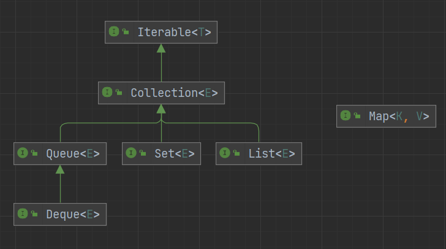

# 集合

Java 集合，也叫做容器，主要用于存储元素



集合主要分为 4 类，继承自 Collection 接口的 List、Set、Queue 与单独的 Map

- List：有序可重复
- Set：不重复，可以有序（TreeSet）可以无序（HashSet）
- Queue：有序可重复
- Map：key 不可重复，可以有序（TreeMap）可以无序（HashMap），value 可重复

## Iterable

```java
public interface Iterable<T> {

    // 获取一个迭代器
    Iterator<T> iterator();

    // 遍历
    default void forEach(Consumer<? super T> action) {
        Objects.requireNonNull(action);
        for (T t : this) {
            action.accept(t);
        }
    }

    // 返回一个可分割的迭代器，并行遍历的迭代器
    default Spliterator<T> spliterator() {
        return Spliterators.spliteratorUnknownSize(iterator(), 0);
    }
}
```

## Collection

```java
public interface Collection<E> extends Iterable<E> {

    // 返回集合中的元素数量
    int size();

    // 集合是否为空
    boolean isEmpty();

    // 集合是否包含给定的元素
    boolean contains(Object o);

    // 获取一个迭代器
    Iterator<E> iterator();

    // 转数组
    Object[] toArray();

    // 转数组
    <T> T[] toArray(T[] a);

    // 添加
    boolean add(E e);

    // 删除
    boolean remove(Object o);

    // 判断是否包含给定的集合中的所有元素
    boolean containsAll(Collection<?> c);

    // 将给定的集合里的元素添加到集合中
    boolean addAll(Collection<? extends E> c);

    // 移除给定的集合中的所有元素
    boolean removeAll(Collection<?> c);

    // 移除满足条件的元素
    default boolean removeIf(Predicate<? super E> filter) {
        Objects.requireNonNull(filter);
        boolean removed = false;
        final Iterator<E> each = iterator();
        while (each.hasNext()) {
            if (filter.test(each.next())) {
                each.remove();
                removed = true;
            }
        }
        return removed;
    }

    // 从当前的集合中保留给定的集合中的元素
    boolean retainAll(Collection<?> c);

    // 清空
    void clear();

    // 判断两个集合是否相等
    boolean equals(Object o);

    // 获取当前集合的hashCode
    int hashCode();

    // 返回一个可分割的迭代器，并行遍历的迭代器
    @Override
    default Spliterator<E> spliterator() {
        return Spliterators.spliterator(this, 0);
    }

    // 获得一个流
    default Stream<E> stream() {
        return StreamSupport.stream(spliterator(), false);
    }

    // 获得一个并行流
    default Stream<E> parallelStream() {
        return StreamSupport.stream(spliterator(), true);
    }
}
```

## List


```java
public interface List<E> extends Collection<E> {
    // 返回集合中的元素数量
    int size();

    // 集合是否为空
    boolean isEmpty();

    // 集合是否包含给定的元素
    boolean contains(Object o);

    // 获取一个迭代器
    Iterator<E> iterator();

    // 转数组
    Object[] toArray();

    // 转数组
    <T> T[] toArray(T[] a);

    // 添加
    boolean add(E e);

    // 删除
    boolean remove(Object o);

    // 判断是否包含给定的集合中的所有元素
    boolean containsAll(Collection<?> c);

    // 将给定的集合里的元素添加到集合中
    boolean addAll(Collection<? extends E> c);

    // 将给定的集合里的元素添加到集合中的指定位置后面
    boolean addAll(int index, Collection<? extends E> c);

    // 移除给定的集合中的所有元素
    boolean removeAll(Collection<?> c);

    // 从当前的集合中保留给定的集合中的元素
    boolean retainAll(Collection<?> c);

    // 遍历并替换元素
    default void replaceAll(UnaryOperator<E> operator) {
        Objects.requireNonNull(operator);
        final ListIterator<E> li = this.listIterator();
        while (li.hasNext()) {
            li.set(operator.apply(li.next()));
        }
    }

    // 排序
    @SuppressWarnings({"unchecked", "rawtypes"})
    default void sort(Comparator<? super E> c) {
        Object[] a = this.toArray();
        Arrays.sort(a, (Comparator) c);
        ListIterator<E> i = this.listIterator();
        for (Object e : a) {
            i.next();
            i.set((E) e);
        }
    }

    // 清空
    void clear();

    // 判断两个集合是否相等
    boolean equals(Object o);

    // 获取当前集合的hashCode
    int hashCode();

    // 根据下标获取元素
    E get(int index);

    // 根据下标修改元素
    E set(int index, E element);

    // 添加元素到指定位置
    void add(int index, E element);

    // 根据下标移除元素
    E remove(int index);

    // 正序查找，返回给定元素的第一次出现的下标
    int indexOf(Object o);

    // 倒序查找，返回给定元素的第一次出现的下标
    int lastIndexOf(Object o);

    // 获取一个迭代器
    ListIterator<E> listIterator();

    // 获取一个从给定下标开始的迭代器
    ListIterator<E> listIterator(int index);

    // 截取集合
    List<E> subList(int fromIndex, int toIndex);

    // 返回一个可分割的迭代器，并行遍历的迭代器
    @Override
    default Spliterator<E> spliterator() {
        return Spliterators.spliterator(this, Spliterator.ORDERED);
    }
}
```

### List 与数组

- List 创建时不需要指定大小，可以随着元素的增加进行动态扩容；数组创建时必须要指定大小，并且创建完成后就无法改变长度了
- List 中只能存储对象，而数组既可以存对象也可以存基本数据类型
- ArrayList、Vector、CopyOnWriteList 内部也是由数组实现的

### ArrayList 与 LinkedList

- ArrayList 是由数组实现的，LinkedList 是由双向链表实现的
- ArrayList 可以指定初始化容量，并且当容量不足时会进行扩容，LinkedList 不支持初始化容量，也不需要扩容
- ArrayList 支持快速随机访问，可以通过下标获取所需的元素，而 LinkedList 只支持顺序访问，除了头尾，都需要通过遍历来获取所需的元素
- 执行插入或删除操作时
  - 列表头部：ArrayList 需要移动数组内的所有元素，时间复杂度为 O(n)；LinkedList 直接在头部进行操作，时间复杂度为 O(1)
  - 列表尾部：ArrayList 不需要移动数组内的元素，时间复杂度为 O(1)；LinkedList 直接在尾部进行操作，时间复杂度为 O(1)
  - 列表中间：ArrayList 能立即找到位置，但需要移动数组内的部分元素，时间复杂度为 O(n)；LinkedList 需要遍历才能找到位置，时间复杂度为 O(n)
- ArrayList 中的数组一般不会填充完全，会有一些空间的浪费；LinkedList 中的元素是存在节点中的，每个节点还需要保存前驱节点与后继节点的指向，所以 LinkedList 相比于 ArrayList，每个元素存储时消耗的空间都更大

### 线程安全的 List

在 Java 中有 3 个常用的线程安全的列表：Vetcor、CopyOnWriteArrayList、SynchronizedList

- Vetcor 的实现与 ArrayList 类似，只是里面方法都添加了 synchronized 关键字，进行同步
- CopyOnWriteArrayList 基于写时复制技术，并使用了 ReentrantLock 来保证修改时的线程安全，适用于读多写少的场景
- SynchronizedList 位于 Collections 工具类中，可以通过 Collections.synchronizedList 方法将一个非线程安全的 List 包装为 SynchronizedList。内部也是通过 synchronized 关键字来保证线程安全，但与 Vetcor 不同的是，没有加在方法上面，而是在方法体里面，当然效果是差不多的


<small>[Collections.synchronizedList 、CopyOnWriteArrayList、Vector介绍、源码浅析与性能对比](https://juejin.cn/post/6844904054745743367#heading-6)</small>

Vetcor 实际上读写性能都不弱，只是遍历时的效率较低。CopyOnWriteArrayList 读与遍历的性能非常好，但写操作效率就非常低了。SynchronizedList 读写效率都挺高，遍历的效率略低，另外注意 SynchronizedList 的中迭代器不是线程安全的

## Map


```java
public interface Map<K,V> {

    // 元素数量
    int size();

    // 集合是否为空
    boolean isEmpty();

    // 是否包含给定的key
    boolean containsKey(Object key);

    // 是否包含给定的value
    boolean containsValue(Object value);

    // 根据key获取value
    V get(Object key);

    // 添加一个键值对
    V put(K key, V value);

    // 移除一个键值对
    V remove(Object key);

    // 将给定的集合里的元素添加到集合中
    void putAll(Map<? extends K, ? extends V> m);

    // 清空
    void clear();

    // 返回key的集合
    Set<K> keySet();

    // 返回value的集合
    Collection<V> values();

    // 返回节点的集合
    Set<Map.Entry<K, V>> entrySet();

    // Map中的节点都直接或间接的实现该接口
    interface Entry<K,V> {
        ...
    }

    // 判断两个集合是否相等
    boolean equals(Object o);

    // 获取当前集合的hashCode
    int hashCode();
}
```

### LinkedHashMap

LinkedHashMap 继承自 HashMap，是一个有序的 Map，可以按照添加的顺序，也可以按照访问的顺序

```java
public class Test {

    public static void main(String[] args) {
        put(new HashMap<>());
        // 添加顺序
        put(new LinkedHashMap<>());
        // 访问顺序
        put(new LinkedHashMap<>(16, 0.75f, true));
    }

    static void put(Map<String, String> map) {
        map.put("one", "one");
        map.put("two", "two");
        map.put("three", "three");
        map.put("four", "four");
        map.put("five", "five");
        map.put("six", "six");
        map.put("seven", "seven");
        map.put("eight", "eight");
        map.put("nine", "nine");
        map.put("ten", "ten");

        map.get("one");
        map.get("two");

        System.out.println(map.keySet());
    }
}
```

> [nine, six, four, one, seven, ten, two, three, five, eight]
> [one, two, three, four, five, six, seven, eight, nine, ten]
> [three, four, five, six, seven, eight, nine, ten, one, two]

通过结果可以看出，LinkedHashMap 以什么顺序添加元素，就以什么顺序输出。而访问顺序是指会将获取过的元素添加到尾部，所以可以作为 LRU（Least Recently Used，最近最少使用） 的一种实现

#### 实现

LinkedHashMap 通过在内部维护了一个双向链表，来实现有序性

LinkedHashMap 的 put 方法就直接使用的 HashMap 的 put 方法，但在创建节点时，调用的是自己重写的方法

```java
Node<K,V> newNode(int hash, K key, V value, Node<K,V> e) {
    LinkedHashMap.Entry<K,V> p =
        new LinkedHashMap.Entry<K,V>(hash, key, value, e);
    linkNodeLast(p);
    return p;
}
```

可以看出创建的是一个 Entry 节点，而该节点又继承自 HashMap.Node，并且多维护 before、after 两个变量，表示前一个节点和后一个节点

```java
static class Entry<K,V> extends HashMap.Node<K,V> {
    Entry<K,V> before, after;
    Entry(int hash, K key, V value, Node<K,V> next) {
        super(hash, key, value, next);
    }
}
```


<small>[Java集合框架源码剖析：LinkedHashSet 和 LinkedHashMap](https://www.cnblogs.com/CarpenterLee/p/5541111.html)</small>

在 HashMap 中有 3 个空方法就是专门留给 LinkedHashMap 来实现的

```java
void afterNodeAccess(Node<K,V> p) { }
void afterNodeInsertion(boolean evict) { }
void afterNodeRemoval(Node<K,V> p) { }
```

```java
// 删除元素后
void afterNodeRemoval(Node<K,V> e) { // unlink
    LinkedHashMap.Entry<K,V> p =
        (LinkedHashMap.Entry<K,V>)e, b = p.before, a = p.after;
    p.before = p.after = null;
    if (b == null)
        head = a;
    else
        b.after = a;
    if (a == null)
        tail = b;
    else
        a.before = b;
}

// 插入元素后
void afterNodeInsertion(boolean evict) { // possibly remove eldest
    LinkedHashMap.Entry<K,V> first;
    if (evict && (first = head) != null && removeEldestEntry(first)) {
        K key = first.key;
        removeNode(hash(key), key, null, false, true);
    }
}

// 访问元素后，用于按照访问顺序
void afterNodeAccess(Node<K,V> e) { // move node to last
    LinkedHashMap.Entry<K,V> last;
    if (accessOrder && (last = tail) != e) {
        LinkedHashMap.Entry<K,V> p =
            (LinkedHashMap.Entry<K,V>)e, b = p.before, a = p.after;
        p.after = null;
        if (b == null)
            head = a;
        else
            b.after = a;
        if (a != null)
            a.before = b;
        else
            last = b;
        if (last == null)
            head = p;
        else {
            p.before = last;
            last.after = p;
        }
        tail = p;
        ++modCount;
    }
}
```

### TreeMap

TreeMap 是一个有序的 Map，与 LinkedHashMap 不同的是 TreeMap 不是按照添加或者访问顺序来排序，而是按照指定的比较器来进行自动排序

```java
public class Test implements Comparable {

    int i;

    public Test(int i) {
        this.i = i;
    }

    public static void main(String[] args) {
        put(new HashMap<>());
        put(new LinkedHashMap<>());
        put(new TreeMap<>());
        put(new TreeMap<>(new Comparator<Test>() {
            @Override
            public int compare(Test o1, Test o2) {
                return Integer.compare(o1.i, o2.i);
            }
        }));
    }

    static void put(Map<Test, String> map) {
        for (int i = 10; i > 0; i--) {
            map.put(new Test(i), "");
        }

        System.out.println(map.keySet());
    }

    @Override
    public int compareTo(Object o) {
        Test test = (Test) o;
        return Integer.compare(this.i - test.i, 0);
    }

    @Override
    public String toString() {
        return String.valueOf(i);
    }
}
```

> [8, 5, 2, 6, 10, 4, 9, 7, 1, 3]
[10, 9, 8, 7, 6, 5, 4, 3, 2, 1]
[1, 2, 3, 4, 5, 6, 7, 8, 9, 10]
[1, 2, 3, 4, 5, 6, 7, 8, 9, 10]

注意作为 key 的对象必须实现 Comparable 接口

### 线程安全的 Map

在 Java 中有 3 个常用的线程安全的 Map：Hashtable、ConcurrentHashMap、SynchronizedMap

- Hashtable 的实现与 JDK1.7 的 HashMap 类似，只是里面方法都添加了 synchronized 关键字，进行同步
- ConcurrentHashMap 通过 CAS 与 synchronized 来保证线程安全，JDK1.7 通过分段锁实现。效率最高
- SynchronizedMap 位于 Collections 工具类中，可以通过 Collections.synchronizedMap 方法将一个非线程安全的 Map 包装为 SynchronizedMap。内部也是通过 synchronized 关键字来保证线程安全，但与 Hashtable 不同的是，没有加在方法上面，而是在方法体里面，当然效果是差不多的

#### 为什么 Hashtable、ConcurrentHashMap 的 key 与 value 不能为 null

主要是为了避免二义性。像 HashMap 就可以存储为 null 的 key 和 value，如果使用 get 方法获取会返回 null，但这个 null 是具有二义性的，他既可以表示不存在该 key，也可以表示 value 就是 null。为了区分这两种情况可以结合 get 与 containsKey 方法

```java
if (map.containsKey(key)) {
    map.get(key);
} else {
    System.out.println("不存在该key");
}
```

在单线程环境中，这样使用是没问题的。但在多线程环境下 containsKey 与 get 之间可能会有其他线程对 Map 进行操作，如添加或删除某个元素，导致执行完 containsKey 如果返回 true，只能说明这时是存在该 key，但不能保证执行 get 方法的时候该 key 仍是存在的。如果允许 Hashtable、ConcurrentHashMap 的 key 与 value 为 null，还是会产生二义性

为了避免二义性，Hashtable、ConcurrentHashMap 不允许 value 为 null 还多了一个好处，就是执行 get 方法就可以判断是否有该 key 了，为 null 就是不存在，有值就表示存在

## Set


```java
public interface Set<E> extends Collection<E> {

    // 返回集合中的元素数量
    int size();

    // 集合是否为空
    boolean isEmpty();

    // 集合是否包含给定的元素
    boolean contains(Object o);

    // 获取一个迭代器
    Iterator<E> iterator();

    // 转数组
    Object[] toArray();

    // 转数组
    <T> T[] toArray(T[] a);

    // 添加一个元素
    boolean add(E e);

    // 移除一个元素
    boolean remove(Object o);

    // 判断是否包含给定的集合中的所有元素
    boolean containsAll(Collection<?> c);

    // 将给定的集合里的元素添加到集合中
    boolean addAll(Collection<? extends E> c);

    // 从当前的集合中保留给定的集合中的元素
    boolean retainAll(Collection<?> c);

    // 移除给定的集合中的所有元素
    boolean removeAll(Collection<?> c);

    // 清空
    void clear();

    // 判断两个集合是否相等
    boolean equals(Object o);

    // 获取当前集合的hashCode
    int hashCode();

    // 返回一个可分割的迭代器，并行遍历的迭代器
    @Override
    default Spliterator<E> spliterator() {
        return Spliterators.spliterator(this, Spliterator.DISTINCT);
    }
}
```

### 线程安全的 Set

在 Java 中有 2 个常用的线程安全的 Set：CopyOnWriteArraySet、SynchronizedSet

- CopyOnWriteArraySet 基于写时复制技术，内部就直接使用的 CopyOnWriteArrayList 实现
- SynchronizedSap 位于 Collections 工具类中，可以通过 Collections.synchronizedSet 方法将一个非线程安全的 Set 包装为 SynchronizedSet。内部也是通过 synchronized 关键字来保证线程安全

#### CopyOnWriteArraySet

```java
public class CopyOnWriteArraySet<E> extends AbstractSet<E>
        implements java.io.Serializable {

    private final CopyOnWriteArrayList<E> al;

    public CopyOnWriteArraySet() {
        al = new CopyOnWriteArrayList<E>();
    }

    public CopyOnWriteArraySet(Collection<? extends E> c) {
        if (c.getClass() == CopyOnWriteArraySet.class) {
            @SuppressWarnings("unchecked") CopyOnWriteArraySet<E> cc =
                (CopyOnWriteArraySet<E>)c;
            al = new CopyOnWriteArrayList<E>(cc.al);
        }
        else {
            al = new CopyOnWriteArrayList<E>();
            al.addAllAbsent(c);
        }
    }
}
```

那么 Set 的不可重复性怎么保证呢

```java
// add方法中调用CopyOnWriteArrayList的addIfAbsent，不存在才能添加
public boolean add(E e) {
    return al.addIfAbsent(e);
}
```

## Queue


```java
public interface Queue<E> extends Collection<E> {
    
    // 向队列中添加一个元素，如果是一个有界队列且空间不足，则抛出异常
    boolean add(E e);

    // 向队列中添加一个元素，如果是一个有界队列且空间不足，则返回false。有界队列更推荐此方法
    boolean offer(E e);

    // 移除并返回队首元素，如果队列为空，则抛出异常
    E remove();

    // 移除并返回队首元素，如果队列为空，则返回null
    E poll();

    // 获得队首元素，如果队列为空，则抛出异常
    E element();

    // 获得队首元素，如果队列为空，则返回null
    E peek();
}
```

### Deque

继承自 Queue，用于表示双端队列

```java
public interface Deque<E> extends Queue<E> {

    // 插入到队首，如果是一个有界队列且空间不足，则抛出异常
    void addFirst(E e);

    // 插入到队尾，如果是一个有界队列且空间不足，则抛出异常
    void addLast(E e);

    // 插入到队首，如果是一个有界队列且空间不足，则返回false
    boolean offerFirst(E e);

    // 插入到队尾，如果是一个有界队列且空间不足，则返回false
    boolean offerLast(E e);

    // 移除并返回队首元素，如果队列为空，则抛出异常
    E removeFirst();

    // 移除并返回队首元素，如果队列为空，则抛出异常
    E removeLast();

    // 移除并返回队首元素，如果队列为空，则返回null
    E pollFirst();

    // 移除并返回队尾元素，如果队列为空，则返回null
    E pollLast();

    // 获得队首元素，如果队列为空，则抛出异常
    E getFirst();

    // 获得队尾元素，如果队列为空，则抛出异常
    E getLast();

    // 获得队首元素，如果队列为空，则返回null
    E peekFirst();

    // 获得队尾元素，如果队列为空，则返回null
    E peekLast();

    // 删除给定的元素，从队首开始查找
    boolean removeFirstOccurrence(Object o);

    // 删除给定的元素，从队尾开始查找
    boolean removeLastOccurrence(Object o);

    // 插入到队尾，如果是一个有界队列且空间不足，则抛出异常
    boolean add(E e);

    // 插入到队尾，如果是一个有界队列且空间不足，则返回false
    boolean offer(E e);

    // 移除并返回队首元素，如果队列为空，则抛出异常
    E remove();

    // 移除并返回队首元素，如果队列为空，则返回null
    E poll();

    // 获得队首元素，如果队列为空，则抛出异常
    E element();

    // 获得队首元素，如果队列为空，则返回null
    E peek();

    // 插入到队首，如果是一个有界队列且空间不足，则抛出异常
    void push(E e);

    // 移除并返回队首元素，如果队列为空，则抛出异常
    E pop();

    // 删除给定的元素，从队首开始查找
    boolean remove(Object o);

    // 队列中是否存在给定的元素，从队首开始查找
    boolean contains(Object o);

    // 返回队列中的元素个数
    public int size();

    // 返回一个迭代器，从队首到队尾
    Iterator<E> iterator();

    // 返回一个迭代器，从队尾到队首
    Iterator<E> descendingIterator();
}
```

### ArrayDeque 与 LinkedList

- ArrayDeque 内部通过数组实现，LinkedList 内部通过链表实现
- ArrayDeque 不允许存储 null，LinkedList 可以存储 null
- ArrayDeque 容量不足时需要扩容，LinkedList 不需要扩容

### 线程安全的 Queue

其实 Queue 的实现众多，但主要就分为两大类，一类是 LinkedList、ArrayDeque、PriorityQueue 代表的非线程安全的，一类是线程安全的。线程安全的 Queue 中又有一个 BlockingQueue 大类，这里就不多做赘述了。作为非阻塞的线程安全的队列 ConcurrentLinkedQueue 与 ConcurrentLinkedDeque 内部通过 CAS 与 重试机制来保证线程安全

## 参考

- [Collections.synchronizedList 、CopyOnWriteArrayList、Vector介绍、源码浅析与性能对比](https://juejin.cn/post/6844904054745743367)
- [Why ConcurrentHashMap does not allow null keys and null values ?](http://javainterviewquestionswithanswer.blogspot.com/2016/12/why-concurrenthashmap-does-not-allow.html)
- [Why does ConcurrentHashMap prevent null keys and values?](https://stackoverflow.com/questions/698638/why-does-concurrenthashmap-prevent-null-keys-and-values)
- [【并发编程】为什么Hashtable和ConcurrentHashMap 是不允许键或值为 null 的，HashMap 的键值则都可以为 null？](https://blog.csdn.net/cy973071263/article/details/126354336)
