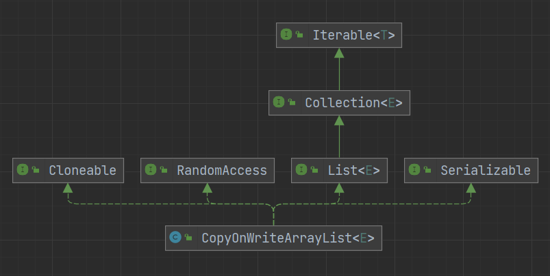

# CopyOnWriteList

CopyOnWriteList 是一个线程安全的集合，通过写时复制策略与 ReentrantLock 锁来保证线程安全

写时复制（Copy-on-write，COW）：一种计算机程序设计领域的优化策略。其核心思想是，如果有多个调用者同时请求相同资源，他们会共同获取相同的指针指向相同的资源，直到某个调用者试图修改资源的内容时，系统才会真正复制一份专用副本给该调用者，而其他调用者所见到的最初的资源仍然保持不变。这过程对其他的调用者都是透明的。此作法主要的优点是如果调用者没有修改该资源，就不会有副本被建立，因此多个调用者只是读取操作时可以共享同一份资源

简而言之写时复制就是，大家都读取的都是同一份资源，当某个用户需要修改该资源时，复制一份副本给该用户进行修改，其他人仍读取之前的资源，修改完成后，再将旧资源的引用指向新资源

- 读操作是无锁的，性能较高
- 每个写操作都对应一个新的副本，需要拷贝，比较耗时，内存占用较大，并且实时性较差，当写操作完成时，别的用户才能读取到新数据，所以只适用于读多写少的场景



## 成员变量

```java
// 控制并发访问的锁
final transient ReentrantLock lock = new ReentrantLock();

// 存放元素的数组
private transient volatile Object[] array;

// Unsafe工具类
private static final sun.misc.Unsafe UNSAFE;

// lock的偏移量，即lock的内存地址
private static final long lockOffset;
```

UNSAFE 与 lockOffset 变量用于 resetLock 方法，对 lock 变量进行 CAS 操作

resetLock 只被 clone、readObject 两个方法调用着，为了克隆或者反序列化时重置锁

```java
private void resetLock() {
    UNSAFE.putObjectVolatile(this, lockOffset, new ReentrantLock());
}
```

array 变量只能通过 getArray、setArray 两个方法进行获取与修改

```java
final Object[] getArray() {
    return array;
}

final void setArray(Object[] a) {
    array = a;
}
```

CopyOnWriteArrayList 中没有 size 变量，想要获取集合中元素的数量时直接返回数组的大小就可以了。因为 CopyOnWriteArrayList 每次添加或删除，都是在新数组中进行操作的，而在新数组创建时就可根据所需的容量指定数组的大小，不像 ArrayList 会有冗余的位置

```java
public int size() {
    return getArray().length;
}
```

## 构造方法

```java
public CopyOnWriteArrayList() {
    // 创建一个空数组
    setArray(new Object[0]);
}

// 将给定的集合复制到一个新数组中，并设置array变量
public CopyOnWriteArrayList(Collection<? extends E> c) {
    Object[] elements;
    if (c.getClass() == CopyOnWriteArrayList.class)
        elements = ((CopyOnWriteArrayList<?>)c).getArray();
    else {
        elements = c.toArray();
        // c.toArray might (incorrectly) not return Object[] (see 6260652)
        if (elements.getClass() != Object[].class)
            elements = Arrays.copyOf(elements, elements.length, Object[].class);
    }
    setArray(elements);
}

// 将给定的数组复制到一个新数组中，并设置array变量
public CopyOnWriteArrayList(E[] toCopyIn) {
    setArray(Arrays.copyOf(toCopyIn, toCopyIn.length, Object[].class));
}
```

## 添加

CopyOnWriteArrayList 没有扩容方法，因为每次执行添加操作，都会创建一个新数组，长度为原数组的大小加上新添加的元素的数量，并将原数组内的元素都复制到新数组中，再将需要添加的元素插入到新数组中

```java
public boolean add(E e) {
    final ReentrantLock lock = this.lock;
    lock.lock();
    try {
        Object[] elements = getArray();
        int len = elements.length;
        // 创建一个长度加1的新数组，并将旧数组中的元素复制到新数组中
        Object[] newElements = Arrays.copyOf(elements, len + 1);
        // 将新元素插入到新数组中
        newElements[len] = e;
        // 将旧数组的引用指向新数组
        setArray(newElements);
        return true;
    } finally {
        lock.unlock();
    }
}

// 添加元素到指定位置
public void add(int index, E element) {
    final ReentrantLock lock = this.lock;
    lock.lock();
    try {
        Object[] elements = getArray();
        int len = elements.length;
        if (index > len || index < 0)
            throw new IndexOutOfBoundsException("Index: "+index+
                                                ", Size: "+len);
        Object[] newElements;
        // 计算需要移动的元素的数量
        int numMoved = len - index;
        // 如果numMoved为0，说明是要在数组末尾进行添加，创建一个长度加1的新数组，并将旧数组中的元素复制到新数组中
        if (numMoved == 0)
            newElements = Arrays.copyOf(elements, len + 1);
        else {
            // 创建一个长度加1的新数组
            newElements = new Object[len + 1];
            // 首先将旧数组中从头到下标位置的元素复制到新数组中
            System.arraycopy(elements, 0, newElements, 0, index);
            // 再将下标位置之后的元素，复制到新数组中同样下标位置向后偏移1位
            System.arraycopy(elements, index, newElements, index + 1,
                                numMoved);
        }
        // 将新元素插入到新数组中
        newElements[index] = element;
        // 将旧数组的引用指向新数组
        setArray(newElements);
    } finally {
        lock.unlock();
    }
}
```

### 如果不存在就添加

```java
public boolean addIfAbsent(E e) {
    // 获取当前数组的快照
    Object[] snapshot = getArray();
    // 首先查找数组内是否有给定的元素，如果不存在就执行添加操作
    return indexOf(e, snapshot, 0, snapshot.length) >= 0 ? false :
        addIfAbsent(e, snapshot);
}

private boolean addIfAbsent(E e, Object[] snapshot) {
    final ReentrantLock lock = this.lock;
    lock.lock();
    try {
        Object[] current = getArray();
        int len = current.length;
        // 如果当前的数组与快照不同，说明在获取到锁之前发生了修改
        if (snapshot != current) {
            // 重新查找数组内是否有给定的元素
            int common = Math.min(snapshot.length, len);
            for (int i = 0; i < common; i++)
                if (current[i] != snapshot[i] && eq(e, current[i]))
                    return false;
            if (indexOf(e, current, common, len) >= 0)
                    return false;
        }
        // 创建一个长度加1的新数组，并将旧数组中的元素复制到新数组中
        Object[] newElements = Arrays.copyOf(current, len + 1);
        // 将新元素插入到新数组中
        newElements[len] = e;
        // 将旧数组的引用指向新数组
        setArray(newElements);
        return true;
    } finally {
        lock.unlock();
    }
}
```

## 获取

```java
private E get(Object[] a, int index) {
    return (E) a[index];
}

public E get(int index) {
    return get(getArray(), index);
}
```

## 删除

与添加方法的实现类似，只不过是数组向前移动，不多赘述

```java
public E remove(int index) {
    final ReentrantLock lock = this.lock;
    lock.lock();
    try {
        Object[] elements = getArray();
        int len = elements.length;
        E oldValue = get(elements, index);
        int numMoved = len - index - 1;
        if (numMoved == 0)
            setArray(Arrays.copyOf(elements, len - 1));
        else {
            Object[] newElements = new Object[len - 1];
            System.arraycopy(elements, 0, newElements, 0, index);
            System.arraycopy(elements, index + 1, newElements, index,
                                numMoved);
            setArray(newElements);
        }
        return oldValue;
    } finally {
        lock.unlock();
    }
}

public boolean remove(Object o) {
    Object[] snapshot = getArray();
    int index = indexOf(o, snapshot, 0, snapshot.length);
    return (index < 0) ? false : remove(o, snapshot, index);
}

private boolean remove(Object o, Object[] snapshot, int index) {
    final ReentrantLock lock = this.lock;
    lock.lock();
    try {
        Object[] current = getArray();
        int len = current.length;
        // 如果当前的数组与快照不同，说明在获取到锁之前发生了修改，重新获取下标位置
        if (snapshot != current) findIndex: {
            int prefix = Math.min(index, len);
            for (int i = 0; i < prefix; i++) {
                if (current[i] != snapshot[i] && eq(o, current[i])) {
                    index = i;
                    break findIndex;
                }
            }
            if (index >= len)
                return false;
            if (current[index] == o)
                break findIndex;
            index = indexOf(o, current, index, len);
            if (index < 0)
                return false;
        }
        Object[] newElements = new Object[len - 1];
        System.arraycopy(current, 0, newElements, 0, index);
        System.arraycopy(current, index + 1,
                            newElements, index,
                            len - index - 1);
        setArray(newElements);
        return true;
    } finally {
        lock.unlock();
    }
}
```

## 修改

```java
public E set(int index, E element) {
    final ReentrantLock lock = this.lock;
    lock.lock();
    try {
        Object[] elements = getArray();
        E oldValue = get(elements, index);

        if (oldValue != element) {
            int len = elements.length;
            Object[] newElements = Arrays.copyOf(elements, len);
            newElements[index] = element;
            setArray(newElements);
        } else {
            // Not quite a no-op; ensures volatile write semantics
            setArray(elements);
        }
        return oldValue;
    } finally {
        lock.unlock();
    }
}
```

## 移除或保留

```java
public boolean removeAll(Collection<?> c) {
    if (c == null) throw new NullPointerException();
    final ReentrantLock lock = this.lock;
    lock.lock();
    try {
        Object[] elements = getArray();
        int len = elements.length;
        if (len != 0) {
            // temp array holds those elements we know we want to keep
            int newlen = 0;
            Object[] temp = new Object[len];
            for (int i = 0; i < len; ++i) {
                Object element = elements[i];
                if (!c.contains(element))
                    temp[newlen++] = element;
            }
            if (newlen != len) {
                setArray(Arrays.copyOf(temp, newlen));
                return true;
            }
        }
        return false;
    } finally {
        lock.unlock();
    }
}

public boolean retainAll(Collection<?> c) {
    if (c == null) throw new NullPointerException();
    final ReentrantLock lock = this.lock;
    lock.lock();
    try {
        Object[] elements = getArray();
        int len = elements.length;
        if (len != 0) {
            // temp array holds those elements we know we want to keep
            int newlen = 0;
            Object[] temp = new Object[len];
            for (int i = 0; i < len; ++i) {
                Object element = elements[i];
                if (c.contains(element))
                    temp[newlen++] = element;
            }
            if (newlen != len) {
                setArray(Arrays.copyOf(temp, newlen));
                return true;
            }
        }
        return false;
    } finally {
        lock.unlock();
    }
}
```

## 参考

-[CopyOnWriteArrayList实现原理及源码分析](https://www.cnblogs.com/chengxiao/p/6881974.html)
