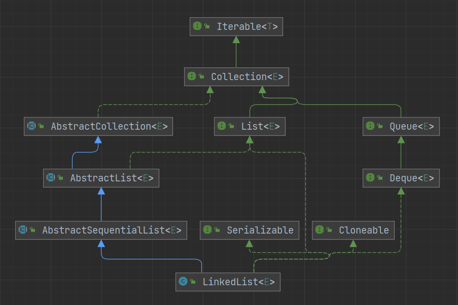
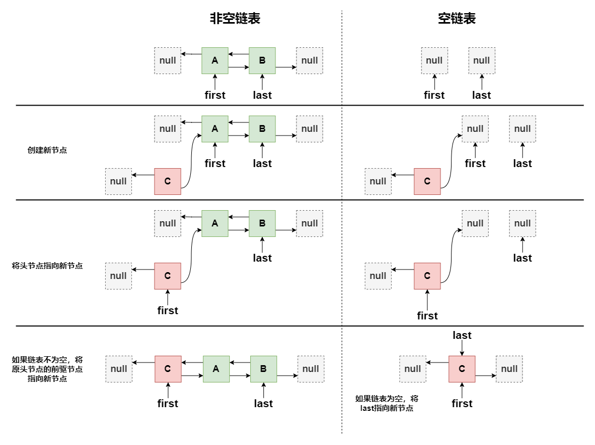
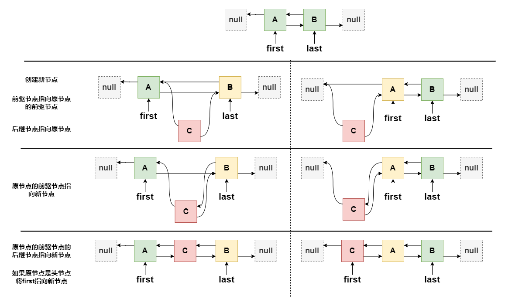
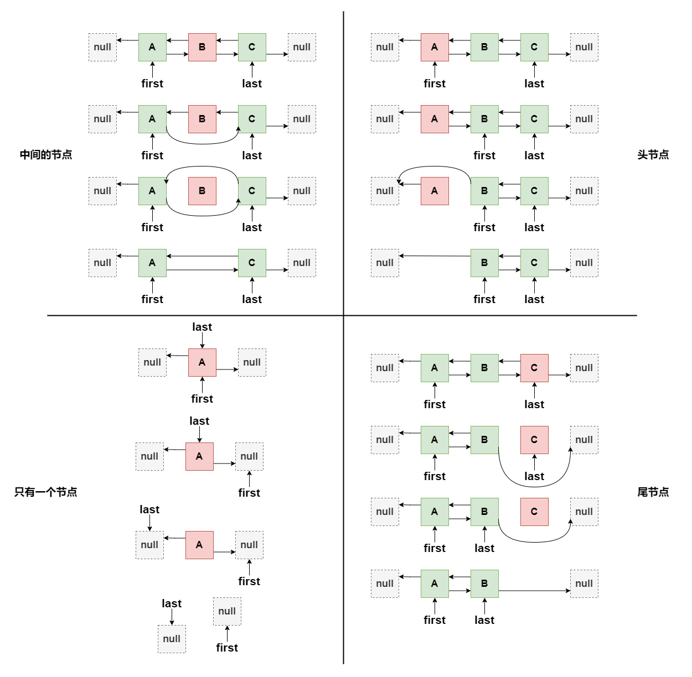

# LinkedList



LinkedList 实现了 Deque 接口，说明他具有双向队列的一些性质。LinkedList 继承了 AbstractSequentialList 类，AbstractSequentialList 又继承了 AbstractList 类。AbstractSequentialList 只支持顺序访问，如果想要支持随机访问应直接继承 AbstractList 类

- 顺序访问：通常需要通过遍历来查找元素，如链表，头尾可以直接获取
- 随机访问：可以直接通过某个标记获取到所需的元素，如数组

## 成员变量

```java
// 元素数量
transient int size = 0;

// 头节点
transient Node<E> first;

// 尾节点
transient Node<E> last;
```

## 节点

```java
private static class Node<E> {
    // 存储的元素
    E item;
    // 后继节点
    Node<E> next;
    // 前驱节点
    Node<E> prev;

    Node(Node<E> prev, E element, Node<E> next) {
        this.item = element;
        this.next = next;
        this.prev = prev;
    }
}
```

## 构造方法

LinkedList 不可指定初始容量

```java
public LinkedList() {
}

public LinkedList(Collection<? extends E> c) {
    this();
    addAll(c);
}
```

## 添加

```java
// 添加元素到尾部
public boolean add(E e) {
    linkLast(e);
    return true;
}

// 添加元素到指定位置
public void add(int index, E element) {
    checkPositionIndex(index);

    // 如果要添加的位置在尾部，直接在尾部进行添加
    if (index == size)
        linkLast(element);
    else
        linkBefore(element, node(index));
}

// 添加元素到头部
public void addFirst(E e) {
    linkFirst(e);
}

// 添加元素到尾部
public void addLast(E e) {
    linkLast(e);
}

// 添加元素到尾部
public boolean offer(E e) {
    return add(e);
}

// 添加元素到头部
public boolean offerFirst(E e) {
    addFirst(e);
    return true;
}

// 添加元素到尾部
public boolean offerLast(E e) {
    addLast(e);
    return true;
}

// 添加元素到头部
public void push(E e) {
    addFirst(e);
}
```

### 添加头节点

```java
private void linkFirst(E e) {
    final Node<E> f = first;
    // 创建新节点，并将后继节点指向原头节点
    final Node<E> newNode = new Node<>(null, e, f);
    // 将头节点指向新节点
    first = newNode;
    // 如果原头节点为null，说明链表为空，则将尾节点也指向新节点
    // 如果原头节点不为null，则将原头节点的前驱节点指向新节点
    if (f == null)
        last = newNode;
    else
        f.prev = newNode;
    size++;
    modCount++;
}
```



### 添加尾节点

```java
void linkLast(E e) {
    final Node<E> l = last;
    // 创建新节点，并将前驱节点指向原尾节点
    final Node<E> newNode = new Node<>(l, e, null);
    // 将尾节点指向新节点
    last = newNode;
    // 如果原尾节点为null，说明链表为空，则将头节点也指向新节点
    // 如果原尾节点不为null，则将原尾节点的后继节点指向新节点
    if (l == null)
        first = newNode;
    else
        l.next = newNode;
    size++;
    modCount++;
}
```

### 添加前驱节点

```java
void linkBefore(E e, Node<E> succ) {
    final Node<E> pred = succ.prev;
    // 创建新节点，并将前驱节点指向原节点前驱节点，后继节点指向原节点
    final Node<E> newNode = new Node<>(pred, e, succ);
    // 将原节点的前驱节点指向新节点
    succ.prev = newNode;
    // 如果原节点的前驱节点为null，说明原节点是头节点，则将头节点也指向新节点
    // 如果原节点的前驱节点不为null，则将原节点的前驱节点的后继节点指向新节点
    if (pred == null)
        first = newNode;
    else
        pred.next = newNode;
    size++;
    modCount++;
}
```



## 添加集合

```java
public boolean addAll(Collection<? extends E> c) {
    return addAll(size, c);
}

public boolean addAll(int index, Collection<? extends E> c) {
    checkPositionIndex(index);

    Object[] a = c.toArray();
    int numNew = a.length;
    // 判断给定的集合是否为空
    if (numNew == 0)
        return false;

    Node<E> pred, succ;
    // 如果要插入的位置等于已有的元素数量，说明要插入到链表尾部，后继节点指向null，前驱节点指向last
    // 如果要插入的位置不等于已有的元素数量，说明要插入到链表中间，后继节点指向该位置本来的节点，前驱节点指向原节点的前驱节点
    if (index == size) {
        succ = null;
        pred = last;
    } else {
        succ = node(index);
        pred = succ.prev;
    }

    for (Object o : a) {
        @SuppressWarnings("unchecked") E e = (E) o;
        // 创建新节点
        Node<E> newNode = new Node<>(pred, e, null);
        // 如果前驱节点为null，则将新节点设置成头节点
        // 如果前驱节点不为null，则将新节点设置成前驱节点的后继节点
        if (pred == null)
            first = newNode;
        else
            pred.next = newNode;
        // 将前驱节点指向新节点，用于下次插入
        pred = newNode;
    }

    // 如果后继节点为null，则将尾节点指向最后一个插入的节点
    // 如果后继节点不为null，则将最后插入的节点的后继节点指向原节点的后继节点，并原节点的后继节点的前驱节点指向最后插入的节点
    if (succ == null) {
        last = pred;
    } else {
        pred.next = succ;
        succ.prev = pred;
    }

    size += numNew;
    modCount++;
    return true;
}
```

## 获取

```java
public E get(int index) {
    checkElementIndex(index);
    return node(index).item;
}

Node<E> node(int index) {
    // 如果指定的下标小于容量的一半，从头部开始遍历，否则从尾部开始遍历
    if (index < (size >> 1)) {
        Node<E> x = first;
        for (int i = 0; i < index; i++)
            x = x.next;
        return x;
    } else {
        Node<E> x = last;
        for (int i = size - 1; i > index; i--)
            x = x.prev;
        return x;
    }
}
```

```java
// 获取头节点
public E getFirst() {
    final Node<E> f = first;
    if (f == null)
        throw new NoSuchElementException();
    return f.item;
}

// 获取尾节点
public E getLast() {
    final Node<E> l = last;
    if (l == null)
        throw new NoSuchElementException();
    return l.item;
}

// 获取头节点
public E peek() {
    final Node<E> f = first;
    return (f == null) ? null : f.item;
}

// 获取头节点
public E element() {
    return getFirst();
}

// 获取头节点
public E peekFirst() {
    final Node<E> f = first;
    return (f == null) ? null : f.item;
}

// 获取尾节点
public E peekLast() {
    final Node<E> l = last;
    return (l == null) ? null : l.item;
}
```

## 删除

```java
// 删除给定下标位置的节点
public E remove(int index) {
    checkElementIndex(index);
    return unlink(node(index));
}

// 删除头节点
public E remove() {
    return removeFirst();
}

// 删除头节点
public E removeFirst() {
    final Node<E> f = first;
    if (f == null)
        throw new NoSuchElementException();
    return unlinkFirst(f);
}

// 删除尾节点
public E removeLast() {
    final Node<E> l = last;
    if (l == null)
        throw new NoSuchElementException();
    return unlinkLast(l);
}

// 删除头节点
public E poll() {
    final Node<E> f = first;
    return (f == null) ? null : unlinkFirst(f);
}

// 删除头节点
public E pollFirst() {
    final Node<E> f = first;
    return (f == null) ? null : unlinkFirst(f);
}

// 删除尾节点
public E pollLast() {
    final Node<E> l = last;
    return (l == null) ? null : unlinkLast(l);
}

// 删除头节点
public E pop() {
    return removeFirst();
}
```

```java
// 删除给定的元素
public boolean remove(Object o) {
    if (o == null) {
        for (Node<E> x = first; x != null; x = x.next) {
            if (x.item == null) {
                unlink(x);
                return true;
            }
        }
    } else {
        for (Node<E> x = first; x != null; x = x.next) {
            if (o.equals(x.item)) {
                unlink(x);
                return true;
            }
        }
    }
    return false;
}

// 删除给定的元素，从头部开始查找
public boolean removeFirstOccurrence(Object o) {
    return remove(o);
}

// 删除给定的元素，从尾部开始查找
public boolean removeLastOccurrence(Object o) {
    if (o == null) {
        for (Node<E> x = last; x != null; x = x.prev) {
            if (x.item == null) {
                unlink(x);
                return true;
            }
        }
    } else {
        for (Node<E> x = last; x != null; x = x.prev) {
            if (o.equals(x.item)) {
                unlink(x);
                return true;
            }
        }
    }
    return false;
}
```

### 删除头节点

```java
private E unlinkFirst(Node<E> f) {
    final E element = f.item;
    final Node<E> next = f.next;
    f.item = null;
    // 将原头节点的后继节点指向null
    f.next = null; // help GC
    // 将头节点指向原头节点的后继节点
    first = next;
    // 如果原头节点的后继节点为null，说明链表中只有一个节点，则将尾节点也指向null
    // 如果原头节点的后继节点不为null，则将原头节点的后继节点的前驱节点指向null
    if (next == null)
        last = null;
    else
        next.prev = null;
    size--;
    modCount++;
    return element;
}
```

### 删除尾节点

```java
private E unlinkLast(Node<E> l) {
    final E element = l.item;
    final Node<E> prev = l.prev;
    l.item = null;
    // 将原尾节点的前驱节点指向null
    l.prev = null; // help GC
    // 将尾节点指向原尾节点的前驱节点
    last = prev;
    // 如果原尾节点的前驱节点为null，说明链表中只有一个节点，则将头节点也指向null
    // 如果原尾节点的前驱节点不为null，则将原尾节点的前驱节点的后继节点指向null
    if (prev == null)
        first = null;
    else
        prev.next = null;
    size--;
    modCount++;
    return element;
}
```

### 删除指定节点

```java
E unlink(Node<E> x) {
    // assert x != null;
    final E element = x.item;
    final Node<E> next = x.next;
    final Node<E> prev = x.prev;

    // 如果该节点的前驱节点为null，说明该节点为头节点，则将头节点指向该节点的后继节点
    // 如果该节点的前驱节点不为null，将该节点的前驱节点的后继节点指向该节点的后继节点，并将该节点的前驱节点指向null
    if (prev == null) {
        first = next;
    } else {
        prev.next = next;
        x.prev = null;
    }

    // 如果该节点的后继节点为null，说明该节点为尾节点，则将尾节点指向该节点的前驱节点
    // 如果该节点的后继节点不为null，将该节点的后继节点的前驱节点指向该节点的前驱节点，并将该节点的后继节点指向null
    if (next == null) {
        last = prev;
    } else {
        next.prev = prev;
        x.next = null;
    }

    x.item = null;
    size--;
    modCount++;
    return element;
}
```



## 修改

```java
public E set(int index, E element) {
    checkElementIndex(index);
    Node<E> x = node(index);
    E oldVal = x.item;
    x.item = element;
    return oldVal;
}
```

## 清空

```java
public void clear() {
    // 从头节点开始遍历
    // 将遍历到的所有节点的所有指向都置为null
    for (Node<E> x = first; x != null; ) {
        Node<E> next = x.next;
        x.item = null;
        x.next = null;
        x.prev = null;
        x = next;
    }
    first = last = null;
    size = 0;
    modCount++;
}
```

## 查找

```java
public boolean contains(Object o) {
    return indexOf(o) != -1;
}

// 正序查找，返回给定元素的第一次出现的下标，如果不存在返回-1
public int indexOf(Object o) {
    int index = 0;
    if (o == null) {
        for (Node<E> x = first; x != null; x = x.next) {
            if (x.item == null)
                return index;
            index++;
        }
    } else {
        for (Node<E> x = first; x != null; x = x.next) {
            if (o.equals(x.item))
                return index;
            index++;
        }
    }
    return -1;
}

// 倒序查找，返回给定元素的第一次出现的下标，如果不存在返回-1
public int lastIndexOf(Object o) {
    int index = size;
    if (o == null) {
        for (Node<E> x = last; x != null; x = x.prev) {
            index--;
            if (x.item == null)
                return index;
        }
    } else {
        for (Node<E> x = last; x != null; x = x.prev) {
            index--;
            if (o.equals(x.item))
                return index;
        }
    }
    return -1;
}
```

## 拷贝

返回该集合的浅拷贝

```java
public Object clone() {
    LinkedList<E> clone = superClone();

    // Put clone into "virgin" state
    clone.first = clone.last = null;
    clone.size = 0;
    clone.modCount = 0;

    // Initialize clone with our elements
    for (Node<E> x = first; x != null; x = x.next)
        clone.add(x.item);

    return clone;
}
```

## 转数组

```java
public Object[] toArray() {
    Object[] result = new Object[size];
    int i = 0;
    for (Node<E> x = first; x != null; x = x.next)
        result[i++] = x.item;
    return result;
}

@SuppressWarnings("unchecked")
public <T> T[] toArray(T[] a) {
    if (a.length < size)
        a = (T[])java.lang.reflect.Array.newInstance(
                            a.getClass().getComponentType(), size);
    int i = 0;
    Object[] result = a;
    for (Node<E> x = first; x != null; x = x.next)
        result[i++] = x.item;

    if (a.length > size)
        a[size] = null;

    return a;
}
```

## 序列化

```java
private void writeObject(java.io.ObjectOutputStream s)
    throws java.io.IOException {
    // Write out any hidden serialization magic
    s.defaultWriteObject();

    // Write out size
    s.writeInt(size);

    // Write out all elements in the proper order.
    for (Node<E> x = first; x != null; x = x.next)
        s.writeObject(x.item);
}

@SuppressWarnings("unchecked")
private void readObject(java.io.ObjectInputStream s)
    throws java.io.IOException, ClassNotFoundException {
    // Read in any hidden serialization magic
    s.defaultReadObject();

    // Read in size
    int size = s.readInt();

    // Read in all elements in the proper order.
    for (int i = 0; i < size; i++)
        linkLast((E)s.readObject());
}
```

## 参考
