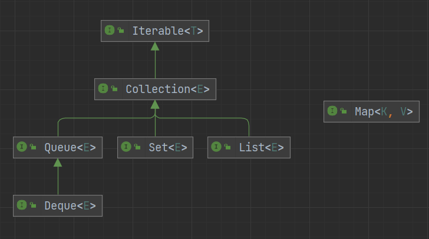

# 集合

Java 集合，也叫做容器，主要用于存储元素



集合主要分为 4 类，继承自 Collection 接口的 List、Set、Queue 与单独的 Map

- List：有序可重复
- Set：不重复，可以有序（TreeSet）可以无序（HashSet）
- Queue：有序可重复
- Map：key 不可重复，可以有序（TreeMap）可以无序（HashMap），value 可重复

> 常有人把 Set 与 Map 简单的归类为无序的集合，这是不严谨的

## Iterable

```java
public interface Iterable<T> {

    // 获取一个迭代器
    Iterator<T> iterator();

    // 遍历
    default void forEach(Consumer<? super T> action) {
        Objects.requireNonNull(action);
        for (T t : this) {
            action.accept(t);
        }
    }

    // 返回一个可分割的迭代器，并行遍历的迭代器
    default Spliterator<T> spliterator() {
        return Spliterators.spliteratorUnknownSize(iterator(), 0);
    }
}
```

## Collection

```java
public interface Collection<E> extends Iterable<E> {

    // 返回集合中的元素数量
    int size();

    // 集合是否为空
    boolean isEmpty();

    // 集合是否包含给定的元素
    boolean contains(Object o);

    // 获取一个迭代器
    Iterator<E> iterator();

    // 转数组
    Object[] toArray();

    // 转数组
    <T> T[] toArray(T[] a);

    // 添加
    boolean add(E e);

    // 删除
    boolean remove(Object o);

    // 判断是否包含给定的集合中的所有元素
    boolean containsAll(Collection<?> c);

    // 将给定的集合里的元素添加到集合中
    boolean addAll(Collection<? extends E> c);

    // 移除给定的集合中的所有元素
    boolean removeAll(Collection<?> c);

    // 移除满足条件的元素
    default boolean removeIf(Predicate<? super E> filter) {
        Objects.requireNonNull(filter);
        boolean removed = false;
        final Iterator<E> each = iterator();
        while (each.hasNext()) {
            if (filter.test(each.next())) {
                each.remove();
                removed = true;
            }
        }
        return removed;
    }

    // 从当前的集合中保留给定的集合中的元素
    boolean retainAll(Collection<?> c);

    // 清空
    void clear();

    // 判断两个集合是否相等
    boolean equals(Object o);

    // 获取当前集合的hashCode
    int hashCode();

    // 返回一个可分割的迭代器，并行遍历的迭代器
    @Override
    default Spliterator<E> spliterator() {
        return Spliterators.spliterator(this, 0);
    }

    // 获得一个流
    default Stream<E> stream() {
        return StreamSupport.stream(spliterator(), false);
    }

    // 获得一个并行流
    default Stream<E> parallelStream() {
        return StreamSupport.stream(spliterator(), true);
    }
}
```
