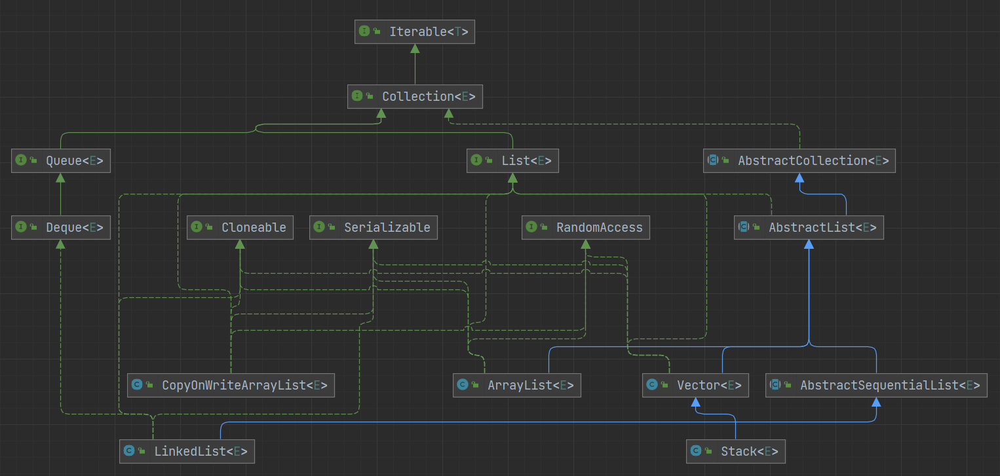

# List



```java
public interface List<E> extends Collection<E> {
    // 返回集合中的元素数量
    int size();

    // 集合是否为空
    boolean isEmpty();

    // 集合是否包含给定的元素
    boolean contains(Object o);

    // 获取一个迭代器
    Iterator<E> iterator();

    // 转数组
    Object[] toArray();

    // 转数组
    <T> T[] toArray(T[] a);

    // 添加
    boolean add(E e);

    // 删除
    boolean remove(Object o);

    // 判断是否包含给定的集合中的所有元素
    boolean containsAll(Collection<?> c);

    // 将给定的集合里的元素添加到集合中
    boolean addAll(Collection<? extends E> c);

    // 将给定的集合里的元素添加到集合中的指定位置后面
    boolean addAll(int index, Collection<? extends E> c);

    // 移除给定的集合中的所有元素
    boolean removeAll(Collection<?> c);

    // 从当前的集合中保留给定的集合中的元素
    boolean retainAll(Collection<?> c);

    // 遍历并替换元素
    default void replaceAll(UnaryOperator<E> operator) {
        Objects.requireNonNull(operator);
        final ListIterator<E> li = this.listIterator();
        while (li.hasNext()) {
            li.set(operator.apply(li.next()));
        }
    }

    // 排序
    @SuppressWarnings({"unchecked", "rawtypes"})
    default void sort(Comparator<? super E> c) {
        Object[] a = this.toArray();
        Arrays.sort(a, (Comparator) c);
        ListIterator<E> i = this.listIterator();
        for (Object e : a) {
            i.next();
            i.set((E) e);
        }
    }

    // 清空
    void clear();

    // 判断两个集合是否相等
    boolean equals(Object o);

    // 获取当前集合的hashCode
    int hashCode();

    // 根据下标获取元素
    E get(int index);

    // 根据下标修改元素
    E set(int index, E element);

    // 添加元素到指定位置
    void add(int index, E element);

    // 根据下标移除元素
    E remove(int index);

    // 正序查找，返回给定元素的第一次出现的下标
    int indexOf(Object o);

    // 倒序查找，返回给定元素的第一次出现的下标
    int lastIndexOf(Object o);

    // 获取一个迭代器
    ListIterator<E> listIterator();

    // 获取一个从给定下标开始的迭代器
    ListIterator<E> listIterator(int index);

    // 截取集合
    List<E> subList(int fromIndex, int toIndex);

    // 返回一个可分割的迭代器，并行遍历的迭代器
    @Override
    default Spliterator<E> spliterator() {
        return Spliterators.spliterator(this, Spliterator.ORDERED);
    }
}
```

## List 与数组

- List 创建时不需要指定大小，可以随着元素的增加进行 **动态扩容**；数组创建时必须要指定大小，并且创建完成后就无法改变长度了
- List 中只能存储对象，而数组既可以存对象也可以存基本数据类型
- ArrayList、Vector、CopyOnWriteList 内部也是由数组实现的
- 性能上，数组无可争议的更好

## ArrayList 与 LinkedList

| ArrayList | LinkedList |
| :-: | :-: |
| 数组 | 双向链表 |
| 可以指定初始化容量，并且当容量不足时会进行扩容 | 不支持初始化容量，也不需要扩容 |
| 支持快速随机访问 | 只支持顺序访问 |
| 数组一般不会填充完全，会有一些空间的浪费 | 每个元素存储时消耗的空间都更大 |

执行插入或删除操作时

- 头部
  - ArrayList 需要移动数组内的所有元素，`O(n)`
  - LinkedList 直接在头部进行操作，`O(1)`
- 尾部
  - ArrayList 不需要移动数组内的元素，`O(1)`，如果触发扩容，需进行 `O(n)` 的复制操作
  - LinkedList 直接在尾部进行操作，`O(1)`
- 中间
  - ArrayList 能立即找到位置，但需要移动数组内的部分元素，`O(n)`
  - LinkedList 需要遍历才能找到位置，`O(n)`

> 如果你拿不准主意，使用 ArrayList 准没错

## 线程安全的 List

- Vetcor：实现与 ArrayList 类似，只是里面方法都添加了 `synchronized` 关键字，进行同步
- CopyOnWriteArrayList：基于写时复制技术（COW），并使用了 ReentrantLock 来保证修改时的线程安全，适用于读多写少的场景
- SynchronizedList：位于 Collections 工具类中，可以通过 `Collections.synchronizedList` 方法将一个非线程安全的 List 包装为 SynchronizedList。内部也是通过 `synchronized` 关键字来保证线程安全，但与 Vetcor 不同的是，没有加在方法上面，而是在方法体里面，当然效果是差不多的

### 性能


<small>[Collections.synchronizedList 、CopyOnWriteArrayList、Vector介绍、源码浅析与性能对比](https://juejin.cn/post/6844904054745743367#heading-6)</small>

- Vetcor 实际上读写性能并不弱，只是遍历时的效率较低
- CopyOnWriteArrayList 读与遍历的性能非常好，但写操作效率就非常低了
- SynchronizedList 读写效率都挺高，遍历的效率略低
  - 注意 SynchronizedList 的中迭代器不是线程安全的，需要手动加锁

## 参考

- [Collections.synchronizedList 、CopyOnWriteArrayList、Vector介绍、源码浅析与性能对比](https://juejin.cn/post/6844904054745743367)
