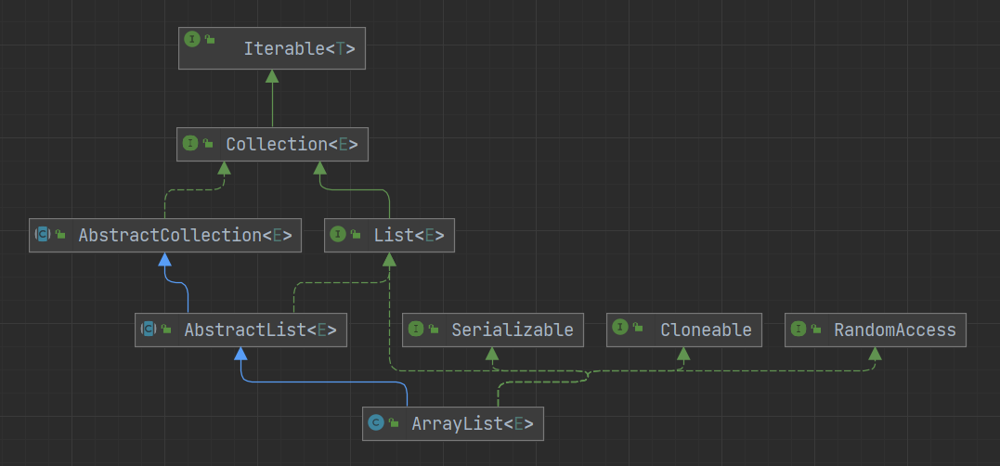

# ArrayList



## RandomAccess 接口

RandomAccess 是一个 **标志接口**，内部没有任何方法或者注解，被该接口标记的集合支持快速随机访问，可以以常数级的时间复杂度从集合中获取元素，并且使用普通 **for** 循环遍历的效率要高于使用迭代器遍历

> 以防有人不知道，增强 for 就是通过迭代器实现的

```java
public interface RandomAccess {
}
```

```java
public class ArrayTest {

    public static void main(String[] args) {
        int length = 100000;

        ArrayList<Integer> arrayList = new ArrayList<>(length);
        LinkedList<Integer> linkedList = new LinkedList<>();

        for (int i = 0; i < length; i++) {
            arrayList.add(0);
            linkedList.add(0);
        }

        long l1 = System.currentTimeMillis();
        for (int i = 0; i < arrayList.size(); i++) {
            arrayList.get(i);
        }
        long l2 = System.currentTimeMillis();
        for (int i = 0; i < linkedList.size(); i++) {
            linkedList.get(i);
        }
        long l3 = System.currentTimeMillis();

        System.out.println("ArrayList普通for循环：" + (l2 - l1));
        System.out.println("LinkedList普通for循环：" + (l3 - l2));

        l1 = System.currentTimeMillis();
        Iterator<Integer> arrayListLtr = arrayList.iterator();
        while (arrayListLtr.hasNext()) {
            arrayListLtr.next();
        }
        l2 = System.currentTimeMillis();
        Iterator<Integer> linkedListLtr = linkedList.iterator();
        while (linkedListLtr.hasNext()) {
            linkedListLtr.next();
        }
        l3 = System.currentTimeMillis();

        System.out.println("ArrayList迭代器：" + (l2 - l1));
        System.out.println("LinkedList迭代器：" + (l3 - l2));
    }
}
```

> ArrayList普通for循环：0
LinkedList普通for循环：2908
ArrayList迭代器：2
LinkedList迭代器：1

## 成员变量

```java
// 默认初始化容量
private static final int DEFAULT_CAPACITY = 10;

// 空数组
private static final Object[] EMPTY_ELEMENTDATA = {};

// 空数组，与EMPTY_ELEMENTDATA区别开来，实行不同的扩容策略
private static final Object[] DEFAULTCAPACITY_EMPTY_ELEMENTDATA = {};

// 实际存放数据的数组
transient Object[] elementData;

// 元素数量
private int size;

// 最大容量
private static final int MAX_ARRAY_SIZE = Integer.MAX_VALUE - 8;
```

### 最大容量

`MAX_ARRAY_SIZE` 实际并不是 ArrayList 的最大容量，可以从扩容的相关方法看出 ArrayList 的最大容量其实是 **`Integer.MAX_VALUE`**

之所以会设置 `MAX_ARRAY_SIZE = Integer.MAX_VALUE - 8`，是因为有些虚拟机可能会在数组中保留一些 header 信息，分配更大的容量可能会导致 OOM

> 当然实际使用的情况，可能设置的容量远没有达到 MAX_ARRAY_SIZE 就出现 OOM 或者卡死，所以尽量不要用 ArrayList 存储数量过于庞大的元素

### modCount

在 ArrayList 的父类 AbstractList 中还有个 `modCount` 变量，用来记录该集合的结构的修改次数，只要执行了能够 **修改集合容量的操作**，`modCount` 都会自增，如执行 `add`、`remove`、`clear` 等操作 `modCount` 都会进行自增，但执行 `set`、`get` 等操作 `modCount` 就不会自增，因为集合的容量没有改变

```java
protected transient int modCount = 0;
```

ArrayList 是线程不安全的，意味着当你使用迭代器遍历一个集合的时候，同时也有可能有另一个线程再往里添加数据。所以 ArrayList 使用了 **fail-fast** 策略，来确保使用迭代器遍历集合，如果有其他线程在做修改能够及时感知

- fail-fast（快速失败）：一旦检测到可能发生错误，就立马抛出异常，程序不继续往下执行
- fail-safe（安全失败）：即便系统发生故障，也不会立即停止执行，通过隐藏错误来继续执行
  - 一般通过写时复制实现

在使用迭代器的时候，首先获取该集合的 `modCount`，存入自己的 `expectedModCount` 中，每次获取元素时，都判断一下自己的 `expectedModCount` 是否等于当前的 `modCount`，如果不一致则说明集合被人修改了，则抛出 ConcurrentModificationException 异常

> 其实就是乐观锁

```java
public class ArrayList<E> extends AbstractList<E>
        implements List<E>, RandomAccess, Cloneable, java.io.Serializable
{
    
    public Iterator<E> iterator() {
        return new Itr();
    }

    private class Itr implements Iterator<E> {
        int cursor;       // index of next element to return
        int lastRet = -1; // index of last element returned; -1 if no such
        // 获取迭代器时为 expectedModCount 赋上当前的 modCount
        int expectedModCount = modCount;

        Itr() {}

        public boolean hasNext() {
            return cursor != size;
        }

        @SuppressWarnings("unchecked")
        public E next() {
            // 检查当前的 modCount
            checkForComodification();
            int i = cursor;
            if (i >= size)
                throw new NoSuchElementException();
            Object[] elementData = ArrayList.this.elementData;
            if (i >= elementData.length)
                throw new ConcurrentModificationException();
            cursor = i + 1;
            return (E) elementData[lastRet = i];
        }

        public void remove() {
            if (lastRet < 0)
                throw new IllegalStateException();
            // 检查当前的 modCount
            checkForComodification();

            try {
                ArrayList.this.remove(lastRet);
                cursor = lastRet;
                lastRet = -1;
                expectedModCount = modCount;
            } catch (IndexOutOfBoundsException ex) {
                throw new ConcurrentModificationException();
            }
        }

        @Override
        @SuppressWarnings("unchecked")
        public void forEachRemaining(Consumer<? super E> consumer) {
            Objects.requireNonNull(consumer);
            final int size = ArrayList.this.size;
            int i = cursor;
            if (i >= size) {
                return;
            }
            final Object[] elementData = ArrayList.this.elementData;
            if (i >= elementData.length) {
                throw new ConcurrentModificationException();
            }
            while (i != size && modCount == expectedModCount) {
                consumer.accept((E) elementData[i++]);
            }
            // update once at end of iteration to reduce heap write traffic
            cursor = i;
            lastRet = i - 1;
            checkForComodification();
        }

        // 检查当前的 modCount 是否等于 expectedModCount
        final void checkForComodification() {
            if (modCount != expectedModCount)
                throw new ConcurrentModificationException();
        }
    }

    ...
        
}
```

```java
public class Test {

    public static void main(String[] args) throws InterruptedException {
        List<String> list = new ArrayList<>();
        list.add("one");

        // 增强 for 循环报错
        new Thread(() -> {
            for (String s : list) {
                try {
                    Thread.sleep(1000);
                    System.out.println(s);
                } catch (InterruptedException e) {
                    throw new RuntimeException(e);
                }
            }
        }).start();

        // 迭代器报错
        new Thread(() -> {
            Iterator<String> iterator = list.iterator();
            while (iterator.hasNext()) {
                try {
                    Thread.sleep(1000);
                    System.out.println(iterator.next());
                } catch (InterruptedException e) {
                    throw new RuntimeException(e);
                }
            }
        }).start();

        // forEach 方法报错
        new Thread(() -> {
            list.forEach(e -> {
                try {
                    Thread.sleep(1000);
                } catch (InterruptedException ex) {
                    throw new RuntimeException(ex);
                }
                System.out.println(e);
            });
        }).start();

        // 普通 for 循环正常执行
        new Thread(() -> {
            for (int i = 0; i < list.size(); i++) {
                try {
                    Thread.sleep(1000);
                } catch (InterruptedException e) {
                    throw new RuntimeException(e);
                }
                System.out.println(list.get(i));
            }
        }).start();

        Thread.sleep(100);

        new Thread(() -> {
            list.add("two");
        }).start();
    }
}
```

增强 for 循环也是借助迭代器进行遍历的，`forEach` 方法内部也有 `expectedModCount` 与 `modCount` 判断，所以他们都会报错，普通的 for 循环是可以正常执行的

多说一句，如果需要在遍历的时候同时删除元素，可以使用迭代器的 `remove` 方法或者普通的 for 循环

```java
List<String> list = new ArrayList<>();
list.add("one");
list.add("two");

Iterator<String> iterator = list.iterator();
while (iterator.hasNext()) {
    iterator.remove();
}
```

```java
List<String> list = new ArrayList<>();
list.add("one");
list.add("two");

// 从后往前删除
for (int i = list.size() - 1; i >= 0; i--) {
    list.remove(i);
}

// 如果使用正序，执行删除后，集合中的数组会进行前移，所以下一个元素的下标仍是当前的下标
for (int i = 0; i < list.size(); i++) {
    list.remove(i);
    i--;
}
```

## 构造方法

```java
// 创建空数组，指向 DEFAULTCAPACITY_EMPTY_ELEMENTDATA
public ArrayList() {
    this.elementData = DEFAULTCAPACITY_EMPTY_ELEMENTDATA;
}

// 创建指定大小的数组，如果给定的容量为 0，则指向 EMPTY_ELEMENTDATA
public ArrayList(int initialCapacity) {
    if (initialCapacity > 0) {
        this.elementData = new Object[initialCapacity];
    } else if (initialCapacity == 0) {
        this.elementData = EMPTY_ELEMENTDATA;
    } else {
        throw new IllegalArgumentException("Illegal Capacity: "+
                                            initialCapacity);
    }
}

// 将给定的集合复制到新数组中
public ArrayList(Collection<? extends E> c) {
    elementData = c.toArray();
    if ((size = elementData.length) != 0) {
        // c.toArray might (incorrectly) not return Object[] (see 6260652)
        if (elementData.getClass() != Object[].class)
            elementData = Arrays.copyOf(elementData, size, Object[].class);
    } else {
        // 如果给定的集合容量为 0，则指向 EMPTY_ELEMENTDATA
        // replace with empty array.
        this.elementData = EMPTY_ELEMENTDATA;
    }
}
```

### `new ArrayList<>(0)` 与 `new ArrayList<>()`

```java
public class Test {

    public static void main(String[] args) throws NoSuchFieldException, IllegalAccessException {
        Field field = ArrayList.class.getDeclaredField("elementData");
        field.setAccessible(true);

        ArrayList[] arr = {
                new ArrayList<>(0),
                new ArrayList<>(),
                new ArrayList<>(0),
                new ArrayList<>()
        };

        for (ArrayList arrayList : arr) {
            Object elementData = field.get(arrayList);
            System.out.println("当前数组长度：" + ((Object[]) elementData).length + " - 数组：" + elementData);
        }

        int times = 11;

        int shift = 16;
        int unit = (1 << shift);
        int mask = (1 << shift) - 1;

        int[] lengthArr = new int[arr.length];

        for (int i = 0; i < times; i++) {
            for (int j = 0; j < arr.length; j++) {
                ArrayList list = arr[j];
                list.add("one");

                if (j == 0) {
                    System.out.println("-------------------------------------添加第 " + (i + 1) + " 个元素");
                }

                Object elementData = field.get(list);

                int current;

                lengthArr[j] = ((current = ((Object[]) elementData).length - (lengthArr[j] & mask)) == 0) ? lengthArr[j] : (lengthArr[j] + unit + current);
                System.out.println("数组：" + elementData + " - 扩容次数：" + (lengthArr[j] >>> shift) + " - 当前数组长度：" + (lengthArr[j] & mask));
            }
        }
    }
}
```

从构造方法中可以看出 `new ArrayList<>(0)` 与 `new ArrayList<>()` 指向的空数组是不同

- 所有的 `new ArrayList<>(0)` 指向的都是 `EMPTY_ELEMENTDATA`
- 所有的 `new ArrayList<>()` 指向的都是 `DEFAULTCAPACITY_EMPTY_ELEMENTDATA`

当向列表中插入 11 个元素时

- `new ArrayList<>(0)` 需要扩容 7 次，容量依次为 0、1、2、3、4、6、9、13
- `new ArrayList<>()` 只需扩容 2 次，容量依次为 0、10、15

`new ArrayList<>(0)` 与 `new ArrayList<>()` 都是按照 1.5 倍的容量进行扩容的，不同的是 `new ArrayList<>(0)` 从 1 开始，`new ArrayList<>()` 从 10 开始

`new ArrayList<>(0)` 适用于一些需要创建集合，但不需要立即填充数据的场景，即便填充了数据，扩容也是从 1 开始的，容量的增长较为缓慢，从上面的结论可以看出 `new ArrayList<>(0)` 增长的容量更贴近实际所需的容量，空间利用率更大，当然缺点就是扩容的次数相对较多

实际开发中建议创建 ArrayList 时根据所需的大小指定一个确定的容量大小，以防元素数量过多，频繁扩容，或者元素过少，浪费空间

## 添加

```java
public boolean add(E e) {
    // 先判断是否需要扩容
    ensureCapacityInternal(size + 1);  // Increments modCount!!
    elementData[size++] = e;
    return true;
}

// 添加元素到指定位置
public void add(int index, E element) {
    rangeCheckForAdd(index);

    // 先判断是否需要扩容
    ensureCapacityInternal(size + 1);  // Increments modCount!!
    // 从指定位置开始，所有的元素后移一位，空出位置，以便插入
    System.arraycopy(elementData, index, elementData, index + 1,
                        size - index);
    elementData[index] = element;
    size++;
}
```

### System.arraycopy、Arrays.copyOf、Arrays.copyOfRange

```java
// src：源数组
// srcPos：源数组开始位置
// dest：目标数组
// destPos：目标数组开始位置
// length：需复制的数组的长度
public static native void arraycopy(Object src,  int  srcPos,
                                    Object dest, int destPos,
                                    int length);
```

```java
// original：源数组
// newLength：新数组的长度
// 返回完成复制后的新数组
public static <T> T[] copyOf(T[] original, int newLength) {
    return (T[]) copyOf(original, newLength, original.getClass());
}

// original：源数组
// newLength：新数组的长度
// newType：新数组的类型
// 返回完成复制后的新数组
public static <T,U> T[] copyOf(U[] original, int newLength, Class<? extends T[]> newType) {
    // 先创建数组
    @SuppressWarnings("unchecked")
    T[] copy = ((Object)newType == (Object)Object[].class)
        ? (T[]) new Object[newLength]
        : (T[]) Array.newInstance(newType.getComponentType(), newLength);
    // 调用System里的arraycopy方法
    System.arraycopy(original, 0, copy, 0,
                        Math.min(original.length, newLength));
    return copy;
}
```

```java
// original：源数组
// from：源数组开始位置（包括）
// to：源数组结束位置（不包括）
// 返回完成复制后的新数组
public static <T> T[] copyOfRange(T[] original, int from, int to) {
    return copyOfRange(original, from, to, (Class<? extends T[]>) original.getClass());
}

// original：源数组
// from：源数组开始位置（包括）
// to：源数组结束位置（不包括）
// newType：新数组的类型
// 返回完成复制后的新数组
public static <T,U> T[] copyOfRange(U[] original, int from, int to, Class<? extends T[]> newType) {
    // 计算新数组的长度
    int newLength = to - from;
    if (newLength < 0)
        throw new IllegalArgumentException(from + " > " + to);
    // 创建新数组
    @SuppressWarnings("unchecked")
    T[] copy = ((Object)newType == (Object)Object[].class)
        ? (T[]) new Object[newLength]
        : (T[]) Array.newInstance(newType.getComponentType(), newLength);
    // 调用System里的arraycopy方法
    // 源数组的长度减源数组开始位置，就是所需复制的元素的数量
    System.arraycopy(original, from, copy, 0,
                        Math.min(original.length - from, newLength));
    return copy;
}
```

- `System.arraycopy` 是个静态的 **本地方法**，`Arrays.copyOf`、`Arrays.copyOfRange` 都是普通的静态方法，在其内部中调用的也是 `System.arraycopy` 方法
- `System.arraycopy` 如果需要新的目标数组需要提前创建好，`Arrays.copyOf`、`Arrays.copyOfRange` 不需要关心新数组的创建
- `System.arraycopy` 源数组和目标数组可以是同一个数组，对数组内的元素进行移动，`Arrays.copyOf`、`Arrays.copyOfRange` 目标数组都是新数组
- `System.arraycopy` 需要关心需要复制的长度，`Arrays.copyOf`、`Arrays.copyOfRange` 会根据起止下标计算需要复制的长度
- `System.arraycopy` 更灵活，可以在目标数组的任意位置开始复制任意数量的元素，`Arrays.copyOf`、`Arrays.copyOfRange` 只能从新数组的开始位置进行复制
- `Arrays.copyOf`、`Arrays.copyOfRange` 更方便，如果满足不了需求，可以使用 `System.arraycopy`

## 添加集合

```java
public boolean addAll(Collection<? extends E> c) {
    Object[] a = c.toArray();
    int numNew = a.length;
    // 先判断是否需要扩容
    ensureCapacityInternal(size + numNew);  // Increments modCount
    System.arraycopy(a, 0, elementData, size, numNew);
    size += numNew;
    return numNew != 0;
}

public boolean addAll(int index, Collection<? extends E> c) {
    rangeCheckForAdd(index);

    Object[] a = c.toArray();
    int numNew = a.length;
    // 先判断是否需要扩容
    ensureCapacityInternal(size + numNew);  // Increments modCount

    // 计算需要移动的元素的数量
    int numMoved = size - index;
    // 数组内从index开始的元素向后移numNew位
    if (numMoved > 0)
        System.arraycopy(elementData, index, elementData, index + numNew,
                            numMoved);

    System.arraycopy(a, 0, elementData, index, numNew);
    size += numNew;
    return numNew != 0;
}
```

## 扩容

```java
// 传入所需的最小的容量
private void ensureCapacityInternal(int minCapacity) {
    ensureExplicitCapacity(calculateCapacity(elementData, minCapacity));
}

private static int calculateCapacity(Object[] elementData, int minCapacity) {
    // 如果数组指向 DEFAULTCAPACITY_EMPTY_ELEMENTDATA 空数组，则取默认容量和所需最小容量中的最大值，即至少容量为 10
    if (elementData == DEFAULTCAPACITY_EMPTY_ELEMENTDATA) {
        return Math.max(DEFAULT_CAPACITY, minCapacity);
    }
    return minCapacity;
}

private void ensureExplicitCapacity(int minCapacity) {
    modCount++;

    // 当所需的容量大于已有的容量才会扩容
    if (minCapacity - elementData.length > 0)
        grow(minCapacity);
}

private void grow(int minCapacity) {
    // overflow-conscious code
    int oldCapacity = elementData.length;
    // oldCapacity + oldCapacity / 2，即1.5倍
    int newCapacity = oldCapacity + (oldCapacity >> 1);
    // 如果扩容后的容量仍小于所需容量，就直接使用所需容量
    if (newCapacity - minCapacity < 0)
        newCapacity = minCapacity;
    // 如果扩容后的容量大于最大容量
    if (newCapacity - MAX_ARRAY_SIZE > 0)
        newCapacity = hugeCapacity(minCapacity);
    // minCapacity is usually close to size, so this is a win:
    elementData = Arrays.copyOf(elementData, newCapacity);
}

private static int hugeCapacity(int minCapacity) {
    // 溢出
    if (minCapacity < 0) // overflow
        throw new OutOfMemoryError();
    // 从这可以看出 ArrayList 的最大容量其实是 Integer.MAX_VALUE
    return (minCapacity > MAX_ARRAY_SIZE) ?
        Integer.MAX_VALUE :
        MAX_ARRAY_SIZE;
}
```

除了私有的扩容方法，ArrayList 中还有一个公共的扩容方法。如果认为即将执行的操作会让 ArrayList 频繁扩容，可以使用该方法，一次性扩容到所需的容量

```java
public void ensureCapacity(int minCapacity) {
    int minExpand = (elementData != DEFAULTCAPACITY_EMPTY_ELEMENTDATA)
        // any size if not default element table
        ? 0
        // larger than default for default empty table. It's already
        // supposed to be at default size.
        : DEFAULT_CAPACITY;

    if (minCapacity > minExpand) {
        ensureExplicitCapacity(minCapacity);
    }
}
```

## 获取

```java
public E get(int index) {
    // 检查下标是否合法
    rangeCheck(index);

    return elementData(index);
}

E elementData(int index) {
    return (E) elementData[index];
}
```

## 删除

删除指定下标位置的元素，并返回该元素

```java
public E remove(int index) {
    rangeCheck(index);

    modCount++;
    E oldValue = elementData(index);

    // 计算需要移动的元素的个数
    int numMoved = size - index - 1;
    // 数组内 index 后的所有元素向前移 1 位
    if (numMoved > 0)
        System.arraycopy(elementData, index+1, elementData, index,
                            numMoved);
    elementData[--size] = null; // clear to let GC do its work

    return oldValue;
}
```

查找并删除给定的元素

```java
// 先查找到给定元素的下标位置
public boolean remove(Object o) {
    if (o == null) {
        for (int index = 0; index < size; index++)
            if (elementData[index] == null) {
                fastRemove(index);
                return true;
            }
    } else {
        for (int index = 0; index < size; index++)
            if (o.equals(elementData[index])) {
                fastRemove(index);
                return true;
            }
    }
    return false;
}

// 数组内 index 后所有的元素向前移 1 位
private void fastRemove(int index) {
    modCount++;
    int numMoved = size - index - 1;
    if (numMoved > 0)
        System.arraycopy(elementData, index+1, elementData, index,
                            numMoved);
    elementData[--size] = null; // clear to let GC do its work
}
```

> 不要在数据量特别大的集合上使用删除方法，或者说最好不要出现数据量过大的集合

## 修改

将指定下标的元素替换为给定的元素，并返回旧元素

```java
public E set(int index, E element) {
    rangeCheck(index);

    // 替换
    E oldValue = elementData(index);
    elementData[index] = element;
    return oldValue;
}
```

## 清空

清空集合中的元素，但数组仍维持原来的大小

```java
public void clear() {
    modCount++;

    // clear to let GC do its work
    for (int i = 0; i < size; i++)
        elementData[i] = null;

    size = 0;
}
```

## 查找

```java
public boolean contains(Object o) {
    // 内部调用 indexOf 方法
    return indexOf(o) >= 0;
}

// 正序查找，返回给定元素的第一次出现的下标，如果不存在返回 -1
public int indexOf(Object o) {
    if (o == null) {
        for (int i = 0; i < size; i++)
            if (elementData[i]==null)
                return i;
    } else {
        for (int i = 0; i < size; i++)
            if (o.equals(elementData[i]))
                return i;
    }
    return -1;
}

// 倒序查找，返回给定元素的第一次出现的下标，如果不存在返回 -1
public int lastIndexOf(Object o) {
    if (o == null) {
        for (int i = size-1; i >= 0; i--)
            if (elementData[i]==null)
                return i;
    } else {
        for (int i = size-1; i >= 0; i--)
            if (o.equals(elementData[i]))
                return i;
    }
    return -1;
}
```

## 修剪

将数组的大小缩减到实际存储元素数量

```java
public void trimToSize() {
    modCount++;
    if (size < elementData.length) {
        elementData = (size == 0)
            ? EMPTY_ELEMENTDATA
            : Arrays.copyOf(elementData, size);
    }
}
```

```java
public class Test {

    public static void main(String[] args) throws NoSuchFieldException, IllegalAccessException {

        ArrayList<String> list = new ArrayList<>();
        list.add("one");
        list.add("two");

        Field field = ArrayList.class.getDeclaredField("elementData");
        field.setAccessible(true);

        Object[] arr = (Object[]) field.get(list);
        System.out.println(arr.length);

        list.trimToSize();

        arr = (Object[]) field.get(list);
        System.out.println(arr.length);
    }
}
```

> 10
> 2

## 移除或保留

```java
// 从当前的集合中移除给定的集合中的元素
public boolean removeAll(Collection<?> c) {
    Objects.requireNonNull(c);
    return batchRemove(c, false);
}

// 从当前的集合中保留给定的集合中的元素
public boolean retainAll(Collection<?> c) {
    Objects.requireNonNull(c);
    return batchRemove(c, true);
}

private boolean batchRemove(Collection<?> c, boolean complement) {
    final Object[] elementData = this.elementData;
    // 创建两个指针，r 读指针，w 写指针
    int r = 0, w = 0;
    boolean modified = false;
    try {
        // 遍历数组中的元素
        for (; r < size; r++)
            // 如果 complement 为 true，且给定的集合中包含该元素，则将该元素移动到数组头部，依次追加
            // 如果 complement 为 false，且给定的集合中不包含该元素，则将该元素移动到数组头部，依次追加
            // 经过此步操作，w 下标后面的元素就都是需要抛弃的
            if (c.contains(elementData[r]) == complement)
                elementData[w++] = elementData[r];
    } finally {
        // 如果 r!=size，说明上面遍历的时候出现了异常
        if (r != size) {
            // 把没有读过的元素移动到写指针后面
            System.arraycopy(elementData, r,
                                elementData, w,
                                size - r);
            w += size - r;
        }
        // 如果 w==size，说明数组不需要做修改
        if (w != size) {
            // clear to let GC do its work
            for (int i = w; i < size; i++)
                elementData[i] = null;
            modCount += size - w;
            size = w;
            modified = true;
        }
    }
    return modified;
}
```

## 截取

```java
public List<E> subList(int fromIndex, int toIndex) {
    // 检查下标是否合法
    subListRangeCheck(fromIndex, toIndex, size);
    return new SubList(this, 0, fromIndex, toIndex);
}
```

```java
private class SubList extends AbstractList<E> implements RandomAccess {
    private final AbstractList<E> parent;
    private final int parentOffset;
    private final int offset;
    int size;

    SubList(AbstractList<E> parent,
            int offset, int fromIndex, int toIndex) {
        this.parent = parent;
        this.parentOffset = fromIndex;
        this.offset = offset + fromIndex;
        this.size = toIndex - fromIndex;
        this.modCount = ArrayList.this.modCount;
    }
}
```

注意截取的列表并不是一个 ArrayList 类型的列表，而是 SubList 类型的，SubList 是 ArrayList 的内部类。SubList 使用的数组也就是被截取的列表的数组，也就是说对 ArrayList 或 SubList 中的元素进行修改，在两者之中都会体现出来

```java
public class Test {

    public static void main(String[] args) {

        ArrayList<Integer> list = new ArrayList<>(10);

        for (int i = 0; i < 10; i++) {
            list.add(i);
        }

        System.out.println(list);

        List<Integer> subList = list.subList(5, 10);

        System.out.println(subList);

        subList.set(1, 999);
        list.set(7, 666);
        subList.add(9999999);

        System.out.println(list);
        System.out.println(subList);
    }
}
```

> [0, 1, 2, 3, 4, 5, 6, 7, 8, 9]
[5, 6, 7, 8, 9]
[0, 1, 2, 3, 4, 5, 999, 666, 8, 9, 9999999]
[5, 999, 666, 8, 9, 9999999]

## 序列化与反序列化

ArrayList 中的 `elementData` 是被 `transient` 修饰的，所以 ArrayList 序列化的时候并不是直接将 `elementData` 进行序列化的，而是将 `elementData` 中的元素依次写入到流中，这样就是以实际存储的元素进行序列化，而不是根据数组的长度进行序列化，减少空间的占用

```java
private void writeObject(java.io.ObjectOutputStream s)
    throws java.io.IOException{
    // Write out element count, and any hidden stuff
    int expectedModCount = modCount;
    s.defaultWriteObject();

    // Write out size as capacity for behavioural compatibility with clone()
    s.writeInt(size);

    // Write out all elements in the proper order.
    for (int i=0; i<size; i++) {
        s.writeObject(elementData[i]);
    }

    if (modCount != expectedModCount) {
        throw new ConcurrentModificationException();
    }
}

private void readObject(java.io.ObjectInputStream s)
    throws java.io.IOException, ClassNotFoundException {
    elementData = EMPTY_ELEMENTDATA;

    // Read in size, and any hidden stuff
    s.defaultReadObject();

    // Read in capacity
    s.readInt(); // ignored

    if (size > 0) {
        // be like clone(), allocate array based upon size not capacity
        int capacity = calculateCapacity(elementData, size);
        SharedSecrets.getJavaOISAccess().checkArray(s, Object[].class, capacity);
        ensureCapacityInternal(size);

        Object[] a = elementData;
        // Read in all elements in the proper order.
        for (int i=0; i<size; i++) {
            a[i] = s.readObject();
        }
    }
}
```

## 多线程环境下可能会出现的问题

ArrayList 不是线程安全的，只建议在单线程环境下使用，在多线程环境下建议使用 Vetcor、CopyOnWriteArrayList、SynchronizedList

### ConcurrentModificationException

多线程环境下，一个线程正在使用迭代器进行遍历，其他线程对集合的结构体进行了更改，例如添加或删除，就会抛出 ConcurrentModificationException 异常

### 数组下标越界

```java
public boolean add(E e) {
    ensureCapacityInternal(size + 1);
    // 可能抛出数组下标越界异常
    elementData[size++] = e;
    return true;
}
```

例如当前集合的容量为 10，并且已经添加了 9 个元素，线程 A 与线程 B 都执行到了 `ensureCapacityInternal(size + 1);`，他们这时获取到的 `size` 都为 9，`size + 1 = 9 + 1 = 10`，没有超过容量，所以线程 A 与线程 B 都认为不需要扩容

假如线程 A 先执行了 `elementData[size++] = e;`，执行完后，`size` 变成了 10，这时问题还没有展现出来

线程 B 再执行 `elementData[size++] = e;`，由于没有触发扩容方法，所以容量仍为 10，即最大下标为 9，此时的 `size` 已变成了 10，超过了数组的最大下标，也就抛出了 ArrayIndexOutOfBoundsException

### 出现 `null` 值或添加完成后的元素数量小于期望的数量

```java
public class Test {

    static int num = 10;
    static int thread_num = 2;

    static ArrayList<Integer> list = new ArrayList<>();

    static class Th extends Thread {
        @Override
        public void run() {
            for (int i = 0; i < num; i++) {
                list.add(i);
            }
        }
    }

    public static void main(String[] args) throws InterruptedException {
        Thread[] arr = new Thread[thread_num];

        for (int i = 0; i < arr.length; i++) {
            arr[i] = new Thread(new Th(), "线程" + (i + 1));
        }

        Thread.sleep(50);

        for (Thread thread : arr) {
            thread.start();
        }

        for (Thread thread : arr) {
            thread.join();
        }

        System.out.println(list);
        System.out.println(list.size());
    }
}
```

上面的代码执行后可能会有 3 种结果

1. 正确的添加 20 个元素，没有出现异常，没有出现 null 值
2. 添加过程中，一个线程抛出了 ArrayIndexOutOfBoundsException，原因看上面
3. 添加过程中，没有出现异常，但出现了 null 值，或者某个元素只被添加了 1 次

> [0, 1, 1, 2, 2, 3, 3, 4, 4, 5, null, 6, 6, 7, 8, null, 9, 9]
> 18

第 3 种情况的问题也在 `elementData[size++] = e;`，该行代码其实分为两步

1. `elementData[size] = e`
2. `size++`

假如线程 A 将 `elementData[0]` 赋为 0，`size` 还未自增，线程 B 这时看到的 `size` 依旧还是 0，所以线程 B 也将 `elementData[0]` 赋为 0，所以就出现了 **重复赋值** 的情况，某一个线程的更新丢失

这时还有两个 `size++` 等待执行

- 两个线程初始看到的 `size` 都是 0，分别进行自增并赋值，所以最终的 `size` 为 1
  - 后面的元素会从 `elementData[1]` 开始赋值
- 一个线程的 `size++` 执行完，此时 `size` 为 1，另一个线程读取到自增后的值，再执行 `size++`，所以最终的 `size` 为 2
  - 后面的元素会从 `elementData[2]` 开始赋值，意味着 `elementData[1]` 就没人使用了，所以该位置最后就为 `null`

出现 `null` 还有一种情况，是在扩容的时候

```java
public boolean add(E e) {
    // 先判断是否需要扩容
    ensureCapacityInternal(size + 1);  // Increments modCount!!
    elementData[size++] = e;
    return true;
}

private void grow(int minCapacity) {
    // overflow-conscious code
    int oldCapacity = elementData.length;
    int newCapacity = oldCapacity + (oldCapacity >> 1);
    if (newCapacity - minCapacity < 0)
        newCapacity = minCapacity;
    if (newCapacity - MAX_ARRAY_SIZE > 0)
        newCapacity = hugeCapacity(minCapacity);
    
    // 创建新数组，并将旧数组的元素复制到新数组中，再将当前存储元素的数组指向新数组
    elementData = Arrays.copyOf(elementData, newCapacity);
}
```

假如当前的 `size` 为 10，线程 A 和线程 B 都触发了扩容方法，两者都执行到了 `Arrays.copyOf(elementData, newCapacity)`，线程 A 先执行完，将 `elementData` 指向扩容后的新数组，然后执行 `elementData[size++] = e` 添加元素，为下标为 10 的位置赋上了值，并且 `size` 自增为了 11

之后线程 B 开始执行，又将 `elementData` 指向了自己创建的新数组，这样线程 A 添加的元素就丢失了。线程 B 继续执行到 `elementData[size++] = e`，此时的 `size` 已经经过了线程 A 中的自增操作，所以线程 B 会在下标为 11 的位置添加元素，这样下标为 10 的位置就被跳过了，也就出现了 `null`

总结就是，多个线程同时触发扩容操作时，可能会出现 `elementData` 被覆盖的情况，导致之前线程添加的元素丢失，但 `size` 的自增操作不会丢失，所以也就会出现某些位置为 `null` 的情况

## 参考

- [RandomAccess接口](https://www.cnblogs.com/dwlovelife/p/14056554.html)
- [Advantages of creating an ArrayList with initial capacity of 0?](https://stackoverflow.com/questions/28345520/advantages-of-creating-an-arraylist-with-initial-capacity-of-0)
- [死磕 java集合之ArrayList源码分析](https://www.cnblogs.com/tong-yuan/p/10638855.html)
- [什么是fail-fast](https://www.cnblogs.com/54chensongxia/p/12470446.html)
- [一文彻底弄懂fail-fast、fail-safe机制（带你撸源码）](https://juejin.cn/post/6879291161274482695#heading-4)
- [ArryList线程安全问题以及解决方案](https://blog.csdn.net/weixin_38860401/article/details/133176597)
- [What are fail-safe & fail-fast Iterators in Java](https://stackoverflow.com/questions/17377407/what-are-fail-safe-fail-fast-iterators-in-java)
