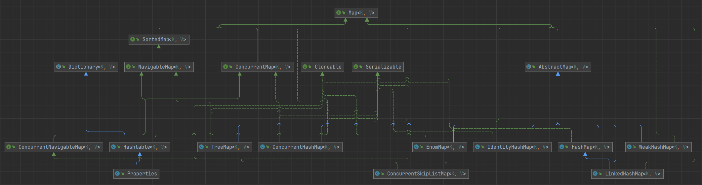

# Map



```java
public interface Map<K,V> {

    // 元素数量
    int size();

    // 集合是否为空
    boolean isEmpty();

    // 是否包含给定的 key
    boolean containsKey(Object key);

    // 是否包含给定的 value
    boolean containsValue(Object value);

    // 根据 key 获取 value
    V get(Object key);

    // 添加一个键值对
    V put(K key, V value);

    // 移除一个键值对
    V remove(Object key);

    // 将给定的集合里的元素添加到集合中
    void putAll(Map<? extends K, ? extends V> m);

    // 清空
    void clear();

    // 返回 key 的集合
    Set<K> keySet();

    // 返回 value 的集合
    Collection<V> values();

    // 返回节点的集合
    Set<Map.Entry<K, V>> entrySet();

    // Map 中的节点都直接或间接的实现该接口
    interface Entry<K,V> {
        ...
    }

    // 判断两个集合是否相等
    boolean equals(Object o);

    // 获取当前集合的 hashCode
    int hashCode();
}
```

## LinkedHashMap

LinkedHashMap 继承自 HashMap，是一个有序的 Map，可以按照添加顺序，也可以按照访问顺序

```java
public class Test {

    public static void main(String[] args) {
        put(new HashMap<>());
        // 添加顺序
        put(new LinkedHashMap<>());
        // 访问顺序，将 accessOrder 置为 true
        put(new LinkedHashMap<>(16, 0.75f, true));
    }

    static void put(Map<String, String> map) {
        map.put("one", "one");
        map.put("two", "two");
        map.put("three", "three");
        map.put("four", "four");
        map.put("five", "five");
        map.put("six", "six");
        map.put("seven", "seven");
        map.put("eight", "eight");
        map.put("nine", "nine");
        map.put("ten", "ten");

        map.get("one");
        map.get("two");

        System.out.println(map.keySet());
    }
}
```

> [nine, six, four, one, seven, ten, two, three, five, eight]
> [one, two, three, four, five, six, seven, eight, nine, ten]
> [three, four, five, six, seven, eight, nine, ten, one, two]

通过结果可以看出，LinkedHashMap 以什么顺序添加元素，就以什么顺序输出。而访问顺序是指会将获取过的元素移动到尾部，所以可以作为 LRU（Least Recently Used，最近最少使用） 的一种实现

### 实现

LinkedHashMap 通过在内部维护了一个 **双向链表**，来实现有序性

LinkedHashMap 的 `put` 方法就直接使用的 HashMap 的 `put` 方法，但在创建节点时，调用的是自己重写的方法

```java
Node<K,V> newNode(int hash, K key, V value, Node<K,V> e) {
    LinkedHashMap.Entry<K,V> p =
        new LinkedHashMap.Entry<K,V>(hash, key, value, e);
    linkNodeLast(p);
    return p;
}
```

Entry 节点继承自 `HashMap.Node`，并且多维护 `before`、`after` 两个变量，表示前驱节点和后继节点

```java
static class Entry<K,V> extends HashMap.Node<K,V> {
    Entry<K,V> before, after;
    Entry(int hash, K key, V value, Node<K,V> next) {
        super(hash, key, value, next);
    }
}
```


<small>[Java集合框架源码剖析：LinkedHashSet 和 LinkedHashMap](https://www.cnblogs.com/CarpenterLee/p/5541111.html)</small>

在 HashMap 中有 3 个空方法就是专门留给 LinkedHashMap 来实现的

```java
void afterNodeRemoval(Node<K,V> p) { }
void afterNodeInsertion(boolean evict) { }
void afterNodeAccess(Node<K,V> p) { }
```

```java
// 删除元素后
void afterNodeRemoval(Node<K,V> e) { // unlink
    LinkedHashMap.Entry<K,V> p =
        (LinkedHashMap.Entry<K,V>)e, b = p.before, a = p.after;
    p.before = p.after = null;
    if (b == null)
        head = a;
    else
        b.after = a;
    if (a == null)
        tail = b;
    else
        a.before = b;
}
```

```java
// 插入元素后
void afterNodeInsertion(boolean evict) { // possibly remove eldest
    LinkedHashMap.Entry<K,V> first;
    if (evict && (first = head) != null && removeEldestEntry(first)) {
        K key = first.key;
        removeNode(hash(key), key, null, false, true);
    }
}

// 如果想实现 LRU 缓存，需要重写该方法，以进行元素的淘汰
protected boolean removeEldestEntry(Map.Entry<K,V> eldest) {
    return false;
}

// 例
private static final int MAX_ENTRIES = 100;
protected boolean removeEldestEntry(Map.Entry eldest) {
    return size() > MAX_ENTRIES;
}
```

```java
// 访问元素后，用于按照访问顺序排序
void afterNodeAccess(Node<K,V> e) { // move node to last
    LinkedHashMap.Entry<K,V> last;
    if (accessOrder && (last = tail) != e) {
        LinkedHashMap.Entry<K,V> p =
            (LinkedHashMap.Entry<K,V>)e, b = p.before, a = p.after;
        p.after = null;
        if (b == null)
            head = a;
        else
            b.after = a;
        if (a != null)
            a.before = b;
        else
            last = b;
        if (last == null)
            head = p;
        else {
            p.before = last;
            last.after = p;
        }
        tail = p;
        ++modCount;
    }
}
```

## TreeMap

TreeMap 是一个有序的 Map，与 LinkedHashMap 不同的是，TreeMap 不是按照添加或者访问顺序来排序，而是按照指定的比较器来进行自动排序

```java
public class Test implements Comparable {

    int i;

    public Test(int i) {
        this.i = i;
    }

    public static void main(String[] args) {
        put(new HashMap<>());
        put(new LinkedHashMap<>());
        put(new TreeMap<>());
        put(new TreeMap<>(new Comparator<Test>() {
            // 重写排序规则
            @Override
            public int compare(Test o1, Test o2) {
                return Integer.compare(o1.i, o2.i);
            }
        }));
    }

    static void put(Map<Test, String> map) {
        for (int i = 10; i > 0; i--) {
            map.put(new Test(i), "");
        }

        System.out.println(map.keySet());
    }

    @Override
    public int compareTo(Object o) {
        Test test = (Test) o;
        return Integer.compare(this.i - test.i, 0);
    }

    @Override
    public String toString() {
        return String.valueOf(i);
    }
}
```

> [8, 5, 2, 6, 10, 4, 9, 7, 1, 3]
> [10, 9, 8, 7, 6, 5, 4, 3, 2, 1]
> [1, 2, 3, 4, 5, 6, 7, 8, 9, 10]
> [1, 2, 3, 4, 5, 6, 7, 8, 9, 10]

注意作为 key 的对象必须实现 Comparable 接口

## 线程安全的 Map

- Hashtable：实现与 JDK1.7 的 HashMap 类似，只是里面方法都添加了 `synchronized` 关键字，进行同步
- ConcurrentHashMap：通过 CAS 与 `synchronized` 来保证线程安全，JDK1.7 通过分段锁实现。效率最高
- SynchronizedMap：位于 Collections 工具类中，可以通过 `Collections.synchronizedMap` 方法将一个非线程安全的 Map 包装为 SynchronizedMap。内部也是通过 `synchronized` 关键字来保证线程安全，但与 Hashtable 不同的是，没有加在方法上面，而是在方法体里面，当然效果是差不多的

### 为什么 Hashtable、ConcurrentHashMap 的 key 与 value 不能为 `null`

主要是为了 **避免二义性**。像 HashMap 就可以存储为 `null` 的 key 和 value，如果使用 `get` 方法获取会返回 `null`，但这个 `null` 是具有二义性的，他既可以表示不存在该 key，也可以表示 value 就是 `null`。为了区分这两种情况可以结合 `get` 与 `containsKey` 方法

```java
if (map.containsKey(key)) {
    map.get(key);
} else {
    System.out.println("不存在该key");
}
```

在单线程环境中，这样使用是没问题的。但在多线程环境下 `containsKey` 与 `get` 之间可能会有其他线程对 Map 进行操作，如添加或删除某个元素，导致执行完 `containsKey` 如果返回 true，只能说明这时是存在该 key，但不能保证执行 `get` 方法的时候该 key 仍是存在的。如果允许 Hashtable、ConcurrentHashMap 的 key 与 value 为 `null`，还是会产生二义性

为了避免二义性，Hashtable、ConcurrentHashMap 不允许 value 为 `null` 还多了一个好处，就是执行 `get` 方法就可以判断是否有该 key 了，为 `null` 就是不存在，有值就表示存在

## 参考

- [Why ConcurrentHashMap does not allow null keys and null values ?](http://javainterviewquestionswithanswer.blogspot.com/2016/12/why-concurrenthashmap-does-not-allow.html)
- [Why does ConcurrentHashMap prevent null keys and values?](https://stackoverflow.com/questions/698638/why-does-concurrenthashmap-prevent-null-keys-and-values)
- [【并发编程】为什么Hashtable和ConcurrentHashMap 是不允许键或值为 null 的，HashMap 的键值则都可以为 null？](https://blog.csdn.net/cy973071263/article/details/126354336)
