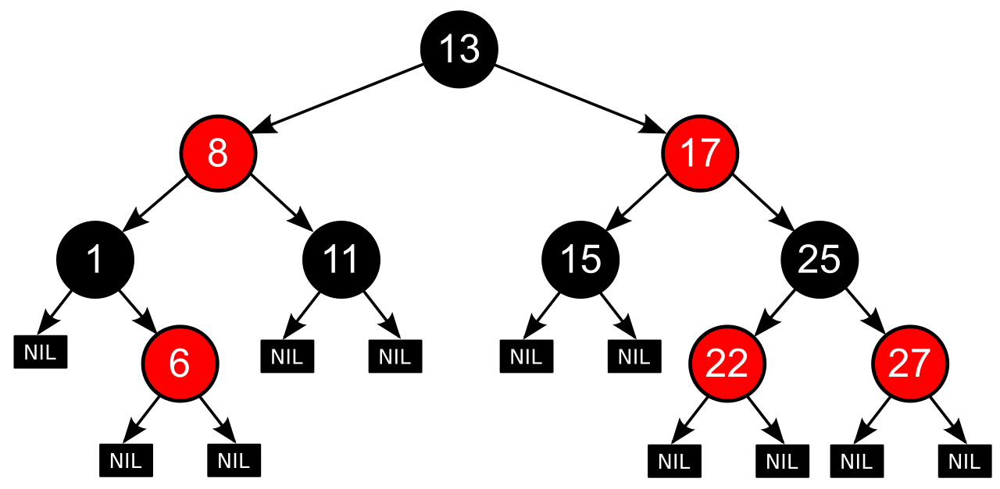

# HashMap


## 成员变量

```java
// 默认初始化容量
static final int DEFAULT_INITIAL_CAPACITY = 1 << 4; // aka 16

// 最大容量
static final int MAXIMUM_CAPACITY = 1 << 30;

// 默认负载因子
static final float DEFAULT_LOAD_FACTOR = 0.75f;

// 当桶中的元素大于等于该值时，转换成红黑树
static final int TREEIFY_THRESHOLD = 8;

// 当桶中的元素小于等于该值时，转换成链表
static final int UNTREEIFY_THRESHOLD = 6;

// 桶中的元素需转化为红黑树时，table 的长度需大于等于该值
static final int MIN_TREEIFY_CAPACITY = 64;

// 存放元素的数组，大小总是2的整数幂
transient Node<K,V>[] table;

// 缓存 entrySet()
transient Set<Map.Entry<K,V>> entrySet;

// 元素的数量
transient int size;

// 集合结构的修改次数
transient int modCount;

// 扩容阈值，当前容量乘以负载因子大于该值时，触发扩容
int threshold;

// 负载因子
final float loadFactor;
```

### 元素的数量 `size`

- 如果插入元素时没有发生过哈希冲突，`size` 就等于 `table` 数组中存放的元素的数量
- 如果插入元素时发生过哈希冲突，`size` 就等于因哈希冲突而产生的链表与红黑树中节点的数量，加上数组中未发生过哈希冲突的元素数量

### 负载因子 `loadFactor`

负载因子控制着数组存放数据的疏密程度，因为需要通过 `threshold` 判断是否需要扩容，而 `threshold` 是通过 `当前容量 * 负载因子` 计算得来的

- 不建议修改 `loadFactor`，官方推荐的 0.75 就是一个很好的平衡了空间和时间复杂度的值

| 负载因子 | 扩容阈值 | 扩容次数 | 元素分布 | 空间利用率 | 发生哈希冲突的概率 |
| :-: | :-: | :-: | :-: | :-: | :-: |
| 越大 | 大 | 少 | 紧密 | 高 | 高 |
| 越小 | 小 | 多 | 松散 | 低 | 低 |

- 此外，建议指定初始化容量时，设置为 `(需要存储的元素个数 / 负载因子) + 1`

### 为什么 HashMap 的容量是 2 的倍数

HashMap 通过 hash 值与容量取余操作来确定 key 的索引位置。当容量为 2 的整数幂时，就可将取余操作（`hash % n`）转化成更高效的位运算（`(n - 1) & hash`），提高计算效率

所以为了扩容后仍能使用位运算进行取余操作，HashMap 也是按照当前容量的 2 倍进行扩容的，所以 2 的整数幂扩容之后依然是 2 的整数幂。而且扩容后的元素，要么就在原位置，要么在原位置向后移动旧容量的大小

#### 高效的位运算

`(n - 1) & hash` 等价于 `hash % n`，即对数组长度进行取余

- 位运算相比于取余操作更高效

```java
// 当 b 为 2 的 n 次方时，位运算与取余操作可以相互替换
a % b = a & (b - 1)
// 即
a % 2^n = a & (2^n - 1)
```

2 的整数幂意味着二进制中，只有一位是 1，其他位都是 0，一个数字对 2 的整数幂取余，就意味着该数字向右移 n 位

- 因此 HashMap 的数组长度也都是 2 的整数幂

```java
// 例如 110183 % 16
0000000000000011010111001100111
0000000000000000000000000010000
// 高位补 0，低位舍弃
00000000000000000011010111001100111
// 舍弃的部分即为余数
0111
```

2 的整数幂减 1，相当于一个取反操作，例如 `10000` 减 1，也就变成了 `01111`。这时再通过与运算，就可以得到取余操作时舍弃的值了，因为 0、1 与 1 做与运算，会保留原来的值

例如 16 是 2 的 4 次方，在二进制中，就是 1 后面有 4 个 0，对 2 的 4 次方取余，也就是被取余的数向右移 4 位。这时候 16 的二进制 `10000` 作为数字的作用其实已经完成了，可以去协助存储余数了

```java
// 例如 110183 % 16
0000000000000011010111001100111
0000000000000000000000000010000

// 16-1
0000000000000000000000000001111

// 即
0000000000000011010111001100111
0000000000000000000000000001111
// 做与运算，即保留 4 位
0000000000000000000000000000111
```

### 为什么转换红黑树的阈值为 8

```java
0:    0.60653066
1:    0.30326533
2:    0.07581633
3:    0.01263606
4:    0.00157952
5:    0.00015795
6:    0.00001316
7:    0.00000094
8:    0.00000006
more: less than 1 in ten million
```

在源码中就指出，经过大量的实验，哈希冲突发生 8 次的概率仅为 0.00000006，几乎是不可能的，如果真的发生了，说明元素本身或者哈希算法有问题

红黑树虽然查询效率高，但相比于链表结构，每个节点的大小都要更大，差不多是普通节点的 2 倍，所以转红黑树，牺牲了空间换时间，更多的是一种兜底的策略，保证极端情况下的查找效率

### 为什么采用 6 和 8 进行红黑树和链表转化

如果将两个阈值设置为同一个值，那么如果发生碰撞，经过不停地插入与删除，正好在该值附近徘徊，就会造成频繁的链表与红黑树的转换，白白浪费资源

6 与 8 之间正好有一个冗余的空间，可以防止链表和红黑树之间频繁的转换

## 哈希函数

```java
static final int hash(Object key) {
    int h;
    // 高 16 位与低 16 位进行异或运算
    return (key == null) ? 0 : (h = key.hashCode()) ^ (h >>> 16);
}
```

获取到 key 的 hash 值后，再通过 `(n - 1) & hash`，即数组长度减 1 与 hash 进行与运算就可以得到该 key 对应的数组下标位置了

### 为什么不直接使用 hash 值做下标

因为不同元素的 hash 值可能是不同的，假如添加两个 key，一个 key 计算出来的 hash 值是 6，那么长度为 16 的数组就足够了，另一个 key 计算出来的 hash 值为 114514，那么至少需要一个长度为 114514 的数组。只存两个元素的话，空间浪费太大了，不如削足适履，就在已有的位置里找

### 为什么需要高 16 位和低 16 位的异或

首先来看看不进行异或操作获取的下标值

```java
// 1 & (16-1)
0000000000000000000000000000001
0000000000000000000000000001111
// 得到
0000000000000000000000000000001

// 65537 & (16-1)
0000000000000010000000000000001
0000000000000000000000000001111
// 得到
0000000000000000000000000000001
```

1 或 65537 对 16 进行取余，得到的结果都是 1。再来看看经过异或运算后

```java
// 1
0000000000000000000000000000001
// 1>>>16
0000000000000000000000000000000
// 1 ^ (1>>>16)
0000000000000000000000000000001
0000000000000000000000000000000
// 得到
0000000000000000000000000000001
// (1 ^ (1>>>16)) & (16-1)
0000000000000000000000000000001
0000000000000000000000000001111
// 得到
0000000000000000000000000000001

// 65537
0000000000000010000000000000001
// 65537>>>16
0000000000000000000000000000001
// 65537 ^ (65537>>>16)
0000000000000010000000000000001
0000000000000000000000000000001
// 得到
0000000000000010000000000000000
// (65537 ^ (65537>>>16)) & (16-1)
0000000000000010000000000000000
0000000000000000000000000001111
// 得到
0000000000000000000000000000000
```

1 与 65537 经过高低 16 位的异或运算，得到了不同的下标，1 对应的下标仍是 1，而 65537 对应的下标变成了 0

通过高低 16 位的异或运算，混合了高位与低位的特征，加大了随机性，且变相的保存了高位的信息，使得数据的分布更松散，降低哈希冲突的概率

- 使用异或运算，而不使用与运算、或运算，是因为异或运算能更好的保留各部分的特征
  - 使用与运算出来的值会向 0 靠拢
  - 使用或运算出来的值会向 1 靠拢

|  | 与 | 或 | 异或 |
| :-: | :-: | :-: | :-: |
| 0 0 | 0 | 0 | 0 |
| 0 1 | 0 | 1 | 1 |
| 1 0 | 0 | 1 | 1 |
| 1 1 | 1 | 1 | 0 |

### 哈希冲突

通常情况下哈希函数的输入空间远大于输出空间，因此理论上哈希冲突是不可避免的。比如，输入空间为全体整数，输出空间为数组容量大小，则必然有多个整数映射至同一桶索引

解决哈希冲突主要有 4 种方法，HashMap 使用了链地址法，并且在数组中元素数量大于 64，且链表中的元素数量大于等于 8，时，会将该链表转换成红黑树以提升查找效率

#### 链地址法

也叫做拉链法，在发生冲突的位置，建立一个链表，将冲突的元素添加进去

实现简单，元素添加移除都方便，且链表上的结点空间是动态申请的，不需要提前确定长度。但链表需要维护指针，占用的内存较大，并且查询效率低，需要线性遍历

> 所以 HashMap 引入了红黑树

#### 开放定址法

从冲突的位置开始往后找，直到找到空位，将冲突的元素添加进去

查找方式与链地址法类似，都是先找到位置再遍历，链地址法是遍历链表，开放定址法是遍历部分数组

- 线性探测：从冲突的位置开始，一个个的找，直到找到空位
  - 容易产生聚集现象，如果某个位置的冲突次数过多，那么该位置后的一片连续区域都存放的是冲突的元素，并且可能会导致某些其他本身应该在该区域的元素，因为没有位置，也继续向后找空位，形成恶性循环，最终导致增删查改操作效率劣化
- 平方探测：从冲突的位置开始，以平方的步数开始查找，即 1^2、2^2、3^2...，直到找到空位
  - 相较于线性探测分布更松散，但仍然存在聚集现象，即某些位置比其他位置更容易被占用
  - 由于平方的增长，平方探测可能不会探测整个哈希表，这意味着即使哈希表中有空桶，平方探测也可能无法访问到它
- 伪随机探测：从冲突的位置开始，首先生成一个随机数，通常随机数也是由另一个哈希算法生成的，这样就不需要特地的保存随机数了，当前的位置加上随机数，即为下次要查找的位置

若可预知数据总数，可以创建完美哈希数列，假如有 10 个元素，那么再创建一个长度略大的数组，元素就可以均匀的分布在数组

- 容易产生  **聚集现象**，且需要的数组空间也较大
- 寻址的次数不可控，次数过多会影响读写性能
- 删除麻烦，需要对后面的元素作处理，详见 ThreadLocalMap。如果删除后，不将后面因相同的冲突插入的元素向前移动的话，那么之后按照冲突位置向后查找元素时，后面的元素就永远都查不到了

> ThreadLocalMap 使用的就是线性探测法

#### 再哈希法

使用多个哈希函数，如果第一个哈希函数计算出来的值发生冲突了，就使用第二个哈希函数重新计算，直到找到空位

不易产生聚集，元素分布更松散，但多个哈希函数会带来额外的计算量

#### 建立公共溢出区

将哈希表分为基本表和溢出表两部分，凡是和基本表发生冲突的元素，一律填入溢出表

溢出表是个独立的空间，不需要其他的操作。但当冲突过多时，就需要多个溢出表，不仅浪费空间，查询效率也低

## 节点

在 HashMap 中，元素是被包裹在节点中的，有 2 种节点

- 链表节点 Node
- 红黑树节点 TreeNode

```java
static class Node<K,V> implements Map.Entry<K,V> {
    final int hash;
    final K key;
    V value;
    Node<K,V> next;

    Node(int hash, K key, V value, Node<K,V> next) {
        this.hash = hash;
        this.key = key;
        this.value = value;
        this.next = next;
    }
}
```

```java
static final class TreeNode<K,V> extends LinkedHashMap.Entry<K,V> {
    TreeNode<K,V> parent;  // red-black tree links
    TreeNode<K,V> left;
    TreeNode<K,V> right;
    TreeNode<K,V> prev;    // needed to unlink next upon deletion
    boolean red;

    TreeNode(int hash, K key, V val, Node<K,V> next) {
        super(hash, key, val, next);
    }
}

// LinkedHashMap.Entry也是继承自HashMap.Node
static class Entry<K,V> extends HashMap.Node<K,V> {
    Entry<K,V> before, after;
    Entry(int hash, K key, V value, Node<K,V> next) {
        super(hash, key, value, next);
    }
}
```

### 红黑树

红黑树（R-B Tree）是特殊的二叉查找树

- 每个节点要么是黑色要么是红色
- 根节点是黑色
- 所有叶子节点都是黑色，并且为空节点
- 每个红色节点必须有两个黑色的子节点
- 从任一节点到其每个叶子的所有路径都包含相同数目的黑色节点



<small>[红黑树](https://zh.wikipedia.org/zh-cn/%E7%BA%A2%E9%BB%91%E6%A0%91)</small>

#### 为什么不使用二叉排序树

红黑树是一种平衡的二叉树，插入、删除、查找的最坏时间复杂度都为 `O(logn)`，避免了二叉树最坏情况下的 `O(n)` 时间复杂度，即退化成链表结构

#### 为什么不使用 AVL 树（平衡二叉树）

红黑树的查询性能略逊于 AVL 树，他允许很少的不完全平衡，最多一层，也就是说相同内容的红黑树相比于 AVL 树最多就多比较一次

但 AVL 树为了维护严格的平衡性，在插入或删除元素时，会进行大量的维护平衡的操作。而红黑树允许少量的不平衡，省去了很多的平衡操作，也就有了更好的插入或删除的效率

## 构造方法

```java
// 使用默认的负载因子
public HashMap() {
    this.loadFactor = DEFAULT_LOAD_FACTOR; // all other fields defaulted
}

// 使用指定容量和默认的负载因子
public HashMap(int initialCapacity) {
    this(initialCapacity, DEFAULT_LOAD_FACTOR);
}

// 使用指定的容量和负载因子
public HashMap(int initialCapacity, float loadFactor) {
    // 判断给定的容量和负载因子是否合法
    if (initialCapacity < 0)
        throw new IllegalArgumentException("Illegal initial capacity: " +
                                            initialCapacity);
    if (initialCapacity > MAXIMUM_CAPACITY)
        initialCapacity = MAXIMUM_CAPACITY;
    if (loadFactor <= 0 || Float.isNaN(loadFactor))
        throw new IllegalArgumentException("Illegal load factor: " +
                                            loadFactor);
    this.loadFactor = loadFactor;
    this.threshold = tableSizeFor(initialCapacity);
}

// 使用默认的负载因子，并将给定的集合中的元素添加到新集合中
public HashMap(Map<? extends K, ? extends V> m) {
    this.loadFactor = DEFAULT_LOAD_FACTOR;
    putMapEntries(m, false);
}
```

当指定容量时，HashMap 会查找离该值最近的 2 的整数幂，用作创建时的容量。例如给定的容量是 100，HashMap 在初始化的时候会调用 `tableSizeFor` 方法来查找最近的 2 的整数幂，得到结果 128，于是将 128 作为初始化的容量

```java
static final int tableSizeFor(int cap) {
    int n = cap - 1;
    n |= n >>> 1;
    n |= n >>> 2;
    n |= n >>> 4;
    n |= n >>> 8;
    n |= n >>> 16;
    return (n < 0) ? 1 : (n >= MAXIMUM_CAPACITY) ? MAXIMUM_CAPACITY : n + 1;
}
```

- 注意，与 ArrayList 类似的，HashMap 里存放数据的数组也是在添加数据的时候才进行创建

```java
public class Test {

    public static void main(String[] args) throws NoSuchFieldException, IllegalAccessException {
        Field field = HashMap.class.getDeclaredField("table");
        field.setAccessible(true);

        HashMap<String, String> map = new HashMap<>(100);
        map.put("one", "one");
        Object[] arr = (Object[]) field.get(map);
        System.out.println(arr.length);
    }
}
```

> 128

## 添加

```java
public V put(K key, V value) {
    return putVal(hash(key), key, value, false, true);
}

// 如果该key不存在则添加
public V putIfAbsent(K key, V value) {
    return putVal(hash(key), key, value, true, true);
}
```

```java
// hash：key 的 hash 值
// key：键
// value：值
// onlyIfAbsent：如果是 true，不要修改已有的值
// evict：如果是 false，数组处于创建模式
final V putVal(int hash, K key, V value, boolean onlyIfAbsent,
                boolean evict) {
    Node<K,V>[] tab; Node<K,V> p; int n, i;
    // 如果数组为空，调用扩容方法进行初始化
    if ((tab = table) == null || (n = tab.length) == 0)
        n = (tab = resize()).length;
    // 计算出该 key 对应的下标，如果该下标内没有元素，则直接新建节点插入该位置
    if ((p = tab[i = (n - 1) & hash]) == null)
        tab[i] = newNode(hash, key, value, null);
    else {
        Node<K,V> e; K k;
        // 如果该位置 key 的 hash 等于本次插入的 key 的 hash，且两个 key 相等，进行替换
        if (p.hash == hash &&
            ((k = p.key) == key || (key != null && key.equals(k))))
            e = p;
        // 如果该位置的节点是个红黑树节点，则执行红黑树的插入方法
        else if (p instanceof TreeNode)
            e = ((TreeNode<K,V>)p).putTreeVal(this, tab, hash, key, value);
        // 如果该位置的节点是个链表节点
        else {
            // 遍历链表
            for (int binCount = 0; ; ++binCount) {
                // 从头节点的后继节点开始，因为头节点已经在上面判断过了
                // 如果该节点为空，说明已遍历到链表末尾了，则创建新节点，并将后继节点指向该节点
                if ((e = p.next) == null) {
                    p.next = newNode(hash, key, value, null);
                    // 判断是否执行红黑树的转换，之后结束循环
                    // 注意这里减 1 是因为已经检查过头节点了
                    if (binCount >= TREEIFY_THRESHOLD - 1) // -1 for 1st
                        treeifyBin(tab, hash);
                    break;
                }
                // 如果该位置 key 的 hash 等于本次插入的 key 的 hash，且两个 key 相等，结束循环
                if (e.hash == hash &&
                    ((k = e.key) == key || (key != null && key.equals(k))))
                    break;
                // 用于执行下次循环
                p = e;
            }
        }
        // 如果节点 e 不为空，e 要么新加入的节点，要么是 hash 与 key 与要插入的节点相同
        if (e != null) { // existing mapping for key
            V oldValue = e.value;
            // 如果允许修改已有的值，或着旧值为空，则进行赋值
            if (!onlyIfAbsent || oldValue == null)
                e.value = value;
            // LinkedHashMap 的相关操作，现在不需要关心
            afterNodeAccess(e);
            // 返回旧值
            return oldValue;
        }
    }
    ++modCount;
    // 判断是否需要扩容
    if (++size > threshold)
        resize();
    // LinkedHashMap 的相关操作，现在不需要关心
    afterNodeInsertion(evict);
    return null;
}
```


<small>[Java 8系列之重新认识HashMap](https://tech.meituan.com/2016/06/24/java-hashmap.html)</small>

## 添加集合

```java
public void putAll(Map<? extends K, ? extends V> m) {
    putMapEntries(m, true);
}
```

```java
// m：传入的集合
// evict：只在构造方法调用时传入 false，其他都为 true，与 afterNodeInsertion 方法有关
final void putMapEntries(Map<? extends K, ? extends V> m, boolean evict) {
    // 传入的集合的元素数量
    int s = m.size();
    if (s > 0) {
        // 如果数组为空，计算扩容阈值
        if (table == null) { // pre-size
            float ft = ((float)s / loadFactor) + 1.0F;
            int t = ((ft < (float)MAXIMUM_CAPACITY) ?
                        (int)ft : MAXIMUM_CAPACITY);
            if (t > threshold)
                threshold = tableSizeFor(t);
        }
        // 如果传入的集合的元素数量大于扩容阈值，则进行扩容
        else if (s > threshold)
            resize();
        // 逐个调用 putVal 方法
        for (Map.Entry<? extends K, ? extends V> e : m.entrySet()) {
            K key = e.getKey();
            V value = e.getValue();
            putVal(hash(key), key, value, false, evict);
        }
    }
}
```

## 扩容

`resize` 负责数组的 **初始化与扩容**

```java
final Node<K,V>[] resize() {
    // 当前的数组
    Node<K,V>[] oldTab = table;
    // 当前的数组容量
    int oldCap = (oldTab == null) ? 0 : oldTab.length;
    // 当前的扩容阈值
    int oldThr = threshold;
    int newCap, newThr = 0;
    // 如果当前的容量大于 0，也就是说数组已经初始化过了
    if (oldCap > 0) {
        // 判断当前的容量是否大于等于最大容量，如果是则将扩容阈值设置为 Integer.MAX_VALUE
        if (oldCap >= MAXIMUM_CAPACITY) {
            threshold = Integer.MAX_VALUE;
            return oldTab;
        }
        // 当前的容量扩充 2 倍即为新容量，并判断新容量是否小于最大容量，且大于等于初始容量，[DEFAULT_INITIAL_CAPACITY, MAXIMUM_CAPACITY)
        // 如果是，则将新的扩容阈值也设置为旧的 2 倍
        else if ((newCap = oldCap << 1) < MAXIMUM_CAPACITY &&
                    oldCap >= DEFAULT_INITIAL_CAPACITY)
            newThr = oldThr << 1; // double threshold
    }
    // 如果当前的容量等于 0，即数组还未创建
    // 如果当前的扩容阈值大于 0，则将新容量设置为当前的扩容阈值
    else if (oldThr > 0) // initial capacity was placed in threshold
        newCap = oldThr;
    // 如果数组还未创建，且扩容阈值也未被设置，也就是刚刚以无参构造方法创建的，还未添加过元素的HashMap
    else {               // zero initial threshold signifies using defaults
        newCap = DEFAULT_INITIAL_CAPACITY;
        newThr = (int)(DEFAULT_LOAD_FACTOR * DEFAULT_INITIAL_CAPACITY);
    }
    // 如果新的扩容阈值为仍未 0，则为其用新的容量进行赋值
    if (newThr == 0) {
        float ft = (float)newCap * loadFactor;
        newThr = (newCap < MAXIMUM_CAPACITY && ft < (float)MAXIMUM_CAPACITY ?
                    (int)ft : Integer.MAX_VALUE);
    }
    // 将当前的扩容阈值指向新的阈值
    threshold = newThr;
    // 创建新数组
    @SuppressWarnings({"rawtypes","unchecked"})
        Node<K,V>[] newTab = (Node<K,V>[])new Node[newCap];
    // 将数组的引用指向新数组
    table = newTab;
    // 如果旧数组不为空，就需要执行元素的移动
    if (oldTab != null) {
        // 将旧数组内的元素移到新数组中
        for (int j = 0; j < oldCap; ++j) {
            Node<K,V> e;
            if ((e = oldTab[j]) != null) {
                oldTab[j] = null;
                // 如果该节点没有发生过冲突，就重新计算下标值，并插入进去
                if (e.next == null)
                    newTab[e.hash & (newCap - 1)] = e;
                // 如果该节点是个红黑树节点，则执行红黑树的分割操作
                else if (e instanceof TreeNode)
                    ((TreeNode<K,V>)e).split(this, newTab, j, oldCap);
                // 如果该位置的节点是个链表节点
                else { // preserve order
                    Node<K,V> loHead = null, loTail = null;
                    Node<K,V> hiHead = null, hiTail = null;
                    Node<K,V> next;
                    // 遍历链表，将链表拆分为两个新链表，一个放在原位置，另一个放在新位置，即旧位置+旧容量
                    do {
                        next = e.next;
                        if ((e.hash & oldCap) == 0) {
                            if (loTail == null)
                                loHead = e;
                            else
                                loTail.next = e;
                            loTail = e;
                        }
                        else {
                            if (hiTail == null)
                                hiHead = e;
                            else
                                hiTail.next = e;
                            hiTail = e;
                        }
                    } while ((e = next) != null);
                    if (loTail != null) {
                        loTail.next = null;
                        newTab[j] = loHead;
                    }
                    if (hiTail != null) {
                        hiTail.next = null;
                        newTab[j + oldCap] = hiHead;
                    }
                }
            }
        }
    }
    return newTab;
}
```

`resize` 扩容时会将链表拆分为两个新链表，一个放在原位置，另一个得益于 HashMap 每次都是按照 2 倍进行扩容的，所以另一个的位置就是原位置加上旧数组的大小

为什么通过 `(e.hash & oldCap) == 0` 就可将链表分为两个部分呢。假如现在有个长度为 16 的数组，下标 5 已经存储了一个元素，那么下一个元素如何才能也存入下标 5 的位置，很简单，加上数组的大小就可以了，`5 + 16 = 21`、`5 + 16 * 2 = 37` ... 也就是 `5 + 16 * n`。

```java
// 5
0000000000000000000000000000101
// 21
0000000000000000000000000010101
// 37
0000000000000000000000000100101
// 53
0000000000000000000000000110101
// 69
0000000000000000000000001000101
// 85
0000000000000000000000001010101
...
```

```java
// 16
0000000000000000000000000010000
```

发现没有 16 的奇数倍在二进制中表示 16 的那位是 1，16 的偶数倍在二进制中表示 16 的那位是 0。所以奇数倍的与 16 做与运算都是 0，偶数倍的与 16 做与运算都是 1。也可以这么理解，奇数个等同于 `16 * 1`，偶数个等同于 `16 * 2`，所以需要进位，二进制中表示 16 的那位就为 0

```java
for (int i = 0; i < 10; i++) {
    int x = 5 + 16 * i;
    System.out.println(x);
    System.out.println(Integer.toBinaryString(x));
    System.out.println(x % 16);
    System.out.println((x & 16) == 0);
    System.out.println("----------");
}
```

> 5
101
5
true
=============
21
10101
5
false
=============
37
100101
5
true
=============
53
110101
5
false
=============
69
1000101
5
true
=============
85
1010101
5
false
=============
101
1100101
5
true
=============
117
1110101
5
false
=============
133
10000101
5
true
=============
149
10010101
5
false
=============

## 获取

```java
public V get(Object key) {
    Node<K,V> e;
    return (e = getNode(hash(key), key)) == null ? null : e.value;
}

// 如果获取到的元素为 null，则返回给定的默认值
public V getOrDefault(Object key, V defaultValue) {
    Node<K,V> e;
    return (e = getNode(hash(key), key)) == null ? defaultValue : e.value;
}
```

```java
final Node<K,V> getNode(int hash, Object key) {
    Node<K,V>[] tab; Node<K,V> first, e; int n; K k;
    // 首先判断当前数组是不是个空数组，且该下标位置有元素
    if ((tab = table) != null && (n = tab.length) > 0 &&
        (first = tab[(n - 1) & hash]) != null) {
        // 先检查头节点
        if (first.hash == hash && // always check first node
            ((k = first.key) == key || (key != null && key.equals(k))))
            return first;
        // 如果头节点不是所需的元素，说明该位置发生过冲突，则查询红黑树或链表
        if ((e = first.next) != null) {
            if (first instanceof TreeNode)
                return ((TreeNode<K,V>)first).getTreeNode(hash, key);
            do {
                if (e.hash == hash &&
                    ((k = e.key) == key || (key != null && key.equals(k))))
                    return e;
            } while ((e = e.next) != null);
        }
    }
    return null;
}
```

## 删除

```java
// 根据 key 删除元素
public V remove(Object key) {
    Node<K,V> e;
    return (e = removeNode(hash(key), key, null, false, true)) == null ?
        null : e.value;
}

// 根据 key 和 value 删除元素
public boolean remove(Object key, Object value) {
    return removeNode(hash(key), key, value, true, true) != null;
}
```

```java
final Node<K,V> removeNode(int hash, Object key, Object value,
                            boolean matchValue, boolean movable) {
    Node<K,V>[] tab; Node<K,V> p; int n, index;
    // 首先判断当前数组是不是个空数组，且该下标位置有元素，与 getNode 方法类似
    if ((tab = table) != null && (n = tab.length) > 0 &&
        (p = tab[index = (n - 1) & hash]) != null) {
        Node<K,V> node = null, e; K k; V v;
        if (p.hash == hash &&
            ((k = p.key) == key || (key != null && key.equals(k))))
            node = p;
        else if ((e = p.next) != null) {
            if (p instanceof TreeNode)
                node = ((TreeNode<K,V>)p).getTreeNode(hash, key);
            else {
                do {
                    if (e.hash == hash &&
                        ((k = e.key) == key ||
                            (key != null && key.equals(k)))) {
                        node = e;
                        break;
                    }
                    p = e;
                } while ((e = e.next) != null);
            }
        }
        // 找到了元素，是否需要判断 value 也相同
        if (node != null && (!matchValue || (v = node.value) == value ||
                                (value != null && value.equals(v)))) {
            // 如果该节点是个红黑树节点，则执行红黑树的删除操作
            if (node instanceof TreeNode)
                ((TreeNode<K,V>)node).removeTreeNode(this, tab, movable);
            // 如果头节点就是要删除的节点，将该位置替换为后继节点即可，不用关心后继节点是不是null
            else if (node == p)
                tab[index] = node.next;
            // 如果 node != p，p 就是要被删除的节点的前驱节点
            // 将p的后继节点，指向被删除节点的后继节点
            else
                p.next = node.next;
            ++modCount;
            --size;
            // LinkedHashMap 的相关操作，现在不需要关心
            afterNodeRemoval(node);
            return node;
        }
    }
    return null;
}
```

## 替换

```java
public V replace(K key, V value) {
    Node<K,V> e;
    // 找到节点并替换
    if ((e = getNode(hash(key), key)) != null) {
        V oldValue = e.value;
        e.value = value;
        afterNodeAccess(e);
        return oldValue;
    }
    return null;
}

public boolean replace(K key, V oldValue, V newValue) {
    Node<K,V> e; V v;
    // 找到节点，先判断旧值与传入的旧值是否相等，再替换
    if ((e = getNode(hash(key), key)) != null &&
        ((v = e.value) == oldValue || (v != null && v.equals(oldValue)))) {
        e.value = newValue;
        afterNodeAccess(e);
        return true;
    }
    return false;
}
```

## 清空

```java
public void clear() {
    Node<K,V>[] tab;
    modCount++;
    // 把数组上的元素清空即可
    if ((tab = table) != null && size > 0) {
        size = 0;
        for (int i = 0; i < tab.length; ++i)
            tab[i] = null;
    }
}
```

## 是否存在

是否存在该 key

```java
public boolean containsKey(Object key) {
    return getNode(hash(key), key) != null;
}
```

是否存在该 value，性能太差，不建议使用

```java
public boolean containsValue(Object value) {
    Node<K,V>[] tab; V v;
    if ((tab = table) != null && size > 0) {
        // 遍历数组
        for (int i = 0; i < tab.length; ++i) {
            // 遍历树或链表
            for (Node<K,V> e = tab[i]; e != null; e = e.next) {
                if ((v = e.value) == value ||
                    (value != null && value.equals(v)))
                    return true;
            }
        }
    }
    return false;
}
```

## 遍历

```java
// 返回 key 集合
public Set<K> keySet() {
    Set<K> ks = keySet;
    if (ks == null) {
        ks = new KeySet();
        keySet = ks;
    }
    return ks;
}

// 返回 value 集合
public Collection<V> values() {
    Collection<V> vs = values;
    if (vs == null) {
        vs = new Values();
        values = vs;
    }
    return vs;
}

// 返回节点集合
public Set<Map.Entry<K,V>> entrySet() {
    Set<Map.Entry<K,V>> es;
    return (es = entrySet) == null ? (entrySet = new EntrySet()) : es;
}
```

- 如果只需要遍历 key，使用 `keySet` 即可
- 如果只需要遍历 value，使用 `values` 即可
- 如果需要遍历 key 和 value 建议使用 `entrySet`
  - 使用 `keySet` 获取 value 还需要调用 `get` 方法，相当于两次循环，`entrySet` 只需要一次循环

## JDK1.7 与 JDK1.8 的区别

|  | 1.7 | 1.8 |
| :-: | :-: | :-: |
| 数据结构 | 数组 + 链表 | 数组 + 链表 + 红黑树 |
| 链表插入方式 | 头插法 | 尾插法 |
| `null` 键 | 调用 `putForNullKey` 方法进行处理 | 不区分键为 `null` 的情况，如果键为 `null`，那么他的 hash 值永远都是 0，所以他也就始终位于数组的头部 |
| 插入与扩容顺序 | 先判断是否扩容，再插入 | 先插入，再判断是否扩容 |
| 哈希函数 | 实现略微复杂 | 更简单，性能也更好 |
| 数组初始化时机 | 创建时 | 插入时 |

- 红黑树可以提升链表过长时的查询性能
- 多个线程同时对链表进行操作，头插法可能会导致链表中的节点指向错误的位置，从而形成一个环形链表

```java
// 哈希函数的区别
// 1.7
static int hash(int h) {
    h ^= (h >>> 20) ^ (h >>> 12);
    return h ^ (h >>> 7) ^ (h >>> 4);
}

// 1.8
static final int hash(Object key) {
    int h;
    return (key == null) ? 0 : (h = key.hashCode()) ^ (h >>> 16);
}
```

### JDK1.7 头插法导致的死循环

```java
// 1.7 版本扩容方法
void resize(int newCapacity) {
    Entry[] oldTable = table;
    int oldCapacity = oldTable.length;
    if (oldCapacity == MAXIMUM_CAPACITY) {
        threshold = Integer.MAX_VALUE;
        return;
    }

    Entry[] newTable = new Entry[newCapacity];
    transfer(newTable, initHashSeedAsNeeded(newCapacity));
    table = newTable;
    threshold = (int)Math.min(newCapacity * loadFactor, MAXIMUM_CAPACITY + 1);
}

// 创建新数组后调用该方法移动元素到新数组中
void transfer(Entry[] newTable) {
    Entry[] src = table;
    int newCapacity = newTable.length;

    for (int j = 0; j < src.length; j++) {
        Entry<K,V> e = src[j];
        if (e != null) {
            src[j] = null;
            do {
                Entry<K,V> next = e.next;
                int i = indexFor(e.hash, newCapacity);
                // 注意这里
                e.next = newTable[i];
                newTable[i] = e;

                e = next;
            } while (e != null);
        }
    }
}
```

假如开始的链表为 A -> B -> null。这时有两个线程进来了，并且都触发了扩容方法，线程 1 执行到了 `e.next = newTable[i];` 之前，这时线程 2 已经完成了扩容和移动，由于采用了头插法，这时链表的指向已经变成了 B -> A -> null

虽然新数组是各个线程自己创建的，是线程私有的，但链表中节点的指针是全局的。所以现在线程 1 看到的指向也变成了 B -> A -> null

这时线程 1 继续往后执行

```java
// e.next = null，即 A -> null
e.next = newTable[i];
// 数组上存入 A
newTable[i] = e;
// e = B
e = next;
```

下一次循环

```java
// 这时的 next 就为 B 的 next，经过线程 1 的修改后，B 的 next 变成了 A
Entry<K,V> next = e.next;
// B -> A
e.next = newTable[i];
// 数组上存入 B
newTable[i] = e;
// e = A
e = next;
```

下一次循环。线程 2 执行了两次循环也就结束了，因为链表中也就只有 2 个元素。但由于线程 2 修改了链表中元素的指向，所以多出了这一次循环

```java
// 这时的 next，为 A 的 next，也就是 null
Entry<K,V> next = e.next;
// A -> B
// 这时环形链表就已经形成了
e.next = newTable[i];
// 数组上存入 A
newTable[i] = e;
// e = null，结束循环
e = next;
```

当使用 `get` 方法获取元素时，就会发现 `A.next = B`、`B.next = A`，相互指向，出现了死循环

## 线程安全

HashMap 不是线程安全的，只建议在单线程环境下使用，在多线程环境下建议使用 Hashtable、ConcurrentHashMap、SynchronizedMap

### 死循环

HashMap 在 JDK1.7 下扩容时可能会出现环形链表，导致死循环，在 JDK1.8 中已被解决

### 元素丢失

```java
final V putVal(int hash, K key, V value, boolean onlyIfAbsent,
                boolean evict) {
    ...
    if ((p = tab[i = (n - 1) & hash]) == null)
        tab[i] = newNode(hash, key, value, null);
    else {
    ...
}
```

如果两个线程算出来的下标位置是同一个，并且该位置没有添加过元素，就可能会导致一个线程刚添加的元素，被另一个线程覆盖掉，这时的 `size` 也是不对的，虽然执行了两次添加操作，但只添加了一个元素

### 扩容时获取不到元素

线程 1 在执行扩容操作

```java
final Node<K,V>[] resize() {
    
    ...

    // 线程 1 正在执行扩容操作，但还未执行到这，所以目前通过 get 方法获取元素，使用的还是旧数组，计算下标时用的还是旧数组的大小
    table = newTab;

    ...

    return newTab;
}
```

线程 1 时间片用完，线程 2 这时开始执行 `get` 方法

```java
final Node<K,V> getNode(int hash, Object key) {
    Node<K,V>[] tab; Node<K,V> first, e; int n; K k;
    // 线程 2 仍用旧数组的大小来获取下标位置
    if ((tab = table) != null && (n = tab.length) > 0 &&
        (first = tab[(n - 1) & hash]) != null) {
        ...
        // 假如发现该位置是个红黑树或链表，准备遍历红黑树或链表，这时已经不需要再使用数组了，所以线程 1 将当前的数组指向新数组也没关系
        if ((e = first.next) != null) {
            if (first instanceof TreeNode)
                return ((TreeNode<K,V>)first).getTreeNode(hash, key);
            do {
                if (e.hash == hash &&
                    ((k = e.key) == key || (key != null && key.equals(k))))
                    return e;
            } while ((e = e.next) != null);
        }
    }
    return null;
}
```

线程 2 时间片用完，线程 1 继续执行扩容操作

```java
final Node<K,V>[] resize() {
    
    ...

    // 线程 1 继续往后执行
    table = newTab;
    if (oldTab != null) {
        // 将旧数组内的元素移到新数组中
        for (int j = 0; j < oldCap; ++j) {
            Node<K,V> e;
            if ((e = oldTab[j]) != null) {
                oldTab[j] = null;
                ...
                // 红黑树的分割操作
                else if (e instanceof TreeNode)
                ...
                // 链表的分割操作
                else {
                    ...
                }
            }
        }
    }
    return newTab;
}
```

如果线程 2 现在正在遍历红黑树或链表，这时线程 1 可能正在执行分割操作，也可能已经执行完分割操作。不管怎样，线程 2 当前遍历的红黑树或链表中，节点中维护的指针都可能产生了变化，如果很不巧的，线程 2 想查找的元素，正好在另一个红黑树或链表中，就会导致返回 `null`，虽然这个元素之前确实存在在该位置

## 参考

- [二进制按位与&及求余数](https://perkins4j2.github.io/posts/19120/)
- [为什么HashMap使用高16位异或低16位计算Hash值？](https://zhuanlan.zhihu.com/p/458305988)
- [Java基础：为什么hashmap的长度要设置为2的倍数？](https://blog.51cto.com/zhangxueliang/6406300)
- [hash冲突的4种解决方案](https://learn.skyofit.com/archives/392)
- [哈希冲突概念及其四种解决方案](https://blog.csdn.net/weixin_42559574/article/details/126523961)
- [6.2 哈希冲突](https://www.hello-algo.com/chapter_hashing/hash_collision/)
- [面试官：HashMap 为什么选用红黑树这种数据结构优化链表？](https://juejin.cn/post/6997969089717075975)
- [面试详解之Java8为什么用红黑树来实现HashMap](https://blog.csdn.net/qq_43410878/article/details/125078507)
- [详解：HashMap红黑树的阈值为什么是8？](https://blog.csdn.net/Liu_Wd/article/details/108052428)
- [【Java】HashMap源码分析（JDK1.8）](https://itimetraveler.github.io/2017/11/25/%E3%80%90Java%E3%80%91HashMap%E6%BA%90%E7%A0%81%E5%88%86%E6%9E%90%EF%BC%88JDK1.8%EF%BC%89/#%E6%A0%91%E5%BD%A2%E5%8C%96%E6%96%B9%E6%B3%95treeifyBin)
- [Java 8系列之重新认识HashMap](https://tech.meituan.com/2016/06/24/java-hashmap.html)
- [浅入浅出 1.7和1.8的 HashMap](https://www.cnblogs.com/god23bin/p/shallow-in-java-with-hashmap.html)
- [HashMap- 1.7源码解析](https://blog.csdn.net/qq_50596778/article/details/121181752)
- [浅谈为什么头插法会导致hashmap7扩容死循环而尾插法却不会](https://blog.csdn.net/yxh13521338301/article/details/105629318)
- [HashMap 的 7 种遍历方式与性能分析！「修正篇」](https://mp.weixin.qq.com/s/zQBN3UvJDhRTKP6SzcZFKw)
