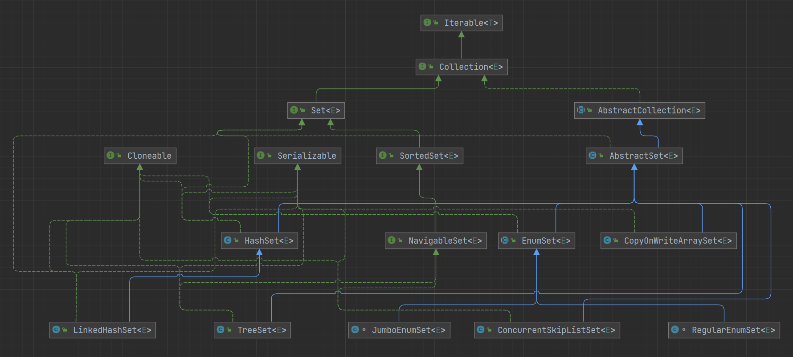

# Set



```java
public interface Set<E> extends Collection<E> {

    // 返回集合中的元素数量
    int size();

    // 集合是否为空
    boolean isEmpty();

    // 集合是否包含给定的元素
    boolean contains(Object o);

    // 获取一个迭代器
    Iterator<E> iterator();

    // 转数组
    Object[] toArray();

    // 转数组
    <T> T[] toArray(T[] a);

    // 添加一个元素
    boolean add(E e);

    // 移除一个元素
    boolean remove(Object o);

    // 判断是否包含给定的集合中的所有元素
    boolean containsAll(Collection<?> c);

    // 将给定的集合里的元素添加到集合中
    boolean addAll(Collection<? extends E> c);

    // 从当前的集合中保留给定的集合中的元素
    boolean retainAll(Collection<?> c);

    // 移除给定的集合中的所有元素
    boolean removeAll(Collection<?> c);

    // 清空
    void clear();

    // 判断两个集合是否相等
    boolean equals(Object o);

    // 获取当前集合的hashCode
    int hashCode();

    // 返回一个可分割的迭代器，并行遍历的迭代器
    @Override
    default Spliterator<E> spliterator() {
        return Spliterators.spliterator(this, Spliterator.DISTINCT);
    }
}
```

## HashSet

### 成员变量

HashSet 就是利用 HashMap 实现的，创建一个 HashSet 其实就是创建一个 HashMap

```java
// 存放元素的集合
private transient HashMap<E,Object> map;

// 作为 value 的值，所有元素共用一个
private static final Object PRESENT = new Object();
```

```java
public class Test {

    public static void main(String[] args) throws NoSuchFieldException, IllegalAccessException {
        Set<String> set = new HashSet<>();
        set.add("one");
        set.add("two");
        set.add("three");

        Field field = HashSet.class.getDeclaredField("map");
        field.setAccessible(true);

        System.out.println(field.get(set));
    }
}
```

> {one=java.lang.Object@2a33fae0, two=java.lang.Object@2a33fae0, three=java.lang.Object@2a33fae0}

可以看出所有的 value 用的都是同一个对象

### 构造方法

构造方法也与 HashMap 类似

```java
public HashSet() {
    map = new HashMap<>();
}

public HashSet(Collection<? extends E> c) {
    map = new HashMap<>(Math.max((int) (c.size()/.75f) + 1, 16));
    addAll(c);
}

public HashSet(int initialCapacity, float loadFactor) {
    map = new HashMap<>(initialCapacity, loadFactor);
}

public HashSet(int initialCapacity) {
    map = new HashMap<>(initialCapacity);
}

// dummy 参数没有具体的意思，只是一个标记，用来区分 HashSet(int initialCapacity, float loadFactor)
// 该构造方法没有被 public 修饰，所以是供内部使用的，用于对 LinkedHashSet 的支持
HashSet(int initialCapacity, float loadFactor, boolean dummy) {
    map = new LinkedHashMap<>(initialCapacity, loadFactor);
}
```

## LinkedHashSet

与 LinkedHashMap 类似的，LinkedHashSet 也是继承自 HashSet，这时 HashSet 中的 `HashSet(int initialCapacity, float loadFactor, boolean dummy)` 构造方法就派上用处了

```java
public class LinkedHashSet<E>
    extends HashSet<E>
    implements Set<E>, Cloneable, java.io.Serializable {

    public LinkedHashSet(int initialCapacity, float loadFactor) {
        super(initialCapacity, loadFactor, true);
    }

    public LinkedHashSet(int initialCapacity) {
        super(initialCapacity, .75f, true);
    }

    public LinkedHashSet() {
        super(16, .75f, true);
    }

    public LinkedHashSet(Collection<? extends E> c) {
        super(Math.max(2*c.size(), 11), .75f, true);
        addAll(c);
    }

    @Override
    public Spliterator<E> spliterator() {
        return Spliterators.spliterator(this, Spliterator.DISTINCT | Spliterator.ORDERED);
    }
}
```

## TreeSet

TreeSet 使用了可排序的 Map，也就是 TreeMap

```java
public class TreeSet<E> extends AbstractSet<E>
    implements NavigableSet<E>, Cloneable, java.io.Serializable
{

    private transient NavigableMap<E,Object> m;

    private static final Object PRESENT = new Object();

    TreeSet(NavigableMap<E,Object> m) {
        this.m = m;
    }

    public TreeSet() {
        this(new TreeMap<E,Object>());
    }

    public TreeSet(Comparator<? super E> comparator) {
        this(new TreeMap<>(comparator));
    }

    public TreeSet(Collection<? extends E> c) {
        this();
        addAll(c);
    }

    public TreeSet(SortedSet<E> s) {
        this(s.comparator());
        addAll(s);
    }
}
```

## 线程安全的 Set

- CopyOnWriteArraySet：基于写时复制技术，内部通过 CopyOnWriteArrayList 实现
- SynchronizedSet：位于 Collections 工具类中，可以通过 `Collections.synchronizedSet` 方法将一个非线程安全的 Set 包装为 SynchronizedSet，内部也是通过 `synchronized` 关键字来保证线程安全

### CopyOnWriteArraySet

```java
public class CopyOnWriteArraySet<E> extends AbstractSet<E>
        implements java.io.Serializable {

    private final CopyOnWriteArrayList<E> al;

    public CopyOnWriteArraySet() {
        al = new CopyOnWriteArrayList<E>();
    }

    public CopyOnWriteArraySet(Collection<? extends E> c) {
        if (c.getClass() == CopyOnWriteArraySet.class) {
            @SuppressWarnings("unchecked") CopyOnWriteArraySet<E> cc =
                (CopyOnWriteArraySet<E>)c;
            al = new CopyOnWriteArrayList<E>(cc.al);
        }
        else {
            al = new CopyOnWriteArrayList<E>();
            al.addAllAbsent(c);
        }
    }
}
```

那么 Set 的不可重复性怎么保证呢

```java
// add 方法中调用 CopyOnWriteArrayList 的 addIfAbsent，不存在才能添加
public boolean add(E e) {
    return al.addIfAbsent(e);
}
```
