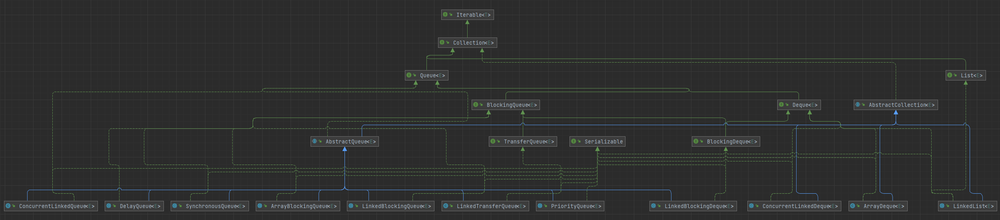

# Queue



```java
public interface Queue<E> extends Collection<E> {
    
    // 向队列中添加一个元素，如果是一个有界队列且空间不足，则抛出异常
    boolean add(E e);

    // 向队列中添加一个元素，如果是一个有界队列且空间不足，则返回false。有界队列更推荐此方法
    boolean offer(E e);

    // 移除并返回队首元素，如果队列为空，则抛出异常
    E remove();

    // 移除并返回队首元素，如果队列为空，则返回null
    E poll();

    // 获得队首元素，如果队列为空，则抛出异常
    E element();

    // 获得队首元素，如果队列为空，则返回null
    E peek();
}
```

### Deque

继承自 Queue，用于表示双端队列

```java
public interface Deque<E> extends Queue<E> {

    // 插入到队首，如果是一个有界队列且空间不足，则抛出异常
    void addFirst(E e);

    // 插入到队尾，如果是一个有界队列且空间不足，则抛出异常
    void addLast(E e);

    // 插入到队首，如果是一个有界队列且空间不足，则返回false
    boolean offerFirst(E e);

    // 插入到队尾，如果是一个有界队列且空间不足，则返回false
    boolean offerLast(E e);

    // 移除并返回队首元素，如果队列为空，则抛出异常
    E removeFirst();

    // 移除并返回队首元素，如果队列为空，则抛出异常
    E removeLast();

    // 移除并返回队首元素，如果队列为空，则返回null
    E pollFirst();

    // 移除并返回队尾元素，如果队列为空，则返回null
    E pollLast();

    // 获得队首元素，如果队列为空，则抛出异常
    E getFirst();

    // 获得队尾元素，如果队列为空，则抛出异常
    E getLast();

    // 获得队首元素，如果队列为空，则返回null
    E peekFirst();

    // 获得队尾元素，如果队列为空，则返回null
    E peekLast();

    // 删除给定的元素，从队首开始查找
    boolean removeFirstOccurrence(Object o);

    // 删除给定的元素，从队尾开始查找
    boolean removeLastOccurrence(Object o);

    // 插入到队尾，如果是一个有界队列且空间不足，则抛出异常
    boolean add(E e);

    // 插入到队尾，如果是一个有界队列且空间不足，则返回false
    boolean offer(E e);

    // 移除并返回队首元素，如果队列为空，则抛出异常
    E remove();

    // 移除并返回队首元素，如果队列为空，则返回null
    E poll();

    // 获得队首元素，如果队列为空，则抛出异常
    E element();

    // 获得队首元素，如果队列为空，则返回null
    E peek();

    // 插入到队首，如果是一个有界队列且空间不足，则抛出异常
    void push(E e);

    // 移除并返回队首元素，如果队列为空，则抛出异常
    E pop();

    // 删除给定的元素，从队首开始查找
    boolean remove(Object o);

    // 队列中是否存在给定的元素，从队首开始查找
    boolean contains(Object o);

    // 返回队列中的元素个数
    public int size();

    // 返回一个迭代器，从队首到队尾
    Iterator<E> iterator();

    // 返回一个迭代器，从队尾到队首
    Iterator<E> descendingIterator();
}
```

## ArrayDeque 与 LinkedList

- ArrayDeque 内部通过数组实现，LinkedList 内部通过链表实现
- ArrayDeque 不允许存储 null，LinkedList 可以存储 null
- ArrayDeque 容量不足时需要扩容，LinkedList 不需要扩容

## 线程安全的 Queue

其实 Queue 的实现众多，但主要就分为两大类，一类是 LinkedList、ArrayDeque、PriorityQueue 代表的非线程安全的，一类是线程安全的。线程安全的 Queue 中又有一个 BlockingQueue 大类，这里就不多做赘述了。作为非阻塞的线程安全的队列 ConcurrentLinkedQueue 与 ConcurrentLinkedDeque 内部通过 CAS 与 重试机制来保证线程安全
