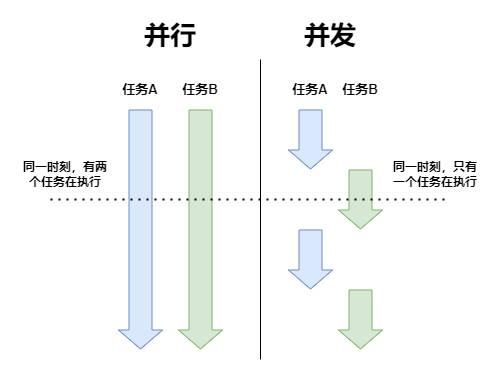
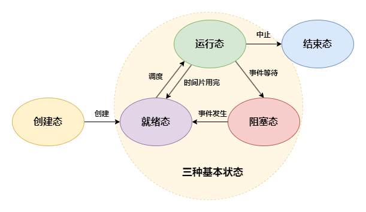
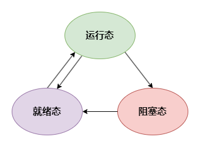
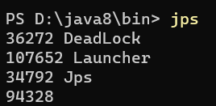
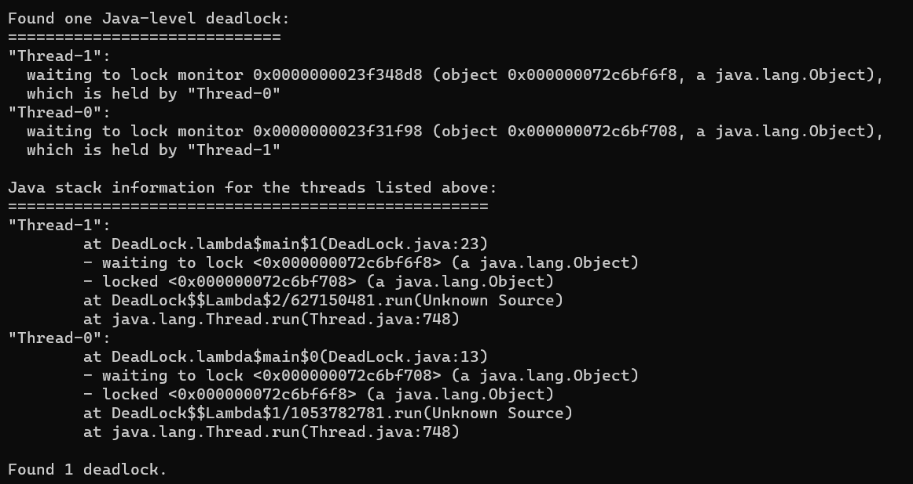
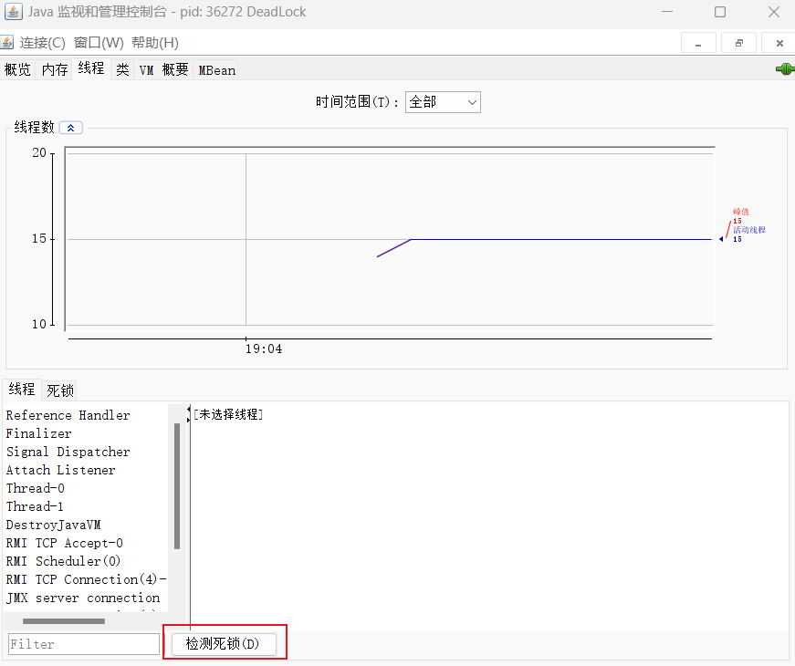
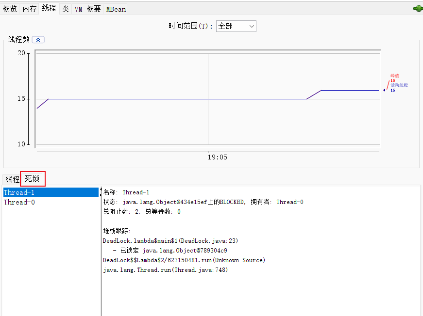
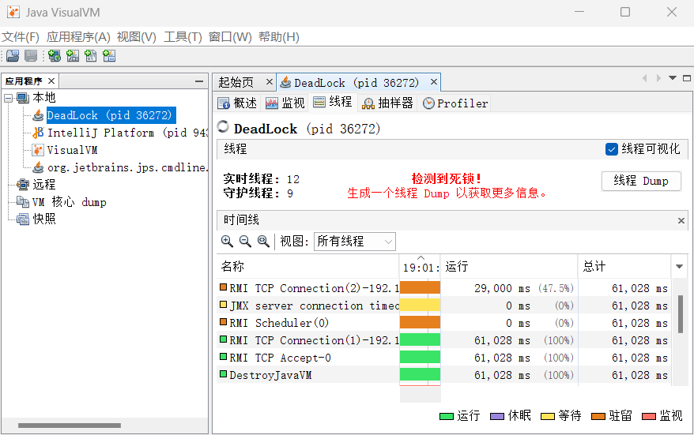

# 并发

## 同步与异步

- **同步（Synchronous）**：发出调用后，必须一直等待返回结果，才能继续后续操作
- **异步（Asynchronous）**：发出调用后，无需等待返回结果，可直接进行后续操作

> 泡方便面时，在那干等着的就是同步，刷会手机的就是异步

## 并发与并行

- **并行（Parallelism）**：同一时刻，多个任务同时执行
- **并发（Concurrency）**：在一个时间段内，多个任务交替执行



## 进程与线程

- **进程（Process）**：进程是静态的程序的动态的执行过程，是系统进行 **资源分配的基本单位**
- **线程（Thread）**：线程是进程当中的一条执行流程，是系统进行 **调度的基本单位**，一个进程内至少有一个线程

### 进程与线程的区别

进程是资源分配的基本单位，创建与销毁，系统都要为之分配或回收资源，且进程间的资源是相互独立的，如果需要进行进程间的通信，需要用到同步和互斥的手段，来保证数据的一致性

线程只需要少量的必不可少的系统资源，开销很小，所以创建与销毁的速度更快，上下文的切换也更快，并且同一个进程内的不同线程可以共享进程的资源，所以可以直接通过读写共享资源来进行线程间通信

- 上下文切换：上下文是指某一时间点上进程或线程的执行状态及相关信息，以便切换回来后进行恢复

> 也可以把进程和线程之间的关系看做父亲跟儿子的关系

### 进程的五种状态



一个进程通常有 5 种状态，其中至少有 3 种基本状态

- **运行态（Runing）**：进程正在运行
- **就绪态（Ready）**：进程处于可运行状态，等待获取 CPU
- **阻塞态（Blocked）**：又称等待态（Waiting），进程正在等待某一事件而暂停运行
- **创建态（New）**：进程正在被创建，暂未转到就绪态
- **结束态（Terminated）**：进程正在从系统中消失，可能是正常执行结束或其他原因中断运行退出

> 进程的七十二变

### 线程的三种状态

线程被视为轻量级进程，所以操作系统线程的状态其实和操作系统进程的状态是一致的，通常只关注最主要的 3 种状态



## 多线程

多线程简单来说就是多个线程并发执行

### 美妙的优点

- 提高执行效率：在应用程序中可能会有很多非常耗时的操作（IO 操作等），只用单线程的话就会产生阻塞，影响其他操作的执行。使用了多线程就可以单独开辟一个线程去处理这类耗时的操作，其他线程可以继续进行其他操作
- 充分利用多核 CPU：如果只使用单线程，会产生一核有难，多核围观的现象。使用多线程就可以更充分利用多核 CPU 的性能，也是提高程序的执行效率

### 让人望而却步的缺点

- 线程安全：多个线程在操作同一个全局变量时都能得到正确的结果，在多线程环境中，为了保证线程安全，需要提供额外的操作，增加了系统的复杂性
- 死锁：多个线程在争夺互相手中的资源，而造成阻塞，若无外力作用，将无限期的等待下去
- 虽然线程占用的资源很少，但过多的线程也是很耗费系统资源的，不仅是资源的占用，创建、销毁、上下文切换的开销也巨大，不仅不会提高效率，反而影响性能

> 如何保证线程安全，是很多程序员对多线程望而却步的重要原因


<small>[Synchronizing Multi Threaded code based on Object Value.](https://kartikiyer.com/2019/06/16/synchronizing-multi-threaded-code-based-on-object-value/)</small>

#### 如何避免线程死锁

```java
public class Test {

    private static Object obj1 = new Object();
    private static Object obj2 = new Object();

    public static void main(String[] args) {
        Thread t1 = new Thread(() -> {
            synchronized (obj1) {
                System.out.println("1、t1获得obj1");
                System.out.println("2、t1开始争抢obj2...");
                synchronized (obj2) {
                    System.out.println("3、t1获得obj2");
                }
            }
        });

        Thread t2 = new Thread(() -> {
            synchronized (obj2) {
                System.out.println("1、t2获得obj2");
                System.out.println("2、t2开始争抢obj1...");
                synchronized (obj1) {
                    System.out.println("3、t2获得obj1");
                }
            }
        });

        t1.start();
        t2.start();
    }
}
```

> 1、t1获得obj1
> 1、t2获得obj2
> 2、t2开始争抢obj1...
> 2、t1开始争抢obj2...

死锁的产生有 4 个必要条件

- 互斥：一个资源只能同时被一个线程所拥有的
- 不可剥夺：一个线程保持的资源只能等待他主动释放，不可以被强行剥夺
- 请求和保持：一个线程保持着某些资源的同时，还去请求别的资源
- 循环等待：产生死锁一定发生了循环等待
  - 循环等待未必一定是死锁

> 你有一个苹果，我有一个梨，我想吃你的苹果，你想吃我的梨，我说先给我苹果，你说先给你梨，行吧，那就互相耗着呗

只要破坏了至少 1 个必要条件，死锁也就可以避免了

- 破坏互斥：一个资源可以被多个线程所拥有的
  - 一般会针对只有读没有写的情况使用共享锁（读锁），如果有写的情况，破坏互斥的话，那么数据一致性也无法保证了
- 破坏不可剥夺：线程可以主动释放持有的资源
  - 为任务添加一个超时时间，时间到了还未结束，线程就主动释放已占有的资源
- 破坏请求和保持：一次性申请所有所需的资源
- 破坏循环等待：按序申请资源，资源按照顺序申请，并按倒序回收

#### 如何排查死锁

##### jps + jstack

先使用 `jps` 检查是否有死锁



再使用 `jstack <进程ID>` 查看堆栈信息



##### jconsole

运行 bin 文件夹中的 jconsole，或者通过命令行运行





##### jvisualvm

运行 bin 文件夹中的 jvisualvm，或者通过命令行运行



## 参考

- [进程](https://zh.wikipedia.org/wiki/%E8%A1%8C%E7%A8%8B)
- [5.1 进程、线程基础知识](https://xiaolincoding.com/os/4_process/process_base.html)
- [Java死锁排查和Java CPU 100% 排查的步骤整理和OOM FullGc案例](https://blog.csdn.net/u010648555/article/details/80721815)
