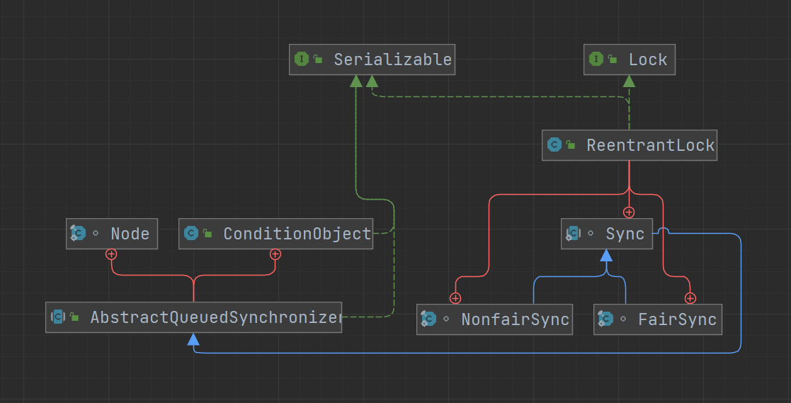

# ReentrantLock

ReentrantLock 是一个基于 AQS 框架的可重入锁，可以完全替代 `synchronized` 关键字，功能更加强大，更灵活，性能更好

- 在 JDK1.6 之后，`synchronized` 做了大量的优化，使得两者的性能差距变得很小
- ReentrantLock 可以响应中断，而 `synchronized` 只能等待其执行完成
- ReentrantLock 可以在获取锁时添加等待时间，超过时间则停止获取，而 `synchronized` 获取不到锁则会一直等待
- ReentrantLock 支持公平锁和非公平锁，而 `synchronized` 只支持非公平锁
- ReentrantLock 上锁期间发生异常无法自动释放锁，而 `synchronized` 在发生异常时会自动释放锁



## 可重入锁

也叫做递归锁，一个线程在获取到某个锁后，可以再次获取该锁而不会被阻塞，其他线程尝试获取的话会被阻塞。使用可重入锁主要是为了同一线程多次获取同一个锁时，避免产生死锁

- 有多少次成功获取到锁，就要同样有多少次释放锁，否则其他线程是获取不到锁的

Java 中自带的锁都是可重入的，如 `synchronized`、ReentrantLock 等

```java
public class Test {

    final static Object lock = new Object();

    public static void main(String[] args) {
        synchronized (lock) {
            System.out.println("第一次获取成功");
            synchronized (lock) {
                System.out.println("第二次获取成功");
            }
        }
    }
}
```

> 第一次获取成功
> 第二次获取成功

如果 `synchronized` 是不可重入的，则第二次获取时会产生死锁

### 使用

```java
public class Test {

    public static void main(String[] args) throws InterruptedException {
        Th th = new Th();

        Thread t1 = new Thread(th, "线程1");
        Thread t2 = new Thread(th, "线程2");

        t1.start();
        t2.start();
    }
}

class Th extends Thread {

    static ReentrantLock lock = new ReentrantLock(false);

    @Override
    public void run() {
        for (int i = 0; i < 5; i++) {
            lock.lock();
            try {
                System.out.println(Thread.currentThread().getName());
            } finally {
                lock.unlock();
            }
        }
    }
}
```

> 线程1
> 线程1
> 线程1
> 线程1
> 线程1
> 线程2
> 线程2
> 线程2
> 线程2
> 线程2

- 将 ReentrantLock 改为公平锁

> 线程1
> 线程2
> 线程1
> 线程2
> 线程1
> 线程2
> 线程1
> 线程2
> 线程1
> 线程2

### Lock 接口

ReentrantLock 是实现自 Lock 接口，Lock 接口主要定义了获取锁及释放锁的操作

```java
public interface Lock {

    // 获取锁，如果锁被占用，则等待
    void lock();

    // 同lock，可响应中断
    void lockInterruptibly() throws InterruptedException;

    // 尝试获取锁，成功返回true，失败返回false，直接返回结果，不会等待
    boolean tryLock();

    // 尝试获取锁，有时间限制
    boolean tryLock(long time, TimeUnit unit) throws InterruptedException;

    // 释放锁
    void unlock();

    // 新建条件状态
    Condition newCondition();
}
```

### 构造方法

```java
// 当前使用的锁
private final Sync sync;

// 默认使用非公平锁
public ReentrantLock() {
    sync = new NonfairSync();
}

// 是否使用公平锁
public ReentrantLock(boolean fair) {
    sync = fair ? new FairSync() : new NonfairSync();
}
```

- 公平锁：多个线程按照申请锁的顺序来获取锁，线程直接进入队列中排队，队列中的第一个线程才能获得锁
- 非公平锁：多个线程加锁时直接尝试获取锁，获取不到才会到等待队列的队尾等待。但如果此时锁刚好可用，那么这个线程可以无需阻塞直接获取到锁

非公平锁的优点是可以减少唤起线程的开销，整体的吞吐效率高，因为线程有几率不阻塞直接获得锁，CPU 不必唤醒所有线程。缺点是处于等待队列中的线程可能会饿死，或者等很久才会获得锁

### 除了 Sync 内部类，ReentrantLock 的其余部分

ReentrantLock 各个方法内部或多或少都依靠着 Sync 类实现功能

```java
public class ReentrantLock implements Lock, java.io.Serializable {
    private static final long serialVersionUID = 7373984872572414699L;

    private final Sync sync;

    public ReentrantLock() {
        sync = new NonfairSync();
    }

    public ReentrantLock(boolean fair) {
        sync = fair ? new FairSync() : new NonfairSync();
    }

    public void lock() {
        sync.lock();
    }

    public void lockInterruptibly() throws InterruptedException {
        sync.acquireInterruptibly(1);
    }

    public boolean tryLock() {
        return sync.nonfairTryAcquire(1);
    }

    public boolean tryLock(long timeout, TimeUnit unit)
            throws InterruptedException {
        return sync.tryAcquireNanos(1, unit.toNanos(timeout));
    }

    public void unlock() {
        sync.release(1);
    }

    // 创建一个新的等待队列
    public Condition newCondition() {
        return sync.newCondition();
    }

    // 获取当前线程持有的该锁的数量
    public int getHoldCount() {
        return sync.getHoldCount();
    }

    // 判断该锁是否被当前线程持有
    public boolean isHeldByCurrentThread() {
        return sync.isHeldExclusively();
    }

    // 判断该锁是否已被某个线程持有
    public boolean isLocked() {
        return sync.isLocked();
    }

    // 判断当前的锁是否是公平锁
    public final boolean isFair() {
        return sync instanceof FairSync;
    }

    // 获取该锁的当前持有者
    protected Thread getOwner() {
        return sync.getOwner();
    }

    // 判断是否有线程在等待该锁
    public final boolean hasQueuedThreads() {
        return sync.hasQueuedThreads();
    }

    // 判断给定的线程是否在等待该锁
    public final boolean hasQueuedThread(Thread thread) {
        return sync.isQueued(thread);
    }

    // 获取正在等待该锁的线程数，是个估计值
    public final int getQueueLength() {
        return sync.getQueueLength();
    }

    // 获取正在等待该锁的线程的列表
    protected Collection<Thread> getQueuedThreads() {
        return sync.getQueuedThreads();
    }

    // 判断给定的等待队列上是否有等待者
    public boolean hasWaiters(Condition condition) {
        if (condition == null)
            throw new NullPointerException();
        if (!(condition instanceof AbstractQueuedSynchronizer.ConditionObject))
            throw new IllegalArgumentException("not owner");
        return sync.hasWaiters((AbstractQueuedSynchronizer.ConditionObject)condition);
    }

    // 判断给定的等待队列长度
    public int getWaitQueueLength(Condition condition) {
        if (condition == null)
            throw new NullPointerException();
        if (!(condition instanceof AbstractQueuedSynchronizer.ConditionObject))
            throw new IllegalArgumentException("not owner");
        return sync.getWaitQueueLength((AbstractQueuedSynchronizer.ConditionObject)condition);
    }

    // 获得给定的等待队列的等待者列表
    protected Collection<Thread> getWaitingThreads(Condition condition) {
        if (condition == null)
            throw new NullPointerException();
        if (!(condition instanceof AbstractQueuedSynchronizer.ConditionObject))
            throw new IllegalArgumentException("not owner");
        return sync.getWaitingThreads((AbstractQueuedSynchronizer.ConditionObject)condition);
    }

    // 打印
    public String toString() {
        Thread o = sync.getOwner();
        return super.toString() + ((o == null) ?
                                   "[Unlocked]" :
                                   "[Locked by thread " + o.getName() + "]");
    }
}
```

### Sync 内部类

ReentrantLock 主要依靠内部类 Sync 实现加锁解锁等操作，Sync 又是基于 AQS 实现的

```java
abstract static class Sync extends AbstractQueuedSynchronizer {
    private static final long serialVersionUID = -5179523762034025860L;

    abstract void lock();

    // 以非公平的方式获取锁，传入需锁定的次数
    final boolean nonfairTryAcquire(int acquires) {
        final Thread current = Thread.currentThread();
        int c = getState();
        // 判断当前是否有线程持有该锁
        if (c == 0) {
            // 利用CAS去尝试获取锁
            if (compareAndSetState(0, acquires)) {
                setExclusiveOwnerThread(current);
                return true;
            }
        }
        // 确保独占模式的可重入性
        // 如果当前有线程持有该锁，则判断当前线程是否就是持有锁的线程
        else if (current == getExclusiveOwnerThread()) {
            int nextc = c + acquires;
            if (nextc < 0) // overflow
                throw new Error("Maximum lock count exceeded");
            setState(nextc);
            return true;
        }
        return false;
    }

    // 尝试释放锁
    protected final boolean tryRelease(int releases) {
        int c = getState() - releases;
        if (Thread.currentThread() != getExclusiveOwnerThread())
            throw new IllegalMonitorStateException();
        boolean free = false;
        // 该线程的锁释放完成，返回成功，并将持有锁的线程置空
        if (c == 0) {
            free = true;
            setExclusiveOwnerThread(null);
        }
        setState(c);
        return free;
    }

    // 判断当前线程是否是持有该锁的线程
    protected final boolean isHeldExclusively() {
        return getExclusiveOwnerThread() == Thread.currentThread();
    }

    // 创建一个新的等待队列
    final ConditionObject newCondition() {
        return new ConditionObject();
    }

    // 获取该锁的当前持有者
    final Thread getOwner() {
        return getState() == 0 ? null : getExclusiveOwnerThread();
    }

    // 获取当前线程持有的该锁的数量
    final int getHoldCount() {
        return isHeldExclusively() ? getState() : 0;
    }

    // 判断该锁是否已被某个线程持有
    final boolean isLocked() {
        return getState() != 0;
    }

    // 反序列化操作
    private void readObject(java.io.ObjectInputStream s)
        throws java.io.IOException, ClassNotFoundException {
        s.defaultReadObject();
        setState(0); // reset to unlocked state
    }
}

// 非公平锁
static final class NonfairSync extends Sync {
    private static final long serialVersionUID = 7316153563782823691L;

    final void lock() {
        // 先利用CAS操作尝试获取锁，获取不到就进入同步队列
        if (compareAndSetState(0, 1))
            setExclusiveOwnerThread(Thread.currentThread());
        else
            acquire(1);
    }

    protected final boolean tryAcquire(int acquires) {
        return nonfairTryAcquire(acquires);
    }
}

// 公平锁
static final class FairSync extends Sync {
    private static final long serialVersionUID = -3000897897090466540L;

    final void lock() {
        acquire(1);
    }

    // 与Sync类中的nonfairTryAcquire方法类似，只多了检查是否有同步队列的操作
    protected final boolean tryAcquire(int acquires) {
        final Thread current = Thread.currentThread();
        int c = getState();
        // 判断当前是否有线程持有该锁
        if (c == 0) {
            // 如果当前没有同步队列，或者有同步队列且当前线程就是下一个要获取锁的线程（不是头结点，而是头结点的后继节点），且通过CAS操作成功获取到锁，如果是就不需要进队列了
            // 如果有同步队列，且同步队列中的节点目前都没有持有锁，会进行争抢
            if (!hasQueuedPredecessors() &&
                compareAndSetState(0, acquires)) {
                setExclusiveOwnerThread(current);
                return true;
            }
        }
        // 如果当前有线程持有该锁，则判断当前线程是否就是持有锁的线程，如果是就不需要进队列了
        else if (current == getExclusiveOwnerThread()) {
            int nextc = c + acquires;
            if (nextc < 0)
                throw new Error("Maximum lock count exceeded");
            setState(nextc);
            return true;
        }
        return false;
    }
}
```

`hasQueuedPredecessors` 方法位于 AQS 中

```java
// 如果当前线程之前已经有一个在排队的线程，则返回true
// 如果队列为空，或者当前线程位于队列的头部（非头节点），则返回false
public final boolean hasQueuedPredecessors() {
    Node t = tail;
    Node h = head;
    Node s;
    // 如果h != t则说明队列不为空
    // 如果(s = h.next) == null则说明队列中只有一个头结点
    // 如果s.thread != Thread.currentThread()则说明节点的后继节点持有的线程不是当前线程，因为头结点是不持有线程的
    return h != t &&
        ((s = h.next) == null || s.thread != Thread.currentThread());
}
```

`acquire` 与 `release` 方法位于 AQS 中

```java
public final void acquire(int arg) {
    if (!tryAcquire(arg) &&
        acquireQueued(addWaiter(Node.EXCLUSIVE), arg))
        selfInterrupt();
}
```

```java
public final boolean release(int arg) {
    // 判断条件由子类进行具体实现
    if (tryRelease(arg)) {
        Node h = head;
        // 如果头节点不是等待状态，则唤醒头节点的后继节点
        if (h != null && h.waitStatus != 0)
            unparkSuccessor(h);
        return true;
    }
    return false;
}
```

### 再回首，结合 AQS 再看看获取与释放资源流程

#### 获取资源

调用 ReentrantLock 类的 `lock` 方法

```java
public void lock() {
    sync.lock();
}
```

`lock` 方法里调用的是 Sync 内部类中的 `lock` 方法，有公平（FairSync）和非公平（NonfairSync）两种实现

```java
abstract void lock();

// 公平锁
final void lock() {
    acquire(1);
}

// 非公平锁
final void lock() {
    // 尝试获取锁
    if (compareAndSetState(0, 1))
        setExclusiveOwnerThread(Thread.currentThread());
    else
        acquire(1);
}
```

非公平锁会先去尝试获取锁，如果失败了就执行与公平锁一样的操作

`acquire` 方法在 AQS 中

```java
public final void acquire(int arg) {
    if (!tryAcquire(arg) &&
        acquireQueued(addWaiter(Node.EXCLUSIVE), arg))
        selfInterrupt();
}
```

`acquire` 先调用 `tryAcquire` 去尝试获取锁，而 `tryAcquire` 方法又在 FairSync 与 NonfairSync 类中被具体实现

`tryAcquire` 方法获取锁成功返回 `true`，否则返回 `false`

```java
// 公平锁
protected final boolean tryAcquire(int acquires) {
    final Thread current = Thread.currentThread();
    int c = getState();
    if (c == 0) {
        if (!hasQueuedPredecessors() &&
            compareAndSetState(0, acquires)) {
            setExclusiveOwnerThread(current);
            return true;
        }
    }
    else if (current == getExclusiveOwnerThread()) {
        int nextc = c + acquires;
        if (nextc < 0)
            throw new Error("Maximum lock count exceeded");
        setState(nextc);
        return true;
    }
    return false;
}

// 非公平锁
protected final boolean tryAcquire(int acquires) {
    return nonfairTryAcquire(acquires);
}

// Sync类中的方法
final boolean nonfairTryAcquire(int acquires) {
    final Thread current = Thread.currentThread();
    int c = getState();
    if (c == 0) {
        if (compareAndSetState(0, acquires)) {
            setExclusiveOwnerThread(current);
            return true;
        }
    }
    else if (current == getExclusiveOwnerThread()) {
        int nextc = c + acquires;
        if (nextc < 0) // overflow
            throw new Error("Maximum lock count exceeded");
        setState(nextc);
        return true;
    }
    return false;
}
```

首先去判断当前有没有线程持有这个锁，就是 `state` 等不等于 0

- `state` 等于 0：代表锁没被任何线程占用，当前线程就可以尝试去获取锁
- `state` 不等于 0：代表锁已被占用，再判断持有该锁的线程是不是就是当前线程，是的话就再获取一次锁

公平锁与非公平锁的 `tryAcquire` 作用都一样，代码也差不多，但公平锁还多了一个 `hasQueuedPredecessors` 方法，这个方法不需要太多关注，只要知道返回结果代表的意思就行

- 如果当前线程之前已经有一个在排队的线程，则返回 `true`
- 如果队列为空，或者当前线程位于队列的头部（非头节点），则返回 `false`

这里需要结果返回 `false` 才会执行后面的判断，否则就不公平了，因为在你之前已经有线程在排队，你是公平锁，你不能去插队

调用完 `tryAcquire` 方法后，如果没有成功回去到锁，就执行 acquire 方法后续的操作，先将当前线程加到队列中

```java
private Node addWaiter(Node mode) {
    Node node = new Node(Thread.currentThread(), mode);
    Node pred = tail;
    // 如果有尾节点，说明队列不为空
    if (pred != null) {
        // 将当前节点的前驱节点指向尾节点
        node.prev = pred;
        if (compareAndSetTail(pred, node)) {
            pred.next = node;
            return node;
        }
    }
    enq(node);
    return node;
}

private Node enq(final Node node) {
    for (;;) {
        Node t = tail;
        // 如果队列为空，则先进行初始化
        if (t == null) {
            if (compareAndSetHead(new Node()))
                tail = head;
        } else {
            node.prev = t;
            if (compareAndSetTail(t, node)) {
                t.next = node;
                return t;
            }
        }
    }
}
```

节点加入成功后，调用 `acquireQueued` 方法以独占模式尝试获取资源

```java
final boolean acquireQueued(final Node node, int arg) {
    boolean failed = true;
    try {
        boolean interrupted = false;
        for (;;) {
            final Node p = node.predecessor();
            // 判断当前节点的前驱节点是否是头结点，如果是则尝试获取锁
            if (p == head && tryAcquire(arg)) {
                // 如果成功获取到了锁，就将该节点设置为头节点
                setHead(node);
                p.next = null; // help GC
                failed = false;
                return interrupted;
            }
            // 判断是否需要阻塞该节点持有的线程
            if (shouldParkAfterFailedAcquire(p, node) &&
                parkAndCheckInterrupt())
                interrupted = true;
        }
    } finally {
        if (failed)
            cancelAcquire(node);
    }
}

// 设置头节点
private void setHead(Node node) {
    head = node;
    node.thread = null;
    node.prev = null;
}

// 判断是否需要阻塞该节点持有的线程
// pred：当前节点的前驱节点
// node：当前节点
private static boolean shouldParkAfterFailedAcquire(Node pred, Node node) {
    int ws = pred.waitStatus;
    // 前驱节点的状态是SIGNAL
    // 表示其后继节点需要被唤醒，即该线程被释放或被取消时，必须唤醒其后继节点
    if (ws == Node.SIGNAL)
        return true;
    if (ws > 0) {
        do {
            node.prev = pred = pred.prev;
        } while (pred.waitStatus > 0);
        pred.next = node;
    } else {
        // 前驱节点的状态waitStatus是0或者PROPAGATE，则将状态改为SIGNAL
        compareAndSetWaitStatus(pred, ws, Node.SIGNAL);
    }
    return false;
}
```

`acquireQueued` 方法返回 `false` 就说明该节点获取到了锁，返回 `true`，该节点持有的线程就要被中断了

#### 释放资源

调用 ReentrantLock 类的 `unlock` 方法

```java
public void unlock() {
    sync.release(1);
}
```

`unlock` 方法里调用的是 Sync 内部类中的 `release` 方法

```java
public final boolean release(int arg) {
    if (tryRelease(arg)) {
        Node h = head;
        if (h != null && h.waitStatus != 0)
            unparkSuccessor(h);
        return true;
    }
    return false;
}
```

`release` 先去调用 Sync 类中 重写 AQS 的 `tryRelease` 方法

```java
protected final boolean tryRelease(int releases) {
    int c = getState() - releases;
    if (Thread.currentThread() != getExclusiveOwnerThread())
        throw new IllegalMonitorStateException();
    boolean free = false;
    if (c == 0) {
        free = true;
        setExclusiveOwnerThread(null);
    }
    setState(c);
    return free;
}
```

首先判断当前线程是不是就是持有锁的线程，因为 ReentrantLock 是独占锁，如果当前线程不是持有锁的线程，也就没资格去释放锁

如果所有的锁的释放完全了，就是获取了多少次，也释放了同样次数的锁，那么就皆大欢喜，就可以唤醒后继节点的线程了，否则就返回释放失败的结果

```java
private void unparkSuccessor(Node node) {
    int ws = node.waitStatus;
    if (ws < 0)
        compareAndSetWaitStatus(node, ws, 0);

    Node s = node.next;
    // 后继节点为空，或被取消
    if (s == null || s.waitStatus > 0) {
        s = null;
        for (Node t = tail; t != null && t != node; t = t.prev)
            if (t.waitStatus <= 0)
                s = t;
    }
    // 后继节点不为空，则将其唤醒
    if (s != null)
        LockSupport.unpark(s.thread);
}
```

## 参考

- [ReentrantLock 源码](https://www.cnblogs.com/mayang2465/p/14621269.html)
- [AQS——hasQueuedPredecessors方法](https://blog.csdn.net/qq_57205114/article/details/124083129)
- [不可不说的Java“锁”事](https://tech.meituan.com/2018/11/15/java-lock.html)
