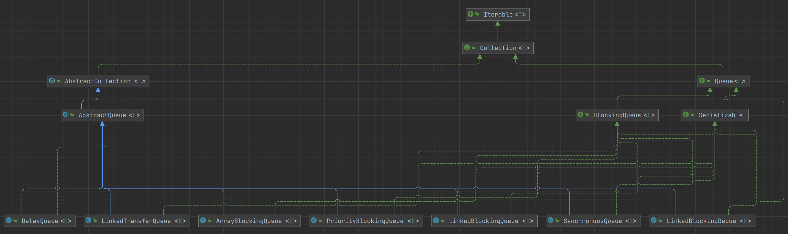

# 阻塞队列

阻塞队列常用于生产者和消费者的场景，生产者是往队列里添加元素的线程，消费者是从队列里拿元素的线程

- 生产者-消费者模式：生产者一直生产资源，消费者一直消费资源，两者不直接交流，而是利用一个缓冲池，生产者将生产出的资源放入缓冲池中，消费者从缓冲池中拿到资源进行消费

阻塞队列的阻塞主要体现在，缓冲池空了，要阻塞消费者，唤醒生产者；缓冲池满了，要阻塞生产者，唤醒消费者

## Queue

阻塞队列首先得是个队列，在 Java 中具有队列性质的集合都实现自 Queue 接口，主要有添加、删除、检查三种操作，每种操作又各有抛出异常、返回特殊值这两个版本

```java
public interface Queue<E> extends Collection<E> {
    
    // 向队列中添加一个元素，如果是一个有界队列且空间不足，则抛出异常
    boolean add(E e);

    // 向队列中添加一个元素，如果是一个有界队列且空间不足，则返回false
    boolean offer(E e);

    // 移除并返回队首元素，如果队列为空，则抛出异常
    E remove();

    // 移除并返回队首元素，如果队列为空，则返回null
    E poll();

    // 获得队首元素，如果队列为空，则抛出异常
    E element();

    // 获得队首元素，如果队列为空，则返回null
    E peek();
}
```

## BlockingQueue

所有的阻塞队列都实现自 BlockingQueue 接口

```java
public interface BlockingQueue<E> extends Queue<E> {
    
    // 向队列中添加一个元素，如果是一个有界队列且空间不足，则抛出异常
    boolean add(E e);

    // 向队列中添加一个元素，如果是一个有界队列且空间不足，则返回false
    boolean offer(E e);

    // 向队列中添加一个元素，如果是一个有界队列且空间不足，则会一直阻塞
    void put(E e) throws InterruptedException;

    // 向队列中添加一个元素，如果是一个有界队列且空间不足，则会等待一段时间，超时返回false
    boolean offer(E e, long timeout, TimeUnit unit)
        throws InterruptedException;

    // 移除并返回队首元素，如果队列为空，则会一直阻塞
    E take() throws InterruptedException;

    // 移除并返回队首元素，如果队列为空，会等待一段时间，超时返回null
    E poll(long timeout, TimeUnit unit)
        throws InterruptedException;

    // 返回该队列剩余可插入的元素数量，最大值为Integer.MAX_VALUE
    int remainingCapacity();

    // 从队列中移除与给定元素相等的元素，如果有多个，只移除第一个
    boolean remove(Object o);

    // 判断队列中是否存在给定的元素
    public boolean contains(Object o);

    // 移除队列中给定数量的元素，并将他们添加到给定的集合中
    int drainTo(Collection<? super E> c, int maxElements);
}
```

|  | 抛出异常 | 返回特殊值 | 阻塞 | 超时退出 |
| :-: | :-: | :-: | :-: | :-: |
| 插入 | `add(e)` | `offer(e)` | `put(e)`* | `offer(e, time, unit)`* |
| 移除 | `remove()` | `poll()` | `take()`* | `poll(time, unit)`* |
| 检查 | `element()` | `peek()` |  |  |

- 标记 `*` 的为 BlockingQueue 特有的方法

### 实现类

BlockingQueue 主要有 7 个实现类



- ArrayBlockingQueue：由 **数组** 结构组成的 **有界** 阻塞队列
- LinkedBlockingQueue：由 **链表** 结构组成的 **有界** 阻塞队列，默认队列的大小为 `Integer.MAX_VALUE`
- LinkedBlockingDeque：由 **链表** 结构组成的 **有界** **双向** 阻塞队列
- LinkedTransferQueue：由 **链表** 结构组成的无界阻塞队列
- SynchronousQueue：**不存储元素** 的阻塞队列
- PriorityBlockingQueue：支持 **优先级** 排序的 **无界** 阻塞队列
- DelayQueue：使用 **延迟优先级** 的 **无界** 阻塞队列

有固定大小被称作有界队列，没有固定大小的，可以一直添加称作无界队列，当然元素是不可能无限制的添加的，在 Java 中的上限一般是 `Integer.MAX_VALUE`，相当于无界

- 所以通常把创建时无需设置容量大小，可以自动扩容至 `Integer.MAX_VALUE`，或者创建时设置容量大小为 `Integer.MAX_VALUE` 的队列称作无界队列

## 参考

- [第十三章 阻塞队列](http://concurrent.redspider.group/article/03/13.html)
- [深入浅出Java多线程-阻塞队列BlockingQueue](https://crazyfzw.github.io/2020/11/20/concurrent-blocking-queue/)
