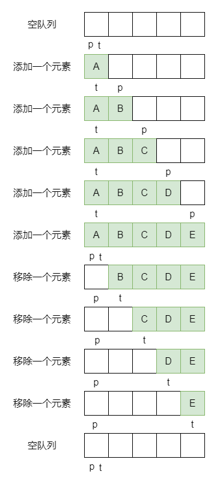

# ArrayBlockingQueue

## 成员变量

```java
// 存放数据的数组
final Object[] items;

// 用于下次执行take、poll、peek、remove方法的数组下标，即获取方法
int takeIndex;

// 用于下次执行put、offer、add方法的数组下标，即添加方法
int putIndex;

// 队列中元素的数量
int count;

// 控制所有并发访问的锁
final ReentrantLock lock;

// 队列空时，消费者线程等待队列
private final Condition notEmpty;

// 队列满时，生产者线程等待队列
private final Condition notFull;

// 迭代器
transient Itrs itrs = null;
```

### notEmpty 与 notFull

notEmpty 与 notFull 的字面意思指的是他们的唤醒条件

- 如果队列不为空就唤醒一个 notEmpty 等待队列中的线程，队列为空就阻塞
  - notEmpty.await 用在移除操作中，队列为空，也就无法移除元素了，所以得阻塞
  - notEmpty.signal 用在添加操作中，只要元素能添加成功，队列肯定就不为空了，所以可以唤醒了
- 如果队列未满，就唤醒一个 notFull 等待队列中的线程，队列已满就阻塞
  - notFull.await：用在添加操作中，队列满了，也就无法再添加元素了，所以得阻塞
  - notFull.signal：用在移除操作中，只要元素能成功移除，队列肯定就不是满的了，所以可以唤醒了

### takeIndex 与 putIndex

ArrayBlockingQueue 是通过数组存储元素的，如果是按照下标为 0 的元素为头结点，那么每次从队列中获取一个元素，之后的元素都要前移一位，性能开销太大了

通过 takeIndex 与 putIndex 两个指针，一个指向可获取元素的位置，一个指向可插入元素的位置。通过两个指针的移动就可以快速的找到获取和插入的位置，也不需要频繁的移动元素，可以循环的利用数组



## 构造方法

```java
// 根据给定的容量创建一个队列，默认非公平锁
public ArrayBlockingQueue(int capacity) {
    this(capacity, false);
}

// 根据给定的容量及公平方式创建一个队列
public ArrayBlockingQueue(int capacity, boolean fair) {
    if (capacity <= 0)
        throw new IllegalArgumentException();
    this.items = new Object[capacity];
    lock = new ReentrantLock(fair);
    notEmpty = lock.newCondition();
    notFull =  lock.newCondition();
}

// 根据给定的容量及公平方式创建一个队列，并将给定的集合中的元素复制到队列中
public ArrayBlockingQueue(int capacity, boolean fair,
                            Collection<? extends E> c) {
    this(capacity, fair);

    final ReentrantLock lock = this.lock;
    lock.lock(); // Lock only for visibility, not mutual exclusion
    try {
        int i = 0;
        try {
            for (E e : c) {
                checkNotNull(e);
                items[i++] = e;
            }
        } catch (ArrayIndexOutOfBoundsException ex) {
            throw new IllegalArgumentException();
        }
        count = i;
        // 如果队列已满，则putIndex为0，无法执行下次的添加操作
        putIndex = (i == capacity) ? 0 : i;
    } finally {
        lock.unlock();
    }
}
```

## 添加方法

### add

```java
public boolean add(E e) {
    return super.add(e);
}

public boolean add(E e) {
    // 内部调用了offer方法
    if (offer(e))
        return true;
    else
        throw new IllegalStateException("Queue full");
}
```

### offer

```java
public boolean offer(E e) {
    checkNotNull(e);
    final ReentrantLock lock = this.lock;
    lock.lock();
    try {
        // 如果队列已满返回false，否则进行入队操作
        if (count == items.length)
            return false;
        else {
            enqueue(e);
            return true;
        }
    } finally {
        lock.unlock();
    }
}

// 有超时时间的
public boolean offer(E e, long timeout, TimeUnit unit)
    throws InterruptedException {

    checkNotNull(e);
    long nanos = unit.toNanos(timeout);
    final ReentrantLock lock = this.lock;
    lock.lockInterruptibly();
    try {
        // 如果队列已满，将当前线程挂起放入notFull等待队列中，等待被唤醒或者超时
        while (count == items.length) {
            if (nanos <= 0)
                return false;
            nanos = notFull.awaitNanos(nanos);
        }
        enqueue(e);
        return true;
    } finally {
        lock.unlock();
    }
}
```

### put

```java
public void put(E e) throws InterruptedException {
    checkNotNull(e);
    final ReentrantLock lock = this.lock;
    lock.lockInterruptibly();
    try {
        // 如果队列已满，将当前线程挂起放入notFull等待队列中，等待被唤醒
        // 等待期间会释放锁
        while (count == items.length)
            notFull.await();
        enqueue(e);
    } finally {
        lock.unlock();
    }
}
```

### 入队操作

```java
private void enqueue(E x) {
    final Object[] items = this.items;
    // 将给定的元素添加到当前可以执行添加操作的下标位置
    items[putIndex] = x;
    // 如果putIndex自增后等于队列容量上限，将putIndex设置为0
    if (++putIndex == items.length)
        putIndex = 0;
    count++;
    // 唤醒notEmpty等待队列中的第一个可用线程，可以去获取元素了
    notEmpty.signal();
}
```

## 移除方法

### remove

```java
public E remove() {
    // 内部调用了poll方法
    E x = poll();
    if (x != null)
        return x;
    else
        throw new NoSuchElementException();
}
```

### poll

```java
public E poll() {
    final ReentrantLock lock = this.lock;
    lock.lock();
    try {
        // 如果队列为空，返回null
        return (count == 0) ? null : dequeue();
    } finally {
        lock.unlock();
    }
}

// 有超时时间的
public E poll(long timeout, TimeUnit unit) throws InterruptedException {
    long nanos = unit.toNanos(timeout);
    final ReentrantLock lock = this.lock;
    lock.lockInterruptibly();
    try {
        // 如果队列为空，将当前线程挂起放入notEmpty等待队列中，等待被唤醒或超时
        while (count == 0) {
            if (nanos <= 0)
                return null;
            nanos = notEmpty.awaitNanos(nanos);
        }
        return dequeue();
    } finally {
        lock.unlock();
    }
}
```

### take

```java
public E take() throws InterruptedException {
    final ReentrantLock lock = this.lock;
    lock.lockInterruptibly();
    try {
        // 如果队列为空，将当前线程挂起放入notEmpty等待队列中，等待被唤醒
        while (count == 0)
            notEmpty.await();
        return dequeue();
    } finally {
        lock.unlock();
    }
}
```

### 出队操作

```java
private E dequeue() {
    final Object[] items = this.items;
    // 通过takeIndex获取元素
    @SuppressWarnings("unchecked")
    E x = (E) items[takeIndex];
    // 将该下标位置置空
    items[takeIndex] = null;
    // 如果takeIndex自增后等于队列容量上限，将takeIndex设置为0
    if (++takeIndex == items.length)
        takeIndex = 0;
    count--;
    if (itrs != null)
        itrs.elementDequeued();
    // 唤醒notFull等待队列中的第一个可用线程，可以去添加元素了
    notFull.signal();
    return x;
}
```

## 检查方法

### element

```java
public E element() {
    // 内部调用了peek方法
    E x = peek();
    if (x != null)
        return x;
    else
        throw new NoSuchElementException();
}
```

### peek

```java
public E peek() {
    final ReentrantLock lock = this.lock;
    lock.lock();
    try {
        return itemAt(takeIndex); // null when queue is empty
    } finally {
        lock.unlock();
    }
}

// 通过takeIndex获取元素
final E itemAt(int i) {
    return (E) items[i];
}
```

## 参考

- [第十三章 阻塞队列](http://concurrent.redspider.group/article/03/13.html)
- [深入浅出Java多线程-阻塞队列BlockingQueue](https://crazyfzw.github.io/2020/11/20/concurrent-blocking-queue/)
- [ArrayBlockingQueue 详细源码解析](https://juejin.cn/post/6844903989788540941)
- [ArrayBlockingQueue uses a single lock for insertion and removal but LinkedBlockingQueue uses 2 separate locks](https://stackoverflow.com/questions/11015571/arrayblockingqueue-uses-a-single-lock-for-insertion-and-removal-but-linkedblocki)
