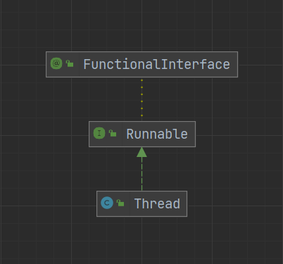
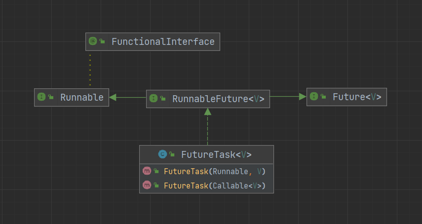

# Java 多线程

## Java 线程的六种状态

```java
public enum State {

    NEW,

    RUNNABLE,

    BLOCKED,

    WAITING,

    TIMED_WAITING,

    TERMINATED;
}
```

- **NEW（新生状态）**：线程刚刚创建，还未开始执行，等到线程的 `start` 方法执行，才表示线程开始执行
- **RUNNABLE（运行状态，也可能是等待状态）**：线程正在执行，也可能正在等待 CPU 分配资源
- **BLOCKED（阻塞状态）**：等待锁的释放
- **WAITING（等待状态）**：等待事件的发生
- **TIMED_WAITING（超时等待状态）**：等待事件的发生，超过时间限制后可自行返回
- **TERMINATED（终止状态）**：线程执行完毕


<small>[挑错 |《Java 并发编程的艺术》中关于线程状态的三处错误](https://mp.weixin.qq.com/s/UOrXql_LhOD8dhTq_EPI0w)</small>

### 示例代码

```java
public class Test {

    private static Object lock = new Object();

    public static void main(String[] args) throws InterruptedException {

        Thread thread_runnable = new Thread(() -> {
            synchronized (lock) {
                while (true) {}
            }
        });

        Thread thread_blocked = new Thread(() -> {
            synchronized (lock) {
                System.out.println(lock);
            }
        });

        Thread thread_waiting = new Thread(() -> {
            try {
                thread_runnable.join();
            } catch (InterruptedException e) {
                throw new RuntimeException(e);
            }
        });

        Thread thread_timed_waiting = new Thread(() -> {
            try {
                thread_runnable.join(1000 * 60);
            } catch (InterruptedException e) {
                throw new RuntimeException(e);
            }
        });

        Thread thread_terminated = new Thread();

        System.out.println(thread_runnable.getState());

        thread_runnable.start();
        // 确保thread_runnable线程已开始运行
        Thread.sleep(50);
        thread_blocked.start();
        thread_waiting.start();
        thread_timed_waiting.start();
        thread_terminated.start();
        // 确保所有线程都已开始运行
        Thread.sleep(50);

        System.out.println(thread_runnable.getState());
        System.out.println(thread_blocked.getState());
        System.out.println(thread_waiting.getState());
        System.out.println(thread_timed_waiting.getState());
        System.out.println(thread_terminated.getState());
    }
}
```

> NEW
> RUNNABLE
> BLOCKED
> WAITING
> TIMED_WAITING
> TERMINATED

### 为什么 Java 用 RUNNABLE 代替了 READY 和 RUNNING 状态

对于现代的分时操作系统，都是通过争抢时间片来进行调度的，获得了时间片就开始执行，时间片用完就释放出 CPU，再继续争抢时间片。也就是说处于就绪态的线程获得了时间片，就会转为运行态，运行态的线程时间片用完，就会转回就绪态

一个时间片通常只有 10 ~ 20 毫秒，即 0.01 ~ 0.02 秒，所以线程会在就绪态和运行态之间飞速的切换，再去做具体的区分意义不大

## Java 中线程的实现

### Thread 类

最常用的实现方式，有三种具体的实现方法

- 继承 Thread 类，并重写 `run` 方法
- 创建匿名内部类，并重写 `run` 方法
- 使用 lambda 表达式重写 `run` 方法

```java
public class Test {

    public static void main(String[] args) {
        
        // 继承
        Thread t1 = new MyThread();
        
        // 匿名内部类
        Thread t2 = new Thread() {
            @Override
            public void run() {
                System.out.println("t2...");
            }
        };

        // lambda表达式
        Thread t3 = new Thread(()->{
            System.out.println("t3...");
        });
    }
}

class MyThread extends Thread {
    @Override
    public void run() {
        System.out.println("t1...");
    }
}
```

### Runnable 接口

```java
@FunctionalInterface
public interface Runnable {
    public abstract void run();
}
```



Thread 类就是实现的 Runnable 接口，Runnable 又继承了 FunctionalInterface，所以支持函数式编程的特性也由此而来

```java
public class Test {

    public static void main(String[] args) {
        Thread thread = new Thread(new MyRunnable());
    }
}

class MyRunnable implements Runnable {

    @Override
    public void run() {
        System.out.println("my runnable");
    }
}
```

### Callable 接口

```java
@FunctionalInterface
public interface Callable<V> {
    V call() throws Exception;
}
```

使用 Runnable 和 Thread 都是没有返回值的，而当我们需要一个线程执行完任务后能给出返回值，就可以使用 Callable + FutureTask（中转）

```java
public class Test {

    public static void main(String[] args) throws Exception {
        // 无法直接传入 Callable 类型，通过 FutureTask 中转
        FutureTask<String> task = new FutureTask<>(new MyCallable());
        new Thread(task).start();
        
        System.out.println("我在你前面");
        
        // 注意调用 get 方法会阻塞当前线程，直到得到结果
        System.out.println(task.get());
        
        System.out.println("我在你后面");
    }
}

class MyCallable implements Callable<String> {

    @Override
    public String call() throws Exception {
        System.out.println("进入线程...");
        Thread.sleep(1000 * 6);
        return "你做的好啊";
    }
}
```

#### FutureTask


通过上图可以看出 Thread 的构造方法是接受不了 Callable 类型的，这就需要一个中转的类，而 FutureTask 正好有能接受 Callable 类型的构造方法



#### Future 接口

```java
public interface Future<V> {

    // 尝试取消，并不一定能取消成功，任务可能已完成、已取消、或者一些其它因素不能取消
    boolean cancel(boolean mayInterruptIfRunning);

    // 是否已被取消
    boolean isCancelled();

    // 是否执行完成
    boolean isDone();

    // 获得执行结果
    V get() throws InterruptedException, ExecutionException;

    // 在时间限制内获得执行结果，如果超时抛出异常
    V get(long timeout, TimeUnit unit)
        throws InterruptedException, ExecutionException, TimeoutException;
}
```

### 线程组

Java 中每个线程都属于一个线程组，如果没有显式的指定线程组，默认将父线程（当前的线程）的线程组设置为自己的线程组

```java
public class Test {

    public static void main(String[] args) throws Exception {
        Thread main = Thread.currentThread();

        Thread thread = new Thread();

        // 创建线程组
        ThreadGroup group = new ThreadGroup("鸡你太美");
        Thread son1 = new Thread(group, thread);
        Thread son2 = new Thread(group, thread);

        System.out.println(main.getThreadGroup().getName());
        System.out.println(thread.getThreadGroup().getName());
        System.out.println(son1.getThreadGroup().getName());
        System.out.println(son2.getThreadGroup().getName());
    }
}
```

> main
> main
> 鸡你太美
> 鸡你太美

通过线程组可以对组内的线程进行简单的管理

```java
// 中断线程组中所有线程
public final void interrupt();

// 停止线程组中所有线程
public final void stop();

// 销毁线程组中所有线程
public final void destroy();

// 返回线程组中当前活动线程的数量
public int activeCount();

// 打印出线程组中所有的线程
public void list();
```

## 线程优先级

Java 中可以指定线程的优先级，范围在 1 ~ 10，优先级高的越容易抢占到资源。由于线程的优先级调度和底层操作系统有密切的关系，在各个平台上表现不一，线程最终的调用顺序还是得由操作系统决定

```java
// 最低优先级
public final static int MIN_PRIORITY = 1;

// 默认优先级
public final static int NORM_PRIORITY = 5;

// 最高优先级
public final static int MAX_PRIORITY = 10;
```

```java
public class Test {

    public static void main(String[] args) {
        Thread t1 = new Thread(() -> {
            for (int i = 0; i < 100000; i++) {
            }
            System.out.println("低优先级");
        });
        Thread t2 = new Thread(() -> {
            for (int i = 0; i < 100000; i++) {
            }
            System.out.println("中优先级");
        });
        Thread t3 = new Thread(() -> {
            for (int i = 0; i < 100000; i++) {
            }
            System.out.println("高优先级");
        });

        // 设置优先级
        t1.setPriority(Thread.MIN_PRIORITY);
        t2.setPriority(Thread.NORM_PRIORITY);
        t3.setPriority(Thread.MAX_PRIORITY);

        t1.start();
        t2.start();
        t3.start();
    }
}
```

> 高优先级
> 中优先级
> 低优先级

优先级更高的总是更快完成，但也是会出现低优先级的比高优先级的更快被完成

## 守护线程

守护线程是一个特殊的线程，默认的优先级比较低，如果一个线程组中所有的非守护线程都结束了，那么守护线程也会自动结束

```java
public class Test {

    public static void main(String[] args) {
        Thread thread = new Thread(() -> {
            while (true) {
                System.out.println("hello");
            }
        });

        // 设置为守护线程
        thread.setDaemon(true);

        thread.start();
    }
}
```

`thread` 被设置为守护线程，线程启动时会一直打印 hello，但过了一段时间后控制台就不会打印任何信息了，因为守护线程自动结束了

- `setDaemon` 方法要在 `start` 方法之前执行，否则会抛出 IllegalThreadStateException 异常，设置守护线程失败，但程序还是会继续运行的

## 参考

- 《实战Java高并发程序设计（第3版）》
