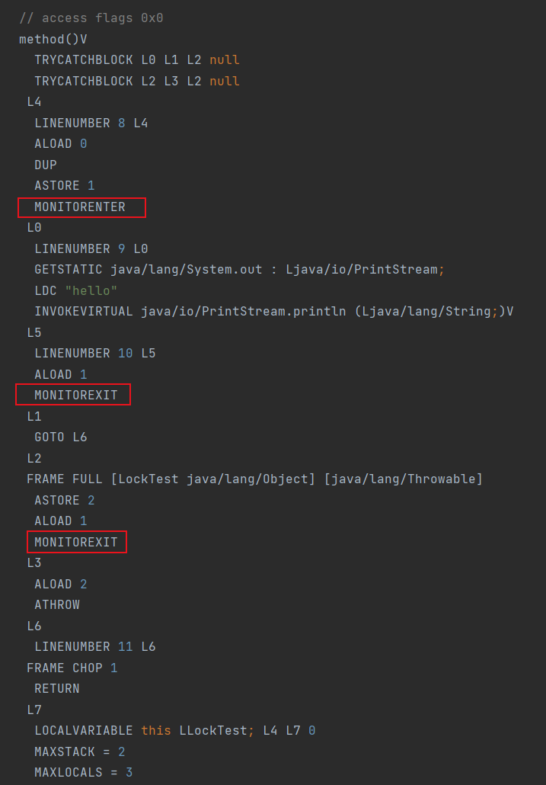
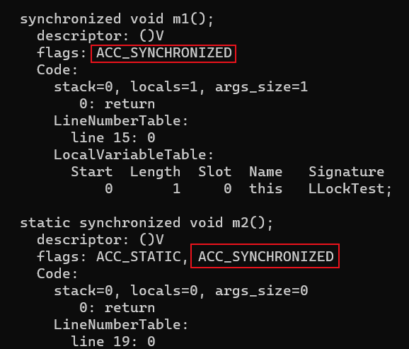

# synchronized

在多线程环境中，常用锁来保证同一时间只有一个线程访问访问共享资源，从而避免数据竞争的问题，保证线程安全

- 锁主要保证的是操作的原子性
- 这里说的访问主要是修改操作，其实还有一种共享锁（读锁），同一时间可以允许有多个线程读取共享资源

Java 中通常使用 `synchronized` 来实现线程的同步，保证线程安全，不仅保障了原子性、可见性、有序性，还保证了可重入性

主要有三种使用方式

```java
// 修饰代码块，对给定的对象加锁
void method() {
    synchronized (this) {}
}

// 修饰实例方法，对当前实例加锁
synchronized void method() {}

// 修饰静态方法，对当前类加锁
synchronized static void method() {}
```

- Java 多线程的锁都是基于对象的，类锁其实也是对象锁，因为静态成员不属于任何⼀个实例对象，归整个类所有，所以类锁其实也就是该类的 **Class 对象的锁**

```java
public class Test extends Thread {

    @Override
    public void run() {
        try {
            methodSync();
            staticSync();
        } catch (InterruptedException e) {
            throw new RuntimeException(e);
        }
    }

    synchronized void methodSync() throws InterruptedException {
        System.out.println(Thread.currentThread().getName() + " - methodSync");
        Thread.sleep(1000);
    }

    synchronized static void staticSync() throws InterruptedException {
        System.out.println(Thread.currentThread().getName() + " - staticSync");
        Thread.sleep(1000);
    }

    public static void main(String[] args) {
        Thread t1 = new Thread(new Test(), "t1");
        Thread t2 = new Thread(new Test(), "t2");

        t1.start();
        t2.start();

        // 每隔 1 秒打印
        new Thread(() -> {
            for (int i = 0; i < 3; i++) {
                System.out.println("-+------+-");
                try {
                    Thread.sleep(1000);
                } catch (InterruptedException e) {
                    throw new RuntimeException(e);
                }
            }
        }).start();
    }
}
```

> t2 - methodSync
t1 - methodSync
-+------+-
t2 - staticSync
-+------+-
t1 - staticSync
-+------+-

上述代码创建线程传入的是不同的对象，所以 `methodSync` 方法几乎是同时打印出来的，而 `staticSync` 是个静态同步方法，以类对象作为锁，所以 `staticSync` 差不多相隔 1 秒后才全部打印完成

## synchronized 原理

在 Java 中的锁都是基于对象的，而每个对象都有一个与之关联的监视器 Monitor（也叫做内部锁或 Monitor 锁），在 JVM 中由 ObjectMonitor 实现

线程在获取锁的时候，本质上是对一个对象监视器 Monitor 的获取，而且这个获取过程是排他的，即同一时刻只能有一个线程获取到该 Monitor

当某个线程想要调用 `synchronized` 语句块时，该线程必须先获取到某个对象的监视器才能进入同步块或者同步方法，而没有获取到监视器的线程将会被阻塞在同步块和同步方法的入口处，进入 BLOCKED 状态

### 修饰代码块

被 `synchronized` 修饰过的代码块前后会生成两个字节码指令：`monitorenter`、`monitorexit`，并且为了保障锁在同步代码块代码正常执行或出现异常都能被正确释放，多加了一个 `monitorexit` 指令



- `monitorenter`：线程试图获取 Monitor 的所有权
  - 每个对象中维护一个锁计数器，对象未被锁定时，计数器为 0
  - 线程成功获取到锁，计数器加 1
  - 同一线程如果再次获取到该锁，计数器再加 1
  - 如果计数器不为 0，其他线程尝试获取该对象的 Monitor 权限时，会被阻塞
- `monitorexit`：线程放弃 Monitor 的所有权，释放锁，所以执行 `monitorexit` 的线程必须是 Monitor 当前拥有者
  - 每执行一次，对象中锁计数器就减 1，直到减为 0，表明锁被释放，其他线程可以尝试获取锁

这也是为什么 `wait`、`notify`、`notifyAll` 方法必须在 `synchronized` 语句中使用

```java
void method() {
    synchronized (this) {
        System.out.println("hello");
    }
}
```

### 修饰方法

被 `synchronized` 修饰的方法不会加入 `monitorenter`、`monitorexit` 两个字节码指令，而是会在类文件中被标识为 ACC_SYNCHRONIZED，表示该方法为一个同步方法。当方法调用时，会先检查是否设置了该标识，如果设置了，执行线程就会先获取 Monitor，获取成功后再去执行方法体的内容

```java
synchronized void m1() {
}

synchronized static void m2() {
}
```



## 原子性、可见性与有序性

`synchronized`  原子性、可见性与有序性都是通过 JMM 中 `lock` 与 `unlock` 保证的

- `lock`（锁定）：把一个变量标识为 **线程独占** 的状态

- `unlock`（解锁）：把一个处于锁定状态的变量 **释放** 出来，释放后的变量才可以被其他线程锁定

### 原子性（Atomicity）

一个操作或者多个操作要么全部执行且执行的过程不会被任何因素打断，要么都不执行

`synchronized` 无论是修饰代码块，还是修饰方法，本质上都是为了获取 Monitor 锁，而且这个获取过程是排他的，即同一时刻只能有一个线程获取到该 Monitor，因此，`synchronized` 也就获得了原子性

### 可见性（Visibility）

对于共享变量的修改其他线程能及时可见

`synchronized` 的可见性是通过 JMM 中

- 如果对一个变量执行 `lock` 操作，那将会清空工作内存中此变量的值，在执行引擎使用这个变量前，需要重新执行 `load` 或 `assign` 操作以初始化变量的值
  - 进入 `synchronized` 语句块时，清空所有工作内存中该变量的副本

- 对一个变量执行 `unlock` 操作之前，必须先把此变量同步回主内存中（执行 `store`、`write` 操作）
  - 在离开 `synchronized` 语句块时，将变量的修改同步会主内存

### 有序性（Ordering）

如果在本线程内观察，所有的操作都是有序的

`synchronized` 的有序性是通过 JMM 中

- 一个变量在同一个时刻只允许一条线程对其进行 `lock` 操作，但 `lock` 操作可以被同一条线程重复执行多次，多次执行 `lock` 后，只有执行相同次数的 `unlock` 操作，变量才会被解锁

这个规则决定了 `synchronized` 语句块限制只能同时被一个线程访问，可以保证当前的操作不受其他线程的干扰。当然保证的是执行结果的有序性，指令还是可能会重排序，即串行语义（as-if-serial）

- as-if-serial 语义：所有的动作都可以为了优化而被重排序，但是必须保证它们重排序后的结果和程序代码本身的应有结果是一致的

## 可重入

`synchronized` 是可重入锁，允许同一个线程多次请求自己持有的锁，当然释放的时候也需要释放相同次数的锁

- 可重入锁也叫递归锁，在外层使用锁之后，在内层仍然可以使用，并且不会产生死锁

`synchronized` 的可重入性也是通过 JMM 中

- 一个变量在同一个时刻只允许一条线程对其进行 `lock` 操作，但 `lock` 操作可以被同一条线程重复执行多次，多次执行 `lock` 后，只有执行相同次数的 `unlock` 操作，变量才会被解锁

## 与 `volatile` 的区别

`synchronized` 关键字和 `volatile` 关键字不是对立的而是 **互补** 的

- `volatile` 是线程同步的轻量级实现，所以 `volatile` 的性能要更好，但是 `volatile` 只能用于修饰变量，而 `synchronized` 可以修饰方法和代码块
- `volatile` 只能保证变量的可见性，不能保证原子性，而 `synchronized` 两者都能保证
- `volatile` 主要用于解决变量在多个线程之间的可见性，而 `synchronized` 主要解决的是多线程之间访问资源的同步性

## 参考

- 《实战Java高并发程序设计（第3版）》
- 《Java并发编程的艺术》
- [深入浅出Java多线程](http://concurrent.redspider.group/)
- [synchronized总结](https://blog.csdn.net/weixin_39559282/article/details/114273936)
