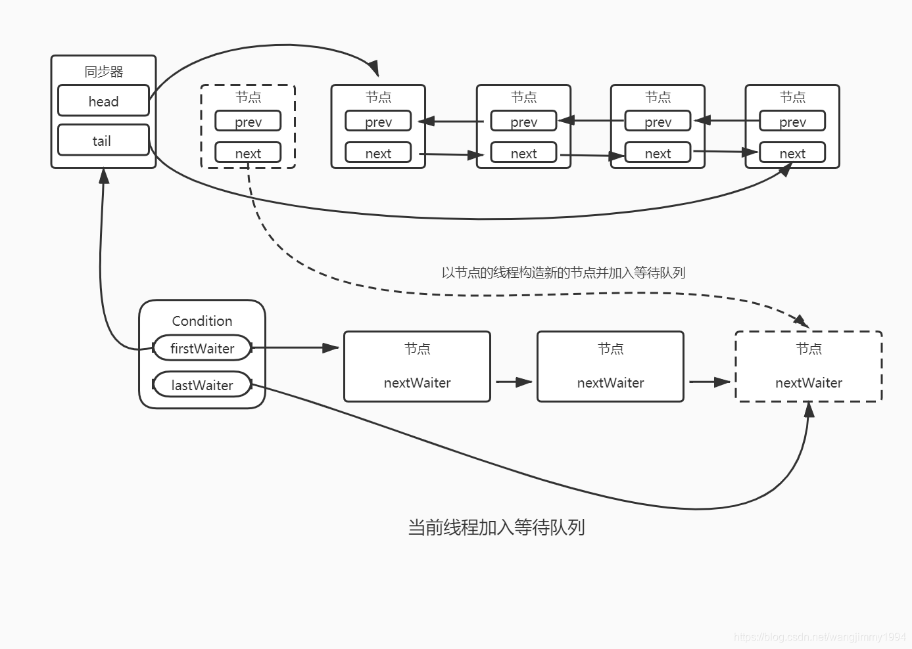

# Condition 接口

Condition 与 Object 中的 `wait`、`notify` 方法作用大致相同

```java
public interface Condition {

    // 当前线程进入等待状态，可响应中断
    void await() throws InterruptedException;

    // 当前线程进入等待状态，不支持中断
    void awaitUninterruptibly();

    // 当前线程进入等待状态，直到超时、被唤醒或中断
    long awaitNanos(long nanosTimeout) throws InterruptedException;

    // 当前线程进入等待状态，直到超时、被唤醒或中断
    boolean await(long time, TimeUnit unit) throws InterruptedException;

    // 当前线程进入等待状态，直到某个时间点、被唤醒或中断
    boolean awaitUntil(Date deadline) throws InterruptedException;

    // 唤醒一个等待的线程
    void signal();

    // 唤醒所有等待的线程
    void signalAll();
}
```

那么已经有了 Object 类的 `wait`、`notify` 方法，为何还需要 Condition 接口呢。首先他们二者都需要 **先获取到对象锁**，并且进入等待状态都会释放持有的锁，都可以设置超时时间，当然 Condition 还可以设置一个时间点，都可响应中断，但 Condition 中有可以不响应中断的方法

二者最大的区别就是，在 Object 监视模型中，一个对象只能有一个等待队列，而 Condition 可以有 **多个等待队列**

AQS 就在内部实现了 Condition 接口，一个 Condition 包含一个等待队列，Condition 拥有首节点和尾节点

```java
public abstract class AbstractQueuedSynchronizer
    extends AbstractOwnableSynchronizer
    implements java.io.Serializable {

    public class ConditionObject implements Condition, java.io.Serializable {
        // Condition 队列的头节点
        private transient Node firstWaiter;
        // Condition 队列的尾节点
        private transient Node lastWaiter;
        
        ...
            
    }
    
    ...
        
}
```

获取一个 Condition 必须通过 Lock 接口的 `newCondition` 方法获取，每个 Lock 可以有多个 Condition

```java
public class Test {

    static ReentrantLock lock = new ReentrantLock();
    static Condition condition = lock.newCondition();

    static Thread awaitThread = new Thread(() -> {
        try {
            lock.lock();
            // 以当前线程构造节点，并将节点从尾部加入等待队列
            // 当前线程进入等待队列并释放锁
            condition.await();
            System.out.println("你吼啊");
        } catch (InterruptedException e) {
            throw new RuntimeException(e);
        } finally {
            lock.unlock();
        }
    });

    static Thread signalThread = new Thread(() -> {
        try {
            lock.lock();
            // 唤醒在等待队列中等待队列中等待时间最长的节点（首节点）
            // 唤醒节点之前，会将该节点移动到同步队列中
            condition.signal();
        } finally {
            lock.unlock();
        }
    });

    public static void main(String[] args) throws Exception {
        awaitThread.start();
        Thread.sleep(1000);
        signalThread.start();
    }
}
```





<small>[并发编程的艺术之读书笔记（九）](https://blog.csdn.net/wangjimmy1994/article/details/105245987)</small>

## 参考

- [Java并发：Condition接口](https://www.cnblogs.com/magic-sea/p/11594861.html)
- [并发编程的艺术之读书笔记（九）](https://blog.csdn.net/wangjimmy1994/article/details/105245987)
