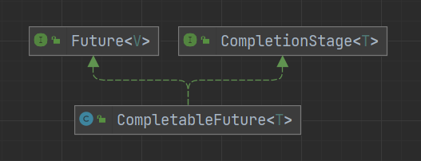

# CompleteFuture

Future 类是异步思想的典型运用，主要用在一些需要返回结果并且比较耗时任务的场景，避免程序一直原地等待耗时任务执行完成，执行效率太低



## Future

CompleteFuture 实现自 Future 接口

```java
public interface Future<V> {

    // 取消任务
    boolean cancel(boolean mayInterruptIfRunning);

    // 判断任务是否已被取消
    boolean isCancelled();

    // 判断任务是否已执行完成
    boolean isDone();

    // 获取任务执行结果，在等待到结果前会一直阻塞
    V get() throws InterruptedException, ExecutionException;

    // 获取任务执行结果，有超时时间
    V get(long timeout, TimeUnit unit)
        throws InterruptedException, ExecutionException, TimeoutException;
}
```

CompletableFuture 除了提供了更为好用和强大的 Future 特性之外，还提供了函数式编程、异步任务编排组合，多个 CompletableFuture 可以串行或并行执行，并可对执行时的异常进行处理

## 创建 CompletableFuture

创建 CompletableFuture 有两种方式

- 通过构造方法创建
- 通过静态方法创建
  - supplyAsync：有返回值
  - runAsync：无返回值

```java
public class Test {

    public static void main(String[] args) throws ExecutionException, InterruptedException {

        CompletableFuture<String> newFuture = new CompletableFuture<>();
        new Thread(() -> {
            try {
                Thread.sleep(1000);
            } catch (InterruptedException e) {
                throw new RuntimeException(e);
            }
            newFuture.complete("new done");
        }).start();

        CompletableFuture<String> supplyAsync = CompletableFuture.supplyAsync(() -> {
            try {
                Thread.sleep(1000);
            } catch (InterruptedException e) {
                throw new RuntimeException(e);
            }
            System.out.println("supplyAsync done");
            return "done";
        });

        CompletableFuture.runAsync(() -> {
            try {
                Thread.sleep(1000);
            } catch (InterruptedException e) {
                throw new RuntimeException(e);
            }
            System.out.println("runAsync done");
        });

        System.out.println(newFuture.get());
        System.out.println(supplyAsync.get());
    }
}
```

> supplyAsync done
> runAsync done
> new done
> done

## 获取结果

可以使用 get 或 join 方法获取执行结果，join 不需要显式的捕获异常

```java
CompletableFuture<String> future = new CompletableFuture<>()

future.join();

try {
    future.get();
} catch (InterruptedException | ExecutionException e) {
    throw new RuntimeException(e);
}
```

没有返回值的 CompletableFuture 可以用 `CompletableFuture<Void>` 类型接收，得到的结果为 null

```java
CompletableFuture<Void> runAsync = CompletableFuture.runAsync(() -> {
    System.out.println("hello");
});

System.out.println(runAsync.get());
```

> null

## 流水线操作

CompletableFuture 实现了 CompletionStage 接口，该接口描述了一个异步计算的阶段。一个计算可以分为多个步骤，通过多个步骤的组合，形成一个异步计算的流水线

CompletableFuture 内的流水线操作大多有 3 个版本，以 thenApply 为例

```java
// 沿用上一个任务的线程池
public <U> CompletableFuture<U> thenApply(
    Function<? super T,? extends U> fn) {
    return uniApplyStage(null, fn);
}
```

```java
// 使用默认的ForkJoinPool线程池（不推荐）
public <U> CompletableFuture<U> thenApplyAsync(
    Function<? super T,? extends U> fn) {
    return uniApplyStage(asyncPool, fn);
}

private static final boolean useCommonPool =
    (ForkJoinPool.getCommonPoolParallelism() > 1);

private static final Executor asyncPool = useCommonPool ?
    ForkJoinPool.commonPool() : new ThreadPerTaskExecutor();
```

```java
// 使用自定义线程池（推荐）
public <U> CompletableFuture<U> thenApplyAsync(
    Function<? super T,? extends U> fn, Executor executor) {
    return uniApplyStage(screenExecutor(executor), fn);
}

private static final boolean useCommonPool =
    (ForkJoinPool.getCommonPoolParallelism() > 1);

static Executor screenExecutor(Executor e) {
    if (!useCommonPool && e == ForkJoinPool.commonPool())
        return asyncPool;
    if (e == null) throw new NullPointerException();
    return e;
}
```

### 追加操作

- thenApply：对执行后的结果进行追加处理，并可将当前的 CompletableFuture 泛型对象更改为处理后新的对象类型
- thenAccept：与 thenApply 作用类似，区别是没有返回值
- thenRun：与 thenAccept 作用类似，区别是传入的参数为 Runnable 类型

```java
public <U> CompletableFuture<U> thenApply(
    Function<? super T,? extends U> fn) {
    return uniApplyStage(null, fn);
}

public CompletableFuture<Void> thenAccept(Consumer<? super T> action) {
    return uniAcceptStage(null, action);
}

public CompletableFuture<Void> thenRun(Runnable action) {
    return uniRunStage(null, action);
}
```

- 使用 thenApply

```java
CompletableFuture<String> supplyAsync = CompletableFuture.supplyAsync(() -> {
    System.out.println("I'm in");
    return 111;
}).thenApply(s -> {
    System.out.println(s);
    return s + " world";
});
```

- 使用 thenAccept

```java
CompletableFuture<Void> supplyAsync = CompletableFuture.supplyAsync(() -> {
    System.out.println("I'm in");
    return 111;
}).thenAccept(s -> {
    System.out.println(s + " haha");
});

```

- 使用 thenRun

```java
Thread thread = new Thread(() -> {
    try {
        Thread.sleep(5000);
    } catch (InterruptedException e) {
        throw new RuntimeException(e);
    }
    System.out.println("haha");
});

CompletableFuture<Void> supplyAsync = CompletableFuture.supplyAsync(() -> {
    System.out.println("I'm in");
    return 114514;
}).thenRun(thread);
```

### 异常处理

- handle：与 thenApply 作用类似，但可以处理异常
- whenComplete：与 thenAccept 作用类似，没有返回值，但可以处理异常
- exceptionally：有异常才会进行处理，没出现异常则会忽略该操作

```java
public <U> CompletableFuture<U> handle(
    BiFunction<? super T, Throwable, ? extends U> fn) {
    return uniHandleStage(null, fn);
}

public CompletableFuture<T> whenComplete(
    BiConsumer<? super T, ? super Throwable> action) {
    return uniWhenCompleteStage(null, action);
}

public CompletableFuture<T> exceptionally(
    Function<Throwable, ? extends T> fn) {
    return uniExceptionallyStage(fn);
}
```

- 使用 handle

```java
// 使用thenApply，上一步出现异常，无法进行追加操作
CompletableFuture<String> supplyAsync = CompletableFuture.supplyAsync(() -> {
    System.out.println(1 / 0);
    return "hello";
}).thenApply((s -> {
    System.out.println("haha");
    return s + " world";
}));

// 使用handle，上一步出现异常，仍可进行追加操作
CompletableFuture<String> supplyAsync = CompletableFuture.supplyAsync(() -> {
    System.out.println(1 / 0);
    return "hello";
}).handle((s, throwable) -> {
    System.out.println(throwable);
    return s + " world";
});
```

- 使用 whenComplete

```java
CompletableFuture<String> supplyAsync = CompletableFuture.supplyAsync(() -> {
    System.out.println(1 / 0);
    return "hello";
}).whenComplete((s, throwable) -> {
    System.out.println(s);
    System.out.println(throwable);
});
```

- 使用 exceptionally

```java
CompletableFuture<String> supplyAsync = CompletableFuture.supplyAsync(() -> {
    System.out.println(1 / 0);
    return "hello";
}).exceptionally(throwable -> {
    return "出错啦";
});
```

### 组合

#### 需等待两个任务都执行完成

- thenCombine：将两个 CompletableFuture 对象组合起来进行下一步处理
- thenAcceptBoth：与 thenCombine 作用类似，区别是没有返回值
- thenCompose：与 thenCombine 都可用作组合，区别是 thenCompose 得依赖上一步获取到的结果，使得两个 CompletableFuture 之间存在着先后顺序；thenCombine 则会在两个任务都执行完成后，对任务结果进行合并，不存在先后顺序
- runAfterBoth：等待两个 CompletableFuture 都执行完后，执行下一步操作，类似 thenRun

```java
public <U,V> CompletableFuture<V> thenCombine(
    CompletionStage<? extends U> other,
    BiFunction<? super T,? super U,? extends V> fn) {
    return biApplyStage(null, other, fn);
}

public <U> CompletableFuture<U> thenCompose(
    Function<? super T, ? extends CompletionStage<U>> fn) {
    return uniComposeStage(null, fn);
}
```

- 使用 thenCombine

```java
CompletableFuture<String> supplyAsync1 = CompletableFuture.supplyAsync(() -> {
    System.out.println("first");
    return "hello";
});

CompletableFuture<String> supplyAsync2 = CompletableFuture.supplyAsync(() -> {
    System.out.println("second");
    return "world";
// 注意在第二参数中，第一个指的是自己
}).thenCombine(supplyAsync1, (x, y) -> {
    System.out.println("done");
    return y + " " + x;
});
```

- 使用 thenAcceptBoth

```java
CompletableFuture<String> supplyAsync1 = CompletableFuture.supplyAsync(() -> {
    System.out.println("first");
    return "hello";
});

CompletableFuture<Void> supplyAsync2 = CompletableFuture.supplyAsync(() -> {
    System.out.println("second");
    return "world";
}).thenAcceptBoth(supplyAsync1, (x, y) -> {
    System.out.println(y + " " + x);
});

```

- 使用 thenCompose

```java
CompletableFuture<String> supplyAsync = CompletableFuture.supplyAsync(() -> {
    System.out.println("first");
    return "hello";
}).thenCompose(s -> CompletableFuture.supplyAsync(() -> {
    System.out.println("second");
    return s + " world";
}));
```

- 使用 runAfterBoth

```java
CompletableFuture<String> supplyAsync1 = CompletableFuture.supplyAsync(() -> {
    System.out.println("first");
    return "hello";
});

Thread thread = new Thread(() -> {
    try {
        Thread.sleep(5000);
    } catch (InterruptedException e) {
        throw new RuntimeException(e);
    }
    System.out.println("done");
});

CompletableFuture<Void> supplyAsync2 = CompletableFuture.supplyAsync(() -> {
    System.out.println("second");
    return "world";
}).runAfterBoth(supplyAsync1, thread);
```

#### 只要任一任务执行完成

- applyToEither：将两个 CompletableFuture 对象组合起来进行，只要有任意一个任务完成，就执行下一步处理
- acceptEither：与 applyToEither 作用类似，但没有返回值
- runAfterEither：等待任一 CompletableFuture 都执行完后，执行下一步操作，类似 thenRun

```java
public <U> CompletableFuture<U> applyToEither(
    CompletionStage<? extends T> other, Function<? super T, U> fn) {
    return orApplyStage(null, other, fn);
}

public CompletableFuture<Void> acceptEither(
    CompletionStage<? extends T> other, Consumer<? super T> action) {
    return orAcceptStage(null, other, action);
}
```

- 使用 applyToEither

```java
CompletableFuture<String> supplyAsync1 = CompletableFuture.supplyAsync(() -> {
    try {
        Thread.sleep(1000);
    } catch (InterruptedException e) {
        throw new RuntimeException(e);
    }
    return "hello";
});

CompletableFuture<String> supplyAsync2 = CompletableFuture.supplyAsync(() -> {
    try {
        Thread.sleep(5000);
    } catch (InterruptedException e) {
        throw new RuntimeException(e);
    }
    return "world";
}).applyToEither(supplyAsync1, s -> {
    System.out.println(s);
    return "有一个完成了";
});
```

- 使用 acceptEither

```java
CompletableFuture<String> supplyAsync1 = CompletableFuture.supplyAsync(() -> {
    try {
        Thread.sleep(1000);
    } catch (InterruptedException e) {
        throw new RuntimeException(e);
    }
    return "hello";
});

CompletableFuture<Void> supplyAsync2 = CompletableFuture.supplyAsync(() -> {
    try {
        Thread.sleep(5000);
    } catch (InterruptedException e) {
        throw new RuntimeException(e);
    }
    return "world";
}).acceptEither(supplyAsync1, s -> {
    System.out.println(s);
});
```

- 使用 runAfterEither

```java
CompletableFuture<String> supplyAsync1 = CompletableFuture.supplyAsync(() -> {
    try {
        Thread.sleep(1000);
    } catch (InterruptedException e) {
        throw new RuntimeException(e);
    }
    return "hello";
});

Thread thread = new Thread(() -> {
    try {
        Thread.sleep(5000);
    } catch (InterruptedException e) {
        throw new RuntimeException(e);
    }
    System.out.println("done");
});

CompletableFuture<Void> supplyAsync2 = CompletableFuture.supplyAsync(() -> {
    try {
        Thread.sleep(5000);
    } catch (InterruptedException e) {
        throw new RuntimeException(e);
    }
    return "world";
}).runAfterEither(supplyAsync1, thread);
```

#### 静态方法

- allOf：阻塞等待所有给定的 CompletableFuture，直到所有的任务完成
- anyOf：阻塞等待所有给定的 CompletableFuture，直到任一任务完成

```java
CompletableFuture<Void>[] arr = new CompletableFuture[10];

for (int i = 0; i < 10; i++) {
    arr[i] = CompletableFuture.runAsync(() -> {
        System.out.println("in");
    });
}

CompletableFuture.anyOf(arr);
CompletableFuture.allOf(arr);
```

## Java 版 Promise

```java
CompletableFuture<String> future = new CompletableFuture<>();

if (success) {
    future.complete("任务完成");
} else {
    future.completeExceptionally(new RuntimeException("任务失败"));
}
```

## 参考

- [CompletableFuture 详解](https://javaguide.cn/java/concurrent/completablefuture-intro.html)
- [JAVA基于CompletableFuture的流水线并行处理深度实践，满满干货](https://juejin.cn/post/7124124854747398175?searchId=20240110145906A22FC186707CA10BD4F2)
- [Java 8 CompletableFuture 对比 ES6 Promise](https://xxgblog.com/2021/08/28/promise-vs-completablefuture/)
