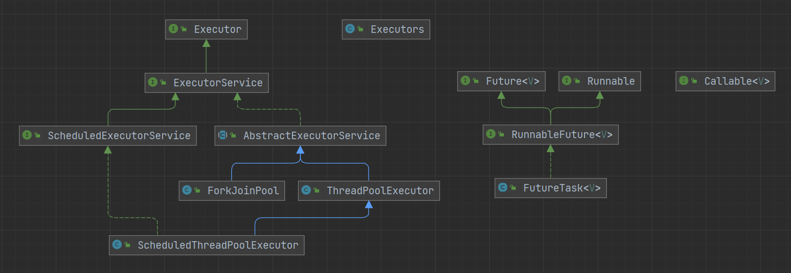

# 线程池

线程池是管理一系列线程的资源池

- 降低资源消耗：通过重复利用已创建的线程降低线程创建和销毁造成的消耗
- 提高响应速度：当任务到达时，任务可以不需要等到线程创建就能立即执行
- 提高线程的可管理性：线程是稀缺资源，如果无限制地创建，不仅会消耗系统资源，还会降低系统的稳定性，使用线程池可以进行统一分配、调优和监控

线程池解决的核心问题就是资源管理问题。在并发环境下，系统不能够确定在任意时刻中，有多少任务需要执行，有多少资源需要投入。这种不确定性将带来以下若干问题

- 频繁申请/销毁资源和调度资源，将带来额外的消耗，可能会非常巨大
- 对资源无限申请缺少抑制手段，易引发系统资源耗尽的风险
- 系统无法合理管理内部的资源分布，会降低系统的稳定性

## Executor 框架

为了能够更好地控制多线程，JDK 提供了一套 Executor 框架，帮助开发人员有效地进行线程控制



Executor 框架主要由 3 大部分组成

- 任务：被执行任务需要实现 Runnable 接口或 Callable 接口
- 任务的执行：包括任务执行机制的核心接口 Executor，以及继承自 Executor 的 ExecutorService 接口。Executor 框架有两个关键类实现了 ExecutorService 接口，ThreadPoolExecutor 和 ScheduledThreadPoolExecutor
- 异步计算的结果：包括接口 Future 和实现 Future 接口的 FutureTask 类

### Executor 框架运行流程

1. 主线程首先要创建实现 Runnable 或者 Callable 接口的任务对象
2. 可以把创建好的 Runnable 对象交给 ExecutorService 执行（execute）；或者把创建好的 Runnable 对象或 Callable 对象提交给 ExecutorService 执行（submit）
    - execute 方法没有返回值，submit 方法会返回一个 FutureTask 对象
3. 如果执行 submit 方法，ExecutorService 将返回一个 FutureTask 对象
4. 最后，主线程可以执行 FutureTask 中的 get 方法来等待任务执行完成，也可以执行 cancel 方法来取消此任务的执行

## ThreadPoolExecutor

ThreadPoolExecutor 有 4 个构造方法，先来看最主要的最基础的构造方法

```java
public ThreadPoolExecutor(int corePoolSize,
                          int maximumPoolSize,
                          long keepAliveTime,
                          TimeUnit unit,
                          BlockingQueue<Runnable> workQueue,
                          ThreadFactory threadFactory,
                          RejectedExecutionHandler handler) {
    if (corePoolSize < 0 ||
        maximumPoolSize <= 0 ||
        maximumPoolSize < corePoolSize ||
        keepAliveTime < 0)
        throw new IllegalArgumentException();
    if (workQueue == null || threadFactory == null || handler == null)
        throw new NullPointerException();
    this.acc = System.getSecurityManager() == null ?
            null :
            AccessController.getContext();
    this.corePoolSize = corePoolSize;
    this.maximumPoolSize = maximumPoolSize;
    this.workQueue = workQueue;
    this.keepAliveTime = unit.toNanos(keepAliveTime);
    this.threadFactory = threadFactory;
    this.handler = handler;
}
```

- corePoolSize：核心线程数最大值
- maximumPoolSize：线程总数最大值
- keepAliveTime：非核心线程闲置超时时长
- unit：超时时间单位
- workQueue：阻塞队列，维护着等待执行的任务对象
- threadFactory：创建线程的工厂，用于批量创建线程，统一在创建线程时设置一些参数
- handler：拒绝策略，线程数量大于最大线程数就会采用拒绝处理策略

```java
// 使用默认的线程创建工厂和默认的拒绝策略
public ThreadPoolExecutor(int corePoolSize,
                          int maximumPoolSize,
                          long keepAliveTime,
                          TimeUnit unit,
                          BlockingQueue<Runnable> workQueue) {
    this(corePoolSize, maximumPoolSize, keepAliveTime, unit, workQueue,
            Executors.defaultThreadFactory(), defaultHandler);
}

// 使用默认的拒绝策略
public ThreadPoolExecutor(int corePoolSize,
                          int maximumPoolSize,
                          long keepAliveTime,
                          TimeUnit unit,
                          BlockingQueue<Runnable> workQueue,
                          ThreadFactory threadFactory) {
    this(corePoolSize, maximumPoolSize, keepAliveTime, unit, workQueue,
            threadFactory, defaultHandler);
}

// 使用默认的线程创建工厂
public ThreadPoolExecutor(int corePoolSize,
                          int maximumPoolSize,
                          long keepAliveTime,
                          TimeUnit unit,
                          BlockingQueue<Runnable> workQueue,
                          RejectedExecutionHandler handler) {
    this(corePoolSize, maximumPoolSize, keepAliveTime, unit, workQueue,
            Executors.defaultThreadFactory(), handler);
}
```

### 核心线程

线程池中有两类线程，核心线程和非核心线程。核心线程默认情况下会一直存在于线程池中，而非核心线程如果闲置时长超过限制，就会被销毁

- 核心线程通常不会被回收，如果调用 allowCoreThreadTimeOut 方法并设置为 true 的话，核心线程闲置超过时间限制也会被销毁

### 阻塞队列

当线程池内正在运行的线程数大于核心线程数时，新的任务就会被添加到阻塞队列中

如果队列也满了，就会创建非核心线程来执行任务

常用的阻塞队列

- LinkedBlockingQueue：链式阻塞队列，底层数据结构是链表，默认大小是 Integer.MAX_VALUE，也可以指定大小
- ArrayBlockingQueue：数组阻塞队列，底层数据结构是数组，需要指定队列的大小
- SynchronousQueue：同步队列，内部容量为 0，每个 put 操作必须等待一个 take 操作，反之亦然
- DelayQueue：延迟队列，该队列中的元素只有当其指定的延迟时间到了，才能够从队列中获取到该元素
- PriorityBlockingQueue：具有优先级的无界阻塞队列

### 拒绝策略

如果等待队列满了，且线程池内正在运行的线程数设定的最大线程数，就会根据拒绝策略进行相应处理

在 ThreadPoolExecutor 中有 4 种拒绝策略

- AbortPolicy：默认策略，丢弃新任务并抛出异常
- DiscardPolicy：丢弃新任务
- DiscardOldestPolicy：丢弃队列头部（最旧的）的任务，然后重新尝试执行程序（如果再次失败，重复此过程）
- CallerRunsPolicy：由调用者的线程处理新任务

### 线程池状态

线程池本身有一个调度线程，这个线程就是用于管理布控整个线程池里的各种任务和事务，例如创建线程、销毁线程、任务队列管理、线程队列管理等等

线程池也同样有状态，在 ThreadPoolExecutor 类中定义了 5 种状态

```java
private static final int RUNNING    = -1 << COUNT_BITS;
private static final int SHUTDOWN   =  0 << COUNT_BITS;
private static final int STOP       =  1 << COUNT_BITS;
private static final int TIDYING    =  2 << COUNT_BITS;
private static final int TERMINATED =  3 << COUNT_BITS;
```

- RUNNING：线程池创建后处于 RUNNING 状态
- SHUTDOWN：调用 shutdown 方法后线程池处于 SHUTDOWN 状态，不再接受新任务，处理完所有的任务包括阻塞队列中的任务后，线程池进入 TIDYING 状态
- STOP：调用 shutdownNow 方法后线程池处于 STOP 状态，不再接受新任务，中断所有正在执行的任务，并丢弃阻塞队列中任务，线程池进入 TIDYING 状态
- TIDYING：当所有的任务已终止，并且记录的任务数量为 0 时，线程池进入 TIDYING 状态
- TERMINATED：线程池处在 TIDYING 状态时，执行完 terminated 方法，线程池进入 TERMINATED 状态

#### ctl 字段

线程池的运行状态被保存在 ctl 字段中，高 3 位代表线程池的运行状态，低 29 位表示线程池中存在的线程数

```java
private final AtomicInteger ctl = new AtomicInteger(ctlOf(RUNNING, 0));

private static final int COUNT_BITS = Integer.SIZE - 3;

// 获取运行状态
private static int runStateOf(int c)     { return c & ~CAPACITY; }

// 获取当前存在的线程数
private static int workerCountOf(int c)  { return c & CAPACITY; }

// 根据运行状态和线程数获取ctl
private static int ctlOf(int rs, int wc) { return rs | wc; }
```

### ThreadPoolExecutor 执行流程

```java
public void execute(Runnable command) {
    if (command == null)
        throw new NullPointerException();

    // 获取线程池的状态
    int c = ctl.get();
    // 如果当前的线程数小于指定的核心线程数
    if (workerCountOf(c) < corePoolSize) {
        // 创建一个新线程，并将当前的任务添加到该线程中
        if (addWorker(command, true))
            return;
        c = ctl.get();
    }

    // 判断线程池是否处于运行状态，并且将任务加入到等待队列中
    if (isRunning(c) && workQueue.offer(command)) {
        // 再次获取线程池状态
        int recheck = ctl.get();
        // 如果线程池不处于运行状态，就从等待队列中移除该任务
        if (! isRunning(recheck) && remove(command))
            // 执行拒绝策略
            reject(command);
        // 如果当前的线程数为0，创建一个新线程
        else if (workerCountOf(recheck) == 0)
            addWorker(null, false);
    }
    // 如果线程池不处于运行状态或者将任务加入到等待队列失败
    // 先尝试新建一个线程并执行任务
    // 如果还失败则执行拒绝策略
    else if (!addWorker(command, false))
        reject(command);
}
```

1. 当一个任务加入到线程中，先判断当前运行的线程数是否小于核心线程数，如果是则新建一个线程执行该任务
2. 如果当前运行的线程数大于核心线程数，则将该任务加入到等待队列中
3. 如果等待队列满了，并且当前运行的线程数小于最大线程数，则新建一个线程执行该任务
4. 如果等待队列满了，并且当前运行的线程数大于最大线程数，则执行拒绝策略

#### 为什么需要二次检查线程池的状态

在并发环境中，线程池的状态是时刻发生变化的，很有可能刚获取线程池状态后线程池状态就改变了。如果没有二次检查，万一线程池处于非 RUNNING 状态，那么加入的任务就永远不会被执行

### 关闭线程池

ThreadPoolExecutor 可以通过 shutdown 和 shutdownNow 方法关闭线程池

- shutdown：执行后，停止接收新任务，等待当前正在执行的任务及等待队列中的任务执行完
- shutdownNow：执行后，停止接收新任务，停止正在执行的任务，并丢弃等待队列中的任务

### execute 与 submit 的区别

```java
public class Test {

    public static void main(String[] args) throws ExecutionException, InterruptedException {

        int corePoolSize = 2;
        int maximumPoolSize = 20;
        long keepAliveTime = 10;
        TimeUnit unit = TimeUnit.SECONDS;
        BlockingQueue<Runnable> queue = new ArrayBlockingQueue<>(10);

        ThreadPoolExecutor threadPoolExecutor = new ThreadPoolExecutor(corePoolSize,
                maximumPoolSize,
                keepAliveTime,
                unit,
                queue,
                Executors.defaultThreadFactory(),
                new ThreadPoolExecutor.AbortPolicy());

        for (int i = 0; i < 10; i++) {
            Thread thread = new Thread(() -> {
                try {
                    Thread.sleep(1000);
                } catch (InterruptedException e) {
                    throw new RuntimeException(e);
                }
                System.out.println("hello");
            });
            threadPoolExecutor.execute(thread);
        }

        for (int i = 0; i < 10; i++) {
            Callable<String> callable = () -> {
                System.out.println("good");
                Thread.sleep(1000);
                return "done";
            };
            Future<String> future = threadPoolExecutor.submit(callable);
            System.out.println(future.get());
        }
    }
}
```

execute 与 submit 最大的区别，就是 submit 提交的任务有返回值，会返回一个 Future 类型的对象。但要注意 Future 调用获取返回值的 get 方法会阻塞当前的线程，或者可以使用带有超时时间的 get 方法

### 创建线程池

线程池创建两种方式，一种是通过 ThreadPoolExecutor 的构造方法创建，另一种是通过 Excutors 进行构建

推荐使用构造方法进行创建，可以更灵活的构造所需的线程池，规避资源耗尽的问题

#### FixedThreadPool

```java
public static ExecutorService newFixedThreadPool(int nThreads) {
    return new ThreadPoolExecutor(nThreads, nThreads,
                                    0L, TimeUnit.MILLISECONDS,
                                    new LinkedBlockingQueue<Runnable>());
}
```

固定线程数量的线程池，核心线程数量和总线程数量相等，没有非核心线程

不推荐使用。当正在执行任务的线程超过核心线程数，就会将任务加入到等待队列中。而 LinkedBlockingQueue 是一个无界队列，如果提交任务的速度大于处理完任务的速度，就会一直往队列中塞，最终可能会导致内存耗尽

#### CachedThreadPool

```java
public static ExecutorService newCachedThreadPool() {
    return new ThreadPoolExecutor(0, Integer.MAX_VALUE,
                                    60L, TimeUnit.SECONDS,
                                    new SynchronousQueue<Runnable>());
}
```

没有核心线程，且闲置的非核心线程只能存活 60 秒。线程总数被设置为 Integer.MAX_VALUE，意味着如果提交任务的速度大于处理完任务的速度，就会不断地创建新线程，可能会导致 CPU 与内存资源的耗尽

#### SingleThreadExecutor

```java
public static ExecutorService newSingleThreadExecutor() {
    return new FinalizableDelegatedExecutorService
        (new ThreadPoolExecutor(1, 1,
                                0L, TimeUnit.MILLISECONDS,
                                new LinkedBlockingQueue<Runnable>()));
}
```

只有一个核心线程的线程池，每次只执行一个任务，新的任务会加入到队列中

不推荐使用。与 FixedThreadPool 类似

#### newScheduledThreadPool

```java
public static ScheduledExecutorService newScheduledThreadPool(int corePoolSize) {
    return new ScheduledThreadPoolExecutor(corePoolSize);
}

// ScheduledThreadPoolExecutor继承自ThreadPoolExecutor
public ScheduledThreadPoolExecutor(int corePoolSize) {
    super(corePoolSize, Integer.MAX_VALUE, 0, NANOSECONDS,
            new DelayedWorkQueue());
}
```

使用延迟阻塞队列实现的线程池，DelayedWorkQueue 内部会按照延迟时间排序，延迟时间越短越靠前

最大线程数为 Integer.MAX_VALUE，且 DelayedWorkQueue 可以存储的元素上限也为 Integer.MAX_VALUE，可能会导致 OOM 问题

### 线程池监控

```java
public class Test {

    public static void main(String[] args) throws ExecutionException, InterruptedException {
        int corePoolSize = 2;
        int maximumPoolSize = 20;
        long keepAliveTime = 10;
        TimeUnit unit = TimeUnit.SECONDS;
        BlockingQueue<Runnable> queue = new ArrayBlockingQueue<>(10);

        ThreadPoolExecutor threadPoolExecutor = new ThreadPoolExecutor(corePoolSize,
                maximumPoolSize,
                keepAliveTime,
                unit,
                queue,
                Executors.defaultThreadFactory(),
                new ThreadPoolExecutor.AbortPolicy());

        int threadNum = 20;

        for (int i = 0; i < threadNum; i++) {
            Thread thread = new Thread(() -> {
                try {
                    Thread.sleep(50000);
                } catch (InterruptedException e) {
                    throw new RuntimeException(e);
                }
            });
            threadPoolExecutor.execute(thread);
        }

        while (true) {
            // 获取核心线程数
            System.out.println(threadPoolExecutor.getCorePoolSize());
            // 获取线程总数
            System.out.println(threadPoolExecutor.getPoolSize());
            // 获取当前正在活动的线程数
            System.out.println(threadPoolExecutor.getActiveCount());
            // 获取等待队列的长度
            System.out.println(threadPoolExecutor.getQueue().size());
            // 获取线程池中的任务总数
            System.out.println(threadPoolExecutor.getTaskCount());
            // 获取线程池中的已完成的任务数量
            System.out.println(threadPoolExecutor.getCompletedTaskCount());

            Thread.sleep(1000);
        }
    }
}
```

### 线程池预热

线程池创建完成后，如果没有任务过来就不会创建线程。可以通过 prestartAllCoreThreads 与 prestartCoreThread 方法对线程池进行预热

- prestartAllCoreThreads：预热所有核心线程
- prestartCoreThread：预热一个核心线程

### 参数动态配置

- setCorePoolSize：设置核心线程数
- setMaximumPoolSize：设置最大线程数
- setKeepAliveTime：设置非核心线程闲置超时时间

注意如果设置的线程数比之前的数量少，会中断所有的工作线程

### 线程数最佳设置

- CPU 密集任务：计算密集型，该任务需要大量的运算，而没有阻塞，CPU 一直全速运行，可以将线程数设置为 CPU 核心数加 1，多出来的一个线程是为了防止线程偶发的缺页中断，或者其它原因导致的任务暂停而带来的影响
- IO 密集任务：系统会用大部分的时间来处理 IO 交互，而线程在处理 IO 的时间段内不会占用 CPU 来处理，这时就可以将 CPU 交出给其它线程使用，可以多配置一些线程，一般为 2 倍的 CPU 核心数

## 参考

- [Java 线程池详解](https://javaguide.cn/java/concurrent/java-thread-pool-summary.html)
- [第十二章 线程池原理](http://concurrent.redspider.group/article/03/12.html)
- [线程池及ThreadPoolExecutor源码分析](https://juejin.cn/post/7177764792730386491)
- [Java线程池实现原理及其在美团业务中的实践](https://tech.meituan.com/2020/04/02/java-pooling-pratice-in-meituan.html)
- [线程池监控和动态配置](i)
- [为什么阿里不建议用excutors创建线程池](https://blog.csdn.net/qq_50652600/article/details/121204469)
- [Java 线程池最佳实践](https://javaguide.cn/java/concurrent/java-thread-pool-best-practices.html)
- [如何合理配置线程池的线程数量？](https://juejin.cn/post/7073118870277455903)
