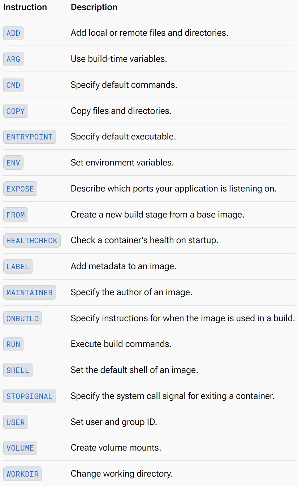

# 基于 Dockerfile 构建自己的镜像

首先准备一个可以正常运行的应用，这一步很重要，避免项目死活启动不了时，排查了 Dockerfile 文件半天，最后才发现是项目自身的原因

然后新建一个文件，名字可以随便取，不需要加任何后缀，建议和应用放在同一个目录，或者相邻的目录，以便可以使用相对路径访问宿主机上的一些资源，移植性更好些

```dockerfile
FROM openjdk:8
# MAINTAINER jiage <XXX@qq.com>
LABEL author="jiage"
LABEL email="XXX@qq.com"
RUN mkdir -p /doro/web
ADD doro-web.zip /doro/web
RUN unzip /doro/web/doro-web.zip -d /doro/web
EXPOSE 9001
CMD ["java", "-jar", "/doro/web/doro-web.jar"]
# CMD java -jar /doro/web/doro-web.jar
# ENTRYPOINT ["java", "-jar", "/doro/web/doro-web.jar"]
```

上面就是一个可以运行的 Dockerfile 文件，是不是看着很简单，事实上就是很简单，接下来就会大致介绍一下上面使用到的指令

## Dockerfile 常用指令

Dockerfile 使用的指令不多，常用的就更少了



<small>[Dockerfile reference - Overview](https://docs.docker.com/reference/dockerfile/#overview/)</small>

### `FROM`

`FROM` 指令是最重要的，也是必须的，指定了构建镜像时所需的基础镜像

```dockerfile
# 可以不指定 tag，默认使用的就是 latest，但不建议，最好指定具体的版本
FROM <image>:<tag>
```

如果构建的是自己的应用的镜像，一般使用 openjdk，也就是 java 作为基础镜像

### `LABEL`

`LABEL` 用来描述镜像的一些信息，如作者、版本、时间等，`MAINTAINER` 指令已被标注为过时，所以如果想添加维护者的信息也可以使用 `LABEL` 指令

### `RUN`

`RUN` 指令后面跟的就是在构建镜像时所需执行的命令

### `ADD`

可以将文件、目录或从远程 URL 获取到的文件复制到镜像中，支持通配符，会对本地（非从 URL 中获取的）的压缩文件自动解压，支持 `tar`、`gzip`、`xz` 格式，`zip` 格式应该是不支持的，起码我使用时并不会自动解压

```dockerfile
ADD <src> <dest>

# 例
ADD test.txt /home
ADD test/ /home
ADD https://test.com/test.txt /home
```

### `COPY`

相比于 `ADD` 更简单明确，就是将文件、目录复制到镜像中，如果只需要复制文件，建议使用该命令

### `EXPOSE`

声明该镜像所需的端口，注意该指令并不会真的开放该端口，或者映射该端口，只是起到声明的作用

### `ENV`

设置环境变量

```dockerfile
ENV <key>=<value>

# 例
ENV JAVA_HOME=/opt/java/openjdk
```

### `ARG`

定义一个变量，可以设置一个默认值，也可在构建时通过 `--build-arg <varname>=<value>` 传入变量值

```dockerfile
ARG <name>[=<default value>]

# 例
ARG num
ARG add=999

ARG JAVA_HOME=/opt/java/openjdk
ENV JAVA_HOME=$JAVA_HOME
```

### `CMD` 与 `ENTRYPOINT`

二者都表示容器启动时所需执行命令，在构建时并不会执行。二者在使用时有些区别，但简单使用的话，不需要过多注意，使用任意一种都可以，也可以二者组合使用

```dockerfile
CMD ["executable", "param1", "param2"]
CMD command param1 param2

ENTRYPOINT ["executable", "param1", "param2"]
ENTRYPOINT command param1 param2
```

## 构建

编辑好 Dockerfile 文件，就可以开始构建镜像了

```shell
docker build [OPTIONS] PATH | URL | -

# -f：指定 Dockerfile 文件
# -t：设置镜像的名字及标签
# 注意末尾需要指定构建时命令的传递位置
# . 表示当前的工作目录，也可以指定目录
docker build -f .\dockerfile -t test-server .
```

## 参考

- [Dockerfile reference](https://docs.docker.com/reference/dockerfile/)
- [万字长文带你看全网最详细Dockerfile教程](https://mp.weixin.qq.com/s/rJDUsOL22KPxj5YdX5Eicw)
