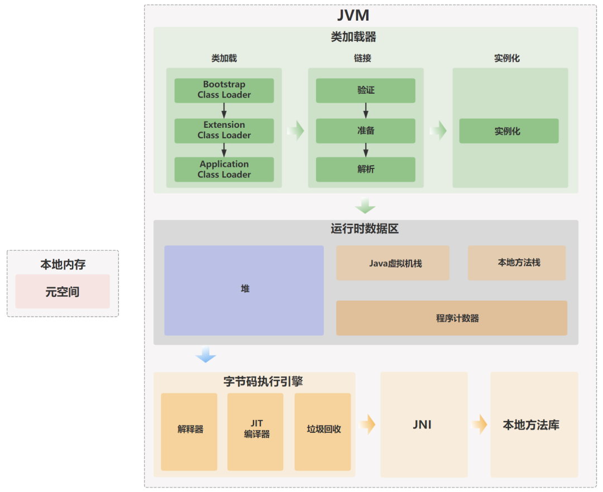

# JVM

JVM（Java Virtual Machine）是一种能够执行 Java 字节码的虚拟机，是实现 Java 跨平台特性的核心部分，他屏蔽了与具体操作系统平台相关的信息，使得 Java 程序只需生成在 JVM 上运行的目标代码（字节码），就可以在多种平台上不加修改地运行

## JDK、JRE 与 JVM

- JDK（Java Development Kit）：Java 开发工具包，用来编译、调试 Java 程序的开发工具包
- JRE（Java Runtime Environment）：Java 运行环境，所有的 Java 程序都要在 JRE 下才能运行
- JVM（Java Virtual Machine）：Java 虚拟机，JRE 的一部分，主要工作是将字节码解释为对应平台的机器码

<small>*[Understanding the difference between JDK, JRE, and JVM](https://www.boardinfinity.com/blog/understanding-the-difference-between-jdk-jre-and-jvm/)*</small>

## JVM 结构

<small>*[大白话+手绘图带你认识 JVM，JVM到底是什么？ - JVM 内部结构](https://javabetter.cn/jvm/what-is-jvm.html)*</small>
