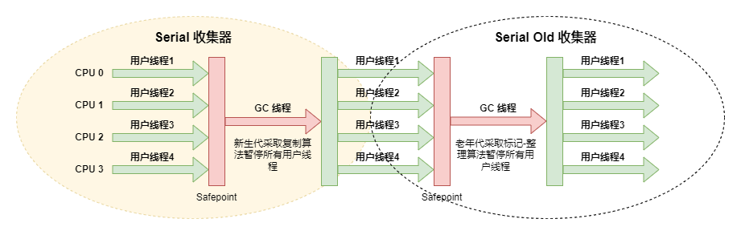
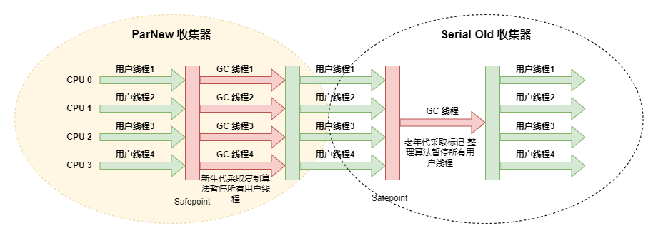
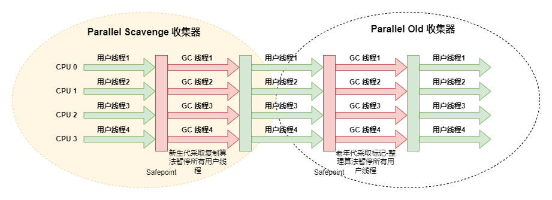
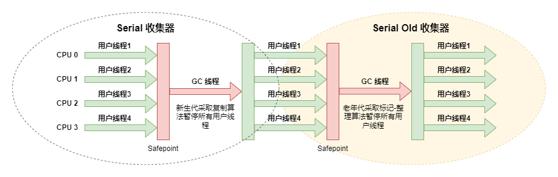
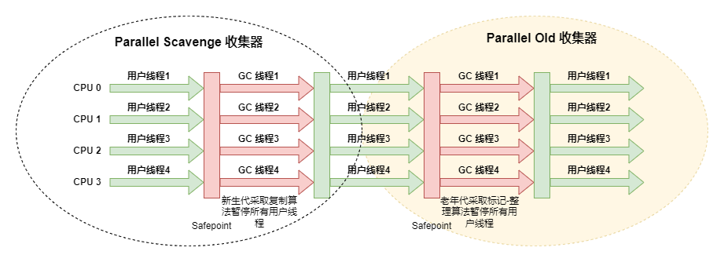
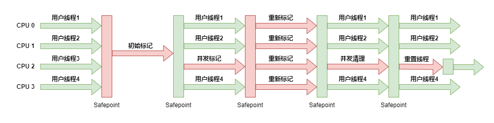
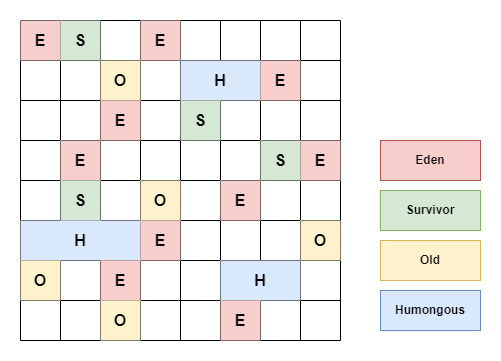
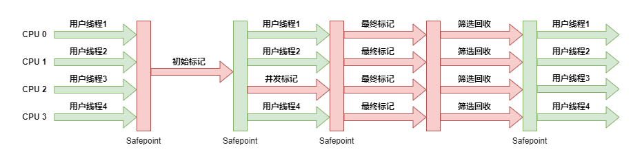

# 垃圾回收器

## Serial

Serial 是最基础、历史最悠久的收集器，是一个 **单线程** 工作的收集器

- 只会使用一个收集线程去完成垃圾收集工作
- 更重要的是强调在它进行垃圾收集时，**必须暂停其他所有工作线程（Stop The World），直到它收集结束**
  - 即便越来越优秀的垃圾收集器在不断涌现，用户线程的停顿时间在持续缩短，但是仍然没有办法彻底消除

- **安全点（Safepoint）**：用户程序执行时并非在代码指令流的任意位置都能够停顿下来开始垃圾收集，而是强制要求 **必须执行到达安全点后才能够暂停**
  - 安全点的选定既不能太少以至于让收集器等待时间过长，也不能太过频繁以至于过分增大运行时的内存负荷

Serial 依然是 **客户端模式下默认的新生代收集器**，简单而高效（与其他收集器的单线程相比），对于内存资源受限的环境，它是所有收集器里 **额外内存消耗最小的**

对于单核处理器或处理器核心数较少的环境来说，Serial 收集器由于 **没有线程交互的开销**，专心做垃圾收集自然可以获得最高的单线程收集效率

## ParNew

 **ParNew 实质上是Serial 的多线程并行版本**，在实现上这两种收集器也共用了相当多的代码

ParNew 是不少运行在服务端模式下虚拟机的首选的新生代收集器，尤其是 JDK1.7 之前的遗留系统，其中有一个与功能、性能无关但其实很重要的原因是，**除了 Serial 收集器外，目前只有它能与 CMS 收集器配合工作**

## Parallel Scavenge

基于 **标记-复制算法** 实现的收集器，是一款 **新生代收集器**，也是能够并行收集的 **多线程收集器**

它的关注点与其他收集器不同，CMS 等收集器的关注点是尽可能地缩短垃圾收集时用户线程的停顿时间，而 Parallel Scavenge 收集器的目标则是达到一个可控制的 **吞吐量（Throughput）**

- 吞吐量：处理器用于运行用户代码的时间与处理器总消耗时间的比值 `吞吐量 = 运行用户代码时间 / (运行用户代码时间 + 运行垃圾收集时间)`

停顿时间越短就越适合需要与用户交互或需要保证服务响应质量的程序，良好的响应速度能提升用户体验；而高吞吐量则可以最高效率地利用处理器资源，尽快完成程序的运算任务，主要适合在后台运算而不需要太多交互的分析任务

> 一个注重更快，一个注重更多

## Serial Old

Serial Old 是 Serial 的老年代版本，它同样是一个单线程收集器，使用 **标记-整理算法**

Serial Old 主要也是供客户端模式下的虚拟机使用。如果在服务端模式下，它也可能有两种用途

- 在 JDK1.5 以及之前的版本中与 Parallel Scavenge 收集器搭配使用
- 作为 CMS 收集器发生失败时的后备预案

## Parallel Old

Parallel Old 是 Parallel Scavenge 收集器的老年代版本，支持多线程并发收集，基于 **标记-整理算法** 实现

直到 Parallel Old 收集器出现后，吞吐量优先收集器终于有了比较名副其实的搭配组合，在注重吞吐量或者处理器资源较为稀缺的场合，都可以优先考虑 Parallel Scavenge 加 Parallel Old 收集器这个组合

- Parallel Scavenge 与 Parallel Old 也是 JDK1.8 默认收集器

## CMS（Concurrent Mark Sweep）

基于 **标记-清除算法**，是一种以获取 **最短回收停顿时间** 为目标的收集器。目前很大一部分的 Java 应用集中在互联网网站或者基于浏览器的 B/S 系统的服务端上，这类应用通常都会较为关注服务的响应速度，希望系统停顿时间尽可能短，以给用户带来良好的交互体验，CMS 收集器就非常符合这类应用的需求

1. **初始标记**：标记一下 GC Roots 能直接关联到的对象，需要停顿线程，但耗时很短
2. **并发标记**：从 GC Roots 开始对堆中对象进行可达性分析，找出要回收的对象，这阶段耗时较长，但可与用户程序并发执行
3. **重新标记**：为了修正并发标记期间，因用户程序继续运作而导致标记产生变动的那一部分对象的标记记录，这个阶段的停顿时间通常会比初始标记阶段稍长一些，但也远比并发标记阶段的时间短
4. **并发清除**：清理删除掉标记阶段判断的已经死亡的对象，由于不需要移动存活对象，所以这个阶段也是可以与用户线程同时并发的

由于在整个过程中耗时最长的并发标记和并发清除阶段中，垃圾收集器线程都可以与用户线程一起工作，所以从总体上来说，CMS 收集器的内存回收过程是与用户线程一起并发执行的

### 缺点

#### 对处理器资源非常敏感

事实上，面向并发设计的程序都对处理器资源比较敏感。在并发阶段，它虽然不会导致用户线程停顿，但却会因为占用了一部分线程（或者说处理器的计算能力）而导致应用程序变慢，降低总吞吐量

#### 无法处理浮动垃圾（Floating Garbage）

在 CMS 的并发标记和并发清理阶段，用户线程是还在继续运行的，程序在运行自然就还会伴随有新的垃圾对象不断产生，但这一部分垃圾对象是出现在标记过程结束以后，CMS 无法在当次收集中处理掉它们，只好留待下一次垃圾收集时再清理掉

#### 空间碎片

基于标记-清除算法实现的收集器，收集结束时会有大量空间碎片产生

## Garbage First （G1）

G1 是一款主要面向服务端应用的垃圾收集器。在 G1 收集器出现之前的所有其他收集器，包括 CMS 在内，垃圾收集的目标范围要么是整个新生代（Minor GC），要么就是整个老年代（Major GC），再要么就是整个堆（Full GC）

而 G1 可以面向堆内存任何部分来组成 **回收集（Collection Set，CSet）** 进行回收，衡量标准不再是它属于哪个分代，而是哪块内存中存放的垃圾数量最多，回收收益最大，这就是 G1 收集器的 **Mixed GC 模式**

G1 不再按照分代区域划分，而是 **把堆划分为多个大小相等的独立区域（Region）**，每一个 Region 都可以根据需要，扮演新生代的 Eden 空间、Survivor 空间，或者老年代空间。**收集器能够对扮演不同角色的 Region 采用不同的策略去处理**

Region 中还有一类特殊的 **Humongous 区域**，专门用来存储大对象

- 大小超过了一个 Region 容量一半的对象，就会被 G1 判定为大对象
- 对于超过了整个 Region 容量的超级大对象，将会被存放在 **多个连续的 Humongous Region** 之中，G1 会把 Humongous Region 作为 **老年代的一部分** 来进行看待

G1 收集器 **将 Region 作为单次回收的最小单元**，即每次收集到的内存空间都是 Region 大小的整数倍，这样可以有计划地避免在整个堆中进行全区域的垃圾收集

更具体的处理思路是让 G1 收集器去跟踪各个 Region 里面的垃圾堆积的价值大小，价值即回收所获得的空间大小以及回收所需时间的经验值，然后在后台维护一个优先级列表，每次根据用户设定允许的收集停顿时间（默认值是 200 毫秒），**优先处理回收价值收益最大的那些 Region**，这也就是 Garbage First 名字的由来

### 工作流程

1. **初始标记**：标记一下 GC Roots 能直接关联到的对象，需要停顿线程，但耗时很短
2. **并发标记**：从 GC Roots 开始对堆中对象进行可达性分析，递归扫描整个堆里的对象图，找出要回收的对象，这阶段耗时较长，但可与用户程序并发执行
3. **最终标记**：对用户线程做另一个短暂的暂停，用于处理并发标记阶段中产生的垃圾
4. **筛选回收**：负责更新 Region 的统计数据，对各个 Region 的回收价值和成本进行排序，根据用户所期望的停顿时间来制定回收计划，可以自由选择任意多个 Region 构成回收集，然后把决定回收的那一部分 Region 的存活对象复制到空的 Region 中，再清理掉整个旧 Region 的全部空间。这里的操作涉及存活对象的移动，是必须暂停用户线程，由多条收集器线程并行完成的

## 垃圾收集器的选择

- 串行：Serial、Serial Old
- 并发：ParNew、Parallel Scavenge、Parallel Old、CMS、G1
 
- 新生代：Serial、ParNew、Parallel Scavenge
- 老年代：Serial Old、Parallel Old、CMS
- G1 保留了分代的概念，但并不局限于收集某个分代
 
- 标记-清除：CMS
- 标记-复制：Serial、ParNew、Parallel Scavenge
- 标记-整理：Serial Old、Parallel Old
- G1 从整体来看是基于标记-整理算法，但从局部（两个 Region 之间）上看又是基于标记-复制算法
 
- 侧重响应时间：CMS、G1（在保证延迟可控的情况下获得尽可能高的吞吐量）
- 侧重吞吐量：Parallel Scavenge、Parallel Old
- 硬件配置低：Serial、Serial Old、ParNew
 
- 优先调整堆的大小让服务器自己来选择
- 如果内存小于 100M，或者是单核 CPU，并且没有停顿时间的要求，选择串行收集器
- 如果优先考虑应用程序的峰值性能，选择 Parallel 收集器
- 如果侧重响应时间，选择并发收集器。4G 以下可以用 parallel，4-8G 可以用 ParNew + CMS，8G 以上可以用 G1

### CMS 与 G1

- G1 是 JDK9 的默认收集器
- 回收算法
  - CMS 采用复制-清除算法，可能会产生的大量的内存空间碎片
  - G1 从整体来看是基于标记-整理算法，但从局部（两个 Region 之间）上看又是基于标记-复制算法，这两种算法都意味着 G1 在运行期间不会产生内存空间碎片
- G1 需要记忆集来记录新生代和老年代之间的引用关系，这种数据结构在 G1 中需要占用大量的内存，可能达到整个堆内存容量的 20% 甚至更多。而且 G1 中维护记忆集的成本较高，带来了更高的执行负载，影响效率。相比较而言 CMS 的记忆集就简单得多内存占用也更少

- CMS 在小内存应用上的表现要优于 G1，而大内存应用上 G1 更有优势，大小内存的界限是 6 ~ 8 GB

## 参考

- 深入理解Java虚拟机（第3版）
