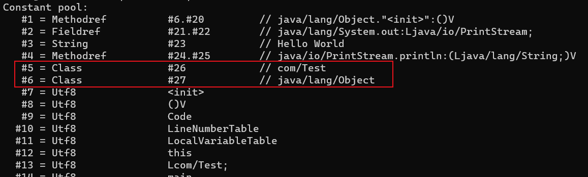

# Class 文件的结构

Class 文件是 **一组以 8 个字节为基础单位的二进制流**，各个数据项目 **严格按照顺序紧凑地** 排列在文件之中，中间没有任何分隔符，这使得整个 Class 文件中存储的内容几乎全部是程序运行的必要数据，没有空隙存在

- 当遇到需要占用 8 个字节以上空间的数据项时，则会按照高位在前的方式分割成若干个 8 个字节进行存储

```java
public class Test {
    public static void main(String[] args) {
        System.out.println("Hello World");
    }
}
```


Class 文件格式采用一种类似于 C 语言结构体的伪结构来存储数据，这种伪结构中只有两种数据类型：**无符号数和表**

- 无符号数属于基本的数据类型，以 `u1`、`u2`、`u4`、`u8` 来分别代表 1 个字节、2 个字节、4 个字节和 8 个字节的无符号数
  - 无符号数可以用来描述数字、索引引用、数量值或者按照 UTF-8 编码构成字符串值

- 表是由多个无符号数或者其他表作为数据项构成的复合数据类型，为了便于区分，所有表的命名都习惯性地以 `_info` 结尾
  - 表用于描述有层次关系的复合结构的数据，整个 Class 文件本质上也可以视作是一张表

无论是无符号数还是表，当需要描述同一类型但数量不定的多个数据时，经常会使用一个前置的容量计数器加若干个连续的数据项的形式，这时候称这一系列连续的某一类型的数据为某一类型的集合

| 类型 | 名称 | 数量 |
| :- | :- | :- |
| u4 | magic | 1 |
| u2 | minjor_version | 1 |
| u2 | major_version | 1 |
| u2 | constant_pool_count | 1 |
| cp_info | constant_pool | constant_pool_count - 1 |
| u2 | access_flags | 1 |
| u2 | this_class | 1 |
| u2 | super_class | 1 |
| u2 | interfaces_count | 1 |
| u2 | interfaces | interfaces_count |
| u2 | fields_count | 1 |
| field_info | fields | fields_count |
| u2 | methods_count | 1 |
| method_info | methods | methods_count |
| u2 | attributes_count | 1 |
| attribute_info | attributes | attributes_count |

## 查看 Class 文件结构

除了二进制编辑器，还可以使用 `javap -v 类名` 查看文件结构

- 使用 `javap -v 类名 > test.txt` 指令可将结果导出

```shell
> javap -v Test
Classfile /D:/workspace/HelloWorld/out/production/HelloWorld/io/Test.class
  Last modified 2024-7-12; size 521 bytes
  MD5 checksum 2b131ef887361e748822f45a266b4c5e
  Compiled from "Test.java"
public class io.Test
  minor version: 0
  major version: 52
  flags: ACC_PUBLIC, ACC_SUPER
Constant pool:
   #1 = Methodref          #6.#20         // java/lang/Object."<init>":()V
   #2 = Fieldref           #21.#22        // java/lang/System.out:Ljava/io/PrintStream;
   #3 = String             #23            // Hello World
   #4 = Methodref          #24.#25        // java/io/PrintStream.println:(Ljava/lang/String;)V
   #5 = Class              #26            // io/Test
   #6 = Class              #27            // java/lang/Object
   #7 = Utf8               <init>
   #8 = Utf8               ()V
   #9 = Utf8               Code
  #10 = Utf8               LineNumberTable
  #11 = Utf8               LocalVariableTable
  #12 = Utf8               this
  #13 = Utf8               Lio/Test;
  #14 = Utf8               main
  #15 = Utf8               ([Ljava/lang/String;)V
  #16 = Utf8               args
  #17 = Utf8               [Ljava/lang/String;
  #18 = Utf8               SourceFile
  #19 = Utf8               Test.java
  #20 = NameAndType        #7:#8          // "<init>":()V
  #21 = Class              #28            // java/lang/System
  #22 = NameAndType        #29:#30        // out:Ljava/io/PrintStream;
  #23 = Utf8               Hello World
  #24 = Class              #31            // java/io/PrintStream
  #25 = NameAndType        #32:#33        // println:(Ljava/lang/String;)V
  #26 = Utf8               io/Test
  #27 = Utf8               java/lang/Object
  #28 = Utf8               java/lang/System
  #29 = Utf8               out
  #30 = Utf8               Ljava/io/PrintStream;
  #31 = Utf8               java/io/PrintStream
  #32 = Utf8               println
  #33 = Utf8               (Ljava/lang/String;)V
{
  public io.Test();
    descriptor: ()V
    flags: ACC_PUBLIC
    Code:
      stack=1, locals=1, args_size=1
         0: aload_0
         1: invokespecial #1                  // Method java/lang/Object."<init>":()V
         4: return
      LineNumberTable:
        line 3: 0
      LocalVariableTable:
        Start  Length  Slot  Name   Signature
            0       5     0  this   Lio/Test;

  public static void main(java.lang.String[]);
    descriptor: ([Ljava/lang/String;)V
    flags: ACC_PUBLIC, ACC_STATIC
    Code:
      stack=2, locals=1, args_size=1
         0: getstatic     #2                  // Field java/lang/System.out:Ljava/io/PrintStream;
         3: ldc           #3                  // String Hello World
         5: invokevirtual #4                  // Method java/io/PrintStream.println:(Ljava/lang/String;)V
         8: return
      LineNumberTable:
        line 6: 0
        line 7: 8
      LocalVariableTable:
        Start  Length  Slot  Name   Signature
            0       9     0  args   [Ljava/lang/String;
}
SourceFile: "Test.java"
```

## 魔数

每个 Class 文件的 **头 4 个字节被称为魔数（Magic Number）**，它唯一的作用是确定这个文件是否为一个能被虚拟机接受的 Class 文件

- 使用魔数而不是扩展名来进行识别主要是基于安全考虑，因为文件扩展名可以随意改动。文件格式的制定者可以自由地选择魔数值，只要这个魔数值还没有被广泛采用过而且不会引起混淆

Class 文件的魔数为 `0xCAFEBABE`（咖啡宝贝），颇具浪漫主义气质啊


## Class 文件的版本

紧接着魔数的 4 个字节存储的是 Class 文件的版本号

- 第 5、6 个字节是次版本号（Minor Version）
- 第 7、8 个字节是主版本号（Major Version）

Java 的版本号是从 45 开始的，JDK1.1 之后的每个 JDK 大版本发布主版本号向上加 1，高版本的 JDK 能向下兼容以前版本的 Class 文件，但不能运行以后版本的 Class 文件，JVM 规范在 Class 文件校验部分明确要求了即使文件格式并未发生任何变化，虚拟机也必须拒绝执行超过其版本号的 Class 文件


## 常量池

紧接着主、次版本号之后的是常量池入口，常量池可以比喻为 Class 文件里的资源仓库，它是 Class 文件结构中与其他项目关联最多的数据，通常也是占用 Class 文件空间最大的数据项目之一

由于常量池中常量的数量是不固定的，所以在常量池的入口需要放置一项 `u2` 类型的数据，代表 **常量池容量计数值（constant_pool_count）**。与 Java 中语言习惯不同，这个容量计数是 **从 1 开始的**

- 索引值设置为 0，表达不引用任何一个常量池项目的含义
- Class 文件结构中只有常量池的容量计数是从 1 开始

常量池中主要存放两大类常量：**字面量（Literal）和符号引用（Symbolic References）**

字面量比较接近于 Java 语言层面的常量概念，如文本字符串、被声明为 `final` 的常量值等

```java
// 字面量为你吼啊
private String hello = "你吼啊";
// 字面量为999
static final int num999 = 999;
// 在常量池中没有字面量
static int num666 = 666;
```

符号引用则属于编译原理方面的概念，主要包括下面几类常量

- 被模块导出或者开放的包
- **类和接口的全限定名**
- **字段的名称和描述符**
- **方法的名称和描述符**
- 方法句柄和方法类型
- 动态调用点和动态常量

在 Class 文件中不会保存各个方法、字段最终在内存中的布局信息，这些字段、方法的符号引用不经过虚拟机在运行期转换的话，是无法得到真正的内存入口地址，也就无法直接被虚拟机使用的。当虚拟机做类加载时，将会从常量池获得对应的符号引用，再在类创建时或运行时解析、翻译到具体的内存地址之中

常量池中每一项常量都是一个表，常量表中分别有 17 种不同类型的常量，表结构起始的第一位都是 u1 类型的标志位，代表着当前常量属于哪种常量类型

| 类型 | 标志 | 描述 |
| :- | :-: | :- |
| CONSTANT_Utf8_info | 1 | UTF-8 编码的字符串 |
| CONSTANT_Integer_info | 3 | 整型字面量 |
| CONSTANT_Float_info | 4 | 浮点型字面量 |
| CONSTANT_Long_info | 5 | 长整型字面量 |
| CONSTANT_Double_info | 6 | 双精度浮点型字面量 |
| CONSTANT_Class_info | 7 | 类或接口的符号引用 |
| CONSTANT_String_info | 8 | 字符串类型字面量 |
| CONSTANT_FieldRef_info | 9 | 字段的符号引用 |
| CONSTANT_MethodRef_info | 10 | 类中方法的符号引用 |
| CONSTANT_InterfaceMethodRef_info | 11 | 接口中方法的符号引用 |
| CONSTANT_NameAndType_info | 12 | 字段或方法的部分符号引用 |
| CONSTANT_MethodHandle_info | 15 | 表示方法句柄 |
| CONSTANT_MethodType_info | 16 | 表示方法类型 |
| CONSTANT_Dynamic_info | 17 | 表示一个动态计算常量 |
| CONSTANT_InvokeDynamic_info | 18 | 表示一个动态方法调用点 |
| CONSTANT_Moudule_info | 19 | 表示一个模块 |
| CONSTANT_Package_info | 20 | 表示一个模块中开放或导出的包 |

```shell
Constant pool:
   #1 = Methodref          #9.#34         // java/lang/Object."<init>":()V
   #2 = String             #35            // 你吼啊
   #3 = Fieldref           #8.#36         // io/Test.hello:Ljava/lang/String;
   #4 = Fieldref           #37.#38        // java/lang/System.out:Ljava/io/PrintStream;
   #5 = Methodref          #39.#40        // java/io/PrintStream.println:(Ljava/lang/String;)V
   #6 = String             #41            // Hello World
   #7 = Fieldref           #8.#42         // io/Test.num666:I
   #8 = Class              #43            // io/Test
   #9 = Class              #44            // java/lang/Object
  #10 = Utf8               hello
  #11 = Utf8               Ljava/lang/String;
  #12 = Utf8               num999
  #13 = Utf8               I
  #14 = Utf8               ConstantValue
  #15 = Integer            999
  #16 = Utf8               num666
  #17 = Utf8               <init>
  #18 = Utf8               ()V
  #19 = Utf8               Code
  #20 = Utf8               LineNumberTable
  #21 = Utf8               LocalVariableTable
  #22 = Utf8               this
  #23 = Utf8               Lio/Test;
  #24 = Utf8               say
  #25 = Utf8               listen
  #26 = Utf8               ()Ljava/lang/String;
  #27 = Utf8               main
  #28 = Utf8               ([Ljava/lang/String;)V
  #29 = Utf8               args
  #30 = Utf8               [Ljava/lang/String;
  #31 = Utf8               <clinit>
  #32 = Utf8               SourceFile
  #33 = Utf8               Test.java
  #34 = NameAndType        #17:#18        // "<init>":()V
  #35 = Utf8               你吼啊
  #36 = NameAndType        #10:#11        // hello:Ljava/lang/String;
  #37 = Class              #45            // java/lang/System
  #38 = NameAndType        #46:#47        // out:Ljava/io/PrintStream;
  #39 = Class              #48            // java/io/PrintStream
  #40 = NameAndType        #49:#50        // println:(Ljava/lang/String;)V
  #41 = Utf8               Hello World
  #42 = NameAndType        #16:#13        // num666:I
  #43 = Utf8               io/Test
  #44 = Utf8               java/lang/Object
  #45 = Utf8               java/lang/System
  #46 = Utf8               out
  #47 = Utf8               Ljava/io/PrintStream;
  #48 = Utf8               java/io/PrintStream
  #49 = Utf8               println
  #50 = Utf8               (Ljava/lang/String;)V
```

## 访问标志

在常量池结束之后，紧接着的 2 个字节代表访问标志（access_flags），这个标志用于识别一些类或者接口层次的访问信息

| 标志名称 | 标志值 | 含义 |
| :- | :-: | :- |
| ACC_PUBLIC | 0x0001 | 是否为 `public` |
| ACC_FINAL | 0x0010 | 是否为 `final` |
| ACC_SUPER | 0x0020 | JDK1.0.2 后都为真 |
| ACC_INTERFACE | 0x0200 | 是否为接口 |
| ACC_ABSTRACT | 0x0400 | 标识为抽象类型，接口与抽象类都为真 |
| ACC_SYNTHETIC | 0x1000 | 是否由编译器自动生成 |
| ACC_ANNOTATION | 0x2000 | 是否为注解 |
| ACC_ENUM | 0x4000 | 是否为枚举 |
| ACC_MODULE | 0x8000 | 是否为模块 |


- 访问标志为 `0x0001 | 0x0010 | 0x0020 = 0x0031`

## 类索引、父类索引与接口索引集合

类索引（this_class）和父类索引（super_class）都是一个 `u2` 类型的数据，而接口索引集合（interfaces）是一组 `u2` 类型的数据的集合，Class 文件中由这三项数据来确定该类型的继承关系

- 类索引用于确定这个类的全限定名
- 父类索引用于确定这个类的父类的全限定名
  - 除了 `java.lang.Object` 外，所有类的父类索引都不为 0
- 接口索引集合就用来描述这个类实现了哪些接口，这些被实现的接口将按 `implements` 关键字（如果这个 Class 文件表示的是一个接口，则应当是 `extends` 关键字）后的接口顺序从左到右排列在接口索引集合中




## 字段表集合

字段表（field_info）用于描述接口或者类中声明的变量。Java 语言中的字段（Field）**包括类级变量以及实例级变量，但不包括在方法内部声明的局部变量**

字段可以包括的修饰符有

- 字段的作用域（`public`、`private`、`protected`）
- 是实例变量还是类变量（`static`）
- 可变性（`final`）
- 并发可见性（`volatile`）
- 可否被序列化（`transient`）
- 字段数据类型（基本类型、对象、数组）
- 字段名称

| 类型 | 名称 | 数量 |
| :- | :- | :- |
| u2 | access_flags | 1 |
| u2 | name_index | 1 |
| u2 | descriptor_index | 1 |
| u2 | attributes_count | 1 |
| attribute_info | attributes | attributes_count |

### access_flags

字段修饰符放在 access_flags 项目中

| 标志名称 | 标志值 | 含义 |
| :- | :-: | :- |
| ACC_PUBLIC | 0x0001 | 是否为 `public` |
| ACC_PRIVATE | 0x0010 | 是否为 `private` |
| ACC_PROTECTED | 0x0020 | 是否为 `proctected` |
| ACC_STATIC | 0x0200 | 是否为 `static` |
| ACC_FINAL | 0x0400 | 是否为 `final` |
| ACC_VOLATILE | 0x1000 | 是否为 `volatile` |
| ACC_TRANSIENT | 0x2000 | 是否为 `transient` |
| ACC_SYNTHETIC | 0x4000 | 是否由编译器自动生成 |
| ACC_ENUM | 0x8000 | 是否为 enum |

### name_index

对常量池项的引用，代表着字段的简单名称。没有类型和参数修饰字段名称

### descriptor_index

对常量池项的引用，代表着字段的描述符

描述符的作用是用来描述字段的数据类型、方法的参数列表（包括数量、类型以及顺序）和返回值。根据描述符规则，基本数据类型以及代表无返回值的 void 类型都用一个大写字符来表示，而对象类型则用字符 L 加对象的全限定名来表示

- 全限定名：将类全名中的 `.` 替换成 `/`，为了使连续的多个全限定名之间不产生混淆，在使用时最后一般会加入一个 `;` 号表示全限定名结束
- 对于数组类型，每一维度将使用一个前置的 `[` 字符来描述，如 `String[][]` 类型的二维数组将被记录成 `[[Ljava/lang/String;`，一个整型数组 `int[]` 将被记录成 `[I`

| 标识字符 | 含义 |
| :-: | :- |
| B | 基本类型 byte |
| C | 基本类型 char |
| D | 基本类型 double |
| F | 基本类型 float |
| I | 基本类型 int |
| J | 基本类型 long |
| S | 基本类型 short |
| Z | 基本类型 boolean |
| V | 特殊类型 void |
| L | 对象类型 |

### attributes_count 与 attributes

字段表所包含的固定数据项目到 descriptor_index 为止就全部结束了，不过在 descriptor_index 之后跟随着一个属性表集合，用于存储一些额外的信息，字段表可以在属性表中附加描述零至多项的额外信息

## 方法表集合

Class 文件存储格式中对方法的描述与对字段的描述采用了几乎完全一致的方式，方法表的结构如同字段表一样。仅在访问标志和属性表集合的可选项中有所区别

- 方法访问标志

| 标志名称 | 标志值 | 含义 |
| :- | :-: | :- |
| ACC_PUBLIC | 0x0001 | 是否为 public |
| ACC_PRIVATE | 0x0002 | 是否为 private |
| ACC_PROTECTED | 0x0004 | 是否为 proctected |
| ACC_STATIC | 0x0008 | 是否为 static |
| ACC_FINAL | 0x0010 | 是否为 final |
| ACC_SYNCHRONIZED | 0x0020 | 是否为 synchronized |
| ACC_BRIDGE | 0x0040 | 是否为编译器产生的桥接方法 |
| ACC_VARARGS | 0x0080 | 是否接受不定参数 |
| ACC_NATIVE | 0x0100 | 是否为 native |
| ACC_ABSTRACT | 0x0400 | 是否为 abstract |
| ACC_STRICT | 0x0800 | 是否为 strictfp |
| ACC_SYNTHETIC | 0x1000 | 是否由编译器自动生成 |

方法里的 Java 代码，编译成字节码指令之后，存放在方法属性表集合中一个名为 Code 的属性里面，属性表是 Class 文件格式中最具扩展性的一种数据项目

与字段表集合相对应地，如果父类方法在子类中没有被重写，方法表集合中就不会出现来自父类的方法信息。但同样地，有可能会出现由编译器自动添加的方法，最常见的便是类构造器 `<clinit>` 方法和实例构造器 `<init>` 方法

用描述符来描述方法时，按照先参数列表、后返回值的顺序描述，参数列表按照参数的严格顺序放在一组小括号之内

```java
private double doSomething(int i, String s, boolean[] boolArr) {
    return 0;
}
```

```shell
(ILjava/lang/String;[Z)D
# I 参数i
# Ljava/lang/String; 参数s
# [Z 参数boolArr
# D 返回值
```

## 属性表集合

Class 文件、字段表、方法表都可以携带自己的属性表集合（attribute_info），以描述某些场景专有的信息

与 Class 文件中其他的数据项目要求严格的顺序、长度和内容不同，属性表集合的限制稍微宽松一些，不再要求各个属性表具有严格顺序，并且 JVM 规范允许只要不与已有属性名重复，任何人实现的编译器都可以向属性表中写入自己定义的属性信息，JVM 运行时会忽略掉它不认识的属性


<small>深入理解Java虚拟机（第3版） - 表6-13 虚拟机规范预定义的属性</small>

## 引用

- 深入理解Java虚拟机（第3版）
