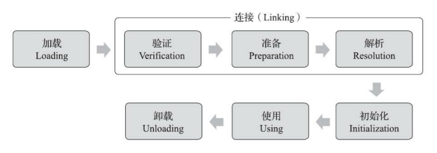

# 类加载机制

类的数据从 Class 文件加载到内存，并对数据进行校验、转换解析和初始化，最终形成可以被虚拟机直接使用的 Java 类型，这个过程被称作虚拟机的类加载机制

与那些在编译时需要进行连接的语言不同，在 Java 语言里面，类型的加载、连接和初始化过程都是在程序运行期间完成的，这种策略让 Java 语言进行提前编译会面临额外的困难，也会让类加载时稍微增加一些性能开销，但是却为 Java 应用提供了极高的扩展性和灵活性，Java 天生可以动态扩展的语言特性就是依赖运行期动态加载和动态连接这个特点实现的

## 类加载的时机

一个类型从被加载到虚拟机内存中开始，到卸载出内存为止，它的整个生命周期将会经历

1. 加载（Loading）
2. 验证（Verification）
3. 准备（Preparation）
4. 解析（Resolution）
5. 初始化（Initialization）
6. 使用（Using）
7. 卸载（Unloading）

其中验证、准备、解析三个部分统称为连接（Linking）



<small>深入理解Java虚拟机（第3版） - 图7-1 类的生命周期</small>

加载、验证、准备、初始化和卸载这五个阶段的顺序是确定的，类型的加载过程必须按照这种顺序按部就班地开始，而解析阶段则不一定，它在某些情况下可以在初始化阶段之后再开始，这是为了支持 Java 语言的运行时绑定特性（也称为动态绑定或晚期绑定）

## 类加载的过程

### 加载（Loading）

在加载阶段，JVM 需要完成以下三件事情

1. 通过类的 **全限定名** 来获取定义此类的二进制字节流
2. 将这个字节流所代表的静态存储结构转化为方法区（元空间）的运行时数据结构
3. 在内存中生成一个代表这个类的 Class 对象，作为方法区这个类的各种数据的访问入口

> 简单来说就是将 Class 文件加载到内存中，从 Class 文件转化成 Class 对象

JVM 规范对这三点要求其实并不是特别具体，留给虚拟机实现与 Java 应用的灵活度都是相当大的，例如可以从 JAR、WAR 包中读取 Class 文件

相对于类加载过程的其他阶段，非数组类型的加载阶段（加载阶段中获取类的二进制字节流的动作）是开发人员可控性最强的阶段。加载阶段既可以使用 JVM 里内置的引导类加载器来完成，也可以自定义的类加载器去完成

对于数组类而言，由于数组类本身不通过类加载器创建，它是由 JVM 直接在内存中动态构造出来的。但数组类与类加载器仍然有很密切的关系，因为数组类的元素类型（Element Type）最终还是要靠类加载器来完成加载

加载阶段结束后，JVM 外部的二进制字节流就按照虚拟机所设定的格式存储在方法区之中了，方法区中的数据存储格式完全由虚拟机实现自行定义。类型数据妥善安置在方法区之后，会在堆内存中实例化一个 Class 类的对象，这个对象将作为程序访问方法区中的类型数据的外部接口


<small>深入理解Java虚拟机（第3版） - 图2-3 通过直接指针访问对象</small>

加载阶段与连接阶段的部分动作（如一部分字节码文件格式验证动作）是 **交叉进行** 的，加载阶段尚未完成，连接阶段可能已经开始，但这些夹在加载阶段之中进行的动作，仍然属于连接阶段的一部分，这两个阶段的开始时间仍然保持着固定的先后顺序

### 验证（Verification）

验证是连接阶段的第一步，这一阶段的目的是 **确保 Class 文件的字节流中包含的信息，符合 JVM 规范的全部约束要求**，保证这些信息被当作代码运行后不会危害虚拟机自身的安全，所以验证字节码是 JVM 保护自身的必要措施

从代码量和耗费的执行性能的角度上讲，验证阶段的工作量在虚拟机的类加载过程中占了相当大的比重

1. **文件格式验证**：验证字节流是否符合 Class 文件格式的规范，并且能被当前版本的虚拟机处理
2. **元数据验证**：进行语义分析，保证符合 Java 语言规范的要求
3. **字节码验证**：整个验证过程中最复杂的一个阶段，通过数据流分析和控制流分析，确定程序语义是合法的、符合逻辑的，保证被校验类的方法在运行时不会做出危害虚拟机安全的行为
4. **符号引用验证**：发生在虚拟机将符号引用转化为直接引用的时候，这个转化动作将在连接的第三阶段（解析阶段）中发生。符号引用验证可以看作是对类自身以外（常量池中的各种符号引用）的各类信息进行匹配性校验，通俗来说就是，该类是否缺少或者被禁止访问它依赖的某些外部类、方法、字段等资源

> 从大到小，逐步递进

验证阶段对于虚拟机的类加载机制来说，有必要，但不是必须要执行的阶段，因为验证阶段只有通过或者不通过的差别，只要通过了验证，其后就对程序运行期没有任何影响了

如果程序运行的全部代码都已经被反复使用和验证过，在生产环境的实施阶段就可以考虑使用 `-Xverify：none` 参数来关闭大部分的类验证措施，以缩短虚拟机类加载的时间

### 准备（Preparation）

准备阶段是正式 **为类中定义的变量（即静态变量，被 `static` 修饰的变量）分配内存并设置类变量初始值** 的阶段

从概念上讲，这些变量所使用的内存都应当在方法区中进行分配，但方法区本身是一个逻辑上的区域，在 JDK1.7 及之前，HotSpot 使用永久代来实现方法区时，实现是完全符合这种逻辑概念的；而在 JDK1.8 及之后，类变量则会随着 Class 对象一起存放在堆中，这时候类变量在方法区就完全是一种对逻辑概念的表述了

关于准备阶段，还有两个容易产生混淆的概念

- 首先这时候进行内存分配的 **仅包括类变量**，而不包括实例变量，实例变量将会在对象实例化时随着对象一起分配在堆中
- 其次是这里所说的初始值通常情况下是数据类型的 **零值**，如果一个常量的话，在准备阶段就会被附上指定的初始值

```java
// 类变量，在准备阶段过后的初始值为 0
public static int value = 123;

// 常量，在准备阶段过后的初始值为 123
public final static int value = 123;
```

### 解析（Resolution）

解析阶段是 JVM 将常量池内的符号引用替换为直接引用的过程

- **符号引用（Symbolic Reference）**：符号引用 **以一组符号来描述所引用的目标**，符号可以是任何形式的字面量，只要使用时能无歧义地定位到目标即可
  - 符号引用 **与虚拟机实现的内存布局无关**，引用的目标并不一定是已经加载到虚拟机内存当中的内容。各种虚拟机实现的内存布局可以各不相同，但是它们能接受的符号引用必须都是一致的，因为符号引用的字面量形式明确定义在 JVM 规范的 Class 文件格式中
- **直接引用（Direct Reference）**：直接引用是可以 **直接指向目标的指针、相对偏移量或者是一个能间接定位到目标的句柄**
  - 直接引用是 **和虚拟机实现的内存布局直接相关的**，同一个符号引用在不同虚拟机实例上翻译出来的直接引用一般不会相同。**如果有了直接引用，那引用的目标必定已经在虚拟机的内存中存在**

> 也可以这么理解，符号引用就是你的想法，比如说你肚子饿了想吃饭，你的目的是想吃饭，直接引用就是把你的想法转化实际的行动，具体找哪家饭店吃饭，有一个明确的位置，那里可以满足你的目的

JVM 规范中并未规定解析阶段发生的具体时间，所以虚拟机实现可以根据需要来自行判断，是在类被加载器加载时就对常量池中的符号引用进行解析，还是等到一个符号引用将要被使用前才去解析它

对同一个符号引用进行多次解析请求是很常见的事情，JVM 需保证在同一个实体中，执行了多次解析动作的幂等性。另外除 `invokedynamic` 指令以外，虚拟机实现可以对第一次解析的结果进行缓存，譬如在运行时直接引用常量池中的记录，并把常量标识为已解析状态，从而避免解析动作重复进行

解析动作主要针对类或接口、字段、类方法、接口方法、方法类型、方法句柄和调用点限定符这 7 类符号引用进行，分别对应着常量池中 8 种常量类型

| 类型 | 对应 | 描述 |
| :- | :-: | :- |
| CONSTANT_Class_info | 类或接口 | 类或接口的符号引用 |
| CONSTANT_FieldRef_info | 字段 | 字段的符号引用 |
| CONSTANT_MethodRef_info | 类方法 | 类中方法的符号引用 |
| CONSTANT_InterfaceMethodRef_info | 接口方法 | 接口中方法的符号引用 |
| CONSTANT_MethodType_info | 方法类型 | 表示方法类型 |
| CONSTANT_MethodHandle_info | 方法句柄 | 表示方法句柄 |
| CONSTANT_Dynamic_info | 调用点限定符 | 表示一个动态计算常量 |
| CONSTANT_InvokeDynamic_info | 调用点限定符 | 表示一个动态方法调用点 |

### 初始化（Initialization）

类的初始化阶段是类加载过程的最后一个步骤，除了在加载阶段用户应用程序可以通过自定义类加载器的方式局部参与外，其余动作都完全由 JVM 来主导控制。直到初始化阶段，JVM 才真正开始执行类中编写的 Java 程序代码，将主导权移交给应用程序

进行准备阶段时，变量已经赋过一次系统要求的初始零值，而在初始化阶段，则会根据程序员通过程序编码制定的主观计划去 **初始化类变量和其他资源**。也可以从另外一种更直接的形式来表达：**初始化阶段就是执行类构造器 `<clinit>` 方法的过程**

- `<clinit>` 并不是程序员在 Java 代码中直接编写的方法，它是 **由编译器的自动生成** 的
- `<clinit>` 方法对于类或接口来说并不是必需的，类中没有 **静态语句块、类变量的赋值操作**，是不会自动生成的
  - 接口中不能使用静态语句块，但仍然有类变量初始化的赋值操作。但接口与类不同的是，执行接口的 `<clinit>` 方法不需要先执行父接口的 `<clinit>` 方法，因为只有当父接口中定义的变量被使用时，父接口才会被初始化。此外，接口的实现类在初始化时也一样不会执行接口的 `<clinit>` 方法

```java
// 静态语句块
static {
    System.out.println("good");
}

// 类变量的赋值操作
static String s = "good";
```

- `<clinit>` 方法与 `<init>` 不同，它不需要显式地调用父类构造器，JVM 会保证在子类的 `<clinit>` 方法执行前，父类的 `<clinit>` 方法已经执行完毕

JVM 必须保证一个类的 `<clinit>` 方法 **在多线程环境中被正确地加锁同步**，如果多个线程同时去初始化一个类，那么只会有其中一个线程去执行这个类的 `<clinit>` 方法，其他线程都需要阻塞等待，直到活动线程执行完毕。如果在一个类的 `<clinit>` 方法中有耗时很长的操作，那就可能造成多个进程阻塞，在实际应用中这种阻塞往往是很隐蔽的

#### 初始化时机

JVM 规范严格规定了有且只有六种情况必须立即对类进行初始化

1. 遇到 `new`、`getstatic`、`putstatic` 或 `invokestatic` 这四条字节码指令时，如果类型没有进行过初始化，则需要先触发其初始化阶段
    - 使用 `new` 关键字实例化对象的时候
    - 读取或设置一个类型的静态字段（被 `final` 修饰、已在编译期把结果放入常量池的静态字段除外）的时候
    - 调用一个类型的静态方法的时候
2. 使用 `java.lang.reflect` 包的方法对类型进行反射调用的时候，如果类型没有进行过初始化，则需要先触发其初始化
3. 当初始化类的时候，如果发现其父类还没有进行过初始化，则需要先触发其父类的初始化
4. 当虚拟机启动时，用户需要指定一个要执行的主类，虚拟机会先初始化这个主类
5. 当使用 JDK1.7 新加入的动态语言支持时，如果一个 `java.lang.invoke.MethodHandle` 实例最后的解析结果为 `REF_getStatic`、`REF_putStatic`、`REF_invokeStatic`、`REF_newInvokeSpecial` 四种类型的方法句柄，并且这个方法句柄对应的类没有进行过初始化，则需要先触发其初始化
6. 当一个接口中定义了 JDK1.8 新加入的默认方法（被 `default` 关键字修饰的接口方法）时，如果有这个接口的实现类发生了初始化，那该接口要在其之前被初始化

### 卸载（Unloading）

卸载类即该类的 Class 对象被 GC，需要满足三个条件

1. 该类的所有的实例对象都已被 GC，即堆不存在该类的实例对象
2. 该类没有在其他任何地方被引用
3. 该类的类加载器的实例已被 GC

所以，在 JVM 生命周期内，由 JVM 自带的类加载器加载的类是不会被卸载的，但是由我们自定义的类加载器加载的类是可能被卸载的

## 参考

- 深入理解Java虚拟机（第3版）
- [JVM|什么是符号引用？](https://blog.csdn.net/weixin_48118167/article/details/130290449)
- [类加载过程详解](https://javaguide.cn/java/jvm/class-loading-process.html)
- [类加载的过程](https://lfool.github.io/LFool-Notes/java/%E7%B1%BB%E5%8A%A0%E8%BD%BD%E7%9A%84%E8%BF%87%E7%A8%8B.html)
