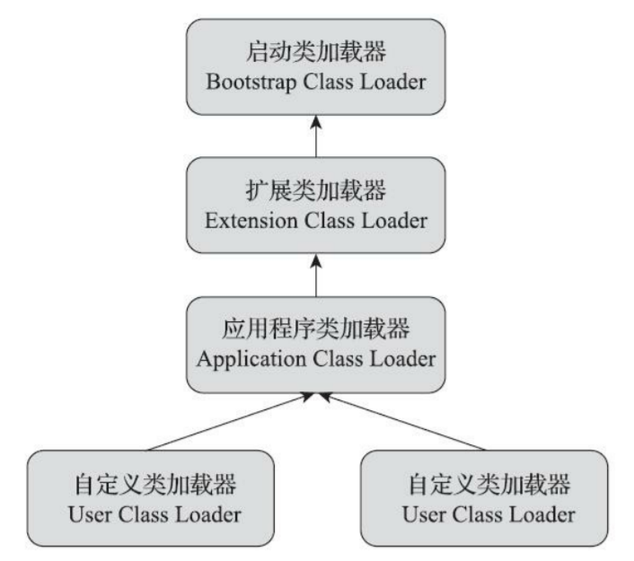

# 类加载器（Class Loader）

在类加载阶段中，把通过一个类的全限定名来获取描述该类的二进制字节流这个动作放到 JVM 外部去实现，以便让应用程序自己决定如何去获取所需的类，实现这个动作的代码被称为类加载器

## 类与类加载器

类加载器虽然只用于实现类的加载动作，但它在 Java 程序中起到的作用却远超类加载阶段

对于任意一个类，都必须由加载它的类加载器和这个类本身一起共同确立其在 Java 虚拟机中的唯一性，每一个类加载器，都拥有一个独立的类名称空间

比较两个类是否相等，只有在这两个类是由同一个类加载器加载的前提下才有意义，否则，即使这两个类来源于同一个 Class 文件，被同一个 JVM 加载，只要加载它们的类加载器不同，那这两个类就必定不相等

## 双亲委派模型

站在 Java 虚拟机的角度来看，只存在两种不同的类加载器

- 一种是启动类加载器（Bootstrap ClassLoader），这个类加载器使用 C++ 语言实现，是虚拟机自身的一部分
- 另外一种就是其他所有的类加载器，这些类加载器都由 Java 语言实现，独立存在于虚拟机外部，并且全都继承自抽象类 `java.lang.ClassLoader`

站在 Java 开发人员的角度来看，类加载器就应当划分得更细致一些。自 JDK1.2 以来，Java 一直保持着三层类加载器、双亲委派的类加载架构



<small>深入理解Java虚拟机（第3版） - 图7-2 类加载器双亲委派模型</small>

双亲委派模型要求除了顶层的启动类加载器外，其余的类加载器都应有自己的父类加载器。不过这里类加载器之间的父子关系一般不是以继承（Inheritance）的关系来实现的，而是通常使用 **组合（Composition）关系** 来复用父加载器的代码

使用双亲委派模型来组织类加载器之间的关系，一个显而易见的好处就是 Java 中的类随着它的类加载器一起具备了一种带有优先级的层次关系，**避免出现重复加载，防止核心类库被随意篡改**

### 工作流程

```java
public abstract class ClassLoader {

    ...

    // 父类加载器
    // Note: VM hardcoded the offset of this field, thus all new fields
    // must be added *after* it.
    private final ClassLoader parent;

    protected Class<?> loadClass(String name, boolean resolve)
        throws ClassNotFoundException
    {
        synchronized (getClassLoadingLock(name)) {
            // 首先，检查请求的类是否已被加载
            Class<?> c = findLoadedClass(name);
            
            if (c == null) {
                long t0 = System.nanoTime();
                try {
                    // 如果父类加载器不为空，则调用父类的加载器
                    // 如果父类加载器为空，则说明当前是启动类加载器，调用启动类加载器
                    if (parent != null) {
                        c = parent.loadClass(name, false);
                    } else {
                        c = findBootstrapClassOrNull(name);
                    }
                } catch (ClassNotFoundException e) {
                    // ClassNotFoundException thrown if class not found
                    // from the non-null parent class loader
                }

                if (c == null) {
                    // 如果父类加载器无法加载，则调用自身的 findClass 实现类加载
                    long t1 = System.nanoTime();
                    c = findClass(name);

                    // 统计类加载器的信息
                    sun.misc.PerfCounter.getParentDelegationTime().addTime(t1 - t0);
                    sun.misc.PerfCounter.getFindClassTime().addElapsedTimeFrom(t1);
                    sun.misc.PerfCounter.getFindClasses().increment();
                }
            }

            // 连接操作
            if (resolve) {
                resolveClass(c);
            }
            return c;
        }
    }

    // 类加载方法，由子类实现
    protected Class<?> findClass(String name) throws ClassNotFoundException {
        throw new ClassNotFoundException(name);
    }

    ...

}
```

1. 先检查当前类是否已被加载过
2. 如果当前类未被加载，则将请求委派给父类加载器去完成，每一个层次的类加载器都是如此，因此所有的加载请求最终都应该传送到最顶层的启动类加载器中
3. 当父加载器反馈自己无法完成这个加载请求（它的搜索范围中没有找到所需的类）时，子加载器才会尝试自己去完成加载

### 启动类加载器（Bootstrap Class Loader）

负责加载存放在 `<JAVA_HOME>\lib` 目录，或者被 `-Xbootclasspath` 参数所指定的路径中存放的，而且是 JVM 能够识别的（按照文件名识别，如 `rt.jar`、`tools.jar`，名字不符合的类库即使放在 lib 目录中也不会被加载）类库加载到虚拟机的内存中

启动类加载器无法被 Java 程序直接引用，用户在编写自定义类加载器时，如果需要把加载请求委派给引导类加载器去处理，直接使用 `null` 代替即可

### 扩展类加载器（Extension Class Loader）

在类 `sun.misc.Launcher$ExtClassLoader` 中以 Java 代码的形式实现的。负责加载 `<JAVA_HOME>\lib\ext` 目录中，或者被 `java.ext.dirs` 系统变量所指定的路径中所有的类库

JDK 的开发团队允许用户将具有通用性的类库放置在 ext 目录里以扩展 Java SE 的功能，在 JDK9 之后，这种扩展机制被模块化带来的天然的扩展能力所取代

由于扩展类加载器是由 Java 代码实现的，开发者可以直接在程序中使用扩展类加载器来加载 Class 文件

### 应用程序类加载器（Application Class Loader）

这个类加载器由 `sun.misc.Launcher$AppClassLoader` 来实现。由于应用程序类加载器是 ClassLoader 类中的 `getSystemClassLoader` 方法的返回值，所以有些场合中也称它为系统类加载器。它负责加载用户类路径（ClassPath）上所有的类库，开发者同样可以直接在代码中使用这个类加载器

### 破坏双亲委派模型

自定义加载器继承 ClassLoader，重写 `loadClass` 方法即可

例如 Tomcat 自定义的类加载器 WebAppClassLoader 就打破了双亲委托机制，因为我们在使用 Tomcat 时通常会部署多个 Web 应用，应用之间可能有相同的类库，但是类库的版本不同，如果采用了向上委托，加载了项目 A 的某个类之后，再加载项目 B 中的同一个类时，由于加载器和类的全限定名都相同，即便版本不同，也不会再加载了

所以 Tomcat 会先自己尝试去加载某个类，如果找不到再代理给父类加载器，目的是为了优先加载 Web 应用自定义的类

- 不同的应用可以加载自己的包，但基础类仍然遵守双亲委派模型

## 参考

- 深入理解Java虚拟机（第3版）
- [双亲委派模型有什么优点？](https://www.zhihu.com/question/315563427/answer/3221815890)
- [破坏双亲委派模型](https://lfool.github.io/LFool-Notes/java/%E7%A0%B4%E5%9D%8F%E5%8F%8C%E4%BA%B2%E5%A7%94%E6%B4%BE%E6%A8%A1%E5%9E%8B.html)
