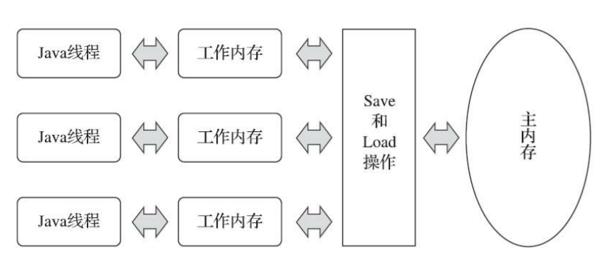

# Java 内存模型

Java 内存模型（JMM，Java Memory Model）的主要目的是定义程序中各种变量的访问规则，即关注在虚拟机中把变量值存储到内存和从内存中取出变量值这样的底层细节

## 主内存与工作内存

Java 内存模型规定了 **所有的变量都存储在主内存**（Main Memory）中（虚拟机内存的一部分），**每条线程还有自己的工作内存**（Working Memory），线程的工作内存中保存了被该线程使用的变量的主内存副本

- 主内存不会存储方法参数和局部变量，他们是线程私有的，所以只会存储在工作内存中

线程对变量的所有操作都 **必须在工作内存中进行**，而不能直接读写主内存中的数据。**不同的线程之间也无法直接访问对方工作内存中的变量，线程间变量值的传递均需要通过主内存来完成**



<small>深入理解Java虚拟机（第3版） - 图12-2 线程、主内存、工作内存三者的交互关系</small>

## 内存间交互操作

关于主内存与工作内存之间具体的交互协议，Java 内存模型中定义了以下 8 种操作来完成。JVM 实现时 **必须保证下面提及的每一种操作都是原子的、不可再分的**

| 操作 | 作用内存 | 作用 |
| :-: |:-: |:- |
| **`lock`（锁定）** | 主内存 | 把一个变量标识为 **线程独占** 的状态 |
| **`unlock`（解锁）** | 主内存 | 把一个处于锁定状态的变量 **释放** 出来，释放后的变量才可以被其他线程锁定 |
| **`read`（读取）** | 主内存 | 把一个变量的值从主内存传输到线程的工作内存中，以便随后的 `load` 动作使用 |
| **`load`（载入）** | 工作内存 | 把 `read` 操作从主内存中得到的变量值，放入工作内存的变量副本中 |
| **`use`（使用）** | 工作内存 | 把工作内存中一个变量的值传递给执行引擎，每当虚拟机遇到一个需要 **使用变量的值** 的字节码指令时将会执行这个操作 |
| **`assign`（赋值）** | 工作内存 | 把一个从执行引擎接收的值赋给工作内存的变量，每当虚拟机遇到一个 **给变量赋值** 的字节码指令时执行这个操作 |
| **`store`（存储）** | 工作内存 | 把一个变量的值从工作内存传送到主内存中，以便随后的 `write` 操作使用 |
| **`write`（写入）** | 主内存 | 把 `store` 操作从工作内存中得到的变量的值放入主内存的变量中 |

如果要把一个变量从主内存拷贝到工作内存，那就要 **按顺序执行 `read` 和 `load` 操作**，如果要把变量从工作内存同步回主内存，就要 **按顺序执行 `store` 和 `write` 操作**。Java 内存模型只要求上述两个操作 **必须按顺序执行，但不要求是连续执行**，中间可插入其他指令

Java 内存模型还规定了在执行上述 8 种基本操作时必须满足如下规则

- 不允许 `read` 和 `load`、`store` 和 `write` 操作之一单独出现
  - 即不允许一个变量从主内存读取了但工作内存不接收
  - 或者工作内存发起回写了但主内存不接受的情况出现

> 拿了就得存

- 不允许一个线程丢弃它最近的 `assign` 操作
  - 即变量在工作内存中改变了之后必须把该变化同步回主内存

> 改了就得存

- 不允许一个线程无原因地（没有发生过任何 `assign` 操作）把数据从线程的工作内存同步回主内存中

> 没改你存什么

- 一个新的变量只能在主内存中诞生，不允许在工作内存中直接使用一个未被初始化的变量

> 你个工作内存也配新建变量

- 一个变量在同一个时刻只允许一条线程对其进行 `lock` 操作，但 `lock` 操作可以被同一条线程重复执行多次，多次执行 `lock` 后，只有执行相同次数的 `unlock` 操作，变量才会被解锁

> 只要你能加锁，想加多少次锁随便你，但解锁时别忘了把锁都解完

- 如果对一个变量执行 `lock` 操作，那将会清空工作内存中此变量的值，在执行引擎使用这个变量前，需要重新执行 `load` 或 `assign` 操作以初始化变量的值

> 我加了锁，你们也用不了，干脆都清空了吧

- 如果一个变量事先没有被 `lock` 操作锁定，那就不允许对它执行 `unlock` 操作，也不允许去 `unlock` 一个被其他线程锁定的变量

> 没加锁你解什么锁，你还想解别人的锁啊

- 对一个变量执行 `unlock` 操作之前，必须先把此变量同步回主内存中（执行 `store`、`write` 操作）

> 我解锁了，你们可以用了

## volatile

关键字 `volatile` 可以说是 JVM 提供的 **最轻量级的同步机制**，但是它并不容易被正确、完整地理解，以至于许多程序员都习惯去避免使用它，遇到需要处理多线程数据竞争问题的时候一律使用 `synchronized` 来进行同步

- 在功能上，锁更强大；在性能上，`volatile` 更有优势

当一个变量被定义成 `volatile` 之后，它将具备两项特性

### 保证线程间变量的可见性

**当一条线程修改了 `volatile` 变量的值，新值对于其他线程来说是可以立即得知的**。而普通变量并不能做到这一点，普通变量的值在线程间传递时均需要通过主内存来完成

- 普通变量
  - 读：优先从本地内存内读取，本地内存没有再去主内存中读取
  - 写：线程对普通变量的更改不会立即同步到主内存，其他线程工作内存放的该变量的副本也不会立即更新。如果其他线程需要操作该变量，可能会读取到旧值
- `volatile` 变量
  - 读：如果本地内存缓存的值是有效的，则从本地内存中读取，否则从主内存中读取
  - 写：在本地的工作内存中，每一次对变量的修改，都会立即将修改后的值刷新到主内存中，如果有其他线程存有该变量的副本，会被强制失效。之后有其他线程需要操作该变量时，发现缓存失效了，就会从主内存中加载最新的值

#### 无法保证原子性

`volatile` 变量的运算在并发下一样是不安全的

```java
public class Test {

    private static volatile int race = 0;

    public static void incr() {
        race++;
    }

    public static void main(String[] args) {
        Thread[] arr = new Thread[20];

        for (int i = 0; i < arr.length; i++) {
            arr[i] = new Thread(() -> {
                for (int j = 0; j < 10000; j++) {
                    incr();
                }
            });
            arr[i].start();
        }

        while (Thread.activeCount() > 1) {
            Thread.yield();
        }
        System.out.println(race);
    }
}
```

该段代码的期望值为 200000，而实际执行得到的结果且千奇百怪，`volatile` 确实保证了可见性，但 `race++` 并不是一个原子操作，它需要先取值，再加 1，再写入到工作内存中

| 线程 A | 线程 B |
| :-: | :-: |
| 取值 999 |  |
| 加 1 为 1000 |  |
|  | 取值 999 |
|  | 加 1 为 1000 |
|  | 写回 |
| 写回 |  |

`volatile` 变量在不符合以下两条规则的运算场景中，需要通过加锁（或者使用原子类）来保证原子性

- 运算结果并不依赖变量的当前值，或者能够确保只有单一的线程修改变量的值
  - 例如 `race++` 就依赖变量的当前值，需要获取到当前值后执行加 1 操作
- 变量不需要与其他的状态变量共同参与不变约束

### 禁止指令重排序

普通的变量仅会保证在该方法的执行过程中所有依赖赋值结果的地方都能获取到正确的结果，而不能保证变量赋值操作的顺序与程序代码中的执行顺序一致。因为在同一个线程的方法执行过程中无法感知到这点，这就是 Java 内存模型中描述的所谓线程内表现为串行的语义（Within-Thread As-If-Serial Semantics）

#### 指令重排序

在 CPU 的实际工作中，每个指令会包含多个步骤，不同的步骤涉及的硬件也可能不同。出于性能考虑，流水线技术诞生了，不需要等待当前的指令执行完，就可以执行下一条指令

```shell
# 例如，需要给变量 a、b 进行赋值，一次赋值的操作有从内存中取值、赋值、写回内存，每个操作只能同时有一个在运行，且每个操作都需要1秒钟时间执行完

# 按照顺序先后执行，执行完需6秒
a: 取->赋->写
b:           取->赋->写

# 使用流水线技术，执行完需4秒
a: 取->赋->写
b:     取->赋->写
```

但是流水线最怕的就是中断，一旦被中断，所有的硬件设备都会进入一个停顿期，再次满载又需要几个周期，因此，性能损失会比较大

```shell
# 依照上面的例子，增加c=a+b和对变量d的赋值
# 由于c取值时，b还未完成赋值，造成中断，b完成赋值后，c继续运行
a: 取->赋->写
b:     取->赋->写
c:          X->取->赋->写
d:              X->取->赋->写
```

指令重排就是减少中断的一种技术，计算机为了优化程序的执行性能而对指令进行重新排序，使得执行代码时不一定是按照代码的顺序执行

- **编译器优化重排**：编译器在 **不改变单线程程序语义** 的前提下，可以重新安排语句的执行顺序
- **指令并行重排**：现代处理器采用了指令级并行技术来将多条指令重叠执行。如果 **不存在数据依赖性**，处理器可以改变语句对应的机器指令的执行顺序
- 内存系统重排：不是真正意义上的重排序。由于主存和本地内存的数据同步存在时间差，导致同一时间点各个工作内存内看到的共享变量的值是不一致的，就好像内存访问指令发生了重排序一样

Java 源代码会经历编译器优化重排、指令并行重排、内存系统重排的过程，最终才变成操作系统可执行的指令序列

```shell
# 依照上面的例子，先对变量d进行赋值，再执行c=a+b
# 对c和d的结果没有影响，且提高了流水线的效率
a: 取->赋->写
b:     取->赋->写
d:         取->赋->写
c:             取->赋->写
```

指令重排提高了 CPU 的执行性能，但却导致了指令乱序的问题。当然并不是说指令能任意重排，处理器必须能正确处理指令依赖情况保障程序能得出正确的执行结果。比如说上面的例子，变量 c 得依赖变量 a、 b，所以变量 a、b 与变量 c 之间的顺序不能重排，而变量 d 不依赖于其他变量，所以他就可以重排，同理 a、b 之间也可以重排，只要保证他们的顺序在变量 c 之前执行即可。所以在同一个处理器中，重排序过的代码看起来依然是有序的

- as-if-serial 语义：所有的动作都可以为了优化而被重排序，但是必须保证它们重排序后的结果和程序代码本身的应有结果是一致的

**指令重排可以保证串行语义一致，但是没有义务保证多线程间的语义也一致**。所以在多线程下，指令重排序可能会导致一些问题

#### 3.2.2 volatile 禁止指令重排序原理

JVM 通过内存屏障（Memory Barrier，或内存栅栏 Memory Fence）禁止 CPU 的指令重排序。内存屏障是一种 CPU 指令

- **阻止屏障两侧的指令重排序**
- 强制把写缓冲区/高速缓存中的脏数据等写回主内存，或者让缓存中相应的数据失效

编译器在生成字节码时，会在指令序列中插入内存屏障来禁止特定类型的处理器重排序。编译器选择了一个比较保守的 JMM 内存屏障插入策略，这样可以保证在任何处理器平台，任何程序中都能得到正确的 `volatile` 内存语义

##### 内存屏障分类

```shell
# LoadLoad：确保之前的读取操作要先于之后的读取完毕
# 在Load2被读取前，要确保Load1已被读取完毕
Load1;LoadLoad;Load2;

# StoreStore：确保之前的写入操作先于之后的对其他处理器可见
# 在Store2写入操作执行前，要确保Store1的写入操作已对其他处理器可见
Store1;StoreStore;Store2;

# LoadStore：确保之前的读取操作先于之后的写入操作对其他处理器可见
# 在Store2被刷出前，要确保Load1已被读取完毕
Load1;LoadStore;Store2;

# StoreLoad：确保之前的写入操作先于之后的读取操作对其他处理器可见
# 在Load2被读取前，要确保Store1已对所有处理器可见
Store1;StoreLoad;Load2;
```

- StoreLoad 屏障开销最大，在大多数处理器的实现中，这个屏障是个万能屏障，兼具其它三种内存屏障的功能

##### 重排序规则

<table>
 <tr>
  <th>是否能重排序</th>
  <th colspan="3">第二个操作</th>
 </tr>
 <tr>
  <th><small>第一个操作</small></th>
  <th><small>普通读 / 写</small></th>
  <th><small>volatile 读</small></th>
  <th><small>volatile 写</small></th>
 </tr>
 <tr>
  <th><small>普通读 / 写</small></th>
  <td></td>
  <td></td>
  <td align="center">NO</td>
 </tr>
 <tr>
  <th><small>volatile 读</small></th>
  <td align="center">NO</td>
  <td align="center">NO</td>
  <td align="center">NO</td>
 </tr>
 <tr>
  <th><small>volatile 写</small></th>
  <td></td>
  <td align="center">NO</td>
  <td align="center">NO</td>
 </tr>
</table>

- 如果第一个操作是 volatile 读，那无论第二个操作是什么，都不能重排序
- 如果第二个操作是 volatile 写，那无论第一个操作是什么，都不能重排序
- 如果第一个操作是 volatile 写，第二个操作是 volatile 读，那不能重排序

## 针对 long 和 double 型变量的特殊规则

Java 内存模型要求 `lock`、`unlock`、`read`、`load`、`assign`、`use`、`store`、`write` 这八种操作都具有原子性，但是对于 64 位的数据类型（long 和 double），在模型中特别定义了一条宽松的规定

允许虚拟机将没有被 `volatile` 修饰的 64 位数据的读写操作划分为两次 32 位的操作来进行，即允许虚拟机实现自行选择是否要保证 64 位数据类型的 load、store、read 和 write 这四个操作的原子性，这就是所谓的 long 和 double 的非原子性协定（Non-Atomic Treatment of double and long Variables）

如果有多个线程共享一个并未声明为 `volatile` 的 long 或 double 类型的变量，并且同时对它们进行读取和修改操作，那么某些线程可能会读取到一个既不是原值，也不是其他线程修改值的代表了半个变量的数值，不过这种读取到半个变量的情况是非常罕见的

## 5. 原子性、可见性与有序性

### 5.1 原子性（Atomicity）

一个操作或者多个操作要么全部执行且执行的过程不会被任何因素打断，要么都不执行

由 Java 内存模型来直接保证的原子性变量操作包括 read、load、assign、use、store 和 write，可以大致的认为基本数据类型的读写都是具备原子性的

如果应用场景需要一个更大范围的原子性保证，Java 内存模型还提供了 lock 和 unlock 操作来满足这种需求，尽管虚拟机未把 lock 和 unlock 操作直接开放给用户使用，但是却提供了更高层次的字节码指令 monitorenter 和 monitorexit 来隐式地使用这两个操作。这两个字节码指令反映到 Java 代码中就是同步块，synchronized 关键字，因此在 synchronized 块之间的操作也具备原子性

### 5.2 可见性（Visibility）

当一个线程修改了共享变量的值时，其他线程能够立即得知这个修改

Java 内存模型通过在变量修改后将新值同步回主内
存，在变量读取前从主内存刷新变量值这种依赖主内存作为传递媒介的方式来实现可见性的，无论是普通变量还是 `volatile` 变量都是如此

普通变量与 `volatile` 变量的区别是，`volatile` 的特殊规则保证了新值能立即同步到主内存，以及每次使用前立即从主内存刷新。因此可以说 `volatile` 保证了多线程操作时变量的可见性，而普通变量则不能保证这一点

除了 `volatile` 之外，Java 还有两个关键字能实现可见性，它们是 synchronized 和 final

- synchronized：对一个变量执行 unlock 操作之前，必须先把此变量同步回主内存中（执行 store、write 操作）
- final：被 final 修饰的字段在构造器中一旦被初始化完成，且没有对象逸出（对象未初始化完成就可以被别的线程使用），那么对于其他线程都是可见的

### 5.3 有序性（Ordering）

如果在本线程内观察，所有的操作都是有序的；如果在一个线程中观察另一个线程，所有的操作都是无序的。前半句是指线程内表现为串行的语义（As-If-Serial），后半句是指指令重排序现象和工作内存与主内存同步延迟现象

Java 语言提供了 volatile 和 synchronized 两个关键字来保证线程之间操作的有序性，volatile 关键字本身就包含了禁止指令重排序的语义，而 synchronized 则是由一个变量在同一个时刻只允许一条线程对其进行 lock 操作这条规则获得的，这个规则决定了持有同一个锁的两个同步块只能串行地进入

## 6. 先行发生原则

如果 Java 内存模型中所有的有序性都仅靠 volatile 和 synchronized 来完成，那么有很多操作都将会变得非常啰嗦，但是我们在编写 Java 并发代码的时候并没有察觉到这一点，这是因为 Java 语言中有一个先行发生（Happens-Before）的原则

- 程序员需要 JMM 提供一个强的内存模型来编写代码；编译器和处理器希望 JMM 的约束越弱越好，这样它们就可以最可能多的做优化来提高性能
- 对于会改变程序执行结果的重排序，JMM 要求编译器和处理器必须禁止这种重排序

### 6.1 规则

- 如果一个操作 happens-before 另一个操作，那么第一个操作的执行结果将对第二个操作可见，并且第一个操作的执行顺序排在第二个操作之前
- 两个操作之间存在 happens-before 关系，并不意味着 Java 平台的具体实现必须要按照 happens-before 关系指定的顺序来执行。如果重排序之后的执行结果，与按 happens-before 关系来执行的结果一致，那么 JMM 也允许这样的重排序

```shell
# 只要保证A、B happens-before C，A和B就可以进行重排序
A happens-before C
B happens-before C
```

### 6.2 天然的先行发生原则

对于程序员来说，自然不想要太过于关注底层实现，只要按照以下规则编写代码，就能保证操作间的强可见性

- 程序次序规则：在一个线程内，按照控制流顺序，书写在前面的操作先行发生于书写在后面的操作
- 管程锁定规则：一个 unlock 操作先行发生于后面对同一个锁的 lock 操作
- volatile 变量规则：对一个 volatile 变量的写操作先行发生于后面对这个变量的读操作
- 对象终结规则：一个对象的初始化完成（构造函数执行结束）先行发生于它的 finalize 方法的开始
- 传递性：如果操作 A 先行发生于操作 B，操作 B 先行发生于操作 C，那就可以得出操作 A 先行发生于操作 C 的结论
- 线程启动规则：Thread 对象的 start 方法先行发生于此线程的每一个动作
- 线程终止规则：线程中的所有操作都先行发生于对此线程的终止检测
- 线程中断规则：对线程 interrupt 方法的调用先行发生于被中断线程的代码检测到中断事件的发生

## 参考

- 深入理解Java虚拟机（第3版）
- [图解volatile是如何保证可见性](https://juejin.cn/post/7032462314989338637)
- [Java内存访问重排序的研究](https://tech.meituan.com/2014/09/23/java-memory-reordering.html)
- [第八章 volatile](http://concurrent.redspider.group/article/02/8.html)
- [深入理解volatile关键字](https://juejin.cn/post/7132479957938225159)
- [讲讲什么是 JMM](https://www.cnblogs.com/shoshana-kong/p/16741851.html)
