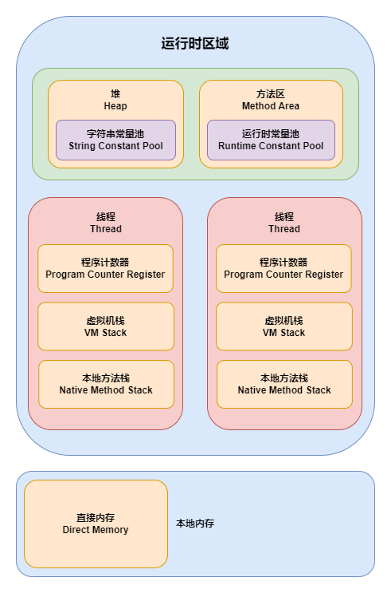
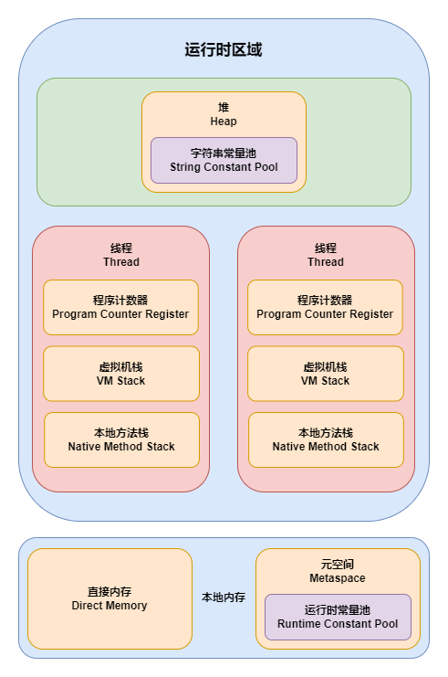
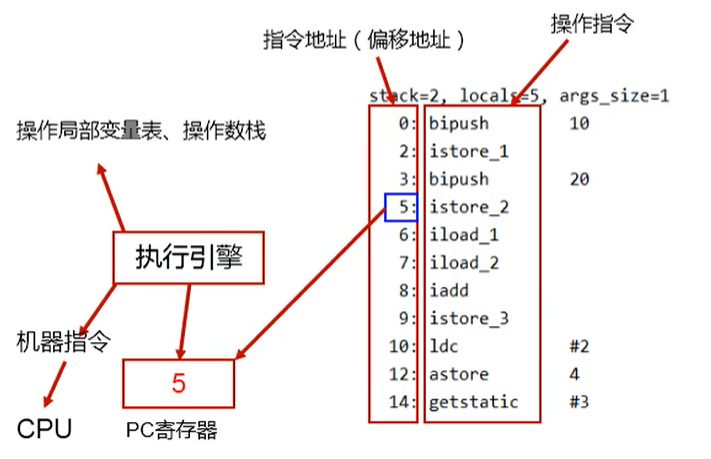
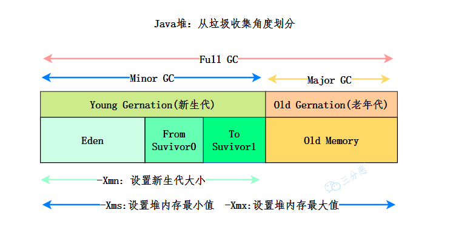

# 运行时数据区域

JVM 在执行 Java 程序的过程中会把它所管理的内存划分为若干个不同的数据区域

- JDK 1.7

- JDK 1.8

## 程序计数器（Program Counter Register）

程序计数器是一块较小的内存空间，可以看作是当前线程所执行的字节码的行号指示器，**存储当前线程正在执行的 JVM 字节码指令地址**

字节码解释器工作时，就是通过改变这个计数器的值，来选取下一条需要执行的字节码指令，它是程序控制流的指示器，分支、循环、跳转、异常处理、线程恢复等基础功能都需要依赖这个计数器来完成

在同一时间一个单核 CPU（或多核 CPU 中的某个内核）只会执行一条线程中的指令，为了线程切换后能恢复到正确的执行位置，每条线程都需要有一个独立的程序计数器，各线程之间计数器互不影响

> 主要作用就是知道要干啥，而且如果中途需要处理别的事，处理完回来还能接着干

<small>[Java JVM——4. 程序计数器 - 2.作用](https://www.cnblogs.com/ruoli-0/p/13781170.html)</small>

- 此内存区域是 **唯一** 一个在虚拟机规范中 **没有规定任何 OutOfMemoryError** 情况的区域

## 虚拟机栈（Virtual Machine Stack）

虚拟机栈描述的是 Java 方法执行的 **线程内存模型**

JVM 以 **方法作为最基本的执行单元**，每个方法被执行的时候，JVM 都会同步创建一个 **栈帧（Stack Frame）** 用于存储局部变量表、操作数栈、动态连接、方法返回地址和一些额外的附加信息

- **每一个方法被调用直至执行完毕的过程，就对应着一个栈帧在虚拟机栈中从入栈到出栈的过程**

一个线程中的方法调用链可能会很长，以 Java 程序的角度来看，同一时刻、同一条线程里面，在调用堆栈的所有方法都同时处于执行状态

而对于执行引擎来讲，在活动线程中，只有位于栈顶的方法才是在运行的，其被称为 **当前栈帧**（Current Stack Frame），与这个栈帧所关联的方法被称为 **当前方法**（Current Method）

- 如果线程请求的 **栈深度大于虚拟机所允许的深度，将抛出 StackOverflowError 异常**
- 如果虚拟机栈容量可以动态扩展，当栈扩展时 **无法申请到足够的内存会抛出 OutOfMemoryError 异常**

### 运行时栈帧结构

#### 局部变量表（Local Variables Table）

局部变量表是一组变量值的存储空间，用于存放 **方法参数和方法内部定义的局部变量**

局部变量表的基本单位是 **变量槽（Variable Slot）**，一个变量槽可以存放一个 32 位以内的数据类型

- boolean、byte、char、short、int、float
- reference：表示对一个对象实例的引用
- returnAddress：目前很少使用，为字节码指令 jsr、jsr_w 和 ret 服务的，指向了一条字节码指令的地址。某些很古老的 JVM 曾经使用这几条指令来实现异常处理时的跳转，但现在也已经全部改为采用异常表了

对于 64 位的数据类型，JVM 会以高位对齐的方式，为其分配两个连续的变量槽空间

- Java 中明确的 64 位的数据类型只有 long 和 double 两种
- 虚拟机 **不允许采用任何方式单独访问其中的某一个变量槽**

#### 操作数栈（Operand Stack）

也常被称为操作栈，主要作为 **方法调用的中转站**，用于存放方法执行过程中产生的中间计算结果，计算过程中产生的临时变量也会放在操作数栈中

当一个方法刚刚开始执行的时候，这个方法的操作数栈是空的，在方法的执行过程中，会有各种字节码指令往操作数栈中写入和提取内容，也就是出栈和入栈操作

#### 动态连接（Dynamic Linking）

每个栈帧都包含一个指向运行时常量池中该栈帧所属方法的引用，持有这个引用是为了支持方法调用过程中的动态连接

Class 文件的常量池中存有大量的符号引用，字节码中的方法调用指令就以常量池里指向方法的符号引用作为参数。这些符号引用一部分会在类加载阶段或者第一次使用的时候就被转化为直接引用，这种转化被称为静态解析。另外一部分将在每一次运行期间都转化为直接引用，这部分就称为动态连接

#### 方法返回地址

当一个方法开始执行后，只有两种方式退出这个方法

- return 语句返回
- 在方法执行的过程中遇到了异常，并且这个异常没有在方法体内得到妥善处理

无论采用何种退出方式，在方法退出之后，都必须返回到最初方法被调用时的位置，程序才能继续执行，方法返回时可能需要在栈帧中保存一些信息，用来帮助恢复它的上层主调方法的执行状态

- 一般来说，方法正常退出时，主调方法的程序计数器的值就可以作为返回地址，栈帧中很可能会保存这个计数器值。而方法异常退出时，返回地址是要通过异常处理器表来确定的，栈帧中就一般不会保存这部分信息

#### 附加信息

JVM 规范允许虚拟机实现增加一些规范里没有描述的信息到栈帧之中，例如与调试、性能收集相关的信息，这部分信息完全取决于具体的虚拟机实现

## 本地方法栈（Native Method Stack）

与虚拟机栈所发挥的作用类似，区别是虚拟机栈为虚拟机执行 Java 方法（即字节码）服务，而本地方法栈则是为虚拟机使用到的 **本地（Native）方法** 服务

- 与虚拟机栈一样，本地方法栈也会在 **栈深度溢出或者栈扩展失败时分别抛出 StackOverflowError 或 OutOfMemoryError 异常**

## 堆（Heap）

堆是虚拟机所管理的内存中最大的一块，也是 **被所有线程共享** 的一块内存区域，在虚拟机启动时创建。此内存区域的唯一目的就是 **存放对象实例**，在 Java 中几乎所有的对象实例都在这里分配内存

- 堆是垃圾收集器管理的主要区域，因此也被称作 GC 堆
- 根据 JVM 规范的规定，堆可以处于物理上不连续的内存空间中，但在逻辑上它应该被视为连续的

如果从分配内存的角度看，在堆中还可以划分出多个线程私有的 **分配缓冲区（Thread Local Allocation Buffer，TLAB）**，以提升对象分配时的效率

堆既可以被实现成固定大小的，也可以是可扩展的，不过当前主流的 Java 虚拟机都是按照可扩展来实现的（通过参数 `-Xmx` 和 `-Xms` 设定）

- 如果在 **堆中没有内存可以完成实例分配**，并且 **堆也无法再扩展** 时，虚拟机将会抛出 **OutOfMemoryError 异常**

### 堆内存结构

从回收内存的角度看，由于现代垃圾收集器大部分都是基于分代收集理论设计的，所以堆中经常会出现新生代、老年代、Eden 空间、From Survivor 空间、To Survivor 空间等名词，**需要注意的是这种划分只是根据垃圾回收机制来进行的划分，不是 JVM 规范本身制定的**。而现在也出现了不采用分代设计的新垃圾收集器，继续采用这种分法就不太严谨了

<small>*[面渣逆袭：JVM经典五十问，这下面试稳了！ - Java 堆内存结构](https://mp.weixin.qq.com/s/XYsEJyIo46jXhHE1sOR_0Q)*</small>

## 方法区（各个线程共享的内存区域）

方法区也是各个线程共享的内存区域，用于存储已被虚拟机加载的类型信息、常量、静态变量、即时编译器编译后的代码缓存等数据

方法区其实是一个抽象的概念，**永久代（Permanent Generation）与元空间（Metaspace）都是方法区的具体实现**

- 如果 **方法区无法满足新的内存分配需求** 时，将抛出 **OutOfMemoryError 异常**

### 为何用元空间替换永久代

- **使用永久代更容易有内存溢出的问题**
  - 永久代有固定的大小上限，即使不设置也有默认大小
  - 元空间使用的是本地内存，受本机可用内存的限制，虽然元空间仍旧可能溢出，但是比原来出现的几率会更小

- 有极少数方法，例如 `String::intern()` 会因永久代的原因而导致不同虚拟机下有不同的表现
- JRockit、J9 等虚拟机本身就没有永久代的概念
  - 当 Oracle 想将 JRockit 的优秀功能移植到 HotSpot 时，因为两者对方法区实现的差异而面临诸多困难，在 JDK1.6 时 HotSpot 团队就有放弃永久代，逐步改为采用本地内存实现方法区的计划。到了 JDK1.7 把原本放在永久代的字符串常量池、静态变量等移出，而到了 JDK1.8 完全废弃了永久代的概念，改用在本地内存中实现的元空间来代替，把 JDK1.7 中永久代还剩余的内容（主要是类型信息）全部移到元空间中

## 运行时常量池（Runtime Constant Pool）

**运行时常量池是方法区的一部分**。Class 文件中除了有类的版本、字段、方法、接口等描述信息外，还有一项信息是 **常量池表（Constant Pool Table），用于存放编译期生成的各种字面量与符号引用**，这部分内容将在类加载后存放到方法区的运行时常量池中

JVM 规范没有对运行时常量池做任何细节上的要求，不同的提供商可以按需实现这个内存区域，不过一般还会把通过符号引用翻译出来的直接引用也存储在运行时常量池中

Java 并不要求常量一定只有编译期才能产生，运行期间也可以将新的常量放入池中，例如使用 `String::intern()`

- 运行时常量池是方法区的一部分，自然受到方法区内存的限制，当常量池无法再申请到内存时会抛出 OutOfMemoryError 异常

## 直接内存（Direct Memory）

直接内存并不是虚拟机运行时数据区的一部分，也不是虚拟机规范中定义的内存区域。但是这部分内存也被频繁地使用，而且也可能导致 OutOfMemoryError 异常出现

本机直接内存的分配不会受到堆大小的限制，但是肯定还是会受到本机总内存（包括物理内存、SWAP 分区或者分页文件）大小以及处理器寻址空间的限制

- 一般在配置虚拟机参数时，会根据实际内存去设置 `-Xmx` 等参数信息，但经常忽略掉直接内存，使得各个内存区域总和大于物理内存限制（包括物理的和操作系统级的限制），从而导致 **动态扩展时出现 OutOfMemoryError 异常**

## 字符串常量池（String Constant Pool）

在日常开发过程中，字符串的创建是比较频繁的，而字符串的分配和其他对象的分配是类似的，需要耗费大量的时间和空间。JVM 为了提升性能和减少内存消耗针对字符串专门开辟的一块区域，主要目的是为了避免字符串的重复创建

- JDK1.7 之前，字符串常量池存放在永久代中
- JDK1.7 字符串常量池和静态变量从永久代移动了堆中

## 参考

- 深入理解Java虚拟机（第3版）
- [Java内存区域详解（重点）](https://javaguide.cn/java/jvm/memory-area.html)
- [JVM——字符串常量池详解](https://www.cnblogs.com/Andya/p/14067618.html)
- [chenxi 分类：Java虚拟机](https://chenxitag.com/archives/category/jvm)
- [一篇文章带你快速理解JVM运行时数据区 、程序计数器详解 （手画详图）值得收藏！！！｜8月更文挑战](https://juejin.cn/post/6992021057678884872)
