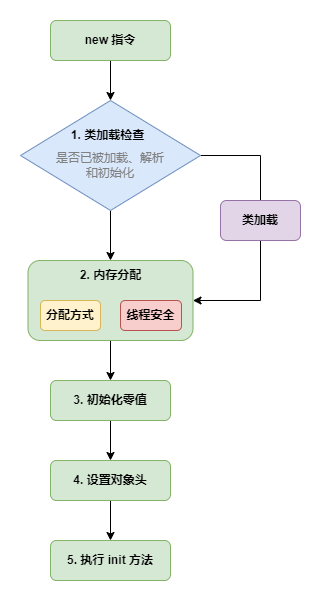
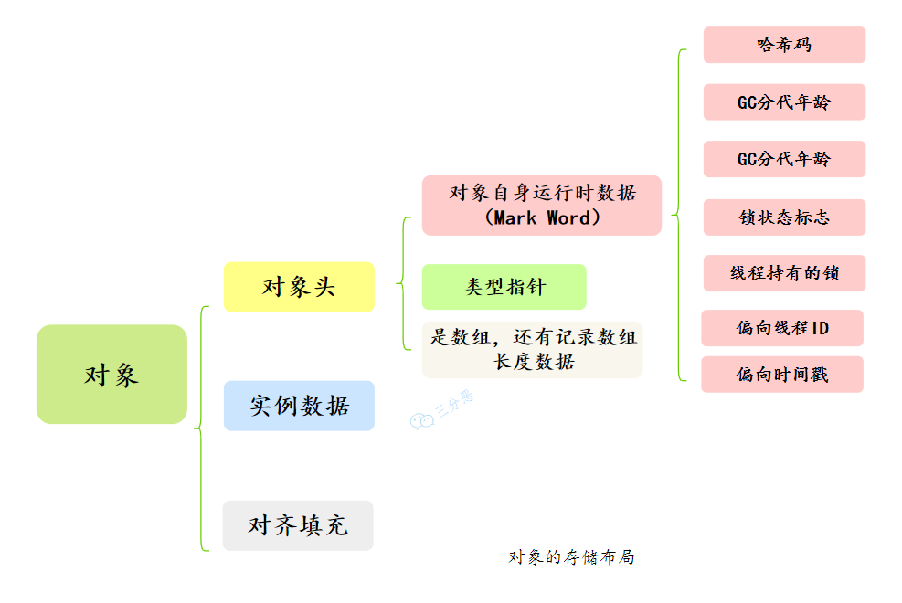
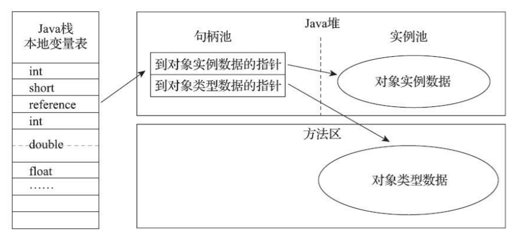
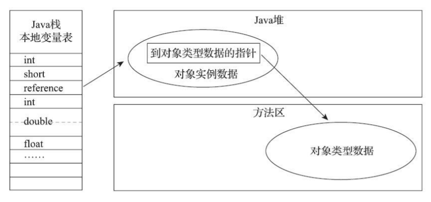

# 对象

## 1. 对象的创建

Java 是一门面向对象的编程语言，Java 程序运行过程中无时无刻都有对象被创建出来

### 1.1 类加载检查

当虚拟机遇到一条字节码 new 指令时，首先会去检查这个指令的参数是否能在常量池中定位到一个类的符号引用，并且检查这个符号引用代表的类是否已被加载、解析和初始化过。如果没有，那必须先执行相应的类加载过程

### 1.2 内存分配

在类加载检查通过后，接下来虚拟机将为新生对象分配内存。对象所需内存的大小在类加载完成后便可完全确定，为对象分配空间的任务实际上便等同于把一块确定大小的内存块从堆中划分出来

#### 1.2.1 分配方式

选择哪种分配方式由堆是否规整决定，而堆是否规整又由所采用的垃圾收集器是否带有空间压缩整理（Compact）的能力决定

##### 指针碰撞（Bump The Pointer）

如果堆中内存是绝对规整的，所有被使用过的内存都被放在一边，空闲的内存被放在另一边，中间放着一个指针作为分界点的指示器，那所分配内存就仅仅是把那个指针向空闲空间方向挪动一段与对象大小相等的距离

##### 空闲列表（Free List）

如果堆中内存并不是规整的，已被使用的内存和空闲的内存相互交错在一起，那就没有办法简单地进行指针碰撞了，虚拟机就必须维护一个列表，记录上哪些内存块是可用的，在分配的时候从列表中找到一块足够大的空间划分给对象实例，并更新列表上的记录

#### 1.2.2 并发问题

对象创建在虚拟机中是非常频繁的行为，在并发情况下也必须保证线程安全，虚拟机采用两种方式来保证线程安全

##### CAS + 失败重试

对分配内存空间的动作进行同步处理。实际上虚拟机是采用 CAS 配上失败重试的方式保证更新操作的原子性

##### TLAB（Thread Local Allocation Buffer）

每个线程在堆中预先分配一小块内存，称为本地线程分配缓冲（TLAB），哪个线程要分配内存，就在哪个线程的本地缓冲区中分配，只有本地缓冲区用完了，分配新的缓存区时才需要同步锁定

### 1.3 初始化零值

内存分配完成之后，虚拟机必须将分配到的内存空间（不包括对象头）都初始化为零值，如果使用了 TLAB 的话，这一项工作也可以提前至 TLAB 分配时顺便进行

这步操作保证了对象的实例字段在 Java 代码中可以不赋初始值就直接使用，使程序能访问到这些字段的数据类型所对应的零值

### 1.4 设置对象头

初始化零值完成后，虚拟机还要对对象进行必要的设置，例如这个对象是哪个类的实例、如何才能找到类的元数据信息、对象的哈希码、对象的 GC 分代年龄等信息。这些信息存放在对象的对象头（Object Header）之中。根据虚拟机当前运行状态的不同，如是否启用偏向锁等，对象头会有不同的设置方式

### 1.5 执行 init 方法

在上面工作都完成之后，从虚拟机的视角来看，一个新的对象已经产生了。但是从 Java 程序的视角看来，对象创建才刚刚开始。构造函数，即 Class 文件中的 `<init>()` 方法还没有执行，所有的字段都为默认的零值，对象需要的其他资源和状态信息也还没有按照预定的意图构造好

## 2. 对象的内存布局

对象在堆内存中的存储布局可以划分为三个部分：对象头（Header）、实例数据（Instance Data）和对齐填充（Padding）

<small>*[面渣逆袭：JVM经典五十问，这下面试稳了！ - 对象的存储布局](https://mp.weixin.qq.com/s/XYsEJyIo46jXhHE1sOR_0Q)*</small>

### 2.1 对象头（Header）

HotSpot 虚拟机对象的对象头部分包括两类信息

- **存储对象自身的运行时数据**，如哈希码、GC 分代年龄、锁状态标志、线程持有的锁、偏向线程 ID、偏向时间戳等，官方称它为 Mark Word
- **类型指针**，即对象指向它的类型元数据的指针，虚拟机通过这个指针来确定该对象是哪个类的实例

如果对象是一个数组，那在对象头中还必须有一块用于记录数组长度的数据，因为虚拟机可以通过对象的元数据信息确定对象的大小，但是如果数组的长度是不确定的，将无法通过元数据中的信息推断出数组的大小

### 2.2 实例数据（Instance Data）

实例数据部分是 **对象真正存储的有效信息**，即在程序代码里面所定义的各种类型的字段内容，无论是从父类继承下来的，还是在子类中定义的字段都必须记录起来

### 2.3 对齐填充（Padding）

**仅仅起着占位符的作用**。由于 HotSpot 虚拟机的自动内存管理系统要求对象起始地址必须是 8 字节的整数倍，即任何对象的大小都必须是 8 字节的整数倍。对象头部分已经被精心设计成正好是 8 字节的倍数（1 倍或者 2 倍），因此，如果对象实例数据部分没有对齐的话，就需要通过对齐填充来补全

## 3. 对象的访问定位

创建对象自然是为了后续使用该对象，Java 程序会通过栈上的 reference 数据来操作堆上的具体对象。由于 reference 类型在 JVM 规范里只规定了它是一个指向对象的引用，并没有定义这个引用应该通过什么方式去定位、访问到堆中对象的具体位置，所以对象访问方式也是由虚拟机实现而定的。主流的访问方式主要有使用句柄和直接指针两种

### 3.1 句柄访问

使用句柄访问，堆中会划分出一块内存来作为句柄池，reference 中存储的就是对象的句柄地址，而句柄中包含了对象实例数据与类型数据各自具体的地址信息

<small>深入理解Java虚拟机（第3版） - 图2-2 通过句柄访问对象</small>

使用句柄来访问的最大好处就是 reference 中存储的是稳定句柄地址，在对象被移动（垃圾收集时移动对象是非常普遍的行为）时只会改变句柄中的实例数据指针，而 reference 本身不需要被修改

### 3.2 直接指针访问

使用直接指针访问，堆中对象的内存布局就必须考虑如何放置访问类型数据的相关信息，reference 中存储的直接就是对象地址，如果只是访问对象本身的话，就不需要多一次间接访问的开销

<small>深入理解Java虚拟机（第3版） - 图2-3 通过直接指针访问对象</small>

使用直接指针来访问最大的好处就是速度更快，它节省了一次指针定位的时间开销，由于对象访问在 Java 中非常频繁，因此这类开销积少成多也是一项极为可观的执行成本

HotSpot 虚拟机使用的是直接指针来进行对象访问，但从整个软件开发的范围来看，在各种语言、框架中使用句柄来访问的情况也十分常见

## 参考

- 深入理解Java虚拟机（第3版）
- [Java内存区域详解（重点）](https://javaguide.cn/java/jvm/memory-area.html)
