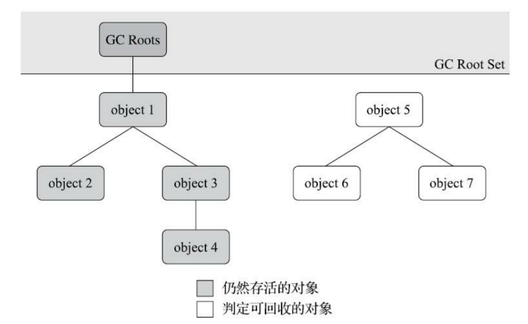
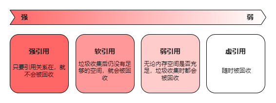
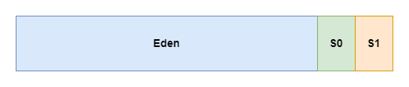
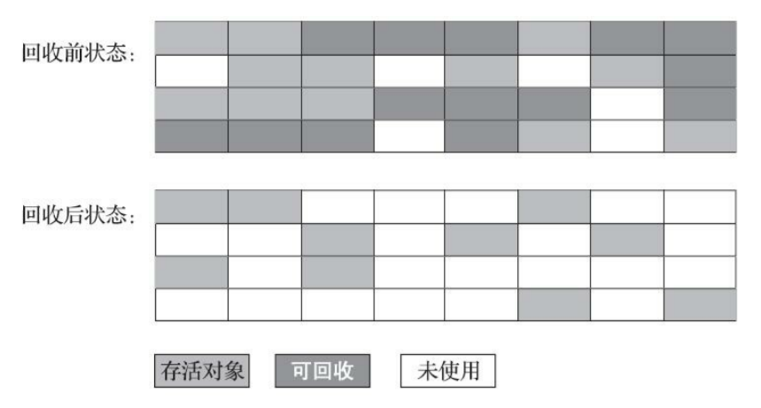
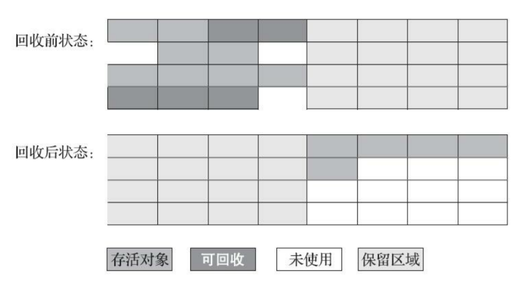
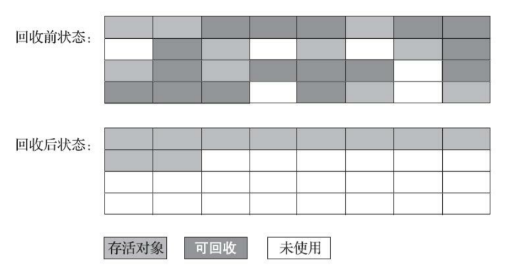

# 垃圾回收

垃圾回收需要完成的三件事情

1. 哪些内存需要回收？
2. 什么时候回收？
3. 如何回收？

## 1. 如何判断对象是否存活

在堆里面存放着 Java 世界中几乎所有的对象实例，垃圾收集器在对堆进行回收前，首先就要确定对象的存活状态

### 1.1 对象存活算法

#### 1.1.1 引用计数算法（Reference Counting）

在对象中添加一个引用计数器，每当有一个地方引用它时，计数器值就加 1；当引用失效时，计数器值就减 1；任何时刻计数器为零的对象就是不可能再被使用的

引用计数算法虽然占用了一些额外的内存空间来进行计数，但它的原理简单，判定效率也很高，在大多数情况下它都是一个不错的算法

##### 循环引用

这个看似简单的算法有很多例外情况要考虑，必须要配合大量额外处理才能保证正确地工作，譬如单纯的引用计数就很难解决对象之间相互循环引用的问题

```java
public class ReferenceCountingGC {

    public Object instance = null;

    public static void testGC() {
        ReferenceCountingGC objA = new ReferenceCountingGC();
        ReferenceCountingGC objB = new ReferenceCountingGC();
        objA.instance = objB;
        objB.instance = objA;
        objA = null;
        objB = null;
    }
}
```

这两个对象除了互相引用外再无任何引用，实际上这两个对象已经不可能再被访问，但是它们因为互相引用着对方，导致它们的引用计数都不为零，引用计数算法也就无法回收它们

#### 1.1.2 可达性分析算法（Reachability Analysis）

通过一系列称为 GC Roots 的根对象作为起点，从这些节点开始，根据引用关系向下搜索，搜索过程所走过的路径称为引用链（Reference Chain），如果某个对象到 GC Roots 间没有任何引用链相连，则证明此对象是不可能再被使用的



<small>深入理解Java虚拟机（第3版） - 图3-1 利用可达性分析算法判定对象是否可回收</small>

##### 可作为 GC Roots 的对象

- 虚拟机栈（栈帧中的本地变量表）中引用的对象
- 方法区中类静态属性引用的对象
- 方法区中常量引用的对象
- 本地方法栈中 JNI（即 Native 方法）引用的对象
- Java虚拟机内部的引用
  - 如基本数据类型对应的 Class 对象，一些常驻的异常对象（NullPointExcepiton、OutOfMemoryError）等，还有系统类加载器
- 所有被同步锁（synchronized 关键字）持有的对象
- 反映 Java 虚拟机内部情况的 JMXBean、JVMTI 中注册的回调、本地代码缓存等

除了这些固定的 GC Roots 集合以外，根据用户所选用的垃圾收集器以及当前回收的内存区域不同，还可以有其他对象临时性地加入，共同构成完整 GC Roots 集合

### 1.2 缓刑阶段

即使在可达性分析算法中判定为不可达的对象，也不是非死不可的，这时候它们暂时还处于缓刑阶段

要真正宣告一个对象死亡，**至少要经历两次标记过程**

1. 如果对象在进行可达性分析后，没有发现与 GC Roots 相连接的引用链，那它将会被第一次标记，随后进行一次筛选，此对象是否有必要执行 finalize 方法。假如对象没有覆盖 finalize 方法，或者 finalize 方法已经被虚拟机调用过，那么虚拟机将这两种情况都视为没有必要执行
   - 即该对象必须重写了 finalize 方法，且之前没有被虚拟机调用过
2. 如果这个对象被判定为确有必要执行 finalize 方法，那么该对象将会被放置在一个队列中进行第二次标记，如果对象要在 finalize 方法中成功拯救自己，只要重新与引用链上的任何一个对象建立关联即可

#### 1.2.1 finalize 方法

对象逃脱死刑的最后机会，当垃圾收集器发现一个对象实例没有任何的引用与之关联，在准备执行垃圾回收之前该方法才会被调用，且 **所有对象的 finalize 方法都只会被系统自动调用一次**

```java
public class Test {

    private static Test test;

    @Override
    protected void finalize() throws Throwable {
        super.finalize();
        System.out.println("execute finalize");
        test = this;
    }

    private static void print(Test t) {
        if (t == null) {
            System.out.println("dead!!!");
        } else {
            System.out.println("alive...");
        }
    }

    public static void main(String[] args) throws InterruptedException {
        test = new Test();

        // 第一次成功自救
        test = null;
        System.gc();
        Thread.sleep(500);
        print(test);

        // 第二次自救失败
        test = null;
        System.gc();
        Thread.sleep(500);
        print(test);
    }
}
```

- 执行结果

> execute finalize
> alive...
> dead!!!

### 1.3 引用

在 JDK1.2 版之前，Java 里面的引用是很传统的定义

如果 reference 类型的数据中存储的数值代表的是另外一块内存的起始地址，就称该 reference 数据是代表某块内存、某个对象的引用

为了实现对象在内存空间足够时，能保留在内存之中，如果内存空间在进行垃圾收集后仍然非常紧张，可以自动舍弃。在 JDK1.2 版之后，Java 对引用的概念进行了扩充



#### 1.3.1 强引用（Strongly Reference）

最传统的引用的定义，在程序代码中普遍存在的引用赋值。无论任何情况下，只要强引用关系还存在，垃圾收集器就永远不会回收掉被引用的对象

```java
Test test = new Test();
```

#### 1.3.2 软引用（Soft Reference）

描述一些还有用，但非必须的对象。只被软引用关联着的对象，在系统将要发生内存溢出异常前，会把这些对象列进回收范围之中进行第二次回收，如果这次回收还没有足够的内存，才会抛出内存溢出异常

```java
Reference<Object> reference = new SoftReference<>(new Test());

System.out.println(reference.get() == null);

System.gc();
Thread.sleep(500);
System.out.println(reference.get() == null);
```

- 执行结果

> false
> false

内存足够，所以进行垃圾回收后，该对象仍然存在

#### 1.3.3 弱引用（Weak Reference）

描述那些非必须对象，但是它的强度比软引用更弱一些，被弱引用关联的对象只能生存到下一次垃圾收集发生为止。当垃圾收集器开始工作，无论当前内存是否足够，都会回收掉只被弱引用关联的对象

```java
Reference<Object> reference = new WeakReference<>(new Test());

System.out.println(reference.get() == null);

System.gc();
Thread.sleep(500);
System.out.println(reference.get() == null);
```

- 执行结果

> false
> true

进行垃圾回收后，该对象便被回收了

#### 1.3.4 虚引用（Phantom Reference）

虚引用也称为幽灵引用或者幻影引用，它是最弱的一种引用关系。一个对象是否有虚引用的存在，完全不会对其生存时间构成影响，也无法通过虚引用来取得一个对象实例。为一个对象设置虚引用关联的唯一目的只是为了能在这个对象被收集器回收时收到一个系统通知

```java
ReferenceQueue queue = new ReferenceQueue();
Reference<Object> reference = new PhantomReference<>(new Test(), queue);

System.out.println(reference.get() == null);

System.gc();
Thread.sleep(500);
System.out.println(reference.get() == null);
```

- 执行结果

> true
> true

还未进行垃圾回收，该对象就被回收了

## 2. 分代收集理论（Generational Collection）

当前商业虚拟机的垃圾收集器，大多数都遵循了分代收集的理论进行设计，它建立在两个分代假说之上

- **弱分代假说（Weak Generational Hypothesis）：绝大多数对象都是朝生夕灭的**
- **强分代假说（Strong Generational Hypothesis）：熬过越多次垃圾收集过程的对象就越难以消亡**

这两个分代假说共同奠定了多款常用的垃圾收集器的一致的设计原则：收集器应该将堆划分出不同的区域，然后将回收对象依据其年龄（即对象熬过垃圾收集过程的次数）分配到不同的区域之中存储

- 如果一个区域中大多数对象都是朝生夕灭，难以熬过垃圾收集过程的话，那么把它们集中放在一起，每次回收时只关注如何保留少量存活，而不是去标记那些大量将要被回收的对象，就能以较低代价回收到大量的空间。如果剩下的都是难以消亡的对象，那把它们集中放在一块，虚拟机便可以使用较低的频率来回收这个区域，这就 **同时兼顾了垃圾收集的时间开销和内存的空间有效利用**

设计者一般至少会把堆划分为新生代（Young Generation）和老年代（Old Generation）两个区域。在新生代中，每次垃圾收集时都发现有大批对象死去，而每次回收后存活的少量对象，将会逐步晋升到老年代中存放

在堆中划分出不同的区域之后，垃圾收集器才可以每次只回收其中某一个或者某些部分的区域

- 部分收集
  - 新生代收集（Minor GC / Young GC）：只针对新生代
  - 老年代收集（Major GC / Old GC）：只针对老年代
  - 混合收集（Mixed GC）：针对整个新生代和部分老年代
- 整堆收集（Full GC）：针对整个堆和方法区

### 2.1 跨代引用

分代收集并非只是简单划分一下内存区域那么容易，例如对象不是孤立的，对象之间会存在跨代引用

假如现在要进行一次 Minor GC，但新生代中的对象有可能被老年代所引用着，为了找出该区域中的存活对象，不得不在固定的 GC Roots 之外，再额外遍历整个老年代中所有对象来确保可达性分析结果的正确性，反过来也是一样

遍历整个老年代所有对象的方案虽然理论上可行，但无疑会为内存回收带来很大的性能负担。为了解决这个问题，就需要对分代收集理论添加第三条经验法则

- **跨代引用假说（Intergenerational Reference Hypothesis）：跨代引用相对于同代引用来说仅占极少数**
  - 这其实是可根据前两条假说逻辑推理得出的隐含推论：存在互相引用关系的两个对象，是应该倾向于同时生存或者同时消亡的

依据这条假说，我们就不应再为了少量的跨代引用去扫描整个老年代，也不必浪费空间专门记录每一个对象是否存在及存在哪些跨代引用，只需在新生代上建立一个全局的数据结构（记忆集，Remembered Set），这个结构把老年代划分成若干小块，标识出老年代的哪一块内存存在跨代引用

此后当发生 Minor GC 时，只有包含了跨代引用的小块内存里的对象才会被加入到 GC Roots 进行扫描。虽然这种方法需要在对象改变引用关系（如将自己或者某个属性赋值）时维护记录数据的正确性，会增加一些运行时的开销，但比起收集时扫描整个老年代来说仍然是划算的

## 3. 内存分配与回收策略

### 3.1 对象优先在 Eden 区分配

大多数情况下，对象在新生代 Eden 区中分配。当 Eden 区没有足够空间进行分配时，虚拟机将发起一次 Minor GC

据统计新生代中的对象有 98% 熬不过第一轮收集。所以可以把新生代分为一块较大的 Eden 空间和两块较小的 Survivor 空间，每次分配内存只使用 Eden 和其中一块 Survivor。发生垃圾收集时，将 Eden 和 Survivor 中仍然存活的对象一次性复制到另外一块 Survivor 空间上，然后直接清理掉 Eden 和已用过的那块 Survivor 空间

HotSpot 虚拟机默认 Eden 和 Survivor 的大小比例是 8∶1，即每次新生代中可用内存空间为整个新生代容量的 90%，只有一个 Survivor 空间，即 10% 的新生代是会被浪费的



### 3.2 大对象直接进入老年代

大对象就是指需要 **大量连续内存空间** 的 Java 对象，比如很长的字符串，或者元素数量很庞大的数组

在分配空间时，大对象容易导致内存明明还有不少空间时就提前触发垃圾收集，以获取足够的连续空间才能安置好它们，而当复制对象时，大对象就意味着高额的内存复制开销

- 比一个大对象更糟糕的是一群短命的大对象

### 3.3 长期存活的对象将进入老年代

虚拟机给每个对象定义了一个对象年龄计数器。对象通常在 Eden 区里诞生，如果经过第一次 Minor GC 后仍然存活，并且能被 Survivor 容纳的话，该对象会被移动到 Survivor 空间中，并且将该对象年龄设为 1。对象在 Survivor 区中每熬过一次 Minor GC，年龄就增加 1，当它的年龄增加到一定程度（默认为 15），就会被晋升到老年代中

### 3.4 动态对象年龄判定

如果在 Survivor 空间中相同年龄所有对象大小的总和大于 Survivor 空间的一半，年龄大于或等于该年龄的对象就可以直接进入老年代

### 3.5 空间分配担保

当 Survivor 空间不足以容纳一次 Minor GC 之后存活的对象时，就需要依赖其他内存区域（实际上大多就是老年代）进行 **分配担保**（Handle Promotion）

在发生 Minor GC 之前，虚拟机必须先检查老年代最大可用的连续空间，是否大于新生代所有对象总空间

- 如果大于，这一次 Minor GC 可以确保是安全的
- 如果小于，虚拟机会检查是否允许担保失败
  - 如果允许，检查老年代最大可用的连续空间是否大于历次晋升到老年代对象的平均大小
    - 如果大于，将尝试进行一次 Minor GC，尽管这次 Minor GC 是有风险的
  - 如果小于或者不允许，那这时就要改为进行一次 Full GC

也就是先检查老年代空间是否能满足需求，满足不了再检查是否允许担保失败，要么执行一次有风险的 Minor GC，要么执行一次 Full GC

#### 3.5.1 风险

使用空间分配担保的前提是，老年代本身还有容纳这些对象的剩余空间，但一共有多少对象会在这次回收中活下来在实际完成内存回收之前是无法明确知道的，所以只能取之前每一次回收晋升到老年代对象容量的平均大小作为经验值，与老年代的剩余空间进行比较，决定是否进行 Full GC 来让老年代腾出更多空间

## 4. 垃圾回收算法

### 4.1 标记-清除算法（Mark-Sweep）

最早出现也是最基础的垃圾收集算法，算法分为标记和清除两个阶段：首先标记出所有需要回收的对象，在标记完成后，统一回收掉所有被标记的对象，也可以反过来，标记存活的对象，统一回收所有未被标记的对象



<small>深入理解Java虚拟机（第3版） - 图3-2 “标记-清除”算法示意图</small>

后续的收集算法大多都是以标记-清除算法为基础，对其缺点进行改进而得到的。它的主要缺点有两个

- 执行效率不稳定：如果堆中包含大量对象，而且其中大部分是需要被回收的，这时必须进行大量标记和清除的动作，导致标记和清除两个过程的执行效率都随对象数量增长而降低
- 内存空间的碎片化：标记、清除之后会产生大量不连续的内存碎片，空间碎片太多可能会导致当以后在程序运行过程中需要分配较大对象时无法找到足够的连续内存而不得不提前触发另一次垃圾收集动作

### 4.2 标记-复制算法（Copying）

为了解决标记-清除算法面对大量可回收对象时执行效率低的问题，复制算法将可用内存按容量划分为大小相等的两块，每次只使用其中的一块。当这一块的内存用完了，就将还存活着的对象复制到另外一块上面，然后再把已使用过的内存空间一次清理掉



<small>深入理解Java虚拟机（第3版） - 图3-3 标记-复制算法示意图</small>

如果内存中多数对象都是存活的，这种算法将会产生大量的内存间复制的开销，但对于多数对象都是可回收的情况，算法需要复制的就是占少数的存活对象，而且每次都是针对整个半区进行内存回收，分配内存时也就不用考虑有空间碎片的复杂情况，只要移动堆顶指针，按顺序分配即可。这样实现简单，运行高效，不过其缺陷也显而易见，可用内存缩小为了原来的一半，空间浪费未免太多了一点

现在的商用 Java 虚拟机大多都优先采用了这种收集算法去回收新生代，新生代中的对象有 98% 熬不过第一轮收集，因此并不需要按照 1∶1 的比例来划分新生代的内存空间

### 4.3 标记-整理算法（Mark-Compact）

标记过程与标记-清除算法一样，但后续步骤不是直接对可回收对象进行清理，而是让所有存活的对象都向内存空间一端移动，然后直接清理掉边界以外的内存



<small>深入理解Java虚拟机（第3版） - 图3-4 “标记-整理”算法示意图</small>

如果移动存活对象，尤其是在老年代这种每次回收都有大量对象存活区域，移动存活对象并更新所有引用这些对象的地方将会是一种极为负重的操作。但如果跟标记-清除算法那样完全不考虑移动和整理存活对象的话，弥散于堆中的存活对象导致的空间碎片化问题就只能依赖更为复杂的内存分配器和内存访问器来解决

是否移动对象都存在弊端，移动则内存回收时会更复杂，不移动则内存分配时会更复杂。从垃圾收集的停顿时间来看，不移动对象停顿时间会更短，甚至可以不需要停顿，但是从整个程序的吞吐量来看，移动对象会更划算

## 参考

- 深入理解Java虚拟机（第3版）
