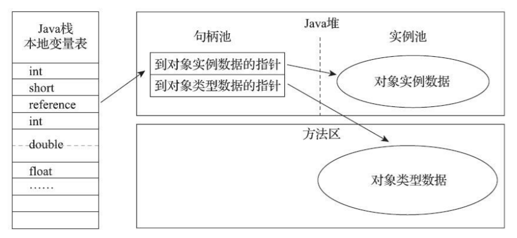
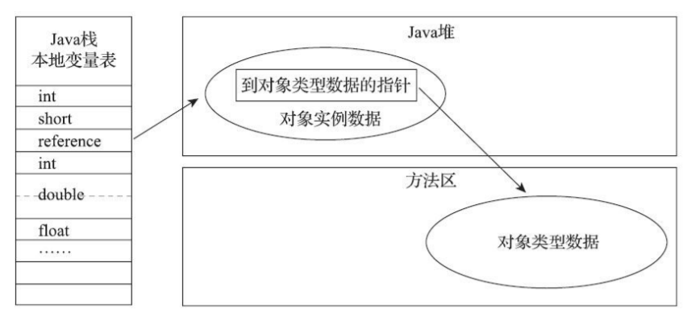

# 对象的内存布局与访问定位

## 内存布局

对象在堆内存中的存储布局可以划分为三个部分：对象头（Header）、实例数据（Instance Data）和对齐填充（Padding）

<small>[面渣逆袭：JVM经典五十问，这下面试稳了！ - 对象的存储布局](https://mp.weixin.qq.com/s/XYsEJyIo46jXhHE1sOR_0Q)</small>

### 对象头（Header）

HotSpot 虚拟机对象的对象头部分包括两类信息

- **存储对象自身的运行时数据**，如哈希码、GC 分代年龄、锁状态标志、线程持有的锁、偏向线程 ID、偏向时间戳等，官方称它为 **Mark Word**
- **类型指针**，即对象指向它的类型元数据的指针，虚拟机通过这个指针来确定该对象是哪个类的实例

如果对象是一个数组，那在对象头中还必须有一块用于记录数组长度的数据，因为虚拟机可以通过对象的元数据信息确定对象的大小，但是如果数组的长度是不确定的，将无法通过元数据中的信息推断出数组的大小

### 实例数据（Instance Data）

实例数据部分是 **对象真正存储的有效信息**，即在程序代码里面所定义的各种类型的字段内容，无论是从父类继承下来的，还是在子类中定义的字段都必须记录起来

### 对齐填充（Padding）

**仅仅起着占位符的作用**。由于 HotSpot 虚拟机的自动内存管理系统要求对象起始地址必须是 8 字节的整数倍，即任何对象的大小都必须是 8 字节的整数倍。对象头部分已经被精心设计成正好是 8 字节的倍数（1 倍或者 2 倍），因此，如果对象实例数据部分没有对齐的话，就需要通过对齐填充来补全

## 访问定位

创建对象自然是为了后续使用该对象，Java 程序会通过栈上的 reference 数据来操作堆上的具体对象。由于 reference 类型在 JVM 规范里只规定了它是一个指向对象的引用，并没有定义这个引用应该通过什么方式去定位、访问到堆中对象的具体位置，所以对象访问方式也是由虚拟机实现而定的。主流的访问方式主要有使用句柄和直接指针两种

### 句柄访问

**堆中会划分出一块内存来作为句柄池**，reference 中存储的就是 **对象的句柄地址**，而句柄中包含了 **对象实例数据与类型数据各自具体的地址信息**

<small>深入理解Java虚拟机（第3版） - 图2-2 通过句柄访问对象</small>

使用句柄访问的最大好处就是 reference 中存储的是稳定句柄地址，在对象被移动（垃圾收集时移动对象是非常普遍的行为）时只会改变句柄中的实例数据指针，而 reference 本身不需要被修改

### 直接指针访问

堆中对象的内存布局就必须考虑如何放置访问类型数据的相关信息，reference 中存储的就是对象地址，如果只是访问对象本身的话，就不需要多一次间接访问的开销

<small>深入理解Java虚拟机（第3版） - 图2-3 通过直接指针访问对象</small>

使用直接指针访问最大的好处就是速度更快，它节省了一次指针定位的时间开销，由于对象访问在 Java 中非常频繁，因此这类开销积少成多也是一项极为可观的执行成本

HotSpot 虚拟机使用的是直接指针来进行对象访问，但从整个软件开发的范围来看，在各种语言、框架中使用句柄来访问的情况也十分常见

## 参考

- 深入理解Java虚拟机（第3版）
- [Java内存区域详解（重点）](https://javaguide.cn/java/jvm/memory-area.html)