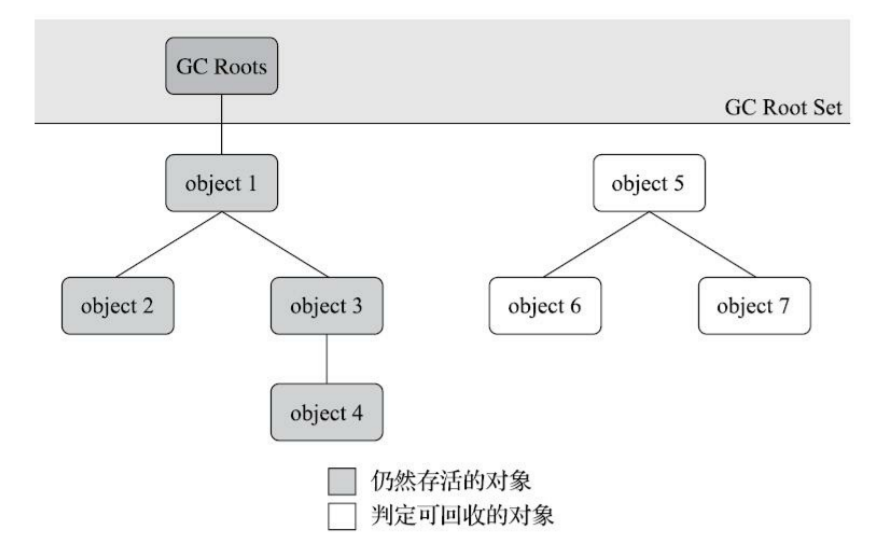

# 对象的存活状态

在堆里面存放着 Java 世界中几乎所有的对象实例，垃圾收集器在对堆进行回收前，首先就要确定对象的存活状态

## 对象存活算法

### 引用计数算法（Reference Counting）

在对象中添加一个引用计数器

- 每当有一个地方引用它时，计数器值就加 1
- 当引用失效时，计数器值就减 1
- 任何时刻计数器为 0 的对象就是不可能再被使用的

引用计数算法虽然占用了一些额外的内存空间来进行计数，但它的原理简单，判定效率也很高，在大多数情况下它都是一个不错的算法

#### 循环引用

这个看似简单的算法有很多例外情况要考虑，必须要配合大量额外处理才能保证正确地工作，例如对象之间的循环引用问题

```java
public class ReferenceCountingGC {

    public Object instance = null;

    public static void testGC() {
        ReferenceCountingGC objA = new ReferenceCountingGC();
        ReferenceCountingGC objB = new ReferenceCountingGC();
        objA.instance = objB;
        objB.instance = objA;
        objA = null;
        objB = null;
    }
}
```

这两个对象除了互相引用外再无任何引用，实际上这两个对象已经不可能再被访问，但是它们因为互相引用着对方，导致它们的引用计数都不为 0，引用计数算法也就无法回收它们

### 可达性分析算法（Reachability Analysis）

通过一系列称为 **GC Roots** 的根对象作为起点，从这些节点开始，根据引用关系向下搜索，搜索过程所走过的路径称为 **引用链（Reference Chain）**，如果某个对象到 GC Roots 间没有任何引用链相连，则证明此对象是不可能再被使用的



<small>深入理解Java虚拟机（第3版） - 图3-1 利用可达性分析算法判定对象是否可回收</small>

#### 可作为 GC Roots 的对象

- 虚拟机栈（栈帧中的本地变量表）中引用的对象
- 方法区中类静态属性引用的对象
- 方法区中常量引用的对象
- 本地方法栈中 JNI（即 Native 方法）引用的对象
- Java 虚拟机内部的引用
  - 如基本数据类型对应的 Class 对象，一些常驻的异常对象（NullPointExcepiton、OutOfMemoryError）等，还有系统类加载器
- 所有被同步锁（`synchronized` 关键字）持有的对象
- 反映 Java 虚拟机内部情况的 JMXBean、JVMTI 中注册的回调、本地代码缓存等

除了这些固定的 GC Roots 集合以外，根据用户所选用的垃圾收集器以及当前回收的内存区域不同，还可以有其他对象临时性地加入，共同构成完整 GC Roots 集合

## 缓刑阶段

即使在可达性分析算法中判定为不可达的对象，也不是非死不可的，这时候它们暂时还处于缓刑阶段

要真正宣告一个对象死亡，**至少要经历两次标记过程**

1. 如果对象在进行可达性分析后，没有发现与 GC Roots 相连接的引用链，那它将会被第一次标记，并判断此对象是否有必要执行 `finalize` 方法。假如对象没有覆盖 `finalize` 方法，或者 `finalize` 方法已经被虚拟机调用过，那么虚拟机将这两种情况都视为没有必要执行
   - 即该对象必须重写了 `finalize` 方法，且之前没有被虚拟机调用过
2. 如果这个对象被判定为有必要执行 `finalize` 方法，就会被放置在一个队列中进行第二次标记，如果对象要在 `finalize` 方法中成功拯救自己，只要重新与引用链上的任何一个对象建立关联即可

### `finalize` 方法

对象逃脱死刑的最后机会，当垃圾收集器发现一个对象实例没有任何的引用与之关联，在准备执行垃圾回收之前该方法才会被调用，且 **所有对象的 `finalize` 方法都只会被系统自动调用一次**

```java
public class Test {

    private static Test test;

    @Override
    protected void finalize() throws Throwable {
        super.finalize();
        System.out.println("execute finalize");
        test = this;
    }

    private static void print(Test t) {
        if (t == null) {
            System.out.println("dead!!!");
        } else {
            System.out.println("alive...");
        }
    }

    public static void main(String[] args) throws InterruptedException {
        test = new Test();

        // 第一次成功自救
        test = null;
        System.gc();
        Thread.sleep(500);
        print(test);

        // 第二次自救失败
        test = null;
        System.gc();
        Thread.sleep(500);
        print(test);
    }
}
```

- 执行结果

> execute finalize
> alive...
> dead!!!

## 参考

- 深入理解Java虚拟机（第3版）
