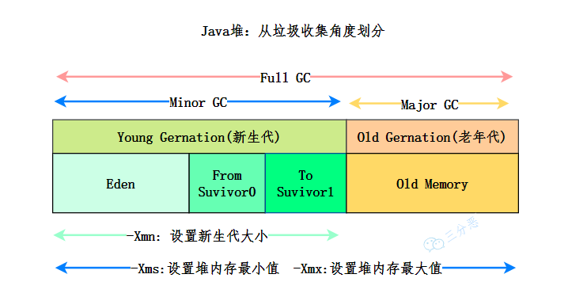

# 内存分配与回收策略

<small>*[面渣逆袭：JVM经典五十问，这下面试稳了！ - Java 堆内存结构](https://mp.weixin.qq.com/s/XYsEJyIo46jXhHE1sOR_0Q)*</small>

## 对象优先在 Eden 区分配

大多数情况下，对象在新生代 Eden 区中分配。当 Eden 区没有足够空间进行分配时，虚拟机将发起一次 Minor GC

据统计新生代中的对象有 98% 熬不过第一轮收集。所以可以把新生代分为一块较大的 Eden 空间和两块较小的 Survivor 空间，每次分配内存只使用 Eden 和其中一块 Survivor。发生垃圾收集时，将 Eden 和 Survivor 中仍然存活的对象一次性复制到另外一块 Survivor 空间上，然后直接清理掉 Eden 和已用过的那块 Survivor 空间

HotSpot 虚拟机默认 Eden 和 Survivor 的大小比例是 8∶1，即每次新生代中可用内存空间为整个新生代容量的 90%，只有一个 Survivor 空间，即 10% 的新生代是会被浪费的

## 大对象直接进入老年代

大对象就是指需要 **大量连续内存空间** 的 Java 对象，比如很长的字符串，或者元素数量很庞大的数组

在分配空间时，大对象容易导致内存明明还有不少空间时就提前触发垃圾收集，以获取足够的连续空间才能安置好它们，而当复制对象时，大对象就意味着高额的内存复制开销

- 比一个大对象更糟糕的是一群短命的大对象

## 长期存活的对象将进入老年代

虚拟机给每个对象定义了一个对象年龄计数器。对象通常在 Eden 区里诞生，如果经过第一次 Minor GC 后仍然存活，并且能被 Survivor 容纳的话，该对象会被移动到 Survivor 空间中，并且将该对象年龄设为 1

对象在 Survivor 区中每熬过一次 Minor GC，年龄就增加 1，当它的年龄增加到一定程度（默认为 15），就会被晋升到老年代中

## 动态对象年龄判定

如果在 Survivor 空间中，相同年龄所有对象大小的总和大于 Survivor 空间的一半，年龄大于或等于该年龄的对象就可以直接进入老年代

## 空间分配担保

当 Survivor 空间不足以容纳一次 Minor GC 之后存活的对象时，就需要依赖其他内存区域（实际上大多就是老年代）进行 **分配担保**（Handle Promotion）

在发生 Minor GC 之前，虚拟机必须先检查老年代最大可用的连续空间，是否大于新生代所有对象总空间

- 如果大于，这一次 Minor GC 可以确保是安全的
- 如果小于，虚拟机会检查是否允许担保失败
  - 如果允许，检查老年代最大可用的连续空间，是否大于历次晋升到老年代对象的平均大小
    - 如果大于，将尝试进行一次 Minor GC，尽管这次 Minor GC 是有风险的
  - 如果小于或者不允许，那这时就要改为进行一次 Full GC

也就是先检查老年代空间是否能满足需求，满足不了再检查是否允许担保失败，要么执行一次有风险的 Minor GC，要么执行一次 Full GC

### 风险

使用空间分配担保的前提是，老年代本身还有容纳这些对象的剩余空间，但一共有多少对象会在这次回收中活下来在实际完成内存回收之前是无法明确知道的，所以只能取之前每一次回收晋升到老年代对象容量的平均大小作为经验值，与老年代的剩余空间进行比较，决定是否进行 Full GC 来让老年代腾出更多空间

## 参考

- 深入理解Java虚拟机（第3版）
