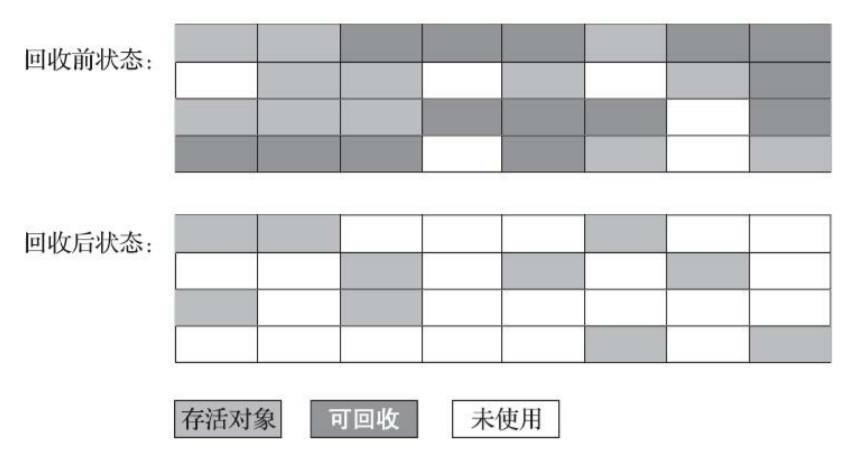
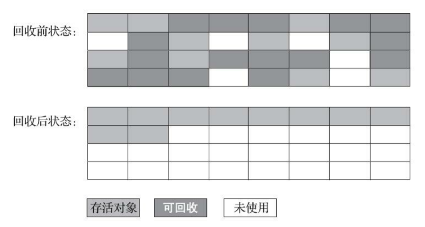

# 垃圾回收算法

垃圾回收需要完成的三件事情

1. 哪些内存需要回收？
2. 什么时候回收？
3. 如何回收？

## 标记-清除算法（Mark-Sweep）

最早出现也是最基础的垃圾收集算法，算法分为 **标记和清除** 两个阶段

首先标记出所有需要回收的对象，在标记完成后，统一回收掉所有被标记的对象，也可以反过来，标记存活的对象，统一回收所有未被标记的对象

<small>深入理解Java虚拟机（第3版） - 图3-2 “标记-清除”算法示意图</small>

后续的收集算法大多都是以标记-清除算法为基础，对其缺点进行改进而得到的，它的缺点主要有两个

- 执行效率不稳定：如果堆中包含大量对象，而且其中大部分是需要被回收的，这时必须进行大量标记和清除的动作，导致标记和清除两个过程的执行效率都随对象数量增长而降低
- **内存空间的碎片化**：标记、清除之后会产生大量不连续的内存碎片，空间碎片太多可能会导致之后需要分配大对象时，由于无法找到足够的连续内存，而不得不提前触发另一次垃圾收集动作

## 标记-复制算法（Copying）

为了解决标记-清除算法面对大量可回收对象时执行效率低的问题，复制算法 **将可用内存按容量划分为大小相等的两块，每次只使用其中的一块**。当这一块的内存用完了，就将还存活着的对象复制到另外一块上面，然后再把已使用过的内存空间一次清理掉

<small>深入理解Java虚拟机（第3版） - 图3-3 标记-复制算法示意图</small>

如果内存中多数对象都是存活的，这种算法将会产生大量的内存间复制的开销，但对于多数对象都是可回收的情况，算法需要复制的就是占少数的存活对象，而且每次都是针对整个半区进行内存回收，分配内存时也就不用考虑有空间碎片的复杂情况，只要移动堆顶指针，按顺序分配即可。这样实现简单，运行高效，不过其缺陷也显而易见，可用内存缩小为了原来的一半，空间浪费未免太多了一点

- 现在的商用 Java 虚拟机大多都优先采用了这种收集算法去回收新生代，因为新生代中的对象有 98% 熬不过第一轮收集，因此并不需要按照 1∶1 的比例来划分新生代的内存空间
  - 例如 HotSpot 的 8 : 1

## 标记-整理算法（Mark-Compact）

标记过程与标记-清除算法一样，但后续步骤不是直接对可回收对象进行清理，而是 **让所有存活的对象都向内存空间一端移动，然后直接清理掉边界以外的内存**

<small>深入理解Java虚拟机（第3版） - 图3-4 “标记-整理”算法示意图</small>

如果移动存活对象，尤其是在老年代这种每次回收都有大量对象存活区域，移动存活对象并更新所有引用这些对象的地方将会是一种极为负重的操作

但如果跟标记-清除算法那样完全不考虑移动和整理存活对象的话，弥散于堆中的存活对象导致的空间碎片化问题就只能依赖更为复杂的内存分配器和内存访问器来解决

是否移动对象都存在弊端，移动则内存回收时会更复杂，不移动则内存分配时会更复杂。从垃圾收集的停顿时间来看，不移动对象停顿时间会更短，甚至可以不需要停顿，但是从整个程序的吞吐量来看，移动对象会更划算

## 参考

- 深入理解Java虚拟机（第3版）
