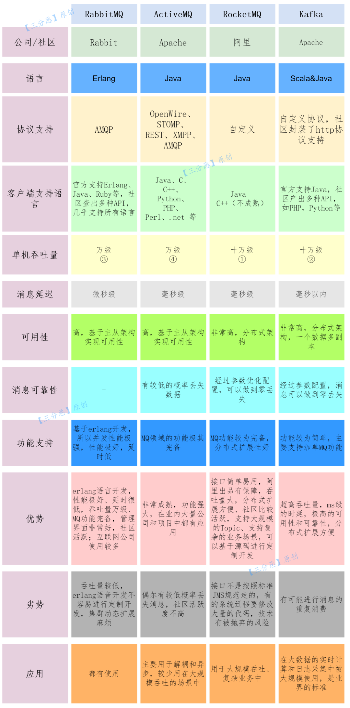
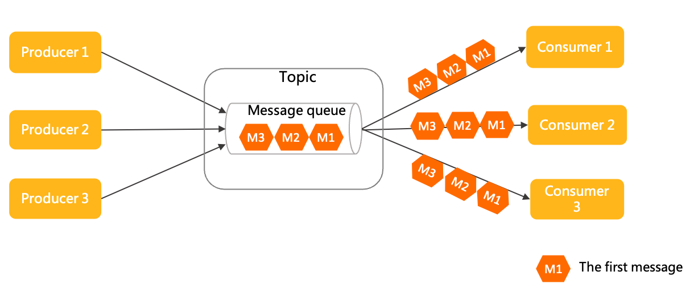

# 消息队列概述

消息队列（MQ，Message queue）是一个消息中间件，注意他的组成，消息和队列，那就很明显了，消息队列就是一个有队列性质的主要用来通信的工具

## 作用

- **异步**：可以将耗时的、不需要立即返回结果的任务放入消息队列，以提高响应效率
  - 例如上传、视频转码、增减库存等
- **解耦**：降低模块、功能之间的耦合性
- **削峰**：减轻服务端压力，将短时间的大量的请求，转为长时间的平滑稳定的请求
  - 例如秒杀活动、同步日志到 ES 等

## 缺点

- 系统可用性降低：增加消息队列可能导致原本独立的系统之间出现依赖关系，增加了单点故障的风险，导致整体系统可用性的下降，还需考虑消息队列自身的可用性
- 系统复杂性提高：需要保证消息队列能正确处理消息丢失、重复消费以及顺序性等问题，增加开发的复杂性和成本
- 一致性问题：在分布式系统环境中，消息丢失或者重复消费可能会导致不一致的结果

> 最重要的是要考虑自己的系统是不是真的需要引入消息队列，其次是能正确的使用消息队列，以满足自身的需求

## 为什么不直接使用网络调用呢

针对消息队列的三大作用，为什么不直接使用 HTTP、RPC 等，异步、解耦都可以做到，削峰也可以通过某些逻辑做到，使用也更简单、更广泛

原因在于他们无法保证消息的投递，如果发送时出现故障，或者服务端出现故障，都有可能导致消息丢失

消息队列的工作就是 **确保消息能成功的投递**，即便信息发送过程中出现故障，也能通过重试、消息持久化等机制，保证消息的成功投递

> 当然也并不是说使用消息队列，消息就能百分百的投递成功，凡事都有万一，例如阿里云还宣传他们的服务器有 99.999% 的可靠性呢，这两年也还是出了不少大事故

## 选型

<small>[面渣逆袭：RocketMQ二十三问 - 四大消息队列对比](https://mp.weixin.qq.com/s/IvBt3tB_IWZgPjKv5WGS4A)</small>

ActiveMQ 虽然已经非常成熟，但性能较差、版本迭代慢、社区目前也不活跃，基本已经算淘汰了

- 吞吐量：推荐 RocketMQ 与 Kafka
- 响应：RabbitMQ 的响应延迟能达到微秒级，其他都在毫秒级
- 可用性：RocketMQ 与 Kafka 基于分布式架构，相比与 RabbitMQ 的主从架构，可用性更高
- 消息丢失：RabbitMQ 丢失的可能性非常低，RocketMQ 与 Kafka 理论上能做到 0 丢失

在国内建议学习 Kafka 和 RocketMQ，并且建议从 Kafka 开始学习，因为二者在很多概念上都是相通的，换句话说，RocketMQ 就是脱胎于 Kafka 的。除此之外，Kafka 的相关书籍资料很健全，大部分都通俗易懂

## 消息传输模型

### 点对点（P2P，Point-to-Point）

<small>[领域模型概述 - 消息传输模型介绍](https://rocketmq.apache.org/zh/docs/domainModel/01main)</small>

也被叫做队列模型，生产者向队列发送消息，该消息会一直保留在队列中，直到被消费或超时

**一条消息只能被一个消费者消费**，消费者之间是竞争关系，消息被消费以后，队列中就不会再存储该消息

### 发布 / 订阅（Pub / Sub）

<small>[领域模型概述 - 消息传输模型介绍](https://rocketmq.apache.org/zh/docs/domainModel/01main)</small>

生产者将消息发给特定的 Topic（主题），所有订阅了该 Topic 的消费者都能收到消息

- 不同订阅组之间互不影响
- 一条消息可以对应多个消费者，一条消息可以多次消费

## 推拉模式

生产者将消息发送到队列后，消费者从队列中获取消息有推、拉两种模式，要么你主动给我，要么我主动去拿

### 推（Push）

服务端主动将消息推送到消费者

- 优点
  - 实时强：消息一旦到达服务端就会立马被推送给消费者，确保消费者能够尽快处理消息
  - 客户端实现简单：消费者只需监听服务端的推送即可，无需主动发起请求
- 缺点
  - 容易导致消息堆积：如果消费者的消费速率跟不上推送速率，就可能导致消息堆积
  - 服务端逻辑复杂：服务端需要一定的流控机制，来平衡对不同消费能力的消费者的推送速率

适合消息量不大，消费能力强，实时性要求高的场景

### 拉（Pull）

消费者可以按需拉取消息，服务端被动响应

- 优点
  - 可以有效的避免消息堆积，灵活性高：消费者可以按自身的处理能力主动拉取消息，处理不了就停止拉取，等处理完再进行拉取
  - 客户端实现简单：服务端只需要响应客户端请求即可，无需关心消费者的消费能力
- 缺点
  - 实时性较差：消费者为了能获取到消息，需要不断的请求服务端，所以实时性受到消费者请求频率与服务端的响应速度的影响
  - 无效请求：如果队列中没有消息，那么客户端的请求都是无效请求
  - 客户端逻辑复杂：客户端需要主动发起请求并处理响应

为了保证了实时性，减少了无效请求，现代消息队列系统通常实现 **长轮询机制**，消费者发起请求后，如果没有消息则保持连接等待，直到有新消息到达或超时

目前主流的消息队列大部分（RocketMQ、Kafka）都用的拉模式

## 参考

- [消息队列基础知识总结](https://javaguide.cn/high-performance/message-queue/message-queue.html)
- [Message Queue vs. Web Services? [closed]](https://stackoverflow.com/questions/2383912/message-queue-vs-web-services)
- [What is a message queue?](https://www.ibm.com/topics/message-queues)
- [面渣逆袭：RocketMQ二十三问](https://mp.weixin.qq.com/s/IvBt3tB_IWZgPjKv5WGS4A)
- [领域模型概述](https://rocketmq.apache.org/zh/docs/domainModel/01main)
- [消息队列，推拉模式的区别在哪？](https://www.cnblogs.com/jiagoubaiduren/p/16282245.html)
- [消息队列的拉模式和推模式](https://juejin.cn/post/7366177423775711232)
- [消息队列之推还是拉，RocketMQ 和 Kafka 是如何做的？](https://juejin.cn/post/6864909592061542407)
