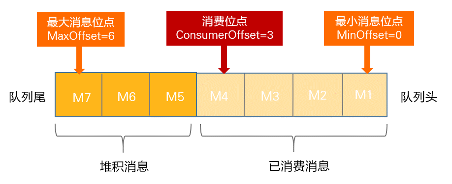

# RocketMQ

RocketMQ 是一个高性能、低延迟、高并发、高可靠开源的消息中间件。主要用于解决分布式系统中消息通信的高性能、高可靠性和异步解耦等问题

RocketMQ 是基于 Kafka 改进而来的，很多概念、用法都是相似的，了解其中某一个，都对另一个的学习有很大帮助

## 架构


<small>[RocketMQ保姆级教程 - 工作流程](https://mp.weixin.qq.com/s/4h6VoywgZgnrxMBx-rqCLg)</small>

### NameServer

NameServer 是一个无状态的服务器，主要用来管理 Broker 和路由信息，其实就是一个注册中心

Broker 在启动时会将自己的信息注册到 NameServer，生产者和消费者会定期从 NameServer 中获取 Broker 的路由信息，在收发消息时就可通过路由信息找到对应的 Broker

#### 为什么需要 NameServer

没有 NameServer，消费者和生产者直接和 Broker 通信不也行吗？也确实可以，但如果 Broker 挂掉了呢，也好解决，再找一个呗，将生产者和消费者指向新的 Broker，等一等，这不就是 NameServer 在做的事吗

另外，为了保证系统的高可用，系统中可能会有多个 Broker，维护工作的复杂程度也大大上升的，如果仍旧是直连的状态，修改一个 Broker，就要修改对应的多个生产者和消费者，累不累啊

#### 高可用

NameServer 这么重要，如果挂了，后果岂不是不可设想，如何保证 NameServer 的高可用呢？很简单，一个不行，就多部署几个 NameServer

NameServer 集群是 **去中心化** 的，意味着他没有主节点，节点之间互不通信，可以很好的进行横向扩展

每个 Broker 都与所有的 NameServer 保持着长连接，并且每个 Broker 每隔 30 秒会向所有 NameServer 发送心跳，报告自己的存活状态，NameServer 超过 120 秒没收到心跳包，就会认为该 Broker 失活，从路由表中移除该 Broker 的信息

- 为了保证高可用，而选择了弱一致性

### Broker

RocketMQ 的服务节点，即 RocketMQ 服务器

主要负责消息的存储、投递和查询以及服务高可用保证

### Producer

生产者，负责生产消息

#### 发送方式

注意发送消息指的是生产者发送消息到 Broker，而不是生产者发送消息到生产者

- 同步（Sync）：发出消息后，需等待响应结果
  - 一般用于重要通知消息
- 异步（Async）：发出消息后，无需等待响应，也可指定回调函数，发送成功或失败触发对应的回调函数
  - 一般用于耗时较长且对响应时间敏感的场景
- 单向（One-way）：只负责发送消息，不等待响应且没有回调函数触发
  - 常用于对可靠性要求不高的场景

### Consumer Group

承载多个消费行为一致的消费者的负载均衡分组，通过消费者分组内初始化多个消费者实现消费性能的水平扩展以及高可用容灾

每个消费者都属于一个特定的消费者组，一个消费者组可以包含一个或多个消费者

- 同一条消息可以被不同消费者组消费
- 在同一个消费者组中，一条消息只能由组内的某一个消费者进行消费

### Consumer

消费者，负责消费消息

### Topic

主题是一个逻辑上的概念，RocketMQ 中的消息以主题为单位进行划分

生产者将消息发送到特定的主题，消费者通过订阅特定的主题获得消息并消费

### MessageQueue

- 一个主题可以有一个或多个队列
- 同一主题下的不同队列包含的消息是不同的
- 同一个主题下的队列可以分布在不同的 Broker 上


<small>[队列（MessageQueue）](https://rocketmq.apache.org/zh/docs/domainModel/03messagequeue)</small>

> 其实也就是 Kafka 中的 Partition

### Tag

可以看做子主题，可以为主题添加额外的标识

### Offset

Offset 是消息在 MessageQueue 中的唯一坐标，这个坐标被定义为 **消息位点**，每个 MessageQueue 都有自己独立的 Offset


<small>[消费进度管理 - 消费进度原理](https://rocketmq.apache.org/zh/docs/featureBehavior/09consumerprogress/)</small>

RocketMQ 定义队列中最早一条消息的位点为 **最小消息位点（MinOffset）**，最新一条消息的位点为 **最大消息位点（MaxOffset）**

虽然消息队列逻辑上是无限存储，但由于服务端物理节点的存储空间有限，RocketMQ 会滚动删除队列中存储最早的消息。因此，消息的最小消费位点和最大消费位点会一直递增变化


<small>[消费进度管理 - 消费进度原理](https://rocketmq.apache.org/zh/docs/featureBehavior/09consumerprogress/)</small>

#### ConsumerOffset（消费位点）

RocketMQ 中某条消息被消费后，并不会直接删除，所以也就无法通过 MinOffset 确定消费进度，于是为了保存消费进度，RocketMQ 为每个 MessageQueue 维护了一个消费位点

- 消费位点指向的 **已被消费** 的最新一条消息



<small>[消费进度管理 - 消费进度原理](https://rocketmq.apache.org/zh/docs/featureBehavior/09consumerprogress/)</small>

#### 消费者提交进度

在广播消费模式消费者不会提交消费进度给到 Broker，仅会持久化到本地磁盘

在集群消费模式下，消费者消费完消息后，会将消费进度提交给 Broker，也就是让 Broker 去更新 ConsumerOffset

- 消费者提交的消费进度是以消费者组为单位的

## 消息模式

- 集群（CLUSTERING）：默认模式，同一条消息，只允许被组内某一个消费者消费
- 广播（BROADCASTING）：同一条消息，能被组内所有消费者消费

## 消费模式（消费顺序）

- 顺序（ORDERLY）：消费者有序的接收消息
  - 即同一时刻只能有一个消费者消费该消息
- 并行（CONCURRENTLY）：消费者可以并行的接收消息
  - 即同一时刻可以有多个消费者消费该消息

## 推拉模式

RocketMQ 同时支持推模式和拉模式，而且 RocketMQ 的推模式实际上也就是披着皮的拉模式

如何通过拉模式获取消息呢？很容易想到的就是去请求 Broker，但消费者是不知道 Broker 中何时有消息的，也就不知道何时需要去请求 Broker。所以就需要不断地请求 Broker，也就是轮询，当 Broker 中有消息的时候，消费者的下次请求就能获取到该消息

当然，使用轮询，消息的实时性就收到请求频率和响应速度的影响，更别提如果 Broker 中没有消息，会产生大量的无效请求，白白的浪费服务器资源

为了能保证实时性，避免大量的无效请求，现代消息队列系统通常都实现了 **长轮询机制**，这也是 RocketMQ 中推模式的实现


<small>[RocketMQ的push消费方式实现的太聪明了 - push消费方式源码探究](https://mp.weixin.qq.com/s/opqRf8UjI9rRW_4befWrbA)</small>

首先每次要请求时，都会先判断当前消费者是否有过多的消息未被消费，如果有就等一会再去请求

- 未消费的消息数量过多
- 未消费的消息占用过大

```java
// 消息队列缓存满时，延迟执行的间隔时间
private static final long PULL_TIME_DELAY_MILLS_WHEN_CACHE_FLOW_CONTROL = 50;

// 未消费的消息数量
long cachedMessageCount = processQueue.getMsgCount().get();
// 未消费的消息大小
long cachedMessageSizeInMiB = processQueue.getMsgSize().get() / (1024 * 1024);

// 大于 1000
if (cachedMessageCount > defaultLitePullConsumer.getPullThresholdForQueue()) {
    scheduledThreadPoolExecutor.schedule(this, PULL_TIME_DELAY_MILLS_WHEN_CACHE_FLOW_CONTROL, TimeUnit.MILLISECONDS);
    if ((queueFlowControlTimes++ % 1000) == 0) {
        log.warn(
                "The cached message count exceeds the threshold {}, so do flow control, minOffset={}, maxOffset={}, count={}, size={} MiB, flowControlTimes={}",
                defaultLitePullConsumer.getPullThresholdForQueue(), processQueue.getMsgTreeMap().firstKey(), processQueue.getMsgTreeMap().lastKey(), cachedMessageCount, cachedMessageSizeInMiB, queueFlowControlTimes);
    }
    return;
}

// 大于 100 MB
if (cachedMessageSizeInMiB > defaultLitePullConsumer.getPullThresholdSizeForQueue()) {
    scheduledThreadPoolExecutor.schedule(this, PULL_TIME_DELAY_MILLS_WHEN_CACHE_FLOW_CONTROL, TimeUnit.MILLISECONDS);
    if ((queueFlowControlTimes++ % 1000) == 0) {
        log.warn(
                "The cached message size exceeds the threshold {} MiB, so do flow control, minOffset={}, maxOffset={}, count={}, size={} MiB, flowControlTimes={}",
                defaultLitePullConsumer.getPullThresholdSizeForQueue(), processQueue.getMsgTreeMap().firstKey(), processQueue.getMsgTreeMap().lastKey(), cachedMessageCount, cachedMessageSizeInMiB, queueFlowControlTimes);
    }
    return;
}
```

消费者每次发起请求，会出现两种情况，一种是队列中有消息，那就拿到消息并消费，并且开始下一次请求，如此循环往复；另一种呢是队列中没消息，队列就将该次请求保持住（默认 15 秒），不终止也不返回，直到队列中有消息时或者请求超时，再将结果响应回去

```java
public class DefaultPullMessageResultHandler implements PullMessageResultHandler {

    ...

    @Override
    public RemotingCommand handle(final GetMessageResult getMessageResult,
        final RemotingCommand request,
        final PullMessageRequestHeader requestHeader,
        final Channel channel,
        final SubscriptionData subscriptionData,
        final SubscriptionGroupConfig subscriptionGroupConfig,
        final boolean brokerAllowSuspend,
        final MessageFilter messageFilter,
        RemotingCommand response,
        TopicQueueMappingContext mappingContext,
        long beginTimeMills) {
        
        ...

        switch (response.getCode()) {
            
            ...

            // 本次没有拉取到消息
            case ResponseCode.PULL_NOT_FOUND:
                final boolean hasSuspendFlag = PullSysFlag.hasSuspendFlag(requestHeader.getSysFlag());
                final long suspendTimeoutMillisLong = hasSuspendFlag ? requestHeader.getSuspendTimeoutMillis() : 0;

                // 当前 Broker 是否允许挂起，并且当前请求是否允许挂起
                if (brokerAllowSuspend && hasSuspendFlag) {
                    // 拉取请求中携带的挂起超时时间
                    // 默认为 15 秒
                    long pollingTimeMills = suspendTimeoutMillisLong;
                    // 如果没有开启长轮询（默认开启），就使用短轮询
                    // 默认为 1 秒
                    if (!this.brokerController.getBrokerConfig().isLongPollingEnable()) {
                        pollingTimeMills = this.brokerController.getBrokerConfig().getShortPollingTimeMills();
                    }

                    String topic = requestHeader.getTopic();
                    long offset = requestHeader.getQueueOffset();
                    int queueId = requestHeader.getQueueId();
                    PullRequest pullRequest = new PullRequest(request, channel, pollingTimeMills,
                        this.brokerController.getMessageStore().now(), offset, subscriptionData, messageFilter);
                    // 将当前的拉取请求加入挂起列表中
                    this.brokerController.getPullRequestHoldService().suspendPullRequest(topic, queueId, pullRequest);
                    return null;
                }

                ...

        }

        ....

}
```

```java
public class PullRequestHoldService extends ServiceThread {

    ...

    protected ConcurrentMap<String/* topic@queueId */, ManyPullRequest> pullRequestTable =
        new ConcurrentHashMap<>(1024);

    public void suspendPullRequest(final String topic, final int queueId, final PullRequest pullRequest) {
        String key = this.buildKey(topic, queueId);
        ManyPullRequest mpr = this.pullRequestTable.get(key);
        if (null == mpr) {
            mpr = new ManyPullRequest();
            ManyPullRequest prev = this.pullRequestTable.putIfAbsent(key, mpr);
            if (prev != null) {
                mpr = prev;
            }
        }

        pullRequest.getRequestCommand().setSuspended(true);
        mpr.addPullRequest(pullRequest);
    }

    @Override
    public void run() {
        log.info("{} service started", this.getServiceName());
        while (!this.isStopped()) {
            try {
                // 判断当前 Broker 是否支持长轮询
                // 支持长轮询就等待 5 秒，不支持就等待 1 秒
                if (this.brokerController.getBrokerConfig().isLongPollingEnable()) {
                    this.waitForRunning(5 * 1000);
                } else {
                    this.waitForRunning(this.brokerController.getBrokerConfig().getShortPollingTimeMills());
                }

                long beginLockTimestamp = this.systemClock.now();
                this.checkHoldRequest();
                long costTime = this.systemClock.now() - beginLockTimestamp;
                if (costTime > 5 * 1000) {
                    log.warn("PullRequestHoldService: check hold pull request cost {}ms", costTime);
                }
            } catch (Throwable e) {
                log.warn(this.getServiceName() + " service has exception. ", e);
            }
        }

        log.info("{} service end", this.getServiceName());
    }

    // 检查挂起的线程
    protected void checkHoldRequest() {
        for (String key : this.pullRequestTable.keySet()) {
            // topic@queueId
            String[] kArray = key.split(TOPIC_QUEUEID_SEPARATOR);
            if (2 == kArray.length) {
                String topic = kArray[0];
                int queueId = Integer.parseInt(kArray[1]);
                final long offset = this.brokerController.getMessageStore().getMaxOffsetInQueue(topic, queueId);
                try {
                    this.notifyMessageArriving(topic, queueId, offset);
                } catch (Throwable e) {
                    log.error(
                        "PullRequestHoldService: failed to check hold request failed, topic={}, queueId={}", topic,
                        queueId, e);
                }
            }
        }
    }

    public void notifyMessageArriving(final String topic, final int queueId, final long maxOffset) {
        notifyMessageArriving(topic, queueId, maxOffset, null, 0, null, null);
    }

    public void notifyMessageArriving(final String topic, final int queueId, final long maxOffset, final Long tagsCode,
        long msgStoreTime, byte[] filterBitMap, Map<String, String> properties) {
        String key = this.buildKey(topic, queueId);
        ManyPullRequest mpr = this.pullRequestTable.get(key);
        if (mpr != null) {
            List<PullRequest> requestList = mpr.cloneListAndClear();
            if (requestList != null) {
                // 需要进行回复的请求
                List<PullRequest> replayList = new ArrayList<>();

                for (PullRequest request : requestList) {
                    long newestOffset = maxOffset;
                    if (newestOffset <= request.getPullFromThisOffset()) {
                        newestOffset = this.brokerController.getMessageStore().getMaxOffsetInQueue(topic, queueId);
                    }

                    // 队列中是否有新消息
                    if (newestOffset > request.getPullFromThisOffset()) {
                        // 过滤消息
                        boolean match = request.getMessageFilter().isMatchedByConsumeQueue(tagsCode,
                            new ConsumeQueueExt.CqExtUnit(tagsCode, msgStoreTime, filterBitMap));
                        // match by bit map, need eval again when properties is not null.
                        if (match && properties != null) {
                            match = request.getMessageFilter().isMatchedByCommitLog(null, properties);
                        }

                        if (match) {
                            try {
                                // 执行请求，响应结果
                                this.brokerController.getPullMessageProcessor().executeRequestWhenWakeup(request.getClientChannel(),
                                    request.getRequestCommand());
                            } catch (Throwable e) {
                                log.error(
                                    "PullRequestHoldService#notifyMessageArriving: failed to execute request when "
                                        + "message matched, topic={}, queueId={}", topic, queueId, e);
                            }
                            continue;
                        }
                    }

                    // 如果等待超时，15 秒
                    if (System.currentTimeMillis() >= (request.getSuspendTimestamp() + request.getTimeoutMillis())) {
                        try {
                            // 执行请求，响应结果
                            this.brokerController.getPullMessageProcessor().executeRequestWhenWakeup(request.getClientChannel(),
                                request.getRequestCommand());
                        } catch (Throwable e) {
                            log.error(
                                "PullRequestHoldService#notifyMessageArriving: failed to execute request when time's "
                                    + "up, topic={}, queueId={}", topic, queueId, e);
                        }
                        continue;
                    }

                    replayList.add(request);
                }

                if (!replayList.isEmpty()) {
                    mpr.addPullRequest(replayList);
                }
            }
        }
    }

    ...

}
```

```java
public class PullMessageProcessor implements NettyRequestProcessor {

    ...

    public void executeRequestWhenWakeup(final Channel channel, final RemotingCommand request) {
        Runnable run = () -> {
            try {
                boolean brokerAllowFlowCtrSuspend = !(request.getExtFields() != null && request.getExtFields().containsKey(ColdDataPullRequestHoldService.NO_SUSPEND_KEY));
                final RemotingCommand response = PullMessageProcessor.this.processRequest(channel, request, false, brokerAllowFlowCtrSuspend);

                if (response != null) {
                    response.setOpaque(request.getOpaque());
                    response.markResponseType();
                    try {
                        NettyRemotingAbstract.writeResponse(channel, request, response, future -> {
                            if (!future.isSuccess()) {
                                LOGGER.error("processRequestWrapper response to {} failed", channel.remoteAddress(), future.cause());
                                LOGGER.error(request.toString());
                                LOGGER.error(response.toString());
                            }
                        });
                    } catch (Throwable e) {
                        LOGGER.error("processRequestWrapper process request over, but response failed", e);
                        LOGGER.error(request.toString());
                        LOGGER.error(response.toString());
                    }
                }
            } catch (RemotingCommandException e1) {
                LOGGER.error("excuteRequestWhenWakeup run", e1);
            }
        };
        this.brokerController.getPullMessageExecutor().submit(new RequestTask(run, channel, request));
    }

    ...
    
}
```

## 一致性

一致性是指一条消息消息是否能够被正确地发送和接收，不会出现丢失或重复的情况

- At Least Once（至少一次）：保证消息至少被传递一次，但允许重复
- At Most Once（至多一次）：保证消息最多被传递一次，但不保证一定被传递
- Exactly Once（精确一次）：既保证消息不丢失，又保证消息不重复，是最高级别的语义

RocketMQ 的选择是 At Least Once

## 消息丢失

一条消息从生产到消费会经历 3 个阶段


<small>[面试官再问我如何保证 RocketMQ 不丢失消息,这回我笑了！ - 0x00. 消息的发送流程](https://www.cnblogs.com/goodAndyxublog/p/12563813.html)</small>

### 生产阶段

消息从生产者到 Broker

如果消息发送过程中出现网络故障等情况，就会导致消息丢失

要保证该阶段的消息不丢失，只需添加请求确认机制。只要发送成功，就返回响应信息，异步发送也可在回调函数中检查，发送失败或超时，生产者可以重试发送消息，建议重试次数不要过多

- 如果重试次数超过最大值，可考虑将异常消息存入日志或数据库中，由人工介入排查问题，进行手工重试

```java
// 同步发送，重试次数，默认为 2
defaultMQProducer.setRetryTimesWhenSendFailed(2);

Message msg = new Message(topic, message.getBytes());
SendResult sendResult = defaultMQProducer.send(msg);
```

```java
// 异步发送，重试次数，默认为 2
defaultMQProducer.setRetryTimesWhenSendAsyncFailed(2);

Message msg = new Message(topic, message.getBytes());
defaultMQProducer.send(msg, new SendCallback() {
    @Override
    public void onSuccess(SendResult sendResult) {
        System.out.println("成功了");
    }

    @Override
    public void onException(Throwable e) {
        System.out.println("失败了");
        System.out.println(e.getMessage());
    }
});
```

### 存储阶段

消息到达 Broker，会先存放在内存中，然后立刻返回确认响应给生产者，并定期将一批消息刷到磁盘中

如果 Broker 还未将消息刷入到磁盘，这时发生了机器故障或 Broker 挂掉等情况，就会导致消息丢失

要保证该阶段的消息不丢失，可以修改 Broker 的刷盘机制，将异步刷盘（ASYNC_FLUSH）修改为同步刷盘（SYNC_FLUSH）。只有刷盘成功才会向生产者发送确认响应

```shell
# broker.conf
flushDiskType = SYNC_FLUSH
```

为了保证 Broker 的高可用，通常会部署一个主从架构的 Broker 集群，这时就又分成两种情况

- 主节点接收到消息就返回确认响应，再将消息异步复制到从节点
  - 主节点宕机，且未成功刷盘，可能会损失少量消息，性能较好，实时性几乎不受影响
- 主从节点都接收到消息才返回确认响应
  - 可靠性更高，但性能较差，消息的延迟也会增加

```shell
# 主节点的 broker.conf 开启同步复制，默认为 ASYNC_MASTER
brokerRole = SYNC_MASTER
```

### 消费阶段

消费者从 Broker 中拉取消息

如果消息接收过程中出现网络故障等情况，或者消费时发生了异常，就会导致消息丢失

要保证该阶段的消息不丢失，与生成阶段类似的，只需添加消费确认机制。接收到消息后不立即返回确认响应，只有消费成功才会发送确认响应

```java
consumer.registerMessageListener((MessageListenerConcurrently) (msg, context) -> {
    for (MessageExt messageExt : msg) {
        if ("SUCCESS".equals(new String(messageExt.getBody()))) {
            // 消费成功
            return ConsumeConcurrentlyStatus.CONSUME_SUCCESS;
        }
    }

    // 消费失败
    return ConsumeConcurrentlyStatus.RECONSUME_LATER;
});
```

- 注意要在代码逻辑中限制重试次数，可考虑将异常消息存入日志或数据库中，由人工介入排查问题，进行手工重试

## 重复消费

RocketMQ 选择的一致性语义是 At Least Once，保证消息一定会被传递，但可能会有重复

最好的解决方式就是幂等设计，保证多次执行的结果一致。主要有两种解决方案

- 在业务层面保证重复消费的结果是一致的
- 使用缓存（Redis）等手段，过滤掉重复的消息

## 顺序消费

顺序消费又可分为两种

- 全局顺序：某个主题下所有的消息都要保证顺序
  - A1 -> B1 -> C1 -> A2 -> B2 -> C2
- 部分顺序：只要保证每一组消息是按照顺序消费的，中间可以穿插别的消息
  - A1 -> A2 -> B2 -> C2 -> B1 -> C1

全局顺序很好实现，只建一个生产者和消费者，并将主题内的队列数设置为 1，但吞吐量和系统的可靠性就没法保证了


<small>[面渣逆袭：RocketMQ二十三问 - 全局顺序消息](https://mp.weixin.qq.com/s/IvBt3tB_IWZgPjKv5WGS4A)</small>

### 部分顺序

部分顺序的思路就是将不同组的消息发送到不同的队列中，因为队列具有天然的有序性，然后保证发送时和消费时的有序性

- 生产者，最好保证单线程执行，或者多线程下顺序执行（还不如就使用单线程）

```java
// topic: 主题
// messgae: 消息
// id: 可以是任何类型的任何值
public void send(String topic, String message, Long id) throws MQBrokerException, RemotingException, InterruptedException, MQClientException {
    Message msg = new Message(topic, message.getBytes());

    // 实现一个消息队列的选择器
    defaultMQProducer.send(msg, new MessageQueueSelector() {
        @Override
        public MessageQueue select(List<MessageQueue> mqs, Message msg, Object arg) {
            // 根据传入的 id 选择对应的队列
            return mqs.get((int) (id % mqs.size()));
        }
    }, id, new SendCallback() {
        @Override
        public void onSuccess(SendResult sendResult) {
            System.out.println("成功了");
        }

        @Override
        public void onException(Throwable e) {
            System.out.println("失败了");
            System.out.println(e.getMessage());
        }
    });
}
```

- 消费者，最好使用 ORDERLY 的消费模式

```java
consumer.registerMessageListener((MessageListenerOrderly) (msg, context) -> {
    for (MessageExt messageExt : msg) {
        System.out.println(new String(messageExt.getBody()));
    }
    return ConsumeOrderlyStatus.SUCCESS;
});
```

## 消息积压

消息队列中的消息无法及时处理和消费，导致队列中消息累积过多

- 消息不能及时消费，导致任务不能及时处理
- 消费者处理大量的消息任务，导致系统性能下降、延迟增加以及资源消耗过高

关于消息积压的出现，最粗粒度的原因，只有 2 种

- 生产者发送速度过快
- 消费者消费速度过慢

### 处理方案

首先找到问题源头，是生产者还是消费者的原因，再去寻找具体原因。如果一时半会找不到原因或者解决方案比较耗时，就可先进行疏导工作

可以尝试停止所有消费者，或增加消费者的数量、队列数量，临时的缓解积压现象。考虑是否丢弃一些重要性不高的消息，或者考虑服务器的扩容

- 监控与告警：建立监控和告警机制，及时发现消息积压的情况并采取相应的措施
- 消费者优化
  - 优化消费端的逻辑：检查消费逻辑是否存在性能瓶颈或不必要的复杂计算
  - 增加消费者数量
- 生产者优化
  - 批量发送
  - 避免发送过大的消息
  - 设置消息的优先级：根据消息的重要性和紧急程度，调整消息的优先级。优先处理重要的消息，确保关键业务的及时性，而对于非关键的消息可以进行降级处理或延后处理
- 消息过滤：过滤一些重复的、不重要的消息
- 增加队列数量
- 定期清理过期和无效的消息：避免队列中存在大量无效的消息占用资源

## 延迟消息

消息被发送以后，并不想让消费者立刻获取，而是等待特定的时间后，消费者才能获取这个消息

```java
Message msg = new Message(topic, message.getBytes());
// 延时 1 秒
msg.setDelayTimeSec(1);
// 延时 1 毫秒
msg.setDelayTimeMs(1);
// 延时级别
msg.setDelayTimeLevel(1);
```


<small>[延迟消息发送 - 延时消息约束](https://rocketmq.apache.org/zh/docs/4.x/producer/04message3/)</small>

## 事务消息

## 高性能 / 高吞吐量

## 存储机制

## 死信队列

由于某些原因消息无法被正确地投递，为了确保消息不会被无故地丢弃，一般会将其放入死信队列

后续就可以通过消费这个死信队列中的内容，来分析当时遇到的异常情况，进而可以改善和优化系统

## 参考

- [RocketMQ常见问题总结](https://javaguide.cn/high-performance/message-queue/rocketmq-questions.html)
- [[万字长文]RocketMQ介绍及基本概念](https://mp.weixin.qq.com/s/IBlTQeRevtYLoV4_bc7xgg)
- [面渣逆袭：RocketMQ二十三问](https://mp.weixin.qq.com/s/IvBt3tB_IWZgPjKv5WGS4A)
- [一万字带你吃透RocketMQ](https://mp.weixin.qq.com/s/VzLsLuHVFYwapCuPBfPTVg)
- [RocketMQ的push消费方式实现的太聪明了](https://mp.weixin.qq.com/s/opqRf8UjI9rRW_4befWrbA)
- [面试官再问我如何保证 RocketMQ 不丢失消息,这回我笑了！](https://www.cnblogs.com/goodAndyxublog/p/12563813.html)
- [【阅读笔记】rocketmq 特性实现 —— 拉取消息长轮询](https://miludeer.github.io/2019/06/07/source-note-rocket-mq-features-long-polling/)
- [队列（MessageQueue）](https://rocketmq.apache.org/zh/docs/domainModel/03messagequeue)
- [消费进度管理](https://rocketmq.apache.org/zh/docs/featureBehavior/09consumerprogress/)
- [消息积压的处理](https://www.cnblogs.com/chjxbt/p/11434240.html)
- [线上消息队列发生积压，如何快速解决？](https://juejin.cn/post/7327124869921636367)
- [MQ消息积压处理方案](https://www.cnblogs.com/yangyongjie/p/17644874.html)
- [消息消费失败如何处理？](https://www.51cto.com/article/647598.html)
- [面试必考：怎样解决线上消息队列积压问题](https://mp.weixin.qq.com/s/w5z25rKxFXOnqakOm2zgMw)
