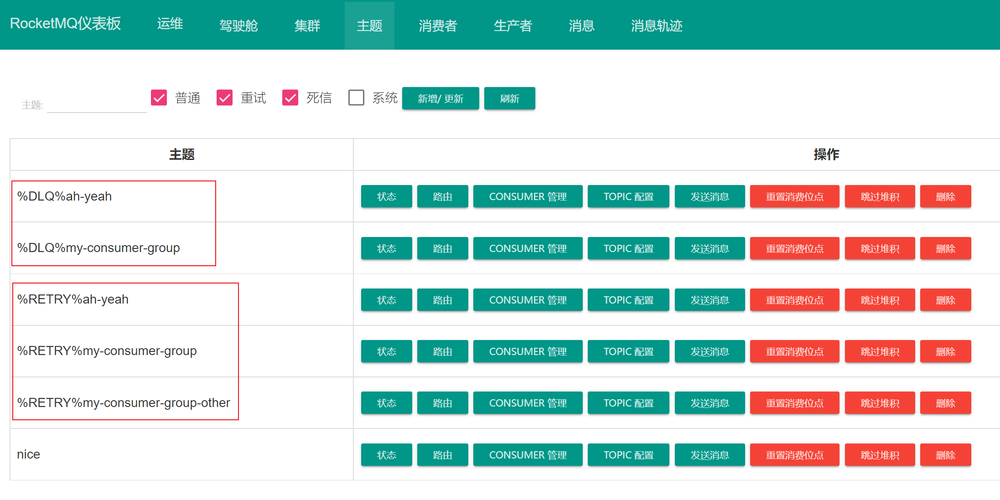

# RocketMQ

RocketMQ 是一个高性能、低延迟、高并发、高可靠开源的消息中间件。主要用于解决分布式系统中消息通信的高性能、高可靠性和异步解耦等问题

RocketMQ 是基于 Kafka 改进而来的，在很多概念、用法上都是相似的，如果对 Kafka 有过了解，会对 RocketMQ 的学习很有帮助

## 架构


<small>[架构设计](https://github.com/apache/rocketmq/blob/develop/docs/cn/architecture.md)</small>

### NameServer

NameServer 是一个非常简单的 **注册中心**，支持 Broker 的动态注册与发现，主要有两个功能

- **Broker 管理**
- **路由信息管理**

Broker 在启动时会将自己的信息注册到 NameServer，注册成功后，NameServer 中就有了 Topic 与 Broker 的映射关系

生产者和消费者会定期（默认 30 秒）从 NameServer 中获取路由列表，在收发消息时就可通过路由信息，根据 Topic 找到对应的 Broker

#### 路由信息

```java
// 路由列表，Topic 为键
private final ConcurrentMap<String, TopicPublishInfo> topicPublishInfoTable = new ConcurrentHashMap<>();
```

```java
// Topic 信息
public class TopicPublishInfo {
    private boolean orderTopic = false;
    private boolean haveTopicRouterInfo = false;
    private List<MessageQueue> messageQueueList = new ArrayList<>();
    private volatile ThreadLocalIndex sendWhichQueue = new ThreadLocalIndex();
    // 路由信息
    private TopicRouteData topicRouteData;
}
```

```java
// 路由信息
public class TopicRouteData extends RemotingSerializable {
    private String orderTopicConf;
    private List<QueueData> queueDatas;
    private List<BrokerData> brokerDatas;
    private HashMap<String/* brokerAddr */, List<String>/* Filter Server */> filterServerTable;
    //It could be null or empty
    private Map<String/*brokerName*/, TopicQueueMappingInfo> topicQueueMappingByBroker;
}
```

#### 为什么需要 NameServer

没有 NameServer，消费者和生产者直接和 Broker 通信不也行吗？也确实可以，但如果 Broker 挂掉了呢，也好解决，再找一个呗，将生产者和消费者指向新的 Broker，等一等，这不就是 NameServer 在做的事吗

另外，为了保证系统的高可用，Broker 通常是集群部署的，所需的维护工作的也大大上升的，如果仍旧是直连的状态，修改一个 Broker，就要修改对应的多个生产者和消费者

> 低耦合！低耦合！低耦合！

#### 为什么不使用 Zookeeper 作为注册中心

- Zookeeper 侧重于 **一致性**，RocketMQ 侧重于 **可用性**
- Zookeeper 相对较重，RocketMQ 不需要那么多功能，NameServer 也只需维护少量的信息
- NameServer 是无状态的，扩展性很好
- Broker 集群可以自己实现主从切换，不需要依赖其他中间件
- 引入 Zookeeper 后，还需要对其进行额外的维护

> Kafka 也放弃 Zookeeper 了

#### NameServer 的高可用

NameServer 这么重要，如果挂了，后果岂不是不可设想，如何保证 NameServer 的高可用呢？很简单，一个不行，就多部署几个 NameServer

NameServer 集群是 **去中心化** 的，意味着他没有主节点，节点之间互不通信，可以很好的进行横向扩展

- 为了保证 **高可用**，选择了 **弱一致性**

Broker 在启动时会向 **所有** NameServer 注册自己的路由信息，所以 **每一个 NameServer 实例上面都保存一份完整的路由信息**。当某个 NameServer 下线时，Broker 仍可向其他 NameServer 同步其路由信息，生产者和消费者也可动态感知 Broker 路由信息的变化

Broker 启动成功后会与 **所有** NameServer 保持着长连接，并且每个 Broker **每隔 30 秒** 会向所有 NameServer 发送心跳，报告自己的存活状态，NameServer **超过 120 秒** 没收到心跳包，就会认为该 Broker 失活，从路由表中移除该 Broker 的信息

生产者与消费者会 **随机** 与 NameServer 集群的某一个节点建立长连接，定期从 NameServer 获取路由信息

### Broker

RocketMQ 的服务节点，即 RocketMQ 服务器，主要负责 **消息的存储、投递和查询以及服务高可用保证**

#### Broker 集群

Broker 集群中的节点可分为主从两种角色，**主节点支持读和写，从节点只支持读，主节点会向从节点同步消息**

- 一个主节点可以有多个从节点，但是一个从节点只能对应一个主节点
  - 即主节点是一对多，从节点是一对一
- 生产者会与提供 Topic 服务的 Broker 的 **主节点** 建立长连接，并定时发送心跳
- 消费者者会与提供 Topic 服务的 Broker 的 **主从节点** 都建立长连接，并定时发送心跳
  - 当主节点不可用或者繁忙的时候，消费者的读请求会被 **自动切换到从节点**

一般推荐部署 2 个主节点，每个主节点配置一个从节点，即 2 主 2 从

主从节点的对应关系通过指定相同的 `brokerName`，以 `brokerId` 和 `brokerRole` 区分角色

- `brokerId`
  - `0` 表示主节点
  - 非 `0` 表示从节点
- `brokerRole`
  - `ASYNC_MASTER` 与 `SYNC_MASTER` 表示主节点
  - `SLAVE` 表示从节点

```shell
# 主节点 A
brokerName = broker-a
brokerId = 0
brokerRole = ASYNC_MASTER

# 主节点 A 的从节点
brokerName = broker-a
brokerId = 1
brokerRole = SLAVE

# 主节点 B
brokerName = broker-b
brokerId = 0
brokerRole = ASYNC_MASTER

# 主节点 B 的从节点
brokerName = broker-b
brokerId = 1
brokerRole = SLAVE
```

#### 异步复制和同步复制

生产者投递消息，消息到达 Broker 后，会返回一个投递成功或失败的响应

在主从模式下，有两种主从同步的响应策略

- 异步复制：主节点接收到消息后，就立即向生产者发送响应，并异步的向从节点同步消息
  - 消息的 **实时性好**
  - 但主从之间存在着消息延迟（毫秒级），如果在主从同步前，主节点宕机的话可能会损失少量消息
- 同步复制：或者说同步双写，主从节点同步成功，才会向生产者发送响应
  - 消息的 **可靠性高**
  - 但消息的实时性较差

可通过主节点的 `brokerRole` 进行修改

```shell
# 默认异步复制
brokerRole = ASYNC_MASTER

# 同步复制
brokerRole = ASYNC_MASTER
```

### Topic

主题是一个逻辑上的概念，RocketMQ 中的消息以主题为单位进行划分，或者通俗的来讲就是消息的分类

生产者将消息发送到特定的主题，消费者通过订阅特定的主题获得消息并消费

#### 为什么不建议开启自动创建 Topic

在使用未创建的 Topic 发送消息时，由于 NameServer 中没有该 Topic 的路由信息，所以会拉取名为 TBW102 的 Topic 获取路由信息

- 如果开启了自动创建 Topic，Broker 在启动时创建名为 TBW102 的 Topic

```java
public static final String AUTO_CREATE_TOPIC_KEY_TOPIC = "TBW102"; // Will be created at broker when isAutoCreateTopicEnable
```

- 用户指定的读写队列数可能不是预期结果。创建的 Topic 的读队列数和写队列数取值为默认 Topic（TBW102）的读队列数和Produce端设置的队列数的最小值


```java
private volatile int defaultTopicQueueNums = 4;
```

### MessageQueue

队列是 RocketMQ 中消息存储和传输的实际容器，也是最小存储单元

- 一个主题至少有一个队列
- 同一主题下的不同队列包含的消息是不同的
  - 即一条消息存在于主题内的某一个队列中
- 同一个主题下的队列可以分布在不同的 Broker 上


<small>[队列（MessageQueue） - 模型关系](https://help.aliyun.com/zh/apsaramq-for-rocketmq/cloud-message-queue-rocketmq-5-x-series/developer-reference/message-queues)</small>

> 其实也就是 Kafka 中的 Partition

#### 读队列与写队列

队列在逻辑上可分为两种，读队列和写队列，顾名思义分别用于读和写

- 建议读队列数量 >= 写队列数量，最好是数量相等
- 在物理层面，只有写队列才会创建文件
- 设置读写队列数的目的在于方便队列的动态伸缩

> 无用的小知识：创建主题设置读写队列数量时，都可以设置为 0，意味着既不能向 Topic 发送消息，也不能从中消费消息

#### 队列选择算法（消息投递算法）

对于消息该发到主题内的哪个队列中，RocketMQ 提供了两种队列的选择算法，当然你也可以通过实现 MessageQueueSelector 接口，自定义选择算法

##### 轮询

默认的选择算法，按照顺序依次向不同队列发送消息，能保证消息均匀分布

部分 Broker 可能会受限于机器性能或网络波动等原因，投递延迟会比较严重，生产者不能及时发出消息，从而导致生产者出现消息积压

##### 最小投递延迟

每次消息投递的时候会统计投递的时间延迟，在选择队列的时候会优先选择投递延迟时间小的队列，延迟相同才用轮询算法投递。可有效提升消息的投递性能

可能会导致消息分布不均匀，投递延迟小的队列可能会存在大量的消息，以致于出现消息积压的现象

```java
// 开启最小投递延迟算法
producer.setSendLatencyFaultEnable(true);
```

### Tag

可以看做子主题，可以为主题添加额外的标识

### Producer

生产者，负责生产消息

#### 发送方式

- **同步（Sync）**：发出消息后，**需等待响应结果**
  - 常用于对可靠性要求高的场景，例如重要的消息通知
- **异步（Async）**：发出消息后，**无需等待响应**，也可指定回调函数，发送成功或失败触发对应的回调函数
  - 常用于耗时较长且对响应时间敏感的场景，例如视频转码
- **单向（One-way）**：只负责发送消息，**不等待响应且没有回调函数触发**
  - 常用于对可靠性要求不高的场景，例如日志消息

```java
// 同步
SendResult sendResult = defaultMQProducer.send(msg);
System.out.println(sendResult);

// 异步
defaultMQProducer.send(msg, new SendCallback() {
    @Override
    public void onSuccess(SendResult sendResult) {
        System.out.println("成功了");
    }

    @Override
    public void onException(Throwable e) {
        System.out.println("失败了");
        System.out.println(e.getMessage());
    }
});

// 单向
defaultMQProducer.sendOneway(msg);
```

### Consumer Group

承载多个消费行为一致的消费者的负载均衡分组，通过消费者分组内初始化多个消费者实现消费性能的水平扩展以及高可用容灾

- 每个消费者都属于一个特定的消费者组，一个消费者组可以包含一个或多个消费者
- 同一条消息可以被不同消费者组消费

#### 消费模式

- 集群（CLUSTERING）：默认模式，同一条消息，只允许被组内某一个消费者消费
- 广播（BROADCASTING）：同一条消息，能被组内所有消费者消费

### Consumer

消费者，负责消费消息

#### 消费顺序

- 顺序（ORDERLY）：消费者有序的接收消息
  - 即同一时刻只能有一个消费者消费该消息
- 并行（CONCURRENTLY）：消费者可以并行的接收消息
  - 即同一时刻可以有多个消费者消费该消息

#### 推模式

RocketMQ 同时支持推模式和拉模式，而且 RocketMQ 的推模式实际上也就是披着皮的拉模式

如何通过拉模式获取消息呢？就是要主动去拿，去请求 Broker，但消费者并不知道 Broker 中何时有消息的，也就不知道何时需要去请求 Broker，所以就需要不断地请求 Broker，也就是轮询

当然，使用轮询，消息的实时性就受到请求频率和响应速度的影响，更别提如果 Broker 中没有消息，会产生大量的无效请求，白白的浪费服务器资源

为了能 **保证实时性，避免大量的无效请求**，现代消息队列系统通常都实现了 **长轮询机制**，这也是 RocketMQ 中推模式的实现


<small>[RocketMQ的push消费方式实现的太聪明了 - push消费方式源码探究](https://mp.weixin.qq.com/s/opqRf8UjI9rRW_4befWrbA)</small>

消费者每次向 Broker 发出拉取请求前，会先判断当前是否有过多的消息未被消费，如果有就等一会再去请求

- 未消费的消息数量过多
- 未消费的消息占用过大

```java
// 消息队列缓存满时，延迟执行的间隔时间
private static final long PULL_TIME_DELAY_MILLS_WHEN_CACHE_FLOW_CONTROL = 50;

// 未消费的消息数量
long cachedMessageCount = processQueue.getMsgCount().get();
// 未消费的消息大小
long cachedMessageSizeInMiB = processQueue.getMsgSize().get() / (1024 * 1024);

// 大于 1000 条
if (cachedMessageCount > defaultLitePullConsumer.getPullThresholdForQueue()) {
    scheduledThreadPoolExecutor.schedule(this, PULL_TIME_DELAY_MILLS_WHEN_CACHE_FLOW_CONTROL, TimeUnit.MILLISECONDS);
    if ((queueFlowControlTimes++ % 1000) == 0) {
        log.warn(
                "The cached message count exceeds the threshold {}, so do flow control, minOffset={}, maxOffset={}, count={}, size={} MiB, flowControlTimes={}",
                defaultLitePullConsumer.getPullThresholdForQueue(), processQueue.getMsgTreeMap().firstKey(), processQueue.getMsgTreeMap().lastKey(), cachedMessageCount, cachedMessageSizeInMiB, queueFlowControlTimes);
    }
    return;
}

// 大于 100 MB
if (cachedMessageSizeInMiB > defaultLitePullConsumer.getPullThresholdSizeForQueue()) {
    scheduledThreadPoolExecutor.schedule(this, PULL_TIME_DELAY_MILLS_WHEN_CACHE_FLOW_CONTROL, TimeUnit.MILLISECONDS);
    if ((queueFlowControlTimes++ % 1000) == 0) {
        log.warn(
                "The cached message size exceeds the threshold {} MiB, so do flow control, minOffset={}, maxOffset={}, count={}, size={} MiB, flowControlTimes={}",
                defaultLitePullConsumer.getPullThresholdSizeForQueue(), processQueue.getMsgTreeMap().firstKey(), processQueue.getMsgTreeMap().lastKey(), cachedMessageCount, cachedMessageSizeInMiB, queueFlowControlTimes);
    }
    return;
}
```

消费者发出请求后，会出现两种情况，一种是该主题内有消息，那就拿到消息并消费，并且开始下一次请求，如此循环往复

另一种是该主题内没消息，Broker 就将该次请求挂起，不终止也不返回，直到队列中有消息时或者请求超时（默认 15 秒），再将结果响应回去

```java
public class DefaultPullMessageResultHandler implements PullMessageResultHandler {

    ...

    @Override
    public RemotingCommand handle(final GetMessageResult getMessageResult,
        final RemotingCommand request,
        final PullMessageRequestHeader requestHeader,
        final Channel channel,
        final SubscriptionData subscriptionData,
        final SubscriptionGroupConfig subscriptionGroupConfig,
        final boolean brokerAllowSuspend,
        final MessageFilter messageFilter,
        RemotingCommand response,
        TopicQueueMappingContext mappingContext,
        long beginTimeMills) {
        
        ...

        switch (response.getCode()) {
            
            ...

            // 本次没有拉取到消息
            case ResponseCode.PULL_NOT_FOUND:
                final boolean hasSuspendFlag = PullSysFlag.hasSuspendFlag(requestHeader.getSysFlag());
                final long suspendTimeoutMillisLong = hasSuspendFlag ? requestHeader.getSuspendTimeoutMillis() : 0;

                // 当前 Broker 是否允许挂起，并且当前请求是否允许挂起
                if (brokerAllowSuspend && hasSuspendFlag) {
                    // 拉取请求中携带的挂起超时时间
                    // 默认为 15 秒
                    long pollingTimeMills = suspendTimeoutMillisLong;
                    // 如果没有开启长轮询（默认开启），就使用短轮询
                    // 默认为 1 秒
                    if (!this.brokerController.getBrokerConfig().isLongPollingEnable()) {
                        pollingTimeMills = this.brokerController.getBrokerConfig().getShortPollingTimeMills();
                    }

                    String topic = requestHeader.getTopic();
                    long offset = requestHeader.getQueueOffset();
                    int queueId = requestHeader.getQueueId();
                    PullRequest pullRequest = new PullRequest(request, channel, pollingTimeMills,
                        this.brokerController.getMessageStore().now(), offset, subscriptionData, messageFilter);
                    // 将当前的拉取请求加入挂起列表中
                    this.brokerController.getPullRequestHoldService().suspendPullRequest(topic, queueId, pullRequest);
                    return null;
                }

                ...

        }

        ....

}
```

```java
public class PullRequestHoldService extends ServiceThread {

    ...

    // 所有挂起请求的列表
    protected ConcurrentMap<String/* topic@queueId */, ManyPullRequest> pullRequestTable =
        new ConcurrentHashMap<>(1024);

    public void suspendPullRequest(final String topic, final int queueId, final PullRequest pullRequest) {
        String key = this.buildKey(topic, queueId);
        ManyPullRequest mpr = this.pullRequestTable.get(key);
        if (null == mpr) {
            mpr = new ManyPullRequest();
            ManyPullRequest prev = this.pullRequestTable.putIfAbsent(key, mpr);
            if (prev != null) {
                mpr = prev;
            }
        }

        pullRequest.getRequestCommand().setSuspended(true);
        mpr.addPullRequest(pullRequest);
    }

    @Override
    public void run() {
        log.info("{} service started", this.getServiceName());
        while (!this.isStopped()) {
            try {
                // 判断当前 Broker 是否支持长轮询
                // 支持长轮询就等待 5 秒，不支持就等待 1 秒
                if (this.brokerController.getBrokerConfig().isLongPollingEnable()) {
                    this.waitForRunning(5 * 1000);
                } else {
                    this.waitForRunning(this.brokerController.getBrokerConfig().getShortPollingTimeMills());
                }

                long beginLockTimestamp = this.systemClock.now();
                this.checkHoldRequest();
                long costTime = this.systemClock.now() - beginLockTimestamp;
                if (costTime > 5 * 1000) {
                    log.warn("PullRequestHoldService: check hold pull request cost {}ms", costTime);
                }
            } catch (Throwable e) {
                log.warn(this.getServiceName() + " service has exception. ", e);
            }
        }

        log.info("{} service end", this.getServiceName());
    }

    // 检查挂起的线程
    protected void checkHoldRequest() {
        for (String key : this.pullRequestTable.keySet()) {
            // topic@queueId
            String[] kArray = key.split(TOPIC_QUEUEID_SEPARATOR);
            if (2 == kArray.length) {
                String topic = kArray[0];
                int queueId = Integer.parseInt(kArray[1]);
                final long offset = this.brokerController.getMessageStore().getMaxOffsetInQueue(topic, queueId);
                try {
                    this.notifyMessageArriving(topic, queueId, offset);
                } catch (Throwable e) {
                    log.error(
                        "PullRequestHoldService: failed to check hold request failed, topic={}, queueId={}", topic,
                        queueId, e);
                }
            }
        }
    }

    public void notifyMessageArriving(final String topic, final int queueId, final long maxOffset) {
        notifyMessageArriving(topic, queueId, maxOffset, null, 0, null, null);
    }

    public void notifyMessageArriving(final String topic, final int queueId, final long maxOffset, final Long tagsCode,
        long msgStoreTime, byte[] filterBitMap, Map<String, String> properties) {
        String key = this.buildKey(topic, queueId);
        ManyPullRequest mpr = this.pullRequestTable.get(key);
        if (mpr != null) {
            List<PullRequest> requestList = mpr.cloneListAndClear();
            if (requestList != null) {
                // 需要进行回复的请求
                List<PullRequest> replayList = new ArrayList<>();

                for (PullRequest request : requestList) {
                    long newestOffset = maxOffset;
                    if (newestOffset <= request.getPullFromThisOffset()) {
                        newestOffset = this.brokerController.getMessageStore().getMaxOffsetInQueue(topic, queueId);
                    }

                    // 队列中是否有新消息
                    if (newestOffset > request.getPullFromThisOffset()) {
                        // 过滤消息
                        boolean match = request.getMessageFilter().isMatchedByConsumeQueue(tagsCode,
                            new ConsumeQueueExt.CqExtUnit(tagsCode, msgStoreTime, filterBitMap));
                        // match by bit map, need eval again when properties is not null.
                        if (match && properties != null) {
                            match = request.getMessageFilter().isMatchedByCommitLog(null, properties);
                        }

                        if (match) {
                            try {
                                // 执行请求，响应结果
                                this.brokerController.getPullMessageProcessor().executeRequestWhenWakeup(request.getClientChannel(),
                                    request.getRequestCommand());
                            } catch (Throwable e) {
                                log.error(
                                    "PullRequestHoldService#notifyMessageArriving: failed to execute request when "
                                        + "message matched, topic={}, queueId={}", topic, queueId, e);
                            }
                            continue;
                        }
                    }

                    // 如果等待超时，15 秒
                    if (System.currentTimeMillis() >= (request.getSuspendTimestamp() + request.getTimeoutMillis())) {
                        try {
                            // 执行请求，响应结果
                            this.brokerController.getPullMessageProcessor().executeRequestWhenWakeup(request.getClientChannel(),
                                request.getRequestCommand());
                        } catch (Throwable e) {
                            log.error(
                                "PullRequestHoldService#notifyMessageArriving: failed to execute request when time's "
                                    + "up, topic={}, queueId={}", topic, queueId, e);
                        }
                        continue;
                    }

                    replayList.add(request);
                }

                if (!replayList.isEmpty()) {
                    mpr.addPullRequest(replayList);
                }
            }
        }
    }

    ...

}
```

```java
public class PullMessageProcessor implements NettyRequestProcessor {

    ...

    public void executeRequestWhenWakeup(final Channel channel, final RemotingCommand request) {
        Runnable run = () -> {
            try {
                boolean brokerAllowFlowCtrSuspend = !(request.getExtFields() != null && request.getExtFields().containsKey(ColdDataPullRequestHoldService.NO_SUSPEND_KEY));
                final RemotingCommand response = PullMessageProcessor.this.processRequest(channel, request, false, brokerAllowFlowCtrSuspend);

                if (response != null) {
                    response.setOpaque(request.getOpaque());
                    response.markResponseType();
                    try {
                        NettyRemotingAbstract.writeResponse(channel, request, response, future -> {
                            if (!future.isSuccess()) {
                                LOGGER.error("processRequestWrapper response to {} failed", channel.remoteAddress(), future.cause());
                                LOGGER.error(request.toString());
                                LOGGER.error(response.toString());
                            }
                        });
                    } catch (Throwable e) {
                        LOGGER.error("processRequestWrapper process request over, but response failed", e);
                        LOGGER.error(request.toString());
                        LOGGER.error(response.toString());
                    }
                }
            } catch (RemotingCommandException e1) {
                LOGGER.error("excuteRequestWhenWakeup run", e1);
            }
        };
        this.brokerController.getPullMessageExecutor().submit(new RequestTask(run, channel, request));
    }

    ...
    
}
```

### Offset

Offset 是消息在 MessageQueue 中的唯一坐标，这个坐标被定义为 **消息位点**，每个 MessageQueue 都有自己独立的 Offset


<small>[消费进度管理 - 消费进度原理](https://help.aliyun.com/zh/apsaramq-for-rocketmq/cloud-message-queue-rocketmq-5-x-series/developer-reference/consumer-progress-management)</small>

RocketMQ 定义队列中最早一条消息的位点为 **最小消息位点（MinOffset）**，最新一条消息的位点为 **最大消息位点（MaxOffset）**

虽然消息队列逻辑上是无限存储，但由于服务端物理节点的存储空间有限，RocketMQ 会滚动删除队列中存储最早的消息。因此，消息的最小消费位点和最大消费位点会一直递增变化


<small>[消费进度管理 - 消费进度原理](https://help.aliyun.com/zh/apsaramq-for-rocketmq/cloud-message-queue-rocketmq-5-x-series/developer-reference/consumer-progress-management)</small>

#### ConsumerOffset（消费位点）

RocketMQ 中某条消息被消费后，并不会直接删除，所以也就无法通过 MinOffset 确定消费进度，于是为了保存消费进度，RocketMQ 为每个 MessageQueue 维护了一个消费位点

- 消费位点指向的 **已被消费** 的最新一条消息


<small>[消费进度管理 - 消费进度原理](https://help.aliyun.com/zh/apsaramq-for-rocketmq/cloud-message-queue-rocketmq-5-x-series/developer-reference/consumer-progress-management)</small>

#### 消费者提交进度

在广播消费模式消费者不会提交消费进度给到 Broker，仅会持久化到本地磁盘

在集群消费模式下，消费者消费完消息后，会将消费进度提交给 Broker，也就是让 Broker 去更新 ConsumerOffset

- 消费者提交的消费进度是以消费者组为单位的

## 延迟消息

消息被发送以后，并不想让消费者立刻获取，而是等待特定的时间后，消费者才能获取这个消息

```java
Message msg = new Message(topic, message.getBytes());
// 延时 1 秒
msg.setDelayTimeSec(1);
// 延时 1 毫秒
msg.setDelayTimeMs(1);
// 延时级别
msg.setDelayTimeLevel(1);
```


<small>[延迟消息发送 - 延时消息约束](https://rocketmq.apache.org/zh/docs/4.x/producer/04message3/)</small>

## 事务消息

事务消息是一种确保消息在分布式系统中被完整发送或完全失败的消息传递机制。在普通消息基础上，将二阶段提交和本地事务绑定，保证本地事务与消息生产的最终一致性，特别适用于关键业务场景，如订单处理、支付操作等

### 工作流程


<small>[事务消息 - 交互流程](https://help.aliyun.com/zh/apsaramq-for-rocketmq/cloud-message-queue-rocketmq-5-x-series/developer-reference/transactional-messages)</small>

1. 生产者向 Broker 发送半事务消息（暂不能进行投递的消息）
2. Broker 收到消息返回确认信息，此时消息被标记为暂不能投递
3. 生产者执行本地事务
4. 生产者根据本地事务的执行结果，向 Broker 发送二次确认结果
    - Commit：Broker 将半事务消息标记为可投递，并投递给消费者
    - Rollback：Broker 则会丢弃半事务消息
5. 在异常情况（断网等）下，Broker 长时间未收到生产者发送的二次确认信息，或者收到的二次确认结果为 Unknown 状态，经过固定时间后，Broker 会向生产者发起消息回查，默认最多尝试 15 次，间隔 30 秒，超过次数就会丢弃本次事务消息
6. 生产者收到回查请求，检查本地事务的执行状态
7. 生产者根据本地事务的执行状态，再次发送二次确认结果，Broker 按照步骤 4 处理，以此类推

```java
public class BrokerConfig extends BrokerIdentity {
    ...

    // 默认触发回查的最短时间间隔
    private long transactionTimeOut = 6 * 1000;

    /**
     * The maximum number of times the message was checked, if exceed this value, this message will be discarded.
     */
    // 默认最大回查次数
    private int transactionCheckMax = 15;

    // 默认回查间隔时间
    private long transactionCheckInterval = 30 * 1000;

    ...
}
```

### 简单使用

```java
@Component
public class TransactionProducer implements ApplicationRunner {

    @Value("${rocketmq.name-server}")
    private String nameServer;

    @Value("${rocketmq.producer.group}")
    private String producerGroup;

    private final TransactionMQProducer transactionMQProducer = new TransactionMQProducer();

    // 需要添加一个线程池，用来检查本地事务状态
    ExecutorService executorService = new ThreadPoolExecutor(2, 5, 100, TimeUnit.SECONDS, new ArrayBlockingQueue<Runnable>(2000));

    public void init() throws MQClientException {
        transactionMQProducer.setProducerGroup(producerGroup);
        transactionMQProducer.setNamesrvAddr(nameServer);
        // 添加事务监听器
        transactionMQProducer.setTransactionListener(new TestListener());
        // 添加检查本地事务状态的线程池
        transactionMQProducer.setExecutorService(executorService);
        transactionMQProducer.start();
        System.out.println("启动");
    }

    public void send(String topic, String message) throws MQClientException {
        Message msg = new Message(topic, message.getBytes());
        // 发送事务消息
        TransactionSendResult sendResult = transactionMQProducer.sendMessageInTransaction(msg, null);
        System.out.println(sendResult);
    }

    @Override
    public void run(ApplicationArguments args) throws Exception {
        init();
    }
}
```

```java
public class TestListener implements TransactionListener {

    // 执行本地事务
    @Override
    public LocalTransactionState executeLocalTransaction(Message msg, Object arg) {
        System.out.println("executeLocalTransaction");
        System.out.println(new String(msg.getBody()));
        System.out.println(arg);
        return LocalTransactionState.UNKNOW;
    }

    // 检查本地事务状态
    @Override
    public LocalTransactionState checkLocalTransaction(MessageExt msg) {
        System.out.println("checkLocalTransaction");
        System.out.println(msg);
        System.out.println(new String(msg.getBody()));
        LocalTransactionState state = this.getState();
        System.out.println(state);
        return state;
    }

    // 模拟本地事务
    private LocalTransactionState getState() {
        int i = RandomUtil.randomInt(6);
        switch (i) {
            case 0:
                return LocalTransactionState.COMMIT_MESSAGE;
            case 1:
                return LocalTransactionState.ROLLBACK_MESSAGE;
        }
        return LocalTransactionState.UNKNOW;
    }
}
```

## 高性能

### 批量发送消息

RocketMQ 支持批量发送消息，可以减少网络通信次数，提高传输效率

- 每条消息的 Topic 必须都得是一样的
- 不支持延迟消息和事务消息
- 不论是普通消息还是批量消息，默认总大小不能超过 4 M

### 消息压缩

RocketMQ 在发送消息，发现消息大小超过 4 K，就会对消息进行压缩，减少存储空间占用，减轻网络传输的压力，但压缩和解压都需要消耗 CPU 资源

- 批量消息不会被压缩

Broker 收到压缩后的消息，并不会直接解压，而是直接将压缩消息刷新到磁盘上，消费者获取到消息才会进行解压，也就是说在生产者压缩，在消费者解压

### 高性能网络通信模型

RocketMQ 的 RPC 通信采用 Netty 组件作为底层通信库，遵循了 Reactor 多线程模型，同时又在这之上做了一些扩展和优化

### 零拷贝（Zero-Copy）

零拷贝是一种高效的数据传输技术，它可以将数据从内核空间直接传输到应用程序的内存空间中

传统的数据传输过程通常需要经历多次内存拷贝。首先，从磁盘读取数据，然后将数据从内核空间拷贝到用户空间，再从用户空间拷贝到应用程序的内存中。这些额外的拷贝会消耗大量的 CPU 资源和内存带宽，降低数据传输的效率。零拷贝就是为了避免这些不必要的数据拷贝，能够将数据直接传输到目标内存区域，以提高数据传输的效率

RocketMQ 使用到了 mmap 和 sendfile 的方式来实现零拷贝

### 顺序写

RocketMQ 会将消息按照顺序一条一条地写入文件中，减少了磁头的移动和寻道时间，顺序写比随机写的性能会高很多

- 使用 SSD 的话，顺序写与随机写差距就不是很大了

### 异步处理

RocketMQ 在处理消息时，会采用一些异步操作来优化操作时间，例如异步刷盘、异步主从复制

## 存储机制

消息到达 Broker，会先存放在内存中，然后再根据刷盘策略（同步或异步）刷到磁盘中

RocketMQ 消息被存储在 `/root/store` 目录中，Windows 为 `C:\Users\用户\store`


消息存储架构主要由三个文件组成

### CommitLog

消息主体以及元数据的存储主体


- 默认单个文件大小为固定的 1 G
- 文件名长度为 20 位，左边补零，剩余为起始偏移量
  - 1 G 的大小为 1073741824 字节，所以第二个文件名为 `00000000001073741824`，以此类推
- 消息主要是顺序写入日志文件，当文件满了，写入下一个文件

### ConsumeQueue

消息消费索引，引入的目的主要是提高消息消费的性能

RocketMQ 采用的是基于主题的订阅模式，消息消费是针对主题进行的，如果要以遍历的方式，从 CommitLog 文件中查找特定主题的消息是非常低效的


<small>[设计(design) - 1 消息存储](https://github.com/apache/rocketmq/blob/develop/docs/cn/design.md)</small>

消费者可根据 ConsumeQueue 来查找待消费的消息，ConsumeQueue 作为消费消息的索引，保存了指定主题下的队列消息在 CommitLog 中的相关信息

- commitLogOffset：起始物理偏移量 offset
- msgSize：消息大小
- tagsCode：消息 Tag 的 HashCode 值

ConsumeQueue 文件可以看成是基于 Topic 的 CommitLog 索引文件，所以 ConsumeQueue 文件在 `store/consumequeue` 是以 `{topic}/{queueId}/{fileName}` 三层组织结构存储的


ConsumeQueue 中每个条目为固定的 20 字节

- commitLogOffset：8 字节
- msgSize：4 字节
- tagsCode: 8 字节

单个文件由 30 万个条目组成，可以像数组一样随机访问每一个条目，每个 ConsumeQueue 文件大小为固定的 600 万字节，也就是 5.72 M

### IndexFile

索引文件，提供了一种可以通过 key 或时间区间来查询消息的方法，存储在 `store/index` 中


文件名以创建时的时间戳命名，每个文件为固定的 400 M，可以保存 2000 万个索引

- IndexFile 的底层存储设计为在文件系统中实现 HashMap 结构，所以 RocketMQ 的索引文件底层实现为哈希索引

## 死信队列（DLQ，Dead-Letter Queue）

由于某些原因消息无法被正确地投递，为了确保消息不会被无故地丢弃，一般会将其放入死信队列。后续就可以通过查看死信队列中的内容，来分析当时遇到的异常情况，进而可以改善和优化系统


<small>[死信消息 - 死信策略](https://help.aliyun.com/zh/apsaramq-for-rocketmq/cloud-message-queue-rocketmq-5-x-series/developer-reference/dead-letter-messages)</small>

在 RocketMQ 中消息消费失败，会被加入到重试队列中，默认重试 16 次后，就会被加入到死信队列，无法再被消费了


<small>[消费重试 - 重试间隔时间](https://help.aliyun.com/zh/apsaramq-for-rocketmq/cloud-message-queue-rocketmq-5-x-series/developer-reference/consumption-retries)</small>

可通过 RocketMQ 的控制台进行死信队列相关的查询和处理



- 死信队列以 `%DLQ%` 开头，拼接上消费者组
- 重试队列以 `%RETRY%` 开头，拼接上消费者组

## 参考

- [架构设计](https://github.com/apache/rocketmq/blob/develop/docs/cn/architecture.md)
- [设计(design)](https://github.com/apache/rocketmq/blob/develop/docs/cn/design.md)
- [RocketMQ常见问题总结](https://javaguide.cn/high-performance/message-queue/rocketmq-questions.html)
- [[万字长文]RocketMQ介绍及基本概念](https://mp.weixin.qq.com/s/IBlTQeRevtYLoV4_bc7xgg)
- [面渣逆袭：RocketMQ二十三问](https://mp.weixin.qq.com/s/IvBt3tB_IWZgPjKv5WGS4A)
- [一万字带你吃透RocketMQ](https://mp.weixin.qq.com/s/VzLsLuHVFYwapCuPBfPTVg)
- [RocketMQ的push消费方式实现的太聪明了](https://mp.weixin.qq.com/s/opqRf8UjI9rRW_4befWrbA)
- [面试官再问我如何保证 RocketMQ 不丢失消息,这回我笑了！](https://www.cnblogs.com/goodAndyxublog/p/12563813.html)
- [【阅读笔记】rocketmq 特性实现 —— 拉取消息长轮询](https://miludeer.github.io/2019/06/07/source-note-rocket-mq-features-long-polling/)
- [队列（MessageQueue）](https://help.aliyun.com/zh/apsaramq-for-rocketmq/cloud-message-queue-rocketmq-5-x-series/developer-reference/message-queues)
- [消费进度管理](https://help.aliyun.com/zh/apsaramq-for-rocketmq/cloud-message-queue-rocketmq-5-x-series/developer-reference/consumer-progress-management)
- [消息积压的处理](https://www.cnblogs.com/chjxbt/p/11434240.html)
- [线上消息队列发生积压，如何快速解决？](https://juejin.cn/post/7327124869921636367)
- [MQ消息积压处理方案](https://www.cnblogs.com/yangyongjie/p/17644874.html)
- [消息消费失败如何处理？](https://www.51cto.com/article/647598.html)
- [面试必考：怎样解决线上消息队列积压问题](https://mp.weixin.qq.com/s/w5z25rKxFXOnqakOm2zgMw)
- [事务消息](https://help.aliyun.com/zh/apsaramq-for-rocketmq/cloud-message-queue-rocketmq-5-x-series/developer-reference/transactional-messages)
- [ROCKETMQ的事务消息详解](https://www.ryujung.com/?p=214)
- [关于 RocketMQ 事务消息的正确打开方式 → 你学废了吗](https://www.cnblogs.com/youzhibing/p/15354713.html)
- [顺序消息](https://help.aliyun.com/zh/apsaramq-for-rocketmq/cloud-message-queue-rocketmq-5-x-series/developer-reference/ordered-messages-1)
- [五张图告诉你 RocketMQ 为什么不使用 Zookeeper 做注册中心](https://www.51cto.com/article/715307.html)
- [RocketMQ为什么这么快？我从源码中扒出了10大原因！](https://mp.weixin.qq.com/s/y1-A-SHAkGdg9IOTeUtPxg)
