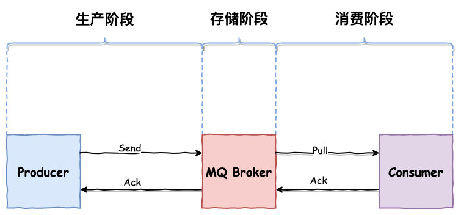

# RocketMQ

RocketMQ 是一个高性能、低延迟、高并发、高可靠开源的消息中间件。主要用于解决分布式系统中消息通信的高性能、高可靠性和异步解耦等问题

RocketMQ 是基于 Kafka 改进而来的，很多概念、用法都是相似的，了解其中某一个，都对另一个的学习有很大帮助

## 架构


<small>[RocketMQ保姆级教程 - 工作流程](https://mp.weixin.qq.com/s/4h6VoywgZgnrxMBx-rqCLg)</small>

### NameServer

NameServer 是一个无状态的服务器，主要用来管理 Broker 和路由信息，其实就是一个注册中心

Broker 在启动时会将自己的信息注册到 NameServer，生产者和消费者会定期从 NameServer 中获取 Broker 的路由信息，在收发消息时就可通过路由信息找到对应的 Broker

#### 为什么需要 NameServer

没有 NameServer，消费者和生产者直接和 Broker 通信不也行吗？也确实可以，但如果 Broker 挂掉了呢，也好解决，再找一个呗，将生产者和消费者指向新的 Broker，等一等，这不就是 NameServer 在做的事吗

另外，为了保证系统的高可用，系统中可能会有多个 Broker，维护工作的复杂程度也大大上升的，如果仍旧是直连的状态，修改一个 Broker，就要修改对应的多个生产者和消费者，累不累啊

#### 高可用

NameServer 这么重要，如果挂了，后果岂不是不可设想，如何保证 NameServer 的高可用呢？很简单，一个不行，就多部署几个 NameServer

NameServer 集群是 **去中心化** 的，意味着他没有主节点，节点之间互不通信，可以很好的进行横向扩展

每个 Broker 都与所有的 NameServer 保持着长连接，并且每个 Broker 每隔 30 秒会向所有 NameServer 发送心跳，报告自己的存活状态，NameServer 超过 120 秒没收到心跳包，就会认为该 Broker 失活，从路由表中移除该 Broker 的信息

- 为了保证高可用，而选择了弱一致性

### Broker

RocketMQ 的服务节点，即 RocketMQ 服务器

主要负责消息的存储、投递和查询以及服务高可用保证

### Producer

生产者，负责生产消息

#### 发送方式

注意发送消息指的是生产者发送消息到 Broker，而不是生产者发送消息到生产者

- 同步（Sync）：发出消息后，需等待响应结果
  - 一般用于重要通知消息
- 异步（Async）：发出消息后，无需等待响应，也可指定回调函数，发送成功或失败触发对应的回调函数
  - 一般用于耗时较长且对响应时间敏感的场景
- 单向（One-way）：只负责发送消息，不等待响应且没有回调函数触发
  - 常用于对可靠性要求不高的场景

### Consumer Group

承载多个消费行为一致的消费者的负载均衡分组，通过消费者分组内初始化多个消费者实现消费性能的水平扩展以及高可用容灾

每个消费者都属于一个特定的消费者组，一个消费者组可以包含一个或多个消费者

- 同一条消息可以被不同消费者组消费
- 在同一个消费者组中，一条消息只能由组内的某一个消费者进行消费

### Consumer

消费者，负责消费消息

### Topic

主题是一个逻辑上的概念，RocketMQ 中的消息以主题为单位进行划分

生产者将消息发送到特定的主题，消费者通过订阅特定的主题获得消息并消费

### MessageQueue

- 一个主题可以有一个或多个队列
- 同一主题下的不同队列包含的消息是不同的
- 同一个主题下的队列可以分布在不同的 Broker 上


<small>[队列（MessageQueue）](https://rocketmq.apache.org/zh/docs/domainModel/03messagequeue)</small>

> 其实也就是 Kafka 中的 Partition

### Tag

可以看做子主题，可以为主题添加额外的标识

## Offset

每条消息在队列中都有一个唯一的坐标，这个坐标


## 消息模式

- 集群（CLUSTERING）：默认模式，同一条消息，只允许被组内某一个消费者消费
- 广播（BROADCASTING）：同一条消息，能被组内所有消费者消费

## 消费模式（消费顺序）

- 顺序（ORDERLY）：消费者有序的接收消息
  - 即同一时刻只能有一个消费者消费该消息
- 并行（CONCURRENTLY）：消费者可以并行的接收消息
  - 即同一时刻可以有多个消费者消费该消息

## 推拉模式

RocketMQ 同时支持推模式和拉模式，而且 RocketMQ 的推模式实际上也就是披着皮的拉模式

如何通过拉模式获取消息呢？很容易想到的就是去请求 Broker，但消费者是不知道 Broker 中何时有消息的，也就不知道何时需要去请求 Broker。所以就需要不断地请求 Broker，也就是轮询，当 Broker 中有消息的时候，消费者的下次请求就能获取到该消息

当然，使用轮询，消息的实时性就收到请求频率和响应速度的影响，更别提如果 Broker 中没有消息，会产生大量的无效请求，白白的浪费服务器资源

为了能保证实时性，避免大量的无效请求，现代消息队列系统通常都实现了 **长轮询机制**，这也是 RocketMQ 中推模式的实现


<small>[RocketMQ的push消费方式实现的太聪明了 - push消费方式源码探究](https://mp.weixin.qq.com/s/opqRf8UjI9rRW_4befWrbA)</small>

首先每次要请求时，都会先判断当前消费者是否有过多的消息未被消费，如果有就等一会再去请求

- 未消费的消息数量过多
- 未消费的消息占用过大

消费者每次发起请求，会出现两种情况，一种是队列中有消息，那就拿到消息并消费，并且开始下一次请求，如此循环往复；另一种呢是队列中没消息，队列就将该次请求保持住，不终止也不返回，等到队列中有消息时，再通过该请求返回回去

## 消息丢失

一条消息从生产到消费会经历 3 个阶段



<small>[面试官再问我如何保证 RocketMQ 不丢失消息,这回我笑了！ - 0x00. 消息的发送流程](https://www.cnblogs.com/goodAndyxublog/p/12563813.html)</small>

### 生产阶段

消息从生产者到 Broker

如果消息发送过程中出现网络故障等情况，就会导致消息丢失

要保证该阶段的消息不丢失，只需添加请求确认机制。只要发送成功，就返回响应信息，异步发送也可在回调函数中检查，发送失败或超时，生产者可以重试发送消息，建议重试次数不要过多

```java
// 同步发送，重试次数，默认为 2
defaultMQProducer.setRetryTimesWhenSendFailed(2);

Message msg = new Message(topic, message.getBytes());
SendResult sendResult = defaultMQProducer.send(msg);
```

```java
// 异步发送，重试次数，默认为 2
defaultMQProducer.setRetryTimesWhenSendAsyncFailed(2);

Message msg = new Message(topic, message.getBytes());
defaultMQProducer.send(msg, new SendCallback() {
    @Override
    public void onSuccess(SendResult sendResult) {
        System.out.println("成功了");
    }

    @Override
    public void onException(Throwable e) {
        System.out.println("失败了");
        System.out.println(e.getMessage());
    }
});
```

### 存储阶段

消息到达 Broker，会先存放在内存中，然后立刻返回确认响应给生产者，并定期将一批消息刷到磁盘中

如果 Broker 还未将消息刷入到磁盘，这时发生了机器故障或 Broker 挂掉等情况，就会导致消息丢失

要保证该阶段的消息不丢失，可以修改 Broker 的刷盘机制，将异步刷盘（ASYNC_FLUSH）修改为同步刷盘（SYNC_FLUSH）。只有刷盘成功才会向生产者发送确认响应

```shell
# broker.conf
flushDiskType = SYNC_FLUSH
```

为了保证 Broker 的高可用，通常会部署一个主从架构的 Broker 集群，这时就又分成两种情况

- 主节点接收到消息就返回确认响应，再将消息异步复制到从节点
  - 主节点宕机，且未成功刷盘，可能会损失少量消息，性能较好，实时性几乎不受影响
- 主从节点都接收到消息才返回确认响应
  - 可靠性更高，但性能较差，消息的延迟也会增加

```shell
# 主节点的 broker.conf 开启同步复制，默认为 ASYNC_MASTER
brokerRole = SYNC_MASTER
```

### 消费阶段

消费者从 Broker 中拉取消息

如果消息接收过程中出现网络故障等情况，或者消费时发生了异常，就会导致消息丢失

要保证该阶段的消息不丢失，与生成阶段类似的，只需添加消费确认机制。接收到消息后不立即返回确认响应，只有消费成功才会发送确认响应

```java
consumer.registerMessageListener((MessageListenerConcurrently) (msg, context) -> {
    for (MessageExt messageExt : msg) {
        if ("SUCCESS".equals(new String(messageExt.getBody()))) {
            // 消费成功
            return ConsumeConcurrentlyStatus.CONSUME_SUCCESS;
        }
    }

    // 消费失败
    return ConsumeConcurrentlyStatus.RECONSUME_LATER;
});
```

- 注意要在代码逻辑中限制重试次数

## 重复消费

## 顺序消费

## 消息堆积

## 延迟消息

## 事务消息

## 消息过滤

## 限流

## 参考

- [RocketMQ常见问题总结](https://javaguide.cn/high-performance/message-queue/rocketmq-questions.html)
- [[万字长文]RocketMQ介绍及基本概念](https://mp.weixin.qq.com/s/IBlTQeRevtYLoV4_bc7xgg)
- [面渣逆袭：RocketMQ二十三问](https://mp.weixin.qq.com/s/IvBt3tB_IWZgPjKv5WGS4A)
- [一万字带你吃透RocketMQ](https://mp.weixin.qq.com/s/VzLsLuHVFYwapCuPBfPTVg)
- [RocketMQ的push消费方式实现的太聪明了](https://mp.weixin.qq.com/s/opqRf8UjI9rRW_4befWrbA)
- [面试官再问我如何保证 RocketMQ 不丢失消息,这回我笑了！](https://www.cnblogs.com/goodAndyxublog/p/12563813.html)
- []()
