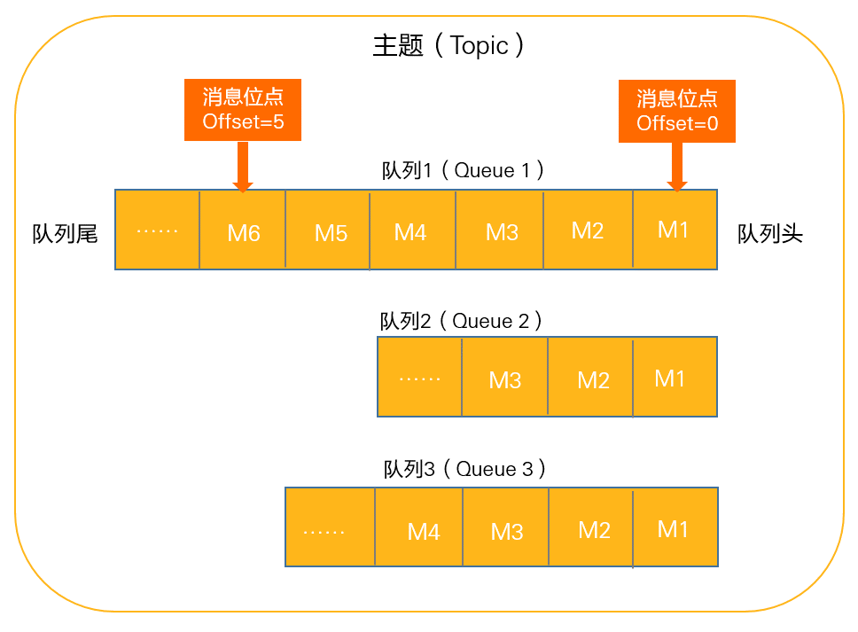
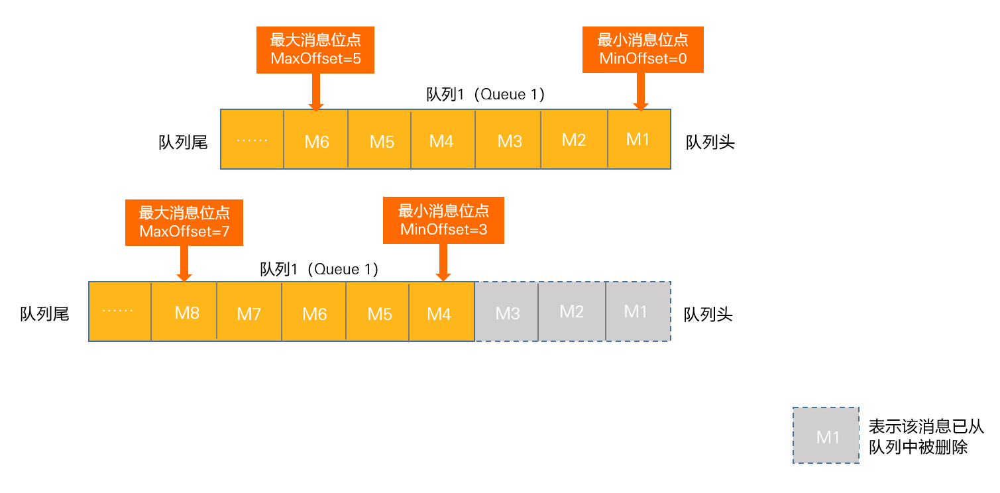
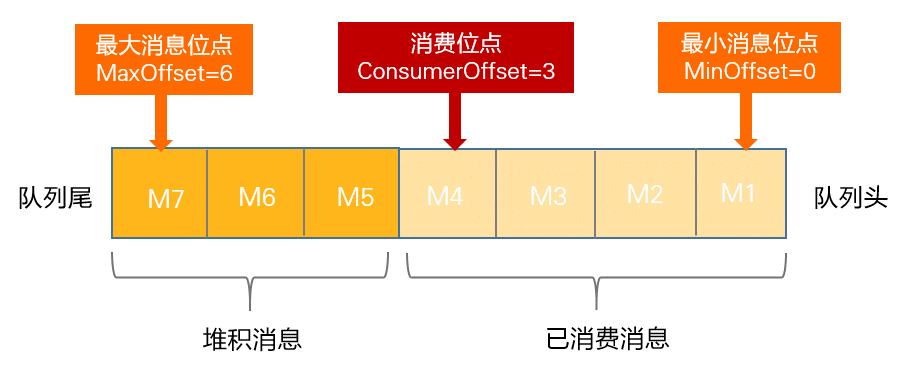

# RocketMQ 概述

RocketMQ 是一个高性能、低延迟、高并发、高可靠开源的消息中间件。主要用于解决分布式系统中消息通信的高性能、高可靠性和异步解耦等问题

RocketMQ 是基于 Kafka 改进而来的，在很多概念、用法上都是相似的，如果对 Kafka 有过了解，会对 RocketMQ 的学习很有帮助

## 架构


<small>[架构设计](https://github.com/apache/rocketmq/blob/develop/docs/cn/architecture.md)</small>

## NameServer

NameServer 其实就是一个非常简单的 **注册中心**，支持 Broker 的动态注册与发现，主要有两个功能

- **Broker 管理**
- **路由信息管理**

Broker 在启动时会将自己的信息注册到 NameServer，注册成功后，NameServer 中就有了 Topic 与 Broker 的映射关系

生产者和消费者会定期（默认 30 秒）从 NameServer 中获取路由列表，在收发消息时就可通过路由信息，根据 Topic 找到对应的 Broker

### 路由信息

```java
// 路由列表，Topic 为键
private final ConcurrentMap<String, TopicPublishInfo> topicPublishInfoTable = new ConcurrentHashMap<>();
```

```java
// Topic 信息
public class TopicPublishInfo {
    private boolean orderTopic = false;
    private boolean haveTopicRouterInfo = false;
    private List<MessageQueue> messageQueueList = new ArrayList<>();
    private volatile ThreadLocalIndex sendWhichQueue = new ThreadLocalIndex();
    // 路由信息
    private TopicRouteData topicRouteData;
}
```

```java
// 路由信息
public class TopicRouteData extends RemotingSerializable {
    private String orderTopicConf;
    private List<QueueData> queueDatas;
    private List<BrokerData> brokerDatas;
    private HashMap<String/* brokerAddr */, List<String>/* Filter Server */> filterServerTable;
    //It could be null or empty
    private Map<String/*brokerName*/, TopicQueueMappingInfo> topicQueueMappingByBroker;
}
```

### 为什么需要 NameServer

没有 NameServer，消费者和生产者直接和 Broker 通信不也行吗？也确实可以，但如果 Broker 挂掉了呢，也好解决，再找一个呗，将生产者和消费者指向新的 Broker，等一等，这不就是 NameServer 在做的事吗

另外，为了保证系统的高可用，Broker 通常是集群部署的，所需的维护工作的也大大上升的，如果仍旧是直连的状态，修改一个 Broker，就要修改对应的多个生产者和消费者

> 低耦合！低耦合！低耦合！

### 为什么不使用 Zookeeper 作为注册中心

- Zookeeper 侧重于 **一致性**，RocketMQ 侧重于 **可用性**
- Zookeeper 相对较重，RocketMQ 不需要那么多功能，NameServer 也只需维护少量的信息
- NameServer 是无状态的，扩展性很好
- Broker 集群可以自己实现主从切换，不需要依赖其他中间件
- 引入 Zookeeper 后，还需要对其进行额外的维护

> Kafka 也已经抛弃 Zookeeper 了

### NameServer 的高可用

NameServer 这么重要，如果挂了，后果岂不是不可设想，如何保证 NameServer 的高可用呢？很简单，一个不行，就多部署几个 NameServer

NameServer 集群是 **去中心化** 的，意味着他没有主节点，节点之间互不通信，可以很好的进行横向扩展

- 为了保证 **高可用**，选择了 **弱一致性**

Broker 在启动时会向 **所有** NameServer 注册自己的路由信息，所以 **每一个 NameServer 实例上面都保存一份完整的路由信息**。当某个 NameServer 下线时，Broker 仍可向其他 NameServer 同步其路由信息，生产者和消费者也可动态感知 Broker 路由信息的变化

Broker 启动成功后会与 **所有** NameServer 保持着长连接，并且每个 Broker **每隔 30 秒** 会向所有 NameServer 发送心跳，报告自己的存活状态，NameServer **超过 120 秒** 没收到心跳包，就会认为该 Broker 失活，从路由表中移除该 Broker 的信息

生产者与消费者会 **随机** 与 NameServer 集群的某一个节点建立长连接，定期从 NameServer 获取路由信息，收发消息时就可通过路由信息，查找到目标 Topic 分布在哪些 Broker 上，并与这些 Broker 建立长连接，开始发送或消费消息

## Broker

RocketMQ 的服务节点，即 RocketMQ 服务器，主要负责 **消息的存储、投递和查询以及服务高可用保证**

### Broker 集群

Broker 集群中的节点可分为主从两种角色，**主节点支持读和写，从节点只支持读，主节点会向从节点同步消息**

- 一个主节点可以有多个从节点，但是一个从节点只能对应一个主节点
  - 即主节点是一对多，从节点是一对一
- 生产者会与提供 Topic 服务的 Broker 的 **主节点** 建立长连接，并定时发送心跳
- 消费者者会与提供 Topic 服务的 Broker 的 **主从节点** 都建立长连接，并定时发送心跳
  - 当主节点不可用或者繁忙的时候，消费者的读请求会被 **自动切换到从节点**

一般推荐部署 2 个主节点，每个主节点配置一个从节点，即 2 主 2 从

主从节点的对应关系通过指定相同的 `brokerName`，以 `brokerId` 和 `brokerRole` 区分角色

- `brokerId`
  - `0` 表示主节点
  - 非 `0` 表示从节点
- `brokerRole`
  - `ASYNC_MASTER` 与 `SYNC_MASTER` 表示主节点
  - `SLAVE` 表示从节点

```shell
# 主节点 A
brokerName = broker-a
brokerId = 0
brokerRole = ASYNC_MASTER

# 主节点 A 的从节点
brokerName = broker-a
brokerId = 1
brokerRole = SLAVE

# 主节点 B
brokerName = broker-b
brokerId = 0
brokerRole = ASYNC_MASTER

# 主节点 B 的从节点
brokerName = broker-b
brokerId = 1
brokerRole = SLAVE
```

### 异步复制和同步复制

生产者投递消息，消息到达 Broker 后，会返回一个投递成功或失败的响应

在主从模式下，有两种主从同步的响应策略

- 异步复制：主节点接收到消息后，就立即向生产者发送响应，并异步的向从节点同步消息
  - 消息的 **实时性好**
  - 但主从之间存在着消息延迟（毫秒级），如果在主从同步前，主节点宕机的话可能会损失少量消息
- 同步复制：或者说同步双写，主从节点同步成功，才会向生产者发送响应
  - 消息的 **可靠性高**
  - 但性能较差，消息的延迟也会增加

可通过主节点的 `brokerRole` 进行修改

```shell
# 默认异步复制
brokerRole = ASYNC_MASTER

# 同步复制
brokerRole = SYNC_MASTER
```

## Topic

主题是一个逻辑上的概念，RocketMQ 中的消息以主题为单位进行划分，或者通俗的来讲就是消息的分类

生产者将消息发送到特定的主题，消费者通过订阅特定的主题获得消息并消费

## MessageQueue

队列是 RocketMQ 中消息存储和传输的实际容器，也是最小存储单元

- 一个主题至少有一个队列
- 同一主题下的不同队列包含的消息是不同的
  - 即一条消息只存在于主题内的某一个队列中
- 同一个主题下的队列可以分布在不同的 Broker 上


<small>[队列（MessageQueue） - 模型关系](https://help.aliyun.com/zh/apsaramq-for-rocketmq/cloud-message-queue-rocketmq-5-x-series/developer-reference/message-queues)</small>

> 其实也就是 Kafka 中的 Partition

### 队列选择算法（消息投递算法）

对于消息该发到主题内的哪个队列中，RocketMQ 提供了两种队列的选择算法，当然你也可以通过实现 MessageQueueSelector 接口，自定义选择算法

#### 轮询

默认的选择算法，按照顺序依次向不同队列发送消息，能保证 **消息均匀分布**

部分 Broker 可能会受限于机器性能或网络波动等原因，投递延迟会比较严重，生产者不能及时发出消息，从而导致生产者出现消息积压

#### 最小投递延迟

每次消息投递的时候会统计投递的时间延迟，在选择队列的时候会优先选择投递延迟时间小的队列，延迟相同再用轮询算法投递，可 **有效提升消息的投递性能**

可能会导致消息分布不均匀，投递延迟小的队列可能会存在大量的消息，以致于出现消息积压的现象

```java
// 开启最小投递延迟算法
producer.setSendLatencyFaultEnable(true);
```

### 读队列与写队列

队列在 **逻辑** 上可分为两种，读队列和写队列，顾名思义分别用于读和写

- 建议读队列数量 >= 写队列数量，最好是 **数量相等**
- 在物理层面，**只有写队列才会创建文件**
  - 所以读写队列只是一个队列的两种表现形式
- 设置读写队列数的目的在于方便队列的动态伸缩

> 无用的小知识：创建主题设置队列数量时，可以将读写队列的数量设置为 0，意味着既不能对该主题执行写操作，也不能对该主题执行读操作，就是玩

#### 如果读写队列数量不相等

首先我们要知道生产者在投递时，只会在写队列中选择一个进行投递，消费时是按消费者组为单位进行消费的，消费者组会读取所有的读队列上的消息，并从组内选择一个消费者进行消费

- 一个消费者可以对应多个读队列，但一个读队列只能对应一个消费者

假设某个主题内有 4 个写队列，编号 0、1、2、3，读队列的数量为 3，消费者在消费时，只会从这 4 个队列中读取其中 3 个队列的消息，意味着总会有一个队列的消息没有被读取到，如果生产者刚好将消息发给了这个队列，那么这些消息就无法被消费了

如果读队列的数量为 5 呢，因为只有写队列才会创建文件，所以实际上还是只有 4 个队列中有消息，有一个读队列是始终没消息的

- 读队列数 > 写队列数：某些读队列读取不到任何消息
- 读队列数 < 写队列数：可能会导致部分消息未被消费

### 读写权限

在主题中有一个 perm 属性，可以控制主题内所有队列的读写权限

- 6：允许读写
- 4：只读
- 2：只写
- 0：不可读写

## Tag

为消息设置的标志，用于同一主题下区分不同类型的消息

## Producer

生产者，负责生产消息

### 发送方式

- **同步（Sync）**：发出消息后，**需等待响应结果**
  - 常用于对可靠性要求高的场景，例如重要的消息通知
- **异步（Async）**：发出消息后，**无需等待响应**，也可指定回调函数，发送成功或失败触发对应的回调函数
  - 常用于耗时较长且对响应时间敏感的场景，例如视频转码
- **单向（One-way）**：只负责发送消息，**不等待响应且没有回调函数触发**
  - 常用于对可靠性要求不高的场景，例如日志消息

```java
// 同步
SendResult sendResult = defaultMQProducer.send(msg);
System.out.println(sendResult);

// 异步
defaultMQProducer.send(msg, new SendCallback() {
    @Override
    public void onSuccess(SendResult sendResult) {
        System.out.println("成功了");
    }

    @Override
    public void onException(Throwable e) {
        System.out.println("失败了");
        System.out.println(e.getMessage());
    }
});

// 单向
defaultMQProducer.sendOneway(msg);
```

## Consumer Group

承载多个消费行为一致的消费者的负载均衡分组，通过消费者分组内初始化多个消费者实现消费性能的水平扩展以及高可用容灾

- 每个消费者都属于一个特定的消费者组，一个消费者组可以包含一个或多个消费者
- 同一条消息可以被不同消费者组消费

同一个消费者组下所有消费者实例所订阅的 Topic、Tag 必须完全一致。如果订阅关系不一致，会导致消费消息紊乱，甚至消息丢失

### 消费模式

- 集群（CLUSTERING）：默认模式，同一条消息，只允许被组内某一个消费者消费
- 广播（BROADCASTING）：同一条消息，能被组内所有消费者消费

建议组内的所有消费者使用相同的消费模式

## Consumer

消费者，负责消费消息

### 消费顺序

- 顺序（ORDERLY）：消费者有序的接收消息
  - 即同一时刻只能有一个消费者消费该消息
- 并行（CONCURRENTLY）：消费者可以并行的接收消息
  - 即同一时刻可以有多个消费者消费该消息

注意在广播（BROADCASTING）模式下不支持顺序（ORDERLY）消费

## Offset

Offset 是消息在 MessageQueue 中的唯一坐标，这个坐标被定义为 **消息位点**，每个 MessageQueue 都有自己独立的 Offset



<small>[消费进度管理 - 消费进度原理](https://help.aliyun.com/zh/apsaramq-for-rocketmq/cloud-message-queue-rocketmq-5-x-series/developer-reference/consumer-progress-management)</small>

虽然消息队列逻辑上是无限存储，但由于服务端物理节点的存储空间有限，RocketMQ 会滚动删除队列中存储最早的消息。因此，消息的最小消费位点和最大消费位点会一直递增变化



- **最小消息位点（MinOffset）**：队列中 **最早** 一条消息的位点
- **最大消息位点（MaxOffset）**：队列中 **最新** 一条消息的位点

<small>[消费进度管理 - 消费进度原理](https://help.aliyun.com/zh/apsaramq-for-rocketmq/cloud-message-queue-rocketmq-5-x-series/developer-reference/consumer-progress-management)</small>

### ConsumerOffset（消费位点）

RocketMQ 中某条消息被消费后，并不会直接删除，所以也就无法直接用 MinOffset 指代当前的消费进度，于是为了保存消费进度，RocketMQ 为每个 MessageQueue 维护了一个消费位点

- 消费位点指向的 **已被消费** 的最新一条消息



<small>[消费进度管理 - 消费进度原理](https://help.aliyun.com/zh/apsaramq-for-rocketmq/cloud-message-queue-rocketmq-5-x-series/developer-reference/consumer-progress-management)</small>

### 消费者提交进度

- 在广播消费模式下，消费者不会提交消费进度给到 Broker，仅会持久化到本地磁盘

- 在集群消费模式下，消费者消费完消息后，会将消费进度提交给 Broker，让 Broker 去更新 ConsumerOffset
  - 消费者提交的消费进度是以消费者组为单位的

## 参考

- [架构设计](https://github.com/apache/rocketmq/blob/develop/docs/cn/architecture.md)
- [RocketMQ常见问题总结](https://javaguide.cn/high-performance/message-queue/rocketmq-questions.html)
- [[万字长文]RocketMQ介绍及基本概念](https://mp.weixin.qq.com/s/IBlTQeRevtYLoV4_bc7xgg)
- [面渣逆袭：RocketMQ二十三问](https://mp.weixin.qq.com/s/IvBt3tB_IWZgPjKv5WGS4A)
- [一万字带你吃透RocketMQ](https://mp.weixin.qq.com/s/VzLsLuHVFYwapCuPBfPTVg)
- [五张图告诉你 RocketMQ 为什么不使用 Zookeeper 做注册中心](https://www.51cto.com/article/715307.html)
- [队列（MessageQueue）](https://help.aliyun.com/zh/apsaramq-for-rocketmq/cloud-message-queue-rocketmq-5-x-series/developer-reference/message-queues)
- [RocketMQ读写队列](https://blog.csdn.net/weixin_35973945/article/details/123525722)
- [订阅关系一致](https://rocketmq.apache.org/zh/docs/bestPractice/05subscribe)
- [消费进度管理](https://help.aliyun.com/zh/apsaramq-for-rocketmq/cloud-message-queue-rocketmq-5-x-series/developer-reference/consumer-progress-management)
