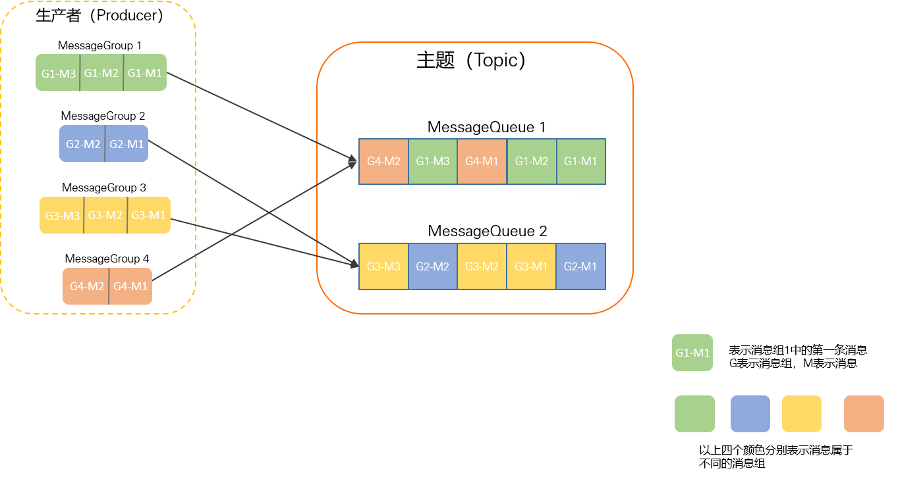

# 消费相关问题

## 消息丢失

一条消息从生产到消费会经历 3 个阶段


<small>[面试官再问我如何保证 RocketMQ 不丢失消息,这回我笑了！ - 0x00. 消息的发送流程](https://www.cnblogs.com/goodAndyxublog/p/12563813.html)</small>

### 生产阶段

消息从生产者到 Broker

如果消息发送过程中出现网络故障等情况，就会导致消息丢失

要保证该阶段的消息不丢失，需要添加一个请求确认机制。消息投递成功才会返回响应信息，异步发送也可在回调函数中检查，发送失败或超时，生产者可以重试发送消息，建议重试次数不要过多

- 如果重试次数超过最大值，可考虑将该异常消息存入日志或数据库中，由人工介入排查问题，进行手工重试

```java
// 同步发送，重试次数，默认为 2
defaultMQProducer.setRetryTimesWhenSendFailed(2);

Message msg = new Message(topic, message.getBytes());
// 投递过程中没有抛出异常，就可认为投递成功
SendResult sendResult = defaultMQProducer.send(msg);
```

```java
// 异步发送，重试次数，默认为 2
defaultMQProducer.setRetryTimesWhenSendAsyncFailed(2);

Message msg = new Message(topic, message.getBytes());
defaultMQProducer.send(msg, new SendCallback() {
    
    // 投递成功
    @Override
    public void onSuccess(SendResult sendResult) {
        System.out.println("成功了");
    }

    // 投递失败
    @Override
    public void onException(Throwable e) {
        System.out.println("失败了");
        System.out.println(e.getMessage());
    }
});
```

能获取到 SendResult，就代表消息投递成功了，在 SendResult 中有个更详细的发送状态 SendStatus

- `SEND_OK`：投递成功
- `FLUSH_DISK_TIMEOUT`：投递成功，但刷盘超时
  - 如果设置了同步刷盘，且在超时时间（默认 5 秒）内未完成刷盘，返回该状态
- `FLUSH_SLAVE_TIMEOUT`：投递成功，但主从同步超时
  - 如果设置了同步复制，且在超时时间（默认 5 秒）内未完成主从同步，返回该状态
- `SLAVE_NOT_AVAILABLE`：投递成功，但从节点不可用
  - 如果设置了同步复制，但没有可用的从节点，返回该状态

### 存储阶段

消息到达 Broker，会先存放在内存中，然后立刻返回确认响应给生产者，并定期将一批消息刷到磁盘中

如果 Broker 还未将消息刷入到磁盘，这时发生了机器故障或 Broker 挂掉等情况，就会导致消息丢失

要保证该阶段的消息不丢失，可以修改 Broker 的刷盘机制，将异步刷盘（ASYNC_FLUSH）修改为同步刷盘（SYNC_FLUSH），只有刷盘成功才会向生产者发送确认响应

```shell
# broker.conf
flushDiskType = SYNC_FLUSH
```

Broker 通常是集群部署的，如果追求更高的消息可靠性，可以考虑使用同步双写模式，主从节点同步成功，才会向生产者发送响应。再配合上同步刷盘，也就是主从消息同步，并且都刷盘成功才会返回响应信息

- 可靠性更高，延迟也更高，需要进行取舍

```shell
# 主节点的 broker.conf 开启同步复制，默认为 ASYNC_MASTER
brokerRole = SYNC_MASTER
```

### 消费阶段

消费者从 Broker 中获取消息

如果消息接收过程中出现网络故障等情况，或者消费时发生了异常，就会导致消息丢失

要保证该阶段的消息不丢失，与生产阶段类似的，添加一个消费确认机制。接收到消息后不立即返回确认响应，只有消费成功才会发送确认响应

```java
consumer.registerMessageListener((MessageListenerConcurrently) (msg, context) -> {
    for (MessageExt messageExt : msg) {
        if ("SUCCESS".equals(new String(messageExt.getBody()))) {
            // 消费成功
            return ConsumeConcurrentlyStatus.CONSUME_SUCCESS;
        }
    }

    // 消费失败
    return ConsumeConcurrentlyStatus.RECONSUME_LATER;
});
```

- 注意要在代码逻辑中限制重试次数，可考虑将异常消息存入日志或数据库中，由人工介入排查问题，进行手工重试

## 重复消费

首先，我们了解一下几个一致性语义

- At Least Once（至少一次）：保证消息至少被传递一次，但允许重复
- At Most Once（至多一次）：保证消息最多被传递一次，但不保证一定被传递
- Exactly Once（严格一次）：既保证消息不丢失，又保证消息不重复，是最高级别的语义

RocketMQ 选择的一致性语义是 At Least Once，保证消息一定会被传递，但可能会有重复

### 如何解决

根据业务场景合理的进行幂等设计，保证多次执行的结果一致。主要有两种解决方案

- 在业务层面保证重复消费的结果是一致的
- 使用缓存（Redis）等手段，过滤掉重复的消息

## 顺序消费

顺序消费可分为两种

- 全局顺序：某个主题下所有的消息都要保证顺序
  - A1 -> B1 -> C1 -> A2 -> B2 -> C2
- 部分顺序：只要保证每一组消息是按照顺序消费的，中间可以穿插别的消息
  - A1 -> A2 -> B2 -> C2 -> B1 -> C1

全局顺序很好实现，只建一个生产者和消费者，并将主题内的队列数设置为 1，但吞吐量和系统的可靠性就没法保证了


<small>[面渣逆袭：RocketMQ二十三问 - 全局顺序消息](https://mp.weixin.qq.com/s/IvBt3tB_IWZgPjKv5WGS4A)</small>

### 部分顺序



<small>[顺序消息 - 如何保证消息的顺序性](https://help.aliyun.com/zh/apsaramq-for-rocketmq/cloud-message-queue-rocketmq-5-x-series/developer-reference/ordered-messages-1)</small>

部分顺序的思路就是将不同组的消息发送到不同的队列中，因为队列具有天然的有序性，然后保证发送时和消费时的有序性

- 生产者，最好保证单线程执行，或者保证能在多线程环境下顺序执行（还不如就使用单线程）

```java
// topic: 主题
// messgae: 消息
// id: 可以是任何类型的任何值
public void send(String topic, String message, Long id) throws MQBrokerException, RemotingException, InterruptedException, MQClientException {
    Message msg = new Message(topic, message.getBytes());

    // 实现一个消息队列的选择器
    defaultMQProducer.send(msg, new MessageQueueSelector() {
        @Override
        public MessageQueue select(List<MessageQueue> mqs, Message msg, Object arg) {
            // 根据传入的 id 选择对应的队列
            return mqs.get((int) (id % mqs.size()));
        }
    }, id, new SendCallback() {
        @Override
        public void onSuccess(SendResult sendResult) {
            System.out.println("成功了");
        }

        @Override
        public void onException(Throwable e) {
            System.out.println("失败了");
            System.out.println(e.getMessage());
        }
    });
}
```

- 消费者，最好使用顺序（ORDERLY）的消费模式
  - 建议使用推模式，因为推是按照存储顺序一条一条推的，而拉模式有可能一次会拉取多条消息，需要在业务中做额外处理

```java
consumer.registerMessageListener((MessageListenerOrderly) (msg, context) -> {
    for (MessageExt messageExt : msg) {
        System.out.println(new String(messageExt.getBody()));
    }
    return ConsumeOrderlyStatus.SUCCESS;
});
```

## 消息积压

消息队列中的消息无法及时处理和消费，导致队列中消息累积过多

- 消息不能及时消费，导致任务不能及时处理
- 消费者处理大量的消息任务，导致系统性能下降、延迟增加以及资源消耗过高

关于消息积压的出现，最粗粒度的原因，只有 2 种

- 生产者发送速度过快
- 消费者消费速度过慢

### 处理方案

首先找到问题源头，是生产者还是消费者的原因，再去寻找具体原因。如果一时半会找不到原因或者解决方案比较耗时，就可先进行疏导工作

可以尝试停止所有消费者，或增加消费者的数量、队列数量，临时的缓解积压现象。并且可以考虑是否丢弃一些重要性不高的消息，或者考虑服务器的扩容

- 监控与告警：建立监控和告警机制，及时发现消息积压的情况并采取相应的措施
- 消费者优化
  - 优化消费端的逻辑：检查消费逻辑是否存在性能瓶颈或不必要的复杂计算
  - 增加消费者数量（注意超过订阅队列数的消费者实例是无效的）
  - 批量消费：一个消费者默认一次只消费一条消息，可修改消费者的 `consumeMessageBatchMaxSize ` 参数，进行批量消费
- 生产者优化
  - 批量发送
  - 避免发送过大的消息
  - 设置消息的优先级：根据消息的重要性和紧急程度，调整消息的优先级。优先处理重要的消息，确保关键业务的及时性，而对于非关键的消息可以进行降级处理或延后处理
- 消息过滤：过滤一些重复的、不重要的消息
- 定期清理过期和无效的消息：避免队列中存在大量无效的消息占用资源

## 参考

- [面试官再问我如何保证 RocketMQ 不丢失消息,这回我笑了！](https://www.cnblogs.com/goodAndyxublog/p/12563813.html)
- [为什么消息会重复消费，我从RocketMQ源码中扒出了7种原因，有点小坑](https://mp.weixin.qq.com/s/XtIZbObkDcDzcwttSDslZg)
- [消息消费失败如何处理？](https://www.51cto.com/article/647598.html)
- [顺序消息](https://help.aliyun.com/zh/apsaramq-for-rocketmq/cloud-message-queue-rocketmq-5-x-series/developer-reference/ordered-messages-1)
- [消息积压的处理](https://www.cnblogs.com/chjxbt/p/11434240.html)
- [线上消息队列发生积压，如何快速解决？](https://juejin.cn/post/7327124869921636367)
- [MQ消息积压处理方案](https://www.cnblogs.com/yangyongjie/p/17644874.html)
- [面试必考：怎样解决线上消息队列积压问题](https://mp.weixin.qq.com/s/w5z25rKxFXOnqakOm2zgMw)
