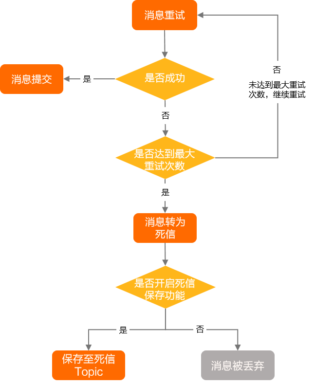
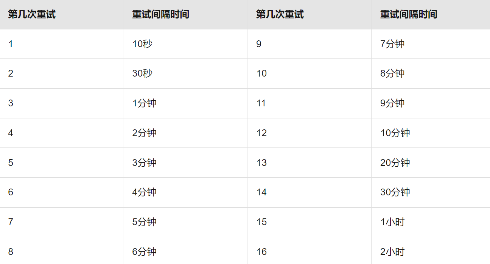
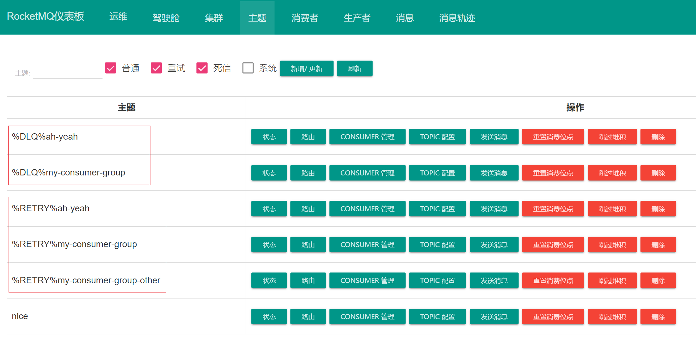

# 死信队列（DLQ，Dead-Letter Queue）

消息消费异常时会自动进行消费重试，达到最大重试次数后还未成功，则消息会转为死信状态，一般会将其放入死信队列。后续就可以通过查看死信队列中的内容，来分析当时遇到的异常情况，进而可以改善和优化系统

<small>[死信消息 - 死信策略](https://help.aliyun.com/zh/apsaramq-for-rocketmq/cloud-message-queue-rocketmq-5-x-series/developer-reference/dead-letter-messages)</small>

在 RocketMQ 中消息消费失败，会被加入到重试队列中，默认重试 16 次后，就会被加入到死信队列，无法再被消费了

<small>[消费重试 - 重试间隔时间](https://help.aliyun.com/zh/apsaramq-for-rocketmq/cloud-message-queue-rocketmq-5-x-series/developer-reference/consumption-retries)</small>

可通过 RocketMQ 的控制台进行死信队列相关的查询和处理

- 死信队列以 `%DLQ%` 开头，拼接上消费者组
- 重试队列以 `%RETRY%` 开头，拼接上消费者组

## 参考

- [死信消息](https://help.aliyun.com/zh/apsaramq-for-rocketmq/cloud-message-queue-rocketmq-5-x-series/developer-reference/dead-letter-messages)
