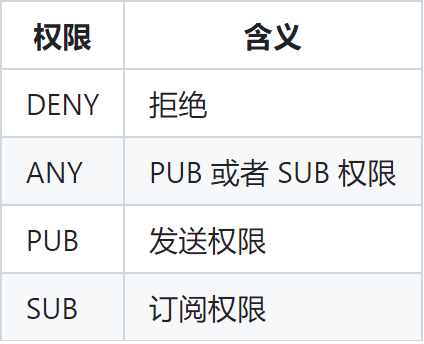
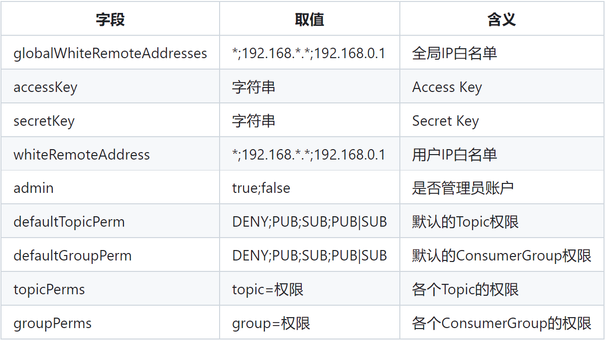

# RocketMQ 权限管理

你还在为 RocketMQ 的安全发愁吗，来试试 ACL（Access Control List）权限校验吧，开启它，你就可以对 Topic、ConsumerGroup、IP 进行权限控制了，避免潜在的安全威胁

先来看看 `conf` 目录中的 `plain_acl.yml` 文件

```yaml
globalWhiteRemoteAddresses:
  - 10.10.103.*
  - 192.168.0.*

accounts:
  - accessKey: RocketMQ
    secretKey: 12345678
    whiteRemoteAddress:
    admin: false
    defaultTopicPerm: DENY
    defaultGroupPerm: SUB
    topicPerms:
      - topicA=DENY
      - topicB=PUB|SUB
      - topicC=SUB
    groupPerms:
      # the group should convert to retry topic
      - groupA=DENY
      - groupB=PUB|SUB
      - groupC=SUB

  - accessKey: rocketmq2
    secretKey: 12345678
    whiteRemoteAddress: 192.168.1.*
    # if it is admin, it could access all resources
    admin: true
```





<small>[权限控制 - 2. 权限控制的定义与属性值](https://github.com/apache/rocketmq/blob/develop/docs/cn/acl/user_guide.md)</small>

结合官方文档，字段及对应的功能应该是很清晰的，为了便于上手，之后都使用以下简短的配置

```yaml
globalWhiteRemoteAddresses:
  - XXX.XXX.XXX.XXX

accounts:
  - accessKey: nishishui
    secretKey: woshinidie
    whiteRemoteAddress:
    admin: true
```

- 注意如果想放开所有的 IP 访问，不要使用 `*`，直接空着就好，否则启动会报错
  - 大部分资料都说 `*` 表示全部匹配，但我使用时就会启动报错，可能与版本有关
- 如果是 Broker 集群，要在全局白名单中放开所有集群所在的节点的 IP，因为集群之间是不能配置 ACL 相关参数，只能通过白名单的方式访问

最后在 Broker 的配置文件中，加上 `aclEnable=true`，表示开启 ACL 控制，再重启 Broker，就可以开始使用了

## Spring Boot 集成时需要做的修改

通常来说在配置文件配置以下配置就足够了

```yaml
rocketmq:
  producer:
    access-key: nishishui
    secret-key: woshinidie
  consumer:
    access-key: nishishui
    secret-key: woshinidie
```

如果是自己创建的生产者，要在创建时添加一个钩子方法，并在里面设置好校验的参数

```java
DefaultMQProducer defaultMQProducer = new DefaultMQProducer(new AclClientRPCHook(new SessionCredentials("nishishui", "woshinidie")));
```

消费者端同理，在创建消费者时添加一个钩子方法，如果使用的是注解，也可在注解中添加校验参数

```java
@RocketMQMessageListener(topic = "oh-no", consumerGroup = "oh-yeah", accessKey = "nishishui", secretKey = "woshinidie")
```

## RocketMQ Dashboard 需要做的修改

只针对使用 Dcoker 安装的情况

```shell
docker run -d --name rocketmq-dashboard -e "JAVA_OPTS=-Drocketmq.namesrv.addr=XXX.XXX.XXX.XXX:9876 -Drocketmq.config.accessKey=nishishui -Drocketmq.config.secretKey=woshinidie" -p 8080:8080 -t apacherocketmq/rocketmq-dashboard:latest
```

## 参考

- [权限控制](https://github.com/apache/rocketmq/blob/develop/docs/cn/acl/user_guide.md)
- [RocketMq启用ACL安全认证](https://mp.weixin.qq.com/s/XTB9rrtpAh5q9QI6LkqSEw)
- [【RocketMQ】RocketMQ ACL动手实践与踩坑记录](https://blog.csdn.net/sinat_14840559/article/details/116302400)
- [No accessKey is configured](https://github.com/apache/rocketmq/issues/3115)
