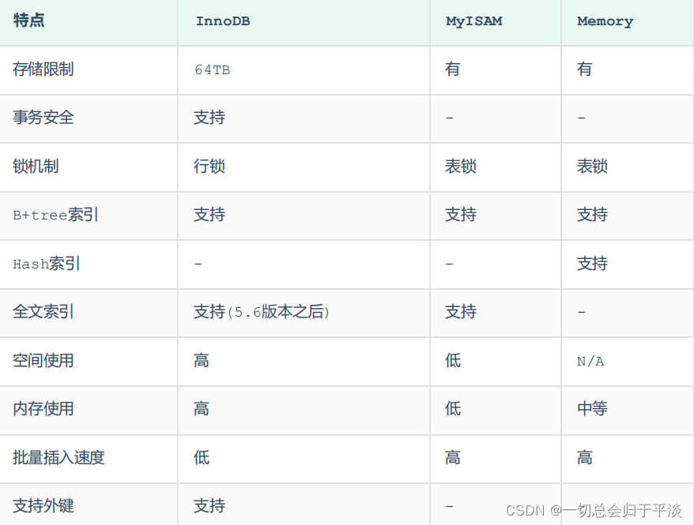

# MySQL 架构与执行过程

## 架构


<small>[SQL语句在MySQL中的执行过程](https://javaguide.cn/database/mysql/how-sql-executed-in-mysql.html)</small>

### server 层

#### 连接器

主要负责与客户端的连接、用户登录与权限验证等

#### 查询缓存

**MySQL 8.0 版本后已删除**

在执行查询语句时，先查询缓存，如果缓存命中，就会直接返回，没有命中，再去执行查询语句，执行完成后也会将结果集缓存起来

- 以查询语句为 key，结果集为 value，缓存在内存中

看起来挺好的，为什么新版本删除了呢？

- 两个查询之间不能有一点差别，即便多了或少了一个空格，都无法命中缓存
- 对表结构或表中数据进行了修改，都会导致所有与这个表相关的缓存失效

#### 分析器

1. **词法分析**：提取出 SQL 语句中的关键字、要操作的表、字段名、查询条件等
2. **语法分析**：判断输入的 SQL 是否正确，是否符合 MySQL 的语法

> 词法分析：你想干啥？
> 语法分析：你这么干合适吗？

#### 优化器

选择最优的方案执行 SQL 语句


> 优化器：我看了 14000605 种执行方案，这是最棒的方案，相信我

#### 执行器

执行 SQL 语句，调用存储引擎的 API

### 存储引擎




<small>[MySQL进阶之存储引擎【InnoDB、MySAM、Memory】](https://blog.csdn.net/weixin_53041251/article/details/124241047)</small>

- InnoDB 不支持哈希索引，但内存结构中有一个 **自适应哈希索引**（Adaptive Hash Index），来提高查询性能。InnoDB 会 **根据表的使用情况自动为表生成哈希索引**，不能人为干预是否在一张表中生成哈希索引

#### Memory

所有的数据都存储在 **内存** 中，数据的处理速度快，但是安全性不高，存储的数据量受到内存大小的限制

#### InnoDB 与 MylSAM

主要差别在 **事务支持、外键、锁粒度、索引**，可以参照上图，此外 MylSAM 还保存了 **表的总行数**，意味着在使用 `COUNT` 语句时，能以 O(1) 的时间复杂度返回具体的行数

InnoDB 与 MyISAM 都使用 B+ 树作为索引结构，但具体实现的方式不一样

- InnoDB 使用的是 **聚簇索引**，索引与数据是存放在一起的，索引叶子节点存储的就是数据记录
- MyISAM 使用的是 **非聚簇索引**，索引文件和数据文件是分离的，索引叶子节点存储的是数据记录的地址，需要根据地址读取相应的数据记录

## 一条查询语句是如何执行的

1. 先检查该语句是否有权限，如果没有权限，直接返回错误信息，如果有权限会先查询缓存（MySQL 8.0 版本之前）
2. 使用分析器进行词法分析和语法分析
3. 使用优化器确定执行方案
4. 按照生成的执行计划，执行并返回结果

## 一条更新语句是如何执行的

建议先了解下 binlog 与 redo log

1. 先找到要修改的数据
2. 对数据进行修改后，调用存储引擎 API 接口，写入这一行数据
3. 存储引擎将这行新数据更新到内存中，同时将这个更新操作记录到 redo log 中，此时 redo log 处于 prepare 状态。然后告知执行器执行完成了，随时可以提交事务
4. 执行器收到通知后记录 binlog，并把 binlog 写入磁盘，然后调用引擎接口，提交 redo log 为提交状态，更新完成

## 查询语句的执行顺序


<small>[MySQL 高级原理： MySQL执行过程及执行顺序 - 三、SQL的执行顺序](https://blog.csdn.net/wy971744839/article/details/130334447)</small>

```sql
FROM <left_table>
ON <join_condition>
<join_type> JOIN <right_table>
WHERE <where_condition>
GROUP BY <group_by_list>
HAVING <having_condition>
SELECT
DISTINCT
ORDER BY <order_by_condition>
LIMIT <limit_number>
```

以下内容浏览一遍即可，不需要太过耗费时间，能理解大致意思即可

1. 首先对 `FROM` 子句中的前两个表执行一个笛卡尔乘积，此时生成虚拟表 vt1
    - 使用左连接查询时，前面的表是驱动表，右连接相反
    - 使用内连接查询时，选择数据最少的表作为驱动表
    - 表中字段有在 `WHERE` 语句出现时，该表为驱动表
2. 对虚拟表 vt1 应用 `ON` 筛选器，`ON` 中的逻辑表达式将应用到虚拟表 vt1 中的各个行，筛选出满足 `ON` 逻辑表达式的行，生成虚拟表 vt2
3. 如果使用的是 `OUTER JOIN`，就将第二步中过滤掉的数据重新添加过来，生成虚拟表 vt3
4. 如果 `FROM` 子句包含两个以上的表，就对虚拟表 vt3 和下一个表重复 1 ~ 3 的步骤，最终得到一个新的虚拟表 vt3
5. 对虚拟表 vt3 应用 `WHERE` 筛选器。根据指定的条件对数据进行筛选，并把满足的数据插入虚拟表 vt4
6. 按 `GROUP BY` 子句中的列表将虚拟表 vt4 中的行唯一的值组合成为一组，生成虚拟表 vt5。如果应用了 `GROUP BY`，那么后面的所有步骤都只能得到的虚拟表 vt5 的列或者是聚合函数。原因在于最终的结果集中每一个组只用一行数据来表示
    - 从这一步开始，后面的语句中都可以使用 `SELECT` 中的别名
7. 对虚拟表 vt5 应用 `HAVING` 筛选器，根据指定的条件对数据进行筛选，并把满足的数据插入虚拟表 vt6
8. 将虚拟表 vt6 中的在 `SELECT` 中出现的列筛选出来，产生虚拟表 vt7
9. 将重复的行从虚拟表 vt7 中移除，产生虚拟表 vt8
10. 将虚拟表 vt8 中的行按 `ORDER BY` 子句中的列表进行排序，生成一个游标
11. 使用 `LIMIT` 指定需要返回的行数

使用内连接时，我们写的 `ON` 条件都会解析成 `WHERE` 条件，所以我们将条件写在 `ON` 或者 `WHERE` 里是没有区别的

### 简单点，你说这么多谁懂啊

首先要解决数据的来源问题，这也是为什么会先执行 `FROM`。如果一个表中的数据无法满足需求，就需要使用 `JOIN` 或 `WHERE` 进行连表处理

为什么 `ON` 比 `JOIN` 先执行呢？`JOIN` 就好比两个人准备约会，而 `ON` 就是一个具体的约会方式，不先确定好约会时间地点等，两个人是遇不上的，我在肯德基等你，而你却在麦当劳等我

有了数据源之后，再经过 `WHERE`、`GROUP BY`、`HAVING` 就可以过滤出符合我们要求的数据了，再通过 `SELECT` 就可以得到我们想要的数据了

至于 `DISTINCT`、`ORDER BY`、`LIMIT` 都是针对已找到的数据进行去重、排序、截取

## 参考

- [MySQL 是怎样运行的：从根儿上理解 MySQL](https://juejin.cn/book/6844733769996304392)
- [SQL 查询语句的执行顺序解析](https://learnku.com/articles/35655)
- [Mysql关键字执行顺序-深入解析](https://developer.aliyun.com/article/1131899)
- [MySQL中SQL语句的执行顺序（详细）](https://www.cnblogs.com/antLaddie/p/17175396.html)
- [SQL语句在MySQL中的执行过程](https://javaguide.cn/database/mysql/how-sql-executed-in-mysql.html)
- [MySQL 高级原理： MySQL执行过程及执行顺序](https://blog.csdn.net/wy971744839/article/details/130334447)
- [掌握MySQL连接查询到底什么是驱动表](https://www.cnblogs.com/sy270321/p/12760211.html)
- [Mysql 的InnoDB引擎下支持hash索引吗？](https://blog.csdn.net/w1014074794/article/details/105617884)
