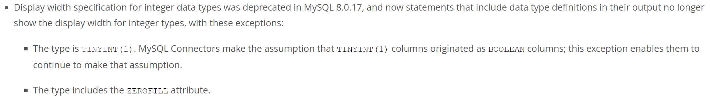

# 字段类型

MySQL 中定义了丰富的字段类型，最常用的有数值类型、字符串类型以及日期时间类型

## 数值类型

数值类型可分为 3 类：整型、浮点型、定点型

### unsigned 属性

数值类型可以设置 unsigned 属性，表示不允许负值的无符号数值，这样可以将可存储的数值的上限提高一倍

### 整型


<small>[13.1.2 Integer Types (Exact Value) - INTEGER, INT, SMALLINT, TINYINT, MEDIUMINT, BIGINT](https://dev.mysql.com/doc/refman/8.0/en/integer-types.html)</small>

#### `int(0)` 与 `int(10)`

无论 `int(0)` 还是 `int(10)`，能存储的数据范围都是相同的，都是 4 个字节的空间。括号中的数字表示显示长度，且只在类型被设置为 zerofill 才有作用，会自动为我们将不满足长度的数值上填充 0，影响的只是展示效果，对实际数据没有任何影响

```sql
# int(0)
999

# int(10)
0000000999
```

是不是觉得没什么用？官方也觉得没什么用，还存在误导性，所以在 8.0.17 版本移除了整型的显示长度，但两种情况除外：该类型为 `TINYINT(1)`，该类型设置了 ZEROFILL 属性。除此之外的整型不会被设置任何显示长度，即 `int` 或 `int(0)`



<small>[Changes in MySQL 8.0.19 (2020-01-13, General Availability) - Deprecation and Removal Notes](https://dev.mysql.com/doc/relnotes/mysql/8.0/en/news-8-0-19.html)</small>

### 浮点型

MySQL 中有两种浮点型：float、double，分别占用 4 字节、8 字节

注意浮点型存储的只是个近似值，如需存储精确的值应当考虑定点型

```sql
# float(10,2) 表示最多可以存储 10 位，其中 2 位为小数
9999999999  # 超过范围
999999999.9 # 超过范围
99999999    # 符合要求
99999999.99 # 符合要求
```

### 定点型

常用的定点型为 DECIMAL，用于存储具有精度要求的小数，例如与货币相关的数据，可以避免浮点数带来的精度损失，使用方法与浮点型类似

## 字符串类型

### CHAR 与 VARCHAR

- CHAR 是 **定长类型**，长度是固定的，如果长度小于指定的长度，会自动用空格填充；VARCHAR 是 **变长类型**，长度是根据存储的字符串来的
  - `CHAR(10)`：即便只存储 1 个字符，也会占用 10 个字符的空间
  - `VARCHAR(10)`：只存储 1 个字符，也只会占用 1 个字符的空间
- 使用 CHAR 存储长度不一致的字符串，会造成空间的浪费，最好只存储一些长度较短且长度固定的字符串
- VARCHAR 适合存储一些长度不固定的字符串，但在存储时，需要额外使用 1 或 2 个字节记录字符串的长度
- CHAR 类型最多只能存放 255 个字符；而 VARCHAR 最多可以存储 65533 个字节的字符

#### `VARCHAR(M)` 最多能存储的数据

MySQL 对一条记录占用的最大存储空间是有限制的，除了 BLOB、TEXT 类型的列之外，其他所有的列（不包括隐藏列和记录头信息）占用的字节长度加起来 **不能超过 65535 个字节**

为了存储一个 `VARCHAR(M)` 类型的列，需要占用 3 部分存储空间

1. 真实数据
2. 真实数据占用的字节长度
    - 可变字段允许存储的最大字节数超过 255 字节，并且真实存储的字节数超过 127 字节，则使用 2 个字节，否则使用 1 个字节
3. NULL 值标识
    - 如果字段允许 NULL 值就会用 1 个字节进行标识，不允许 NULL 值则不需要

所以 `VARCHAR(M)` 最多能存储的字节数为 `65535 - (是否允许 NULL 值 ? 1 : 0) - 2`，再除以字符集中表示一个字符最多需要使用的字节数，就可得到最多能存放的字符数

```sql
# 使用 ascii 字符集，1 个字符占用 1 个字节，允许 NULL 值，能存储的最大字符数
65532

# 使用 ascii 字符集，1 个字符占用 1 个字节，不允许 NULL 值，能存储的最大字符数
65533

# 使用 utf8mb3 字符集，1 个字符占用 1 ~ 3 个字节，能存储的最大字符数
21845

# 使用 utf8mb4 字符集，1 个字符占用 1 ~ 4 个字节，能存储的最大字符数
16383
```

#### `VARCHAR(100)` 与 `VARCHAR(10)` 的区别

虽然 `VARCHAR(100)` 和 `VARCHAR(10)` 能存储的字符范围不同，但二者存储相同的字符串，所占用磁盘的存储空间其实是一样的

不过 `VARCHAR(100)` 会消耗更多的内存。这是因为 VARCHAR 类型在内存中操作时，会使用固定大小的内存块来保存值，即使用字符类型中定义的长度

### TEXT 与 BLOB

TEXT 用于存储大字符串，BLOB 用于存储二进制数据

应尽量避免使用这两种类型

- 无法设置默认值
- 查询效率低
- 不能直接创建索引，需要指定前缀长度
- 可能会消耗大量的网络和 IO 带宽
- 在使用临时表时无法使用内存临时表，只能在磁盘上创建临时表

## 日期时间类型

不建议使用字符串存储日期

- 字符串占用的空间更大
- 字符串存储的日期效率比较低（逐个字符进行比对），无法用日期相关的 API 进行计算和比较

也可以考虑使用 int 或者 bigint 类型来保存时间戳，但可读性较差

### DATETIME 与 TIMESTAMP

- 存储时间的表现格式一致，均为 `YYYY-MM-DD HH:MM:SS`
- 都可以存储微秒的小数秒

#### 时区

- DateTime 与时区无关，保存的时间都是当前会话所设置的时区对应的时间
- Timestamp 和时区有关，保存的时间会随着服务器时区的变化而变化，自动换算成相应的时间

#### 表示范围

- DateTime：`1000-01-01 00:00:00.000000 ~ 9999-12-31 23:59:59.499999`
- Timestamp：`1970-01-01 00:00:01.000000 ~ 2038-01-19 03:14:07.499999`

#### 占用空间

- MySQL 5.6.4 之前，DateTime 和 Timestamp 的存储空间是固定的，分别为 8 字节和 4 字节
- MySQL 5.6.4 之后，它们的存储空间会根据毫秒精度的不同而变化，DateTime 的范围是 5 ~ 8 字节，Timestamp 的范围是 4 ~ 7 字节

## NULL 与 `''`

MySQL 中不建议使用 NULL 作为默认值

- `''` 的长度是 0，是不占用空间的，而 NULL 需要额外的空间（NULL 值标识）对其进行标记
- NULL 会影响数据分析
  - 使用聚合函数时，NULL 值会被忽略，从而导致结果不准确
  - 进行分组时，NULL 值会被视为独立的一组
  - 使用 `count(1)`、`count(*)` 时会统计所有的记录数，包括 NULL 值，而使用 `COUNT(列名)` 是不包含 NULL 值的
- 查询 NULL 值时，必须使用 IS NULL 或 IS NOT NULL 来判断，不能使用运算符进行比较。而 `''` 可以使用这些比较运算符的
- NULL 值需要进行判空处理，否则可能会影响代码逻辑，产生空指针问题
- 列中 NULL 值过多会影响索引的查询效率，因为列中的重复值过多，意味着需要大量的回表操作才能找到所需的数据，甚至会直接采用全表扫描而不走索引

简而言之，NULL 值相比空字符串会占用更多的空间，数据统计时结果可能会不准确

## 大字段

通常指的是 TEXT 与 BLOB，也包括一些存储了很多数据的字段，例如非常长的字符串

- 首先大字段肯定影响的就是存储空间，不仅会占用更多的磁盘与内存（缓存），还影响网络 IO
  - 使用对象存储
  - 业务中使用缓存，避免频繁对大字段进行查询
- 增加索引的维护成本，影响查询效率
  - 将大字段拆分成多个字段
  - 建立前缀索引

## 参考

- [MySQL 是怎样运行的：从根儿上理解 MySQL](https://juejin.cn/book/6844733769996304392)
- [13.1.2 Integer Types (Exact Value) - INTEGER, INT, SMALLINT, TINYINT, MEDIUMINT, BIGINT](https://dev.mysql.com/doc/refman/8.0/en/integer-types.html)
- [MySQL 8 ignoring integer lengths](https://stackoverflow.com/questions/60892749/mysql-8-ignoring-integer-lengths)
- [MySQL Integer类型与INT(11)](https://www.cnblogs.com/polk6/p/11595107.html)
- [MySQL常见面试题总结](https://javaguide.cn/database/mysql/mysql-questions-01.html)
- [MySQL日期类型选择建议](https://javaguide.cn/database/mysql/some-thoughts-on-database-storage-time.html)
- [mysql中varchar能存多少汉字、数字，以及varchar(100)和varchar(10)的区别](https://blog.csdn.net/weixin_43431218/article/details/124734940)
- [mysql中的int(10)int(20)分别代表什么意思](https://blog.csdn.net/weixin_45707610/article/details/131439336)
- [常见面试题:为什么Mysql不建议使用NULL作为列的默认值](https://www.zytool.cn/read/122)
- [mysql 一张表中有大字段类型,影响性能吗](https://blog.51cto.com/u_16213394/7249939)
